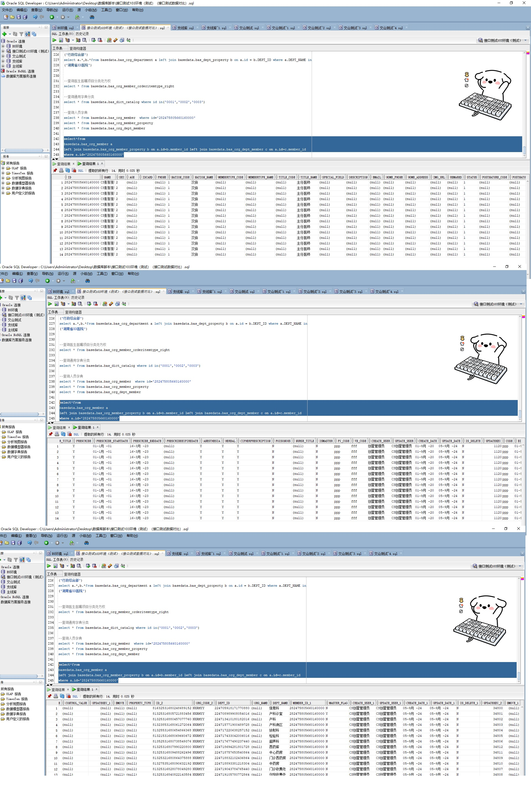

# 领域服务/基础领域 - 查询人员字典 - 查询人员字典 正向用例
## 请求参数：
``` json
{
  "pageSize": 3,
  "orgCode": "NXRMYY",
  "isDelete": "N",
  "pageIndex": 1,
  "ids": [
    "282475805660160000"
  ],
  "status": "1"
}
```
## 返回参数：
``` json
{
  "exception": null,
  "apiCode": null,
  "data": {
    "list": [
      {
        "anesthesia": "Y",
        "antiLevel": "0",
        "antiLevelName": "无",
        "birthday": "2020-09-01 19:36:13",
        "canDispensing": "N",
        "cipherPrescription": "Y",
        "clinicalPostCode": null,
        "code": "ppp",
        "createDate": "2020-09-01 19:38:00",
        "createUserId": "创星管理员",
        "daySurgeryOpen": "N",
        "description": null,
        "doctorCode": null,
        "email": null,
        "endoscopeOpeRight": "0",
        "fromHosp": "01",
        "herbal": "Y",
        "herbalMedicine": "N",
        "homeAddress": null,
        "homePhone": null,
        "id": "282475805660160000",
        "idCard": " ",
        "imgUrl": null,
        "interventionOpeRight": "0",
        "isAudit": "Y",
        "isDelete": "N",
        "isEnableCaVerify": "0",
        "isGroupLeader": "N",
        "isMaster": "N",
        "isOnLine": "N",
        "isRefund": "N",
        "materApply": "N",
        "medicalInsuranceCode": null,
        "memberRole": "1",
        "memberTypeCode": null,
        "memberTypeName": null,
        "name": "CS彭彭彭",
        "nationCode": "1",
        "nationName": "汉族",
        "nurseTitle": null,
        "nurseTitleName": null,
        "office": null,
        "officeName": null,
        "onState": "1",
        "onStateName": "聘用",
        "openOpeRight": "0",
        "orgCode": "NXRMYY",
        "phone": null,
        "platId": null,
        "poisonous": "N",
        "postNatureCode": null,
        "postNatureName": null,
        "prescribe": "Y",
        "prescribeEndDate": "2023-03-16 10:32:34",
        "prescribeStartDate": "0001-01-01 00:00:00",
        "psyRight": null,
        "pyCode": "ppp",
        "reEmploy": "N",
        "remarks": null,
        "sex": "2",
        "signUrl": null,
        "sitInfo": null,
        "sitRoomInfo": null,
        "slowExcess": "N",
        "sortNo": 0,
        "source": "1",
        "specialField": null,
        "status": "1",
        "theRapeutist": "N",
        "titleCode": "1",
        "titleName": "主任医师",
        "ukeyCode": null,
        "updateDate": "2024-09-05 11:37:44",
        "updateUserId": "CS创星管理员",
        "wbCode": "fff",
        "zlypLevel": "0",
        "zlypLevelName": "无",
        "antiConsultationRight": "N",
        "antiOverNolimitRight": "N",
        "antiOverlimitRight": "N",
        "antiOverSpecialRight": "N",
        "belongGroupId": null,
        "belongGroupName": null,
        "memberDepts": null,
        "memberProperys": null
      }
    ],
    "totalCount": 1,
    "pageSize": 1,
    "pageNo": 3,
    "pageCount": 1
  },
  "Code": 200,
  "Message": "操作成功"
}
```
## 数据校验：

# 领域服务/基础领域 - 查询人员字典 - 必填校验-[orgCode]为空
## 请求参数：
``` json
{
  "pageSize": 3,
  "orgCode": "",
  "isDelete": "N",
  "pageIndex": 1,
  "ids": [
    "282475805660160000"
  ],
  "status": "1"
}
```
## 返回参数：
``` json
{
  "exception": null,
  "apiCode": null,
  "data": null,
  "Code": 1,
  "Message": "医院编码不可为空"
}
```
# 领域服务/基础领域 - 查询人员字典 - 必填校验-[pageIndex]为空
## 请求参数：
``` json
{
  "pageSize": 3,
  "orgCode": "NXRMYY",
  "isDelete": "N",
  "pageIndex": null,
  "ids": [
    "282475805660160000"
  ],
  "status": "1"
}
```
## 返回参数：
``` json
{
  "exception": null,
  "apiCode": null,
  "data": null,
  "Code": 1,
  "Message": "系统内部异常"
}
```
# 领域服务/基础领域 - 查询人员字典 - 必填校验-[pageSize]为空
## 请求参数：
``` json
{
  "pageSize": null,
  "orgCode": "NXRMYY",
  "isDelete": "N",
  "pageIndex": 1,
  "ids": [
    "282475805660160000"
  ],
  "status": "1"
}
```
## 返回参数：
``` json
{
  "exception": null,
  "apiCode": null,
  "data": null,
  "Code": 1,
  "Message": "系统内部异常"
}
```
# 领域服务/基础领域 - 查询人员字典 - 类型校验-[pageIndex]类型错误
## 请求参数：
``` json
{
  "pageSize": 3,
  "orgCode": "NXRMYY",
  "isDelete": "N",
  "pageIndex": "abc",
  "ids": [
    "282475805660160000"
  ],
  "status": "1"
}
```
## 返回参数：
``` json
{
  "exception": null,
  "apiCode": null,
  "data": null,
  "Code": 1,
  "Message": "请求参数错误"
}
```
# 领域服务/基础领域 - 查询人员字典 - 类型校验-[pageSize]类型错误
## 请求参数：
``` json
{
  "pageSize": "abc",
  "orgCode": "NXRMYY",
  "isDelete": "N",
  "pageIndex": 1,
  "ids": [
    "282475805660160000"
  ],
  "status": "1"
}
```
## 返回参数：
``` json
{
  "exception": null,
  "apiCode": null,
  "data": null,
  "Code": 1,
  "Message": "请求参数错误"
}
```
# 领域服务/基础领域 - 查询人员字典 - 依赖用例-[orgCode]赋值为依赖用例测试值
## 请求参数：
``` json
{
  "pageSize": 3,
  "orgCode": "依赖用例测试值",
  "isDelete": "N",
  "pageIndex": 1,
  "ids": [
    "282475805660160000"
  ],
  "status": "1"
}
```
## 返回参数：
``` json
{
  "exception": null,
  "apiCode": null,
  "data": {
    "list": [],
    "totalCount": 0,
    "pageSize": 1,
    "pageNo": 3,
    "pageCount": 0
  },
  "Code": 200,
  "Message": "操作成功"
}
```