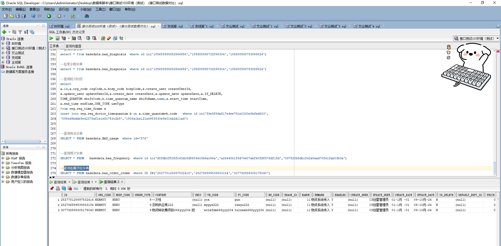

# 领域服务/基础领域 - 查询医嘱项目字典 - 查询医嘱项目字典 正向用例
## 请求参数：
``` json
{
  "isGetMedBodySample": "1",
  "hospCode": "NXRY",
  "isGetCustomAttribute": "1",
  "pageIndex": 1,
  "orgCode": "NXRMYY",
  "pageSize": 3
}
```
## 返回参数：
``` json
{
  "exception": null,
  "apiCode": null,
  "data": {
    "list": [
      {
        "id": "282778128697532416",
        "orgCode": "NXRMYY",
        "hospCode": null,
        "createDate": "0001-01-01 00:00:00",
        "updateDate": "2024-10-09 15:08:44",
        "isDelete": "N",
        "attention": null,
        "checkBigTypeCode": null,
        "checkBigTypeName": null,
        "collect": null,
        "consultationCode": null,
        "createUserId": null,
        "customAttributes": null,
        "defaulSampleOrPositionCode": null,
        "defaultSampleOrPositionName": null,
        "enabled": "Y",
        "execDepts": null,
        "exeDeptType": "1",
        "frequencyId": null,
        "hospPrices": null,
        "indication": null,
        "insStatus": "1",
        "isTestGroup": null,
        "itemTypeId": null,
        "itemTypeName": null,
        "medBodySamples": null,
        "medicalType": null,
        "name": "一次性",
        "nuCode": null,
        "operCode": null,
        "orderCountryType": "0",
        "orderCountryTypeName": null,
        "orderType": 9,
        "orderTypeName": "其它",
        "platId": null,
        "price": 0,
        "priceItems": null,
        "purpose": null,
        "pyCode": "gun",
        "range": 11,
        "remark": "物资系统传入",
        "sortNo": 8434,
        "tipsMsg": null,
        "unit": null,
        "updateUserId": "CS创星管理员",
        "usageId": null,
        "usageName": null,
        "wbCode": "ycx",
        "reimburseClass": null,
        "stdCode": null,
        "stdName": null,
        "skillClass": null,
        "skillDifficulty": null,
        "riskDegree": null,
        "isMerge": "N",
        "isOrderGroup": "N"
      },
      {
        "id": "282796599539933184",
        "orgCode": "NXRMYY",
        "hospCode": null,
        "createDate": "0001-01-01 00:00:00",
        "updateDate": "2024-10-09 15:08:44",
        "isDelete": "N",
        "attention": null,
        "checkBigTypeCode": null,
        "checkBigTypeName": null,
        "collect": null,
        "consultationCode": null,
        "createUserId": null,
        "customAttributes": null,
        "defaulSampleOrPositionCode": null,
        "defaultSampleOrPositionName": null,
        "enabled": "Y",
        "execDepts": null,
        "exeDeptType": "1",
        "frequencyId": null,
        "hospPrices": null,
        "indication": null,
        "insStatus": "1",
        "isTestGroup": null,
        "itemTypeId": null,
        "itemTypeName": null,
        "medBodySamples": null,
        "medicalType": null,
        "name": "没哟供应商222",
        "nuCode": null,
        "operCode": null,
        "orderCountryType": "0",
        "orderCountryTypeName": null,
        "orderType": 9,
        "orderTypeName": "其它",
        "platId": null,
        "price": 0,
        "priceItems": null,
        "purpose": null,
        "pyCode": "ikwyu222",
        "range": 11,
        "remark": "物资系统传入",
        "sortNo": 8425,
        "tipsMsg": null,
        "unit": null,
        "updateUserId": "CS创星管理员",
        "usageId": null,
        "usageName": null,
        "wbCode": "mygys222",
        "reimburseClass": null,
        "stdCode": null,
        "stdName": null,
        "skillClass": null,
        "skillDifficulty": null,
        "riskDegree": null,
        "isMerge": "N",
        "isOrderGroup": "N"
      },
      {
        "id": "307792599305175040",
        "orgCode": "NXRMYY",
        "hospCode": null,
        "createDate": "0001-01-01 00:00:00",
        "updateDate": "2024-10-09 15:08:44",
        "isDelete": "N",
        "attention": null,
        "checkBigTypeCode": null,
        "checkBigTypeName": null,
        "collect": null,
        "consultationCode": null,
        "createUserId": null,
        "customAttributes": null,
        "defaulSampleOrPositionCode": null,
        "defaultSampleOrPositionName": null,
        "enabled": "Y",
        "execDepts": null,
        "exeDeptType": "1",
        "frequencyId": null,
        "hospPrices": null,
        "indication": null,
        "insStatus": "1",
        "isTestGroup": null,
        "itemTypeId": null,
        "itemTypeName": null,
        "medBodySamples": null,
        "medicalType": null,
        "name": "物资转收费项目666yyy234",
        "nuCode": null,
        "operCode": null,
        "orderCountryType": "0",
        "orderCountryTypeName": null,
        "orderType": 9,
        "orderTypeName": "其它",
        "platId": null,
        "price": 0,
        "priceItems": null,
        "purpose": null,
        "pyCode": "tulnxah666yyy234",
        "range": 11,
        "remark": "物资系统传入",
        "sortNo": 8424,
        "tipsMsg": null,
        "unit": "把",
        "updateUserId": "CS创星管理员",
        "usageId": null,
        "usageName": null,
        "wbCode": "wzzsfxm666yyy234",
        "reimburseClass": null,
        "stdCode": null,
        "stdName": null,
        "skillClass": null,
        "skillDifficulty": null,
        "riskDegree": null,
        "isMerge": "N",
        "isOrderGroup": "N"
      }
    ],
    "totalCount": 10947,
    "pageSize": 3,
    "pageNo": 1,
    "pageCount": 3649
  },
  "Code": 200,
  "Message": "操作成功"
}
```
## 数据校验：

# 领域服务/基础领域 - 查询医嘱项目字典 - 必填校验-[orgCode]为空
## 请求参数：
``` json
{
  "isGetMedBodySample": "1",
  "hospCode": "NXRY",
  "isGetCustomAttribute": "1",
  "pageIndex": 1,
  "orgCode": "",
  "pageSize": 3
}
```
## 返回参数：
``` json
{
  "exception": null,
  "apiCode": null,
  "data": null,
  "Code": 1,
  "Message": "医院编码不能为空"
}
```
# 领域服务/基础领域 - 查询医嘱项目字典 - 必填校验-[hospCode]为空
## 请求参数：
``` json
{
  "isGetMedBodySample": "1",
  "hospCode": "",
  "isGetCustomAttribute": "1",
  "pageIndex": 1,
  "orgCode": "NXRMYY",
  "pageSize": 3
}
```
## 返回参数：
``` json
{
  "exception": null,
  "apiCode": null,
  "data": null,
  "Code": 1,
  "Message": "院区编码不能为空"
}
```
# 领域服务/基础领域 - 查询医嘱项目字典 - 必填校验-[pageIndex]为空
## 请求参数：
``` json
{
  "isGetMedBodySample": "1",
  "hospCode": "NXRY",
  "isGetCustomAttribute": "1",
  "pageIndex": null,
  "orgCode": "NXRMYY",
  "pageSize": 3
}
```
## 返回参数：
``` json
{
  "exception": null,
  "apiCode": null,
  "data": null,
  "Code": 1,
  "Message": "系统内部异常"
}
```
# 领域服务/基础领域 - 查询医嘱项目字典 - 必填校验-[pageSize]为空
## 请求参数：
``` json
{
  "isGetMedBodySample": "1",
  "hospCode": "NXRY",
  "isGetCustomAttribute": "1",
  "pageIndex": 1,
  "orgCode": "NXRMYY",
  "pageSize": null
}
```
## 返回参数：
``` json
{
  "exception": null,
  "apiCode": null,
  "data": null,
  "Code": 1,
  "Message": "系统内部异常"
}
```
# 领域服务/基础领域 - 查询医嘱项目字典 - 类型校验-[pageSize]类型错误
## 请求参数：
``` json
{
  "isGetMedBodySample": "1",
  "hospCode": "NXRY",
  "isGetCustomAttribute": "1",
  "pageIndex": 1,
  "orgCode": "NXRMYY",
  "pageSize": "abc"
}
```
## 返回参数：
``` json
{
  "exception": null,
  "apiCode": null,
  "data": null,
  "Code": 1,
  "Message": "请求参数错误"
}
```
# 领域服务/基础领域 - 查询医嘱项目字典 - 类型校验-[pageIndex]类型错误
## 请求参数：
``` json
{
  "isGetMedBodySample": "1",
  "hospCode": "NXRY",
  "isGetCustomAttribute": "1",
  "pageIndex": "abc",
  "orgCode": "NXRMYY",
  "pageSize": 3
}
```
## 返回参数：
``` json
{
  "exception": null,
  "apiCode": null,
  "data": null,
  "Code": 1,
  "Message": "请求参数错误"
}
```
# 领域服务/基础领域 - 查询医嘱项目字典 - 依赖用例-[orgCode]赋值为依赖用例测试值
## 请求参数：
``` json
{
  "isGetMedBodySample": "1",
  "hospCode": "NXRY",
  "isGetCustomAttribute": "1",
  "pageIndex": 1,
  "orgCode": "依赖用例测试值",
  "pageSize": 3
}
```
## 返回参数：
``` json
{
  "exception": null,
  "apiCode": null,
  "data": {
    "list": [],
    "totalCount": 0,
    "pageSize": 3,
    "pageNo": 1,
    "pageCount": 0
  },
  "Code": 200,
  "Message": "操作成功"
}
```
# 领域服务/基础领域 - 查询医嘱项目字典 - 依赖用例-[hospCode]赋值为依赖用例测试值
## 请求参数：
``` json
{
  "isGetMedBodySample": "1",
  "hospCode": "依赖用例测试值",
  "isGetCustomAttribute": "1",
  "pageIndex": 1,
  "orgCode": "NXRMYY",
  "pageSize": 3
}
```
## 返回参数：
``` json
{
  "exception": null,
  "apiCode": null,
  "data": {
    "list": [],
    "totalCount": 0,
    "pageSize": 3,
    "pageNo": 1,
    "pageCount": 0
  },
  "Code": 200,
  "Message": "操作成功"
}
```