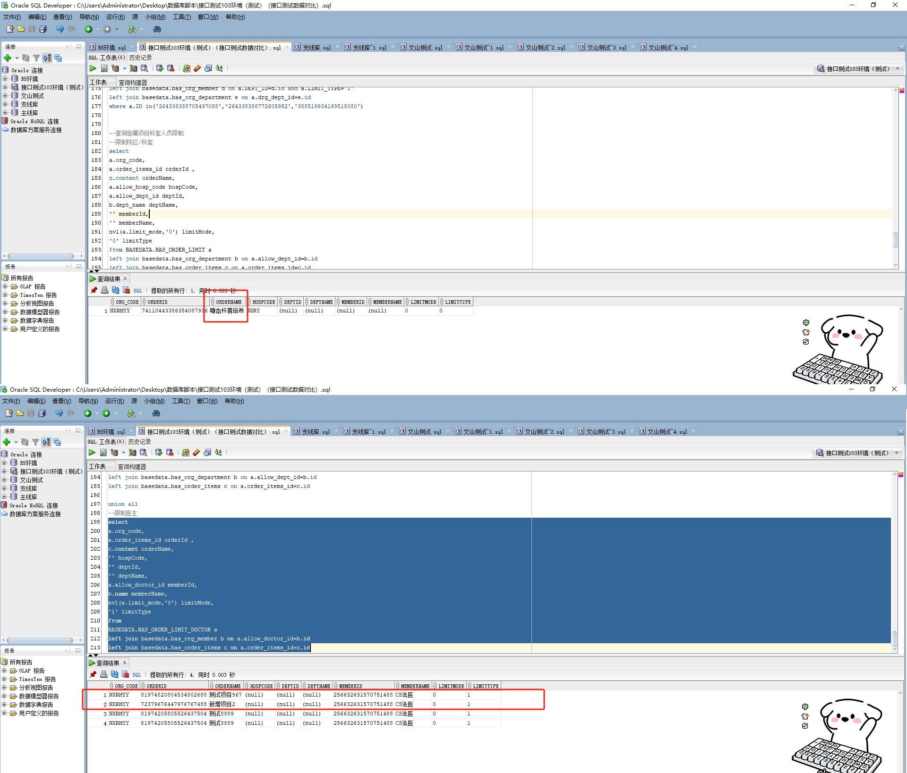

# 领域服务/基础领域 - 查询医嘱项目科室人员限制 - 查询医嘱项目科室人员限制 正向用例
## 请求参数：
``` json
{
  "hospCode": "NXRY",
  "pageIndex": 1,
  "orgCode": "NXRMYY",
  "pageSize": 3
}
```
## 返回参数：
``` json
{
    "exception": null,
    "apiCode": null,
    "data": {
        "list": [
            {
                "id": "74110448645537974016",
                "orgCode": "NXRMYY",
                "hospCode": "NXRY",
                "createDate": "2024-02-19 16:53:10",
                "updateDate": "2024-02-19 16:53:10",
                "isDelete": "N",
                "orderId": "74110443386354087936",
                "orderName": "嗜血杆菌培养",
                "deptId": null,
                "deptName": null,
                "memberId": null,
                "memberName": null,
                "limitMode": "0",
                "limitType": "2",
                "createUserId": "CS创星管理员",
                "updateUserId": "CS创星管理员"
            },
            {
                "id": "81597420804222419776",
                "orgCode": "NXRMYY",
                "hospCode": null,
                "createDate": "2024-10-22 10:58:03",
                "updateDate": "2024-10-22 10:58:03",
                "isDelete": "N",
                "orderId": "72379676447976767488",
                "orderName": "新增项目2",
                "deptId": null,
                "deptName": null,
                "memberId": "256632631570751488",
                "memberName": "CS法医",
                "limitMode": "0",
                "limitType": "1",
                "createUserId": "CS创星管理员",
                "updateUserId": "CS创星管理员"
            },
            {
                "id": "81974208046471612816",
                "orgCode": "NXRMYY",
                "hospCode": null,
                "createDate": "2024-10-22 10:59:21",
                "updateDate": "2024-10-22 10:59:21",
                "isDelete": "N",
                "orderId": "81974820804534802688",
                "orderName": "测试项目567",
                "deptId": null,
                "deptName": null,
                "memberId": "256632631570751488",
                "memberName": "CS法医",
                "limitMode": "0",
                "limitType": "1",
                "createUserId": "CS创星管理员",
                "updateUserId": "CS创星管理员"
            }
        ],
        "totalCount": 5,
        "pageSize": 1,
        "pageNo": 3,
        "pageCount": 2
    },
    "Code": 200,
    "Message": "操作成功"
}
```
## 数据校验：

# 领域服务/基础领域 - 查询医嘱项目科室人员限制 - 必填校验-[orgCode]为空
## 请求参数：
``` json
{
  "hospCode": "NXRY",
  "pageIndex": 1,
  "orgCode": "",
  "pageSize": 3,
  "orderIds": [
    "20200612080229809",
    "20200612080228845",
    "20200612080227996",
    "387951939575635968",
    "387951939177177088",
    "20200612080233196",
    "20200612080233079",
    "20200612080229706",
    "20200612080228977",
    "20200612080229945",
    "20200612080231904",
    "20200612080230938",
    "20200612080228730",
    "20200612080230810",
    "20200612080228626",
    "20200612080227898",
    "387951939525304320",
    "20200612080228916",
    "20200612080232061",
    "20200612080232298",
    "20200612080233266",
    "20200612080232192",
    "20200612080233154",
    "20200612080233399",
    "20200612080228813",
    "319003279127478272",
    "364611463145664512",
    "282796599539933184",
    "20200612080227960",
    "387951939189760000",
    "20200612080233048",
    "20200612080229918",
    "20200612080228948",
    "20200612080227857",
    "20200612080233295",
    "20200612080229526",
    "20200612080229888",
    "20200612080228434",
    "20200612080232930",
    "20200612080228561",
    "20200612080231841",
    "20200612080232811",
    "20200612080229415",
    "20200612080229778",
    "20200612080231732",
    "20200612080230521",
    "20200612080231612",
    "20200612080228218",
    "20200612080228698",
    "20200612080230894"
  ],
  "deptIds": [
    "224708989908054016"
  ],
  "memberIds": [
    "282475805660160000"
  ]
}
```
## 返回参数：
``` json
{
  "exception": null,
  "apiCode": null,
  "data": null,
  "Code": 1,
  "Message": "医院编码不能为空"
}
```
# 领域服务/基础领域 - 查询医嘱项目科室人员限制 - 必填校验-[pageIndex]为空
## 请求参数：
``` json
{
  "hospCode": "NXRY",
  "pageIndex": null,
  "orgCode": "NXRMYY",
  "pageSize": 3,
  "orderIds": [
    "20200612080229809",
    "20200612080228845",
    "20200612080227996",
    "387951939575635968",
    "387951939177177088",
    "20200612080233196",
    "20200612080233079",
    "20200612080229706",
    "20200612080228977",
    "20200612080229945",
    "20200612080231904",
    "20200612080230938",
    "20200612080228730",
    "20200612080230810",
    "20200612080228626",
    "20200612080227898",
    "387951939525304320",
    "20200612080228916",
    "20200612080232061",
    "20200612080232298",
    "20200612080233266",
    "20200612080232192",
    "20200612080233154",
    "20200612080233399",
    "20200612080228813",
    "319003279127478272",
    "364611463145664512",
    "282796599539933184",
    "20200612080227960",
    "387951939189760000",
    "20200612080233048",
    "20200612080229918",
    "20200612080228948",
    "20200612080227857",
    "20200612080233295",
    "20200612080229526",
    "20200612080229888",
    "20200612080228434",
    "20200612080232930",
    "20200612080228561",
    "20200612080231841",
    "20200612080232811",
    "20200612080229415",
    "20200612080229778",
    "20200612080231732",
    "20200612080230521",
    "20200612080231612",
    "20200612080228218",
    "20200612080228698",
    "20200612080230894"
  ],
  "deptIds": [
    "224708989908054016"
  ],
  "memberIds": [
    "282475805660160000"
  ]
}
```
## 返回参数：
``` json
{
  "exception": null,
  "apiCode": null,
  "data": null,
  "Code": 1,
  "Message": "系统内部异常"
}
```
# 领域服务/基础领域 - 查询医嘱项目科室人员限制 - 必填校验-[pageSize]为空
## 请求参数：
``` json
{
  "hospCode": "NXRY",
  "pageIndex": 1,
  "orgCode": "NXRMYY",
  "pageSize": null,
  "orderIds": [
    "20200612080229809",
    "20200612080228845",
    "20200612080227996",
    "387951939575635968",
    "387951939177177088",
    "20200612080233196",
    "20200612080233079",
    "20200612080229706",
    "20200612080228977",
    "20200612080229945",
    "20200612080231904",
    "20200612080230938",
    "20200612080228730",
    "20200612080230810",
    "20200612080228626",
    "20200612080227898",
    "387951939525304320",
    "20200612080228916",
    "20200612080232061",
    "20200612080232298",
    "20200612080233266",
    "20200612080232192",
    "20200612080233154",
    "20200612080233399",
    "20200612080228813",
    "319003279127478272",
    "364611463145664512",
    "282796599539933184",
    "20200612080227960",
    "387951939189760000",
    "20200612080233048",
    "20200612080229918",
    "20200612080228948",
    "20200612080227857",
    "20200612080233295",
    "20200612080229526",
    "20200612080229888",
    "20200612080228434",
    "20200612080232930",
    "20200612080228561",
    "20200612080231841",
    "20200612080232811",
    "20200612080229415",
    "20200612080229778",
    "20200612080231732",
    "20200612080230521",
    "20200612080231612",
    "20200612080228218",
    "20200612080228698",
    "20200612080230894"
  ],
  "deptIds": [
    "224708989908054016"
  ],
  "memberIds": [
    "282475805660160000"
  ]
}
```
## 返回参数：
``` json
{
  "exception": null,
  "apiCode": null,
  "data": null,
  "Code": 1,
  "Message": "系统内部异常"
}
```
# 领域服务/基础领域 - 查询医嘱项目科室人员限制 - 类型校验-[pageSize]类型错误
## 请求参数：
``` json
{
  "hospCode": "NXRY",
  "pageIndex": 1,
  "orgCode": "NXRMYY",
  "pageSize": "abc",
  "orderIds": [
    "20200612080229809",
    "20200612080228845",
    "20200612080227996",
    "387951939575635968",
    "387951939177177088",
    "20200612080233196",
    "20200612080233079",
    "20200612080229706",
    "20200612080228977",
    "20200612080229945",
    "20200612080231904",
    "20200612080230938",
    "20200612080228730",
    "20200612080230810",
    "20200612080228626",
    "20200612080227898",
    "387951939525304320",
    "20200612080228916",
    "20200612080232061",
    "20200612080232298",
    "20200612080233266",
    "20200612080232192",
    "20200612080233154",
    "20200612080233399",
    "20200612080228813",
    "319003279127478272",
    "364611463145664512",
    "282796599539933184",
    "20200612080227960",
    "387951939189760000",
    "20200612080233048",
    "20200612080229918",
    "20200612080228948",
    "20200612080227857",
    "20200612080233295",
    "20200612080229526",
    "20200612080229888",
    "20200612080228434",
    "20200612080232930",
    "20200612080228561",
    "20200612080231841",
    "20200612080232811",
    "20200612080229415",
    "20200612080229778",
    "20200612080231732",
    "20200612080230521",
    "20200612080231612",
    "20200612080228218",
    "20200612080228698",
    "20200612080230894"
  ],
  "deptIds": [
    "224708989908054016"
  ],
  "memberIds": [
    "282475805660160000"
  ]
}
```
## 返回参数：
``` json
{
  "exception": null,
  "apiCode": null,
  "data": null,
  "Code": 1,
  "Message": "请求参数错误"
}
```
# 领域服务/基础领域 - 查询医嘱项目科室人员限制 - 类型校验-[pageIndex]类型错误
## 请求参数：
``` json
{
  "hospCode": "NXRY",
  "pageIndex": "abc",
  "orgCode": "NXRMYY",
  "pageSize": 3,
  "orderIds": [
    "20200612080229809",
    "20200612080228845",
    "20200612080227996",
    "387951939575635968",
    "387951939177177088",
    "20200612080233196",
    "20200612080233079",
    "20200612080229706",
    "20200612080228977",
    "20200612080229945",
    "20200612080231904",
    "20200612080230938",
    "20200612080228730",
    "20200612080230810",
    "20200612080228626",
    "20200612080227898",
    "387951939525304320",
    "20200612080228916",
    "20200612080232061",
    "20200612080232298",
    "20200612080233266",
    "20200612080232192",
    "20200612080233154",
    "20200612080233399",
    "20200612080228813",
    "319003279127478272",
    "364611463145664512",
    "282796599539933184",
    "20200612080227960",
    "387951939189760000",
    "20200612080233048",
    "20200612080229918",
    "20200612080228948",
    "20200612080227857",
    "20200612080233295",
    "20200612080229526",
    "20200612080229888",
    "20200612080228434",
    "20200612080232930",
    "20200612080228561",
    "20200612080231841",
    "20200612080232811",
    "20200612080229415",
    "20200612080229778",
    "20200612080231732",
    "20200612080230521",
    "20200612080231612",
    "20200612080228218",
    "20200612080228698",
    "20200612080230894"
  ],
  "deptIds": [
    "224708989908054016"
  ],
  "memberIds": [
    "282475805660160000"
  ]
}
```
## 返回参数：
``` json
{
  "exception": null,
  "apiCode": null,
  "data": null,
  "Code": 1,
  "Message": "请求参数错误"
}
```
# 领域服务/基础领域 - 查询医嘱项目科室人员限制 - 依赖用例-[orgCode]赋值为依赖用例测试值
## 请求参数：
``` json
{
  "hospCode": "NXRY",
  "pageIndex": 1,
  "orgCode": "依赖用例测试值",
  "pageSize": 3,
  "orderIds": [
    "20200612080229809",
    "20200612080228845",
    "20200612080227996",
    "387951939575635968",
    "387951939177177088",
    "20200612080233196",
    "20200612080233079",
    "20200612080229706",
    "20200612080228977",
    "20200612080229945",
    "20200612080231904",
    "20200612080230938",
    "20200612080228730",
    "20200612080230810",
    "20200612080228626",
    "20200612080227898",
    "387951939525304320",
    "20200612080228916",
    "20200612080232061",
    "20200612080232298",
    "20200612080233266",
    "20200612080232192",
    "20200612080233154",
    "20200612080233399",
    "20200612080228813",
    "319003279127478272",
    "364611463145664512",
    "282796599539933184",
    "20200612080227960",
    "387951939189760000",
    "20200612080233048",
    "20200612080229918",
    "20200612080228948",
    "20200612080227857",
    "20200612080233295",
    "20200612080229526",
    "20200612080229888",
    "20200612080228434",
    "20200612080232930",
    "20200612080228561",
    "20200612080231841",
    "20200612080232811",
    "20200612080229415",
    "20200612080229778",
    "20200612080231732",
    "20200612080230521",
    "20200612080231612",
    "20200612080228218",
    "20200612080228698",
    "20200612080230894"
  ],
  "deptIds": [
    "224708989908054016"
  ],
  "memberIds": [
    "282475805660160000"
  ]
}
```
## 返回参数：
``` json
{
  "exception": null,
  "apiCode": null,
  "data": {
    "list": [],
    "totalCount": 0,
    "pageSize": 1,
    "pageNo": 3,
    "pageCount": 0
  },
  "Code": 200,
  "Message": "操作成功"
}
```