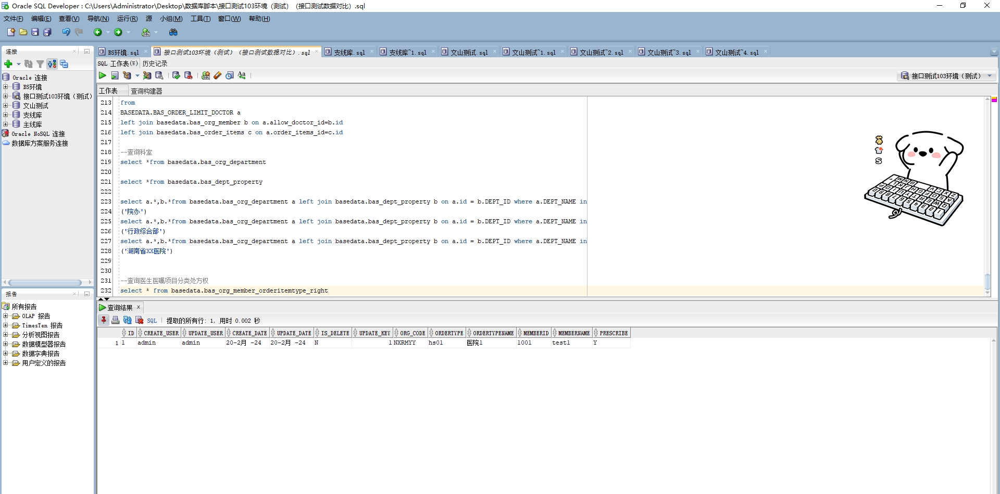

# 领域服务/基础领域 - 查询医生医嘱项目分类处方权 - 查询医生医嘱项目分类处方权 正向用例
## 请求参数：
``` json
{
  "pageIndex": 1,
  "orgCode": "NXRMYY",
  "pageSize": 3,
  "memberIds": [
    "1001"
  ]
}
```
## 返回参数：
``` json
{
    "exception": null,
    "apiCode": null,
    "data": {
        "list": [
            {
                "id": "1",
                "orgCode": "NXRMYY",
                "hospCode": null,
                "createDate": "2024-02-20 15:42:47",
                "updateDate": "2024-02-20 15:42:47",
                "isDelete": "N",
                "orderType": "hs01",
                "orderTypeName": "医院1",
                "memberId": "1001",
                "memberName": "test1",
                "prescribe": "Y",
                "createUserId": "admin",
                "updateUserId": "admin"
            }
        ],
        "totalCount": 1,
        "pageSize": 1,
        "pageNo": 3,
        "pageCount": 1
    },
    "Code": 200,
    "Message": "操作成功"
}
```
## 数据校验：



# 领域服务/基础领域 - 查询医生医嘱项目分类处方权 - 必填校验-[orgCode]为空
## 请求参数：
``` json
{
  "pageIndex": 1,
  "orgCode": "",
  "pageSize": 3,
  "memberIds": [
    "282475805660160000"
  ]
}
```
## 返回参数：
``` json
{
  "exception": null,
  "apiCode": null,
  "data": null,
  "Code": 1,
  "Message": "医院编码不能为空"
}
```
# 领域服务/基础领域 - 查询医生医嘱项目分类处方权 - 必填校验-[pageIndex]为空
## 请求参数：
``` json
{
  "pageIndex": null,
  "orgCode": "NXRMYY",
  "pageSize": 3,
  "memberIds": [
    "282475805660160000"
  ]
}
```
## 返回参数：
``` json
{
  "exception": null,
  "apiCode": null,
  "data": null,
  "Code": 1,
  "Message": "系统内部异常"
}
```
# 领域服务/基础领域 - 查询医生医嘱项目分类处方权 - 必填校验-[pageSize]为空
## 请求参数：
``` json
{
  "pageIndex": 1,
  "orgCode": "NXRMYY",
  "pageSize": null,
  "memberIds": [
    "282475805660160000"
  ]
}
```
## 返回参数：
``` json
{
  "exception": null,
  "apiCode": null,
  "data": null,
  "Code": 1,
  "Message": "系统内部异常"
}
```
# 领域服务/基础领域 - 查询医生医嘱项目分类处方权 - 必填校验-[memberIds]为空
## 请求参数：
``` json
{
  "pageIndex": 1,
  "orgCode": "NXRMYY",
  "pageSize": 3,
  "memberIds": null
}
```
## 返回参数：
``` json
{
  "exception": null,
  "apiCode": null,
  "data": null,
  "Code": 1,
  "Message": "人员ID不能为空"
}
```
# 领域服务/基础领域 - 查询医生医嘱项目分类处方权 - 类型校验-[memberIds]类型错误
## 请求参数：
``` json
{
  "pageIndex": 1,
  "orgCode": "NXRMYY",
  "pageSize": 3,
  "memberIds": "abc"
}
```
## 返回参数：
``` json
{
  "exception": null,
  "apiCode": null,
  "data": null,
  "Code": 1,
  "Message": "请求参数错误"
}
```
# 领域服务/基础领域 - 查询医生医嘱项目分类处方权 - 类型校验-[pageSize]类型错误
## 请求参数：
``` json
{
  "pageIndex": 1,
  "orgCode": "NXRMYY",
  "pageSize": "abc",
  "memberIds": [
    "282475805660160000"
  ]
}
```
## 返回参数：
``` json
{
  "exception": null,
  "apiCode": null,
  "data": null,
  "Code": 1,
  "Message": "请求参数错误"
}
```
# 领域服务/基础领域 - 查询医生医嘱项目分类处方权 - 类型校验-[pageIndex]类型错误
## 请求参数：
``` json
{
  "pageIndex": "abc",
  "orgCode": "NXRMYY",
  "pageSize": 3,
  "memberIds": [
    "282475805660160000"
  ]
}
```
## 返回参数：
``` json
{
  "exception": null,
  "apiCode": null,
  "data": null,
  "Code": 1,
  "Message": "请求参数错误"
}
```
# 领域服务/基础领域 - 查询医生医嘱项目分类处方权 - 依赖用例-[memberIds]赋值为[依赖用例测试值]
## 请求参数：
``` json
{
  "pageIndex": 1,
  "orgCode": "NXRMYY",
  "pageSize": 3,
  "memberIds": [
    "依赖用例测试值"
  ]
}
```
## 返回参数：
``` json
{
  "exception": null,
  "apiCode": null,
  "data": {
    "list": [],
    "totalCount": 0,
    "pageSize": 1,
    "pageNo": 3,
    "pageCount": 0
  },
  "Code": 200,
  "Message": "操作成功"
}
```
# 领域服务/基础领域 - 查询医生医嘱项目分类处方权 - 依赖用例-[orgCode]赋值为依赖用例测试值
## 请求参数：
``` json
{
  "pageIndex": 1,
  "orgCode": "依赖用例测试值",
  "pageSize": 3,
  "memberIds": [
    "282475805660160000"
  ]
}
```
## 返回参数：
``` json
{
  "exception": null,
  "apiCode": null,
  "data": {
    "list": [],
    "totalCount": 0,
    "pageSize": 1,
    "pageNo": 3,
    "pageCount": 0
  },
  "Code": 200,
  "Message": "操作成功"
}
```