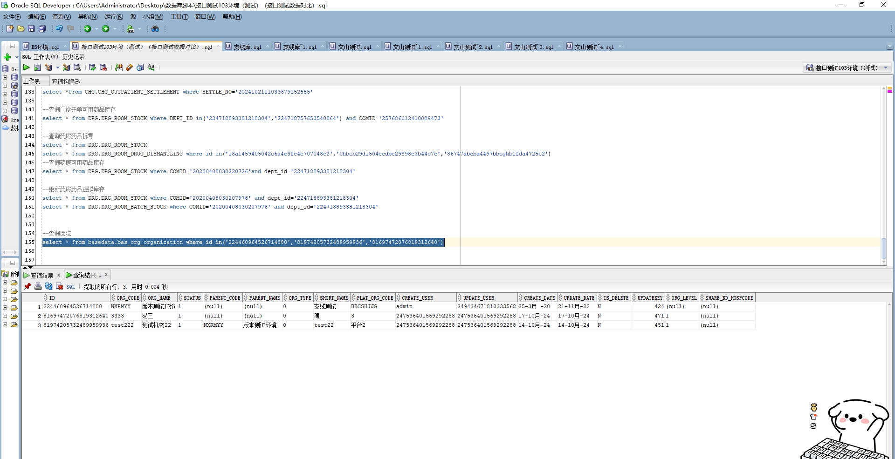

# 领域服务/基础领域 - 查询医院 - 查询医院 正向用例
## 请求参数：
``` json
{
  "pageSize": 3,
  "pageIndex": 1
}
```
## 返回参数：
``` json
{
  "exception": null,
  "apiCode": null,
  "data": {
    "list": [
      {
        "id": "224460964526714880",
        "createDate": "2020-03-25 17:27:44",
        "createUserId": "admin",
        "isDelete": "N",
        "orgCode": "NXRMYY",
        "orgLevel": null,
        "orgName": "版本测试环境",
        "orgShortName": "支线测试",
        "paltOrgCode": "BBCSHJJG",
        "parentCode": null,
        "parentName": null,
        "status": "1",
        "updateDate": "2022-11-21 14:34:08",
        "updateUserId": "249434671812333568"
      },
      {
        "id": "81974205732489959936",
        "createDate": "2024-10-14 17:43:59",
        "createUserId": "247536401569292288",
        "isDelete": "N",
        "orgCode": "test222",
        "orgLevel": "1",
        "orgName": "测试机构22",
        "orgShortName": "test22",
        "paltOrgCode": "平台2",
        "parentCode": "NXRMYY",
        "parentName": "版本测试环境",
        "status": "1",
        "updateDate": "2024-10-14 17:43:59",
        "updateUserId": "247536401569292288"
      },
      {
        "id": "81697472076819312640",
        "createDate": "2024-10-17 14:08:38",
        "createUserId": "247536401569292288",
        "isDelete": "N",
        "orgCode": "3333",
        "orgLevel": "1",
        "orgName": "易三",
        "orgShortName": "简",
        "paltOrgCode": "3",
        "parentCode": null,
        "parentName": null,
        "status": "1",
        "updateDate": "2024-10-17 14:08:38",
        "updateUserId": "247536401569292288"
      }
    ],
    "totalCount": 4,
    "pageSize": 1,
    "pageNo": 3,
    "pageCount": 2
  },
  "Code": 200,
  "Message": "操作成功"
}
```
## 数据校验：



# 领域服务/基础领域 - 查询医院 - 必填校验-[pageIndex]为空
## 请求参数：
``` json
{
  "pageSize": 3,
  "pageIndex": null
}
```
## 返回参数：
``` json
{
  "exception": null,
  "apiCode": null,
  "data": null,
  "Code": 1,
  "Message": "系统内部异常"
}
```
# 领域服务/基础领域 - 查询医院 - 必填校验-[pageSize]为空
## 请求参数：
``` json
{
  "pageSize": null,
  "pageIndex": 1
}
```
## 返回参数：
``` json
{
  "exception": null,
  "apiCode": null,
  "data": null,
  "Code": 1,
  "Message": "系统内部异常"
}
```
# 领域服务/基础领域 - 查询医院 - 类型校验-[pageIndex]类型错误
## 请求参数：
``` json
{
  "pageSize": 3,
  "pageIndex": "abc"
}
```
## 返回参数：
``` json
{
  "exception": null,
  "apiCode": null,
  "data": null,
  "Code": 1,
  "Message": "请求参数错误"
}
```
# 领域服务/基础领域 - 查询医院 - 类型校验-[pageSize]类型错误
## 请求参数：
``` json
{
  "pageSize": "abc",
  "pageIndex": 1
}
```
## 返回参数：
``` json
{
  "exception": null,
  "apiCode": null,
  "data": null,
  "Code": 1,
  "Message": "请求参数错误"
}
```