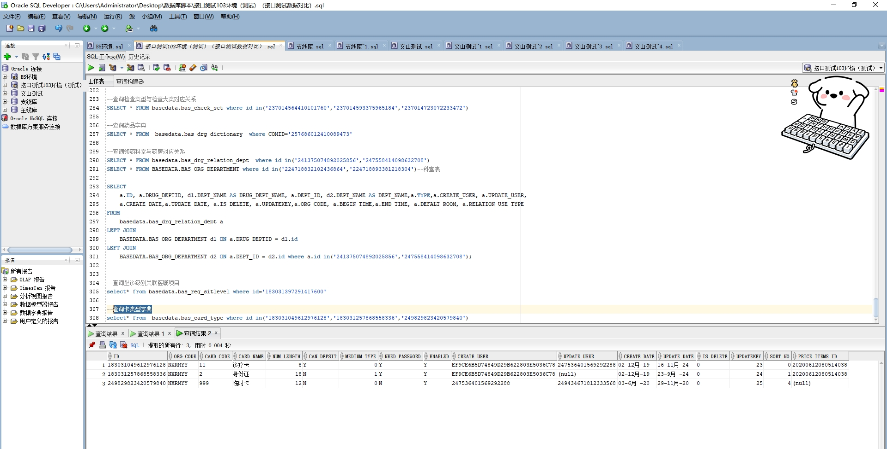

# 领域服务/基础领域 - 查询卡类型字典 - 查询卡类型字典 正向用例
## 请求参数：
``` json
{
  "pageSize": 3,
  "pageIndex": 1,
  "orgCode": "NXRMYY"
}
```
## 返回参数：
``` json
{
  "exception": null,
  "apiCode": null,
  "data": {
    "list": [
      {
        "id": "183031049612976128",
        "orgCode": "NXRMYY",
        "hospCode": null,
        "createDate": "2019-12-02 09:40:02",
        "updateDate": "2024-11-16 14:17:06",
        "isDelete": "N",
        "cardCode": "11",
        "cardName": "诊疗卡",
        "numLength": 8,
        "canDepsit": "Y",
        "mediumType": 0,
        "needPassword": "Y",
        "enabled": "Y",
        "sortNo": 0,
        "priceItemsId": "20200612080514038",
        "priceItemName": "卡特尔16项人格测验",
        "createUserId": "EF9CE6B5D74849D29B622803E5036C78",
        "updateUserId": "247536401569292288",
        "updatekey": 23
      },
      {
        "id": "183031257868558336",
        "orgCode": "NXRMYY",
        "hospCode": null,
        "createDate": "2019-12-02 09:40:52",
        "updateDate": "2024-09-23 14:06:01",
        "isDelete": "N",
        "cardCode": "2",
        "cardName": "身份证",
        "numLength": 18,
        "canDepsit": "N",
        "mediumType": 1,
        "needPassword": "Y",
        "enabled": "Y",
        "sortNo": 1,
        "priceItemsId": "20200612080514038",
        "priceItemName": "卡特尔16项人格测验",
        "createUserId": "EF9CE6B5D74849D29B622803E5036C78",
        "updateUserId": null,
        "updatekey": 24
      },
      {
        "id": "249829823420579840",
        "orgCode": "NXRMYY",
        "hospCode": null,
        "createDate": "2020-06-03 17:34:31",
        "updateDate": "2020-11-29 15:19:52",
        "isDelete": "N",
        "cardCode": "999",
        "cardName": "临时卡",
        "numLength": 12,
        "canDepsit": "N",
        "mediumType": 0,
        "needPassword": "N",
        "enabled": "Y",
        "sortNo": 4,
        "priceItemsId": null,
        "priceItemName": null,
        "createUserId": "247536401569292288",
        "updateUserId": "249434671812333568",
        "updatekey": 25
      }
    ],
    "totalCount": 19,
    "pageSize": 3,
    "pageNo": 1,
    "pageCount": 7
  },
  "Code": 200,
  "Message": "操作成功"
}
```
## 数据校验：

# 领域服务/基础领域 - 查询卡类型字典 - 必填校验-[orgCode]为空
## 请求参数：
``` json
{
  "pageSize": 3,
  "pageIndex": 1,
  "orgCode": ""
}
```
## 返回参数：
``` json
{
  "exception": null,
  "apiCode": null,
  "data": null,
  "Code": 1,
  "Message": "医院编码不能为空"
}
```
# 领域服务/基础领域 - 查询卡类型字典 - 必填校验-[pageIndex]为空
## 请求参数：
``` json
{
  "pageSize": 3,
  "pageIndex": null,
  "orgCode": "NXRMYY"
}
```
## 返回参数：
``` json
{
  "exception": null,
  "apiCode": null,
  "data": null,
  "Code": 1,
  "Message": "系统内部异常"
}
```
# 领域服务/基础领域 - 查询卡类型字典 - 必填校验-[pageSize]为空
## 请求参数：
``` json
{
  "pageSize": null,
  "pageIndex": 1,
  "orgCode": "NXRMYY"
}
```
## 返回参数：
``` json
{
  "exception": null,
  "apiCode": null,
  "data": null,
  "Code": 1,
  "Message": "系统内部异常"
}
```
# 领域服务/基础领域 - 查询卡类型字典 - 类型校验-[pageIndex]类型错误
## 请求参数：
``` json
{
  "pageSize": 3,
  "pageIndex": "abc",
  "orgCode": "NXRMYY"
}
```
## 返回参数：
``` json
{
  "exception": null,
  "apiCode": null,
  "data": null,
  "Code": 1,
  "Message": "请求参数错误"
}
```
# 领域服务/基础领域 - 查询卡类型字典 - 类型校验-[pageSize]类型错误
## 请求参数：
``` json
{
  "pageSize": "abc",
  "pageIndex": 1,
  "orgCode": "NXRMYY"
}
```
## 返回参数：
``` json
{
  "exception": null,
  "apiCode": null,
  "data": null,
  "Code": 1,
  "Message": "请求参数错误"
}
```
# 领域服务/基础领域 - 查询卡类型字典 - 依赖用例-[orgCode]赋值为依赖用例测试值
## 请求参数：
``` json
{
  "pageSize": 3,
  "pageIndex": 1,
  "orgCode": "依赖用例测试值"
}
```
## 返回参数：
``` json
{
  "exception": null,
  "apiCode": null,
  "data": {
    "list": [],
    "totalCount": 0,
    "pageSize": 3,
    "pageNo": 1,
    "pageCount": 0
  },
  "Code": 200,
  "Message": "操作成功"
}
```