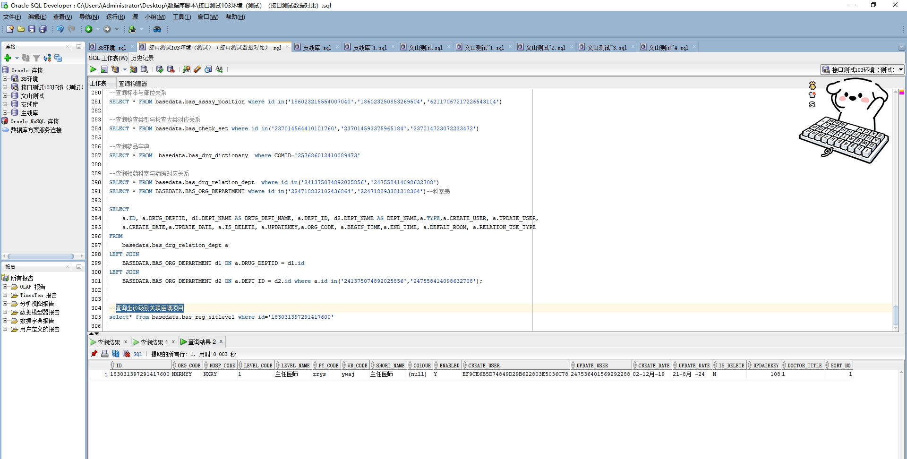

# 领域服务/基础领域 - 查询坐诊级别关联医嘱项目 - 查询坐诊级别关联医嘱项目 正向用例
## 请求参数：
``` json
{
  "hospCode": "NXRY",
  "isDelete": "N",
  "pageSize": 3,
  "enabled": "Y",
  "pageIndex": 1,
  "orgCode": "NXRMYY",
  "ids": [
    "183031397291417600"
  ]
}
```
## 返回参数：
``` json
{
  "exception": null,
  "apiCode": null,
  "data": {
    "list": [
      {
        "id": "183031397291417600",
        "orgCode": "NXRMYY",
        "hospCode": "NXRY",
        "createDate": "2019-12-02 09:41:25",
        "updateDate": "2024-08-21 10:30:02",
        "isDelete": "N",
        "pyCode": "zrys",
        "wbCode": "ywaj",
        "shortName": "主任医师",
        "enabled": "Y",
        "sortNo": 1,
        "doctorTitleName": null,
        "relateOrderItems": null,
        "createUserId": "EF9CE6B5D74849D29B622803E5036C78",
        "updateUserId": "247536401569292288",
        "code": "1",
        "name": "主任医师",
        "color": null,
        "updatekey": 108,
        "doctorTitleCode": "1"
      }
    ],
    "totalCount": 1,
    "pageSize": 3,
    "pageNo": 1,
    "pageCount": 1
  },
  "Code": 200,
  "Message": "操作成功"
}
```
## 数据校验：

# 领域服务/基础领域 - 查询坐诊级别关联医嘱项目 - 必填校验-[orgCode]为空
## 请求参数：
``` json
{
  "hospCode": "NXRY",
  "isDelete": "N",
  "pageSize": 3,
  "enabled": "Y",
  "pageIndex": 1,
  "orgCode": "",
  "ids": [
    "183031397291417600"
  ]
}
```
## 返回参数：
``` json
{
  "exception": null,
  "apiCode": null,
  "data": null,
  "Code": 1,
  "Message": "医院编码不可为空"
}
```
# 领域服务/基础领域 - 查询坐诊级别关联医嘱项目 - 必填校验-[hospCode]为空
## 请求参数：
``` json
{
  "hospCode": "",
  "isDelete": "N",
  "pageSize": 3,
  "enabled": "Y",
  "pageIndex": 1,
  "orgCode": "NXRMYY",
  "ids": [
    "183031397291417600"
  ]
}
```
## 返回参数：
``` json
{
  "exception": null,
  "apiCode": null,
  "data": null,
  "Code": 1,
  "Message": "院区编码不可为空"
}
```
# 领域服务/基础领域 - 查询坐诊级别关联医嘱项目 - 必填校验-[pageIndex]为空
## 请求参数：
``` json
{
  "hospCode": "NXRY",
  "isDelete": "N",
  "pageSize": 3,
  "enabled": "Y",
  "pageIndex": null,
  "orgCode": "NXRMYY",
  "ids": [
    "183031397291417600"
  ]
}
```
## 返回参数：
``` json
{
  "exception": null,
  "apiCode": null,
  "data": null,
  "Code": 1,
  "Message": "系统内部异常"
}
```
# 领域服务/基础领域 - 查询坐诊级别关联医嘱项目 - 必填校验-[pageSize]为空
## 请求参数：
``` json
{
  "hospCode": "NXRY",
  "isDelete": "N",
  "pageSize": null,
  "enabled": "Y",
  "pageIndex": 1,
  "orgCode": "NXRMYY",
  "ids": [
    "183031397291417600"
  ]
}
```
## 返回参数：
``` json
{
  "exception": null,
  "apiCode": null,
  "data": null,
  "Code": 1,
  "Message": "系统内部异常"
}
```
# 领域服务/基础领域 - 查询坐诊级别关联医嘱项目 - 类型校验-[pageIndex]类型错误
## 请求参数：
``` json
{
  "hospCode": "NXRY",
  "isDelete": "N",
  "pageSize": 3,
  "enabled": "Y",
  "pageIndex": "abc",
  "orgCode": "NXRMYY",
  "ids": [
    "183031397291417600"
  ]
}
```
## 返回参数：
``` json
{
  "exception": null,
  "apiCode": null,
  "data": null,
  "Code": 1,
  "Message": "请求参数错误"
}
```
# 领域服务/基础领域 - 查询坐诊级别关联医嘱项目 - 类型校验-[pageSize]类型错误
## 请求参数：
``` json
{
  "hospCode": "NXRY",
  "isDelete": "N",
  "pageSize": "abc",
  "enabled": "Y",
  "pageIndex": 1,
  "orgCode": "NXRMYY",
  "ids": [
    "183031397291417600"
  ]
}
```
## 返回参数：
``` json
{
  "exception": null,
  "apiCode": null,
  "data": null,
  "Code": 1,
  "Message": "请求参数错误"
}
```
# 领域服务/基础领域 - 查询坐诊级别关联医嘱项目 - 依赖用例-[orgCode]赋值为依赖用例测试值
## 请求参数：
``` json
{
  "hospCode": "NXRY",
  "isDelete": "N",
  "pageSize": 3,
  "enabled": "Y",
  "pageIndex": 1,
  "orgCode": "依赖用例测试值",
  "ids": [
    "183031397291417600"
  ]
}
```
## 返回参数：
``` json
{
  "exception": null,
  "apiCode": null,
  "data": {
    "list": [],
    "totalCount": 0,
    "pageSize": 3,
    "pageNo": 1,
    "pageCount": 0
  },
  "Code": 200,
  "Message": "操作成功"
}
```
# 领域服务/基础领域 - 查询坐诊级别关联医嘱项目 - 依赖用例-[hospCode]赋值为依赖用例测试值
## 请求参数：
``` json
{
  "hospCode": "依赖用例测试值",
  "isDelete": "N",
  "pageSize": 3,
  "enabled": "Y",
  "pageIndex": 1,
  "orgCode": "NXRMYY",
  "ids": [
    "183031397291417600"
  ]
}
```
## 返回参数：
``` json
{
  "exception": null,
  "apiCode": null,
  "data": {
    "list": [],
    "totalCount": 0,
    "pageSize": 3,
    "pageNo": 1,
    "pageCount": 0
  },
  "Code": 200,
  "Message": "操作成功"
}
```