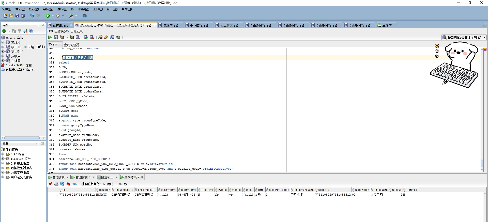

# 领域服务/基础领域 - 查询基础信息分组明细 - 查询基础信息分组明细 正向用例
## 请求参数：
``` json
{
  "pageSize": 3,
  "groupTypeCodes": [
    "1"
  ],
  "pageIndex": 1,
  "orgCode": "NXRMYY"
}
```
## 返回参数：
``` json
{
    "exception": null,
    "apiCode": null,
    "data": {
        "list": [
            {
                "id": "77311082297331853312",
                "orgCode": "NXRMYY",
                "hospCode": null,
                "createDate": null,
                "updateDate": "2024-06-06 00:00:00",
                "isDelete": "N",
                "code": null,
                "groupCode": "02",
                "groupId": "77311082297331853312",
                "groupName": "治疗用药",
                "groupTypeCode": "1",
                "groupTypeName": "用药指征",
                "isMutex": "N",
                "name": "发热",
                "pyCode": "fr",
                "sortNo": 2,
                "wbCode": "vr",
                "createUserId": null,
                "updateUserId": null
            }
        ],
        "totalCount": 1,
        "pageSize": 1,
        "pageNo": 1,
        "pageCount": 1
    },
    "Code": 200,
    "Message": "操作成功"
}
```
## 数据校验：

# 领域服务/基础领域 - 查询基础信息分组明细 - 必填校验-[orgCode]为空
## 请求参数：
``` json
{
  "pageSize": 3,
  "groupTypeCodes": [
    "1"
  ],
  "pageIndex": 1,
  "orgCode": ""
}
```
## 返回参数：
``` json
{
  "exception": null,
  "apiCode": null,
  "data": null,
  "Code": 1,
  "Message": "医院编码不能为空"
}
```
# 领域服务/基础领域 - 查询基础信息分组明细 - 必填校验-[pageIndex]为空
## 请求参数：
``` json
{
  "pageSize": 3,
  "groupTypeCodes": [
    "1"
  ],
  "pageIndex": null,
  "orgCode": "NXRMYY"
}
```
## 返回参数：
``` json
{
  "exception": null,
  "apiCode": null,
  "data": null,
  "Code": 1,
  "Message": "系统内部异常"
}
```
# 领域服务/基础领域 - 查询基础信息分组明细 - 必填校验-[pageSize]为空
## 请求参数：
``` json
{
  "pageSize": null,
  "groupTypeCodes": [
    "1"
  ],
  "pageIndex": 1,
  "orgCode": "NXRMYY"
}
```
## 返回参数：
``` json
{
  "exception": null,
  "apiCode": null,
  "data": null,
  "Code": 1,
  "Message": "系统内部异常"
}
```
# 领域服务/基础领域 - 查询基础信息分组明细 - 类型校验-[pageIndex]类型错误
## 请求参数：
``` json
{
  "pageSize": 3,
  "groupTypeCodes": [
    "1"
  ],
  "pageIndex": "abc",
  "orgCode": "NXRMYY"
}
```
## 返回参数：
``` json
{
  "exception": null,
  "apiCode": null,
  "data": null,
  "Code": 1,
  "Message": "请求参数错误"
}
```
# 领域服务/基础领域 - 查询基础信息分组明细 - 类型校验-[pageSize]类型错误
## 请求参数：
``` json
{
  "pageSize": "abc",
  "groupTypeCodes": [
    "1"
  ],
  "pageIndex": 1,
  "orgCode": "NXRMYY"
}
```
## 返回参数：
``` json
{
  "exception": null,
  "apiCode": null,
  "data": null,
  "Code": 1,
  "Message": "请求参数错误"
}
```
# 领域服务/基础领域 - 查询基础信息分组明细 - 依赖用例-[orgCode]赋值为依赖用例测试值
## 请求参数：
``` json
{
  "pageSize": 3,
  "groupTypeCodes": [
    "1"
  ],
  "pageIndex": 1,
  "orgCode": "依赖用例测试值"
}
```
## 返回参数：
``` json
{
  "exception": null,
  "apiCode": null,
  "data": {
    "list": [],
    "totalCount": 0,
    "pageSize": 10,
    "pageNo": 1,
    "pageCount": 1
  },
  "Code": 200,
  "Message": "操作成功"
}
```