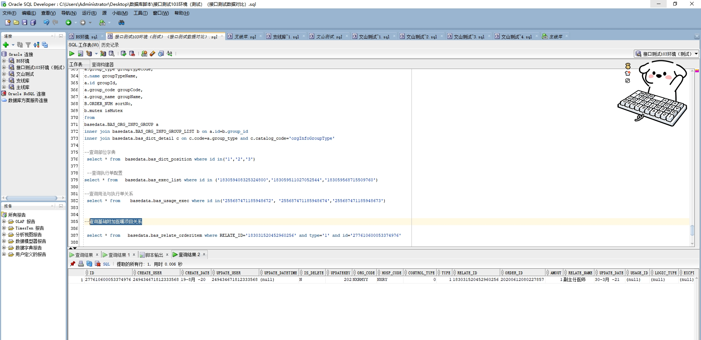

# 领域服务/基础领域 - 查询基础附加医嘱项目关系 - 查询基础附加医嘱项目关系 正向用例
## 请求参数：
``` json
{
    "hospCode": "NXRY",
    "pageIndex": 1,
    "orgCode": "NXRMYY",
    "relateId": [
        "183031520452960256"
    ],
    "pageSize": 1,
    "relateType": "1"
}
```
## 返回参数：
``` json
{
    "exception": null,
    "apiCode": null,
    "data": {
        "list": [
            {
                "id": "277610600053374976",
                "orgCode": "NXRMYY",
                "hospCode": "NXRY",
                "createDate": "2020-08-19 09:25:24",
                "updateDate": "2021-03-30 10:00:03",
                "isDelete": "N",
                "updateDatetime": null,
                "controlType": 0,
                "relateId": "183031520452960256",
                "relateName": "副主任医师",
                "orderItemName": "副主任医师门诊诊查费",
                "usageId": null,
                "usageName": null,
                "frequencyId": null,
                "frequencyName": null,
                "logicType": null,
                "execDeptId": null,
                "execDeptName": null,
                "mngType": null,
                "relateOrderItemDepts": null,
                "relateOrderItemRegulars": null,
                "createUserId": "249434671812333568",
                "updateUserId": "249434671812333568",
                "relateType": 1,
                "orderItemId": "20200612080227857",
                "amount": 1
            }
        ],
        "totalCount": 3,
        "pageSize": 1,
        "pageNo": 1,
        "pageCount": 3
    },
    "Code": 200,
    "Message": "操作成功"
}
```
## 数据校验：

# 领域服务/基础领域 - 查询基础附加医嘱项目关系 - 必填校验-[orgCode]为空
## 请求参数：
``` json
{
  "hospCode": "NXRY",
  "pageIndex": 1,
  "orgCode": "",
  "relateId": [
    "224708989908054016"
  ],
  "pageSize": 3,
  "relateType": "12"
}
```
## 返回参数：
``` json
{
  "exception": null,
  "apiCode": null,
  "data": null,
  "Code": 1,
  "Message": "医院编码不能为空"
}
```
# 领域服务/基础领域 - 查询基础附加医嘱项目关系 - 必填校验-[hospCode]为空
## 请求参数：
``` json
{
  "hospCode": "",
  "pageIndex": 1,
  "orgCode": "NXRMYY",
  "relateId": [
    "224708989908054016"
  ],
  "pageSize": 3,
  "relateType": "12"
}
```
## 返回参数：
``` json
{
  "exception": null,
  "apiCode": null,
  "data": null,
  "Code": 1,
  "Message": "院区编码不能为空"
}
```
# 领域服务/基础领域 - 查询基础附加医嘱项目关系 - 必填校验-[pageIndex]为空
## 请求参数：
``` json
{
  "hospCode": "NXRY",
  "pageIndex": null,
  "orgCode": "NXRMYY",
  "relateId": [
    "224708989908054016"
  ],
  "pageSize": 3,
  "relateType": "12"
}
```
## 返回参数：
``` json
{
  "exception": null,
  "apiCode": null,
  "data": null,
  "Code": 1,
  "Message": "系统内部异常"
}
```
# 领域服务/基础领域 - 查询基础附加医嘱项目关系 - 必填校验-[pageSize]为空
## 请求参数：
``` json
{
  "hospCode": "NXRY",
  "pageIndex": 1,
  "orgCode": "NXRMYY",
  "relateId": [
    "224708989908054016"
  ],
  "pageSize": null,
  "relateType": "12"
}
```
## 返回参数：
``` json
{
  "exception": null,
  "apiCode": null,
  "data": null,
  "Code": 1,
  "Message": "系统内部异常"
}
```
# 领域服务/基础领域 - 查询基础附加医嘱项目关系 - 必填校验-[relateType]为空
## 请求参数：
``` json
{
  "hospCode": "NXRY",
  "pageIndex": 1,
  "orgCode": "NXRMYY",
  "relateId": [
    "224708989908054016"
  ],
  "pageSize": 3,
  "relateType": ""
}
```
## 返回参数：
``` json
{
  "exception": null,
  "apiCode": null,
  "data": null,
  "Code": 1,
  "Message": "附加类型不能为空"
}
```
# 领域服务/基础领域 - 查询基础附加医嘱项目关系 - 必填校验-[relateId]为空
## 请求参数：
``` json
{
  "hospCode": "NXRY",
  "pageIndex": 1,
  "orgCode": "NXRMYY",
  "relateId": null,
  "pageSize": 3,
  "relateType": "12"
}
```
## 返回参数：
``` json
{
  "exception": null,
  "apiCode": null,
  "data": null,
  "Code": 1,
  "Message": "关联ID不能为空"
}
```
# 领域服务/基础领域 - 查询基础附加医嘱项目关系 - 类型校验-[pageSize]类型错误
## 请求参数：
``` json
{
  "hospCode": "NXRY",
  "pageIndex": 1,
  "orgCode": "NXRMYY",
  "relateId": [
    "224708989908054016"
  ],
  "pageSize": "abc",
  "relateType": "12"
}
```
## 返回参数：
``` json
{
  "exception": null,
  "apiCode": null,
  "data": null,
  "Code": 1,
  "Message": "请求参数错误"
}
```
# 领域服务/基础领域 - 查询基础附加医嘱项目关系 - 类型校验-[relateId]类型错误
## 请求参数：
``` json
{
  "hospCode": "NXRY",
  "pageIndex": 1,
  "orgCode": "NXRMYY",
  "relateId": "abc",
  "pageSize": 3,
  "relateType": "12"
}
```
## 返回参数：
``` json
{
  "exception": null,
  "apiCode": null,
  "data": null,
  "Code": 1,
  "Message": "请求参数错误"
}
```
# 领域服务/基础领域 - 查询基础附加医嘱项目关系 - 类型校验-[pageIndex]类型错误
## 请求参数：
``` json
{
  "hospCode": "NXRY",
  "pageIndex": "abc",
  "orgCode": "NXRMYY",
  "relateId": [
    "224708989908054016"
  ],
  "pageSize": 3,
  "relateType": "12"
}
```
## 返回参数：
``` json
{
  "exception": null,
  "apiCode": null,
  "data": null,
  "Code": 1,
  "Message": "请求参数错误"
}
```
# 领域服务/基础领域 - 查询基础附加医嘱项目关系 - 枚举用例-[relateType] 枚举值为 1(附加类型为坐诊级别附加)
## 请求参数：
``` json
{
  "hospCode": "NXRY",
  "pageIndex": 1,
  "orgCode": "NXRMYY",
  "relateId": [
    "224708989908054016"
  ],
  "pageSize": 3,
  "relateType": "1"
}
```
## 返回参数：
``` json
{
  "exception": null,
  "apiCode": null,
  "data": {
    "list": [],
    "totalCount": 0,
    "pageSize": 3,
    "pageNo": 1,
    "pageCount": 0
  },
  "Code": 200,
  "Message": "操作成功"
}
```
# 领域服务/基础领域 - 查询基础附加医嘱项目关系 - 枚举用例-[relateType] 枚举值为 2(附加类型为医嘱对应医嘱)
## 请求参数：
``` json
{
  "hospCode": "NXRY",
  "pageIndex": 1,
  "orgCode": "NXRMYY",
  "relateId": [
    "224708989908054016"
  ],
  "pageSize": 3,
  "relateType": "2"
}
```
## 返回参数：
``` json
{
  "exception": null,
  "apiCode": null,
  "data": {
    "list": [],
    "totalCount": 0,
    "pageSize": 3,
    "pageNo": 1,
    "pageCount": 0
  },
  "Code": 200,
  "Message": "操作成功"
}
```
# 领域服务/基础领域 - 查询基础附加医嘱项目关系 - 枚举用例-[relateType] 枚举值为 3(附加类型为用法附加)
## 请求参数：
``` json
{
  "hospCode": "NXRY",
  "pageIndex": 1,
  "orgCode": "NXRMYY",
  "relateId": [
    "224708989908054016"
  ],
  "pageSize": 3,
  "relateType": "3"
}
```
## 返回参数：
``` json
{
  "exception": null,
  "apiCode": null,
  "data": {
    "list": [],
    "totalCount": 0,
    "pageSize": 3,
    "pageNo": 1,
    "pageCount": 0
  },
  "Code": 200,
  "Message": "操作成功"
}
```
# 领域服务/基础领域 - 查询基础附加医嘱项目关系 - 枚举用例-[relateType] 枚举值为 4(附加类型为皮试附加)
## 请求参数：
``` json
{
  "hospCode": "NXRY",
  "pageIndex": 1,
  "orgCode": "NXRMYY",
  "relateId": [
    "224708989908054016"
  ],
  "pageSize": 3,
  "relateType": "4"
}
```
## 返回参数：
``` json
{
  "exception": null,
  "apiCode": null,
  "data": {
    "list": [],
    "totalCount": 0,
    "pageSize": 3,
    "pageNo": 1,
    "pageCount": 0
  },
  "Code": 200,
  "Message": "操作成功"
}
```
# 领域服务/基础领域 - 查询基础附加医嘱项目关系 - 枚举用例-[relateType] 枚举值为 5(附加类型为煎药费附加)
## 请求参数：
``` json
{
  "hospCode": "NXRY",
  "pageIndex": 1,
  "orgCode": "NXRMYY",
  "relateId": [
    "224708989908054016"
  ],
  "pageSize": 3,
  "relateType": "5"
}
```
## 返回参数：
``` json
{
  "exception": null,
  "apiCode": null,
  "data": {
    "list": [],
    "totalCount": 0,
    "pageSize": 3,
    "pageNo": 1,
    "pageCount": 0
  },
  "Code": 200,
  "Message": "操作成功"
}
```
# 领域服务/基础领域 - 查询基础附加医嘱项目关系 - 枚举用例-[relateType] 枚举值为 6(附加类型为急诊级别附加)
## 请求参数：
``` json
{
  "hospCode": "NXRY",
  "pageIndex": 1,
  "orgCode": "NXRMYY",
  "relateId": [
    "224708989908054016"
  ],
  "pageSize": 3,
  "relateType": "6"
}
```
## 返回参数：
``` json
{
  "exception": null,
  "apiCode": null,
  "data": {
    "list": [],
    "totalCount": 0,
    "pageSize": 3,
    "pageNo": 1,
    "pageCount": 0
  },
  "Code": 200,
  "Message": "操作成功"
}
```
# 领域服务/基础领域 - 查询基础附加医嘱项目关系 - 枚举用例-[relateType] 枚举值为 7(附加类型为医嘱对应药品)
## 请求参数：
``` json
{
  "hospCode": "NXRY",
  "pageIndex": 1,
  "orgCode": "NXRMYY",
  "relateId": [
    "224708989908054016"
  ],
  "pageSize": 3,
  "relateType": "7"
}
```
## 返回参数：
``` json
{
  "exception": null,
  "apiCode": null,
  "data": {
    "list": [],
    "totalCount": 0,
    "pageSize": 3,
    "pageNo": 1,
    "pageCount": 0
  },
  "Code": 200,
  "Message": "操作成功"
}
```
# 领域服务/基础领域 - 查询基础附加医嘱项目关系 - 枚举用例-[relateType] 枚举值为 8(附加类型为标本附加)
## 请求参数：
``` json
{
  "hospCode": "NXRY",
  "pageIndex": 1,
  "orgCode": "NXRMYY",
  "relateId": [
    "224708989908054016"
  ],
  "pageSize": 3,
  "relateType": "8"
}
```
## 返回参数：
``` json
{
  "exception": null,
  "apiCode": null,
  "data": {
    "list": [],
    "totalCount": 0,
    "pageSize": 3,
    "pageNo": 1,
    "pageCount": 0
  },
  "Code": 200,
  "Message": "操作成功"
}
```
# 领域服务/基础领域 - 查询基础附加医嘱项目关系 - 枚举用例-[relateType] 枚举值为 9(附加类型为药品附加)
## 请求参数：
``` json
{
  "hospCode": "NXRY",
  "pageIndex": 1,
  "orgCode": "NXRMYY",
  "relateId": [
    "224708989908054016"
  ],
  "pageSize": 3,
  "relateType": "9"
}
```
## 返回参数：
``` json
{
  "exception": null,
  "apiCode": null,
  "data": {
    "list": [],
    "totalCount": 0,
    "pageSize": 3,
    "pageNo": 1,
    "pageCount": 0
  },
  "Code": 200,
  "Message": "操作成功"
}
```
# 领域服务/基础领域 - 查询基础附加医嘱项目关系 - 枚举用例-[relateType] 枚举值为 10(附加类型为检查医嘱对应医嘱)
## 请求参数：
``` json
{
  "hospCode": "NXRY",
  "pageIndex": 1,
  "orgCode": "NXRMYY",
  "relateId": [
    "224708989908054016"
  ],
  "pageSize": 3,
  "relateType": "10"
}
```
## 返回参数：
``` json
{
  "exception": null,
  "apiCode": null,
  "data": {
    "list": [],
    "totalCount": 0,
    "pageSize": 3,
    "pageNo": 1,
    "pageCount": 0
  },
  "Code": 200,
  "Message": "操作成功"
}
```
# 领域服务/基础领域 - 查询基础附加医嘱项目关系 - 枚举用例-[relateType] 枚举值为 11(附加类型为用法对应医嘱)
## 请求参数：
``` json
{
  "hospCode": "NXRY",
  "pageIndex": 1,
  "orgCode": "NXRMYY",
  "relateId": [
    "224708989908054016"
  ],
  "pageSize": 3,
  "relateType": "11"
}
```
## 返回参数：
``` json
{
  "exception": null,
  "apiCode": null,
  "data": {
    "list": [],
    "totalCount": 0,
    "pageSize": 3,
    "pageNo": 1,
    "pageCount": 0
  },
  "Code": 200,
  "Message": "操作成功"
}
```
# 领域服务/基础领域 - 查询基础附加医嘱项目关系 - 枚举用例-[relateType] 枚举值为 12(附加类型为科室附加)
## 请求参数：
``` json
{
  "hospCode": "NXRY",
  "pageIndex": 1,
  "orgCode": "NXRMYY",
  "relateId": [
    "224708989908054016"
  ],
  "pageSize": 3,
  "relateType": "12"
}
```
## 返回参数：
``` json
{
  "exception": null,
  "apiCode": null,
  "data": {
    "list": [],
    "totalCount": 0,
    "pageSize": 3,
    "pageNo": 1,
    "pageCount": 0
  },
  "Code": 200,
  "Message": "操作成功"
}
```
# 领域服务/基础领域 - 查询基础附加医嘱项目关系 - 枚举用例-[relateType] 枚举值为 13(附加类型为病人类型附加)
## 请求参数：
``` json
{
  "hospCode": "NXRY",
  "pageIndex": 1,
  "orgCode": "NXRMYY",
  "relateId": [
    "224708989908054016"
  ],
  "pageSize": 3,
  "relateType": "13"
}
```
## 返回参数：
``` json
{
  "exception": null,
  "apiCode": null,
  "data": {
    "list": [],
    "totalCount": 0,
    "pageSize": 3,
    "pageNo": 1,
    "pageCount": 0
  },
  "Code": 200,
  "Message": "操作成功"
}
```
# 领域服务/基础领域 - 查询基础附加医嘱项目关系 - 依赖用例-[orgCode]赋值为依赖用例测试值
## 请求参数：
``` json
{
  "hospCode": "NXRY",
  "pageIndex": 1,
  "orgCode": "依赖用例测试值",
  "relateId": [
    "224708989908054016"
  ],
  "pageSize": 3,
  "relateType": "12"
}
```
## 返回参数：
``` json
{
  "exception": null,
  "apiCode": null,
  "data": {
    "list": [],
    "totalCount": 0,
    "pageSize": 3,
    "pageNo": 1,
    "pageCount": 0
  },
  "Code": 200,
  "Message": "操作成功"
}
```
# 领域服务/基础领域 - 查询基础附加医嘱项目关系 - 依赖用例-[hospCode]赋值为依赖用例测试值
## 请求参数：
``` json
{
  "hospCode": "依赖用例测试值",
  "pageIndex": 1,
  "orgCode": "NXRMYY",
  "relateId": [
    "224708989908054016"
  ],
  "pageSize": 3,
  "relateType": "12"
}
```
## 返回参数：
``` json
{
  "exception": null,
  "apiCode": null,
  "data": {
    "list": [],
    "totalCount": 0,
    "pageSize": 3,
    "pageNo": 1,
    "pageCount": 0
  },
  "Code": 200,
  "Message": "操作成功"
}
```