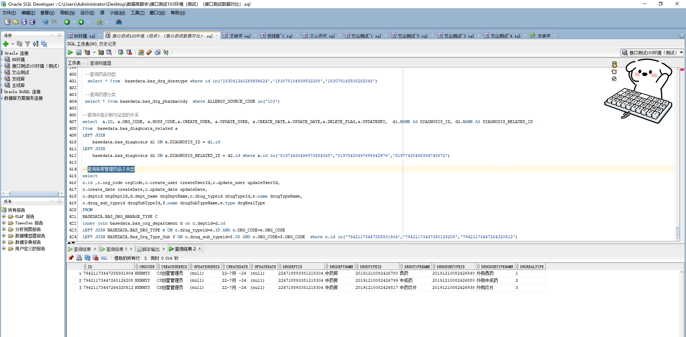

# 领域服务/基础领域 - 查询库房管理药品子类型 - 查询库房管理药品子类型 正向用例
## 请求参数：
``` json
{
  "pageIndex": 1,
  "orgCode": "NXRMYY",
  "pageSize": 3,
  "drgDeptIds": [
    "224718893381218304",
    "224718832102436864"
  ]
}
```
## 返回参数：
``` json
{
  "exception": null,
  "apiCode": null,
  "data": {
    "list": [
      {
        "createDate": "2024-07-22 19:51:32",
        "createUserId": "CS创星管理员",
        "drgDeptId": "224718893381218304",
        "drgDeptName": "中药房",
        "drugSubTypeId": "20191210082426840",
        "drugSubTypeName": "外购西药",
        "drugTypeId": "20191210082426780",
        "drugTypeName": "西药",
        "id": "79421173447255931904",
        "orgCode": "NXRMYY",
        "updateDate": null,
        "updateUserId": null,
        "drgRealType": "1"
      },
      {
        "createDate": "2024-07-22 19:51:32",
        "createUserId": "CS创星管理员",
        "drgDeptId": "224718893381218304",
        "drgDeptName": "中药房",
        "drugSubTypeId": "20191210082426880",
        "drugSubTypeName": "外购中成药",
        "drugTypeId": "20191210082426799",
        "drugTypeName": "中成药",
        "id": "79421173447260126208",
        "orgCode": "NXRMYY",
        "updateDate": null,
        "updateUserId": null,
        "drgRealType": "2"
      },
      {
        "createDate": "2024-07-22 19:51:32",
        "createUserId": "CS创星管理员",
        "drgDeptId": "224718893381218304",
        "drgDeptName": "中药房",
        "drugSubTypeId": "20191210082426938",
        "drugSubTypeName": "外购饮片",
        "drugTypeId": "20191210082426817",
        "drugTypeName": "中药饮片",
        "id": "79421173447264320512",
        "orgCode": "NXRMYY",
        "updateDate": null,
        "updateUserId": null,
        "drgRealType": "3"
      }
    ],
    "totalCount": 12,
    "pageSize": 3,
    "pageNo": 1,
    "pageCount": 4
  },
  "Code": 200,
  "Message": "操作成功"
}
```
## 数据校验：

# 领域服务/基础领域 - 查询库房管理药品子类型 - 必填校验-[orgCode]为空
## 请求参数：
``` json
{
  "pageIndex": 1,
  "orgCode": "",
  "pageSize": 3,
  "drgDeptIds": [
    "224718893381218304",
    "224718832102436864"
  ]
}
```
## 返回参数：
``` json
{
  "exception": null,
  "apiCode": null,
  "data": null,
  "Code": 1,
  "Message": "医院编码不能为空"
}
```
# 领域服务/基础领域 - 查询库房管理药品子类型 - 必填校验-[drgDeptIds]为空
## 请求参数：
``` json
{
  "pageIndex": 1,
  "orgCode": "NXRMYY",
  "pageSize": 3,
  "drgDeptIds": null
}
```
## 返回参数：
``` json
{
  "exception": null,
  "apiCode": null,
  "data": null,
  "Code": 1,
  "Message": "药剂科室id集合不能为空"
}
```
# 领域服务/基础领域 - 查询库房管理药品子类型 - 必填校验-[pageIndex]为空
## 请求参数：
``` json
{
  "pageIndex": null,
  "orgCode": "NXRMYY",
  "pageSize": 3,
  "drgDeptIds": [
    "224718893381218304",
    "224718832102436864"
  ]
}
```
## 返回参数：
``` json
{
  "exception": null,
  "apiCode": null,
  "data": null,
  "Code": 1,
  "Message": "系统内部异常"
}
```
# 领域服务/基础领域 - 查询库房管理药品子类型 - 必填校验-[pageSize]为空
## 请求参数：
``` json
{
  "pageIndex": 1,
  "orgCode": "NXRMYY",
  "pageSize": null,
  "drgDeptIds": [
    "224718893381218304",
    "224718832102436864"
  ]
}
```
## 返回参数：
``` json
{
  "exception": null,
  "apiCode": null,
  "data": null,
  "Code": 1,
  "Message": "系统内部异常"
}
```
# 领域服务/基础领域 - 查询库房管理药品子类型 - 类型校验-[drgDeptIds]类型错误
## 请求参数：
``` json
{
  "pageIndex": 1,
  "orgCode": "NXRMYY",
  "pageSize": 3,
  "drgDeptIds": "abc"
}
```
## 返回参数：
``` json
{
  "exception": null,
  "apiCode": null,
  "data": null,
  "Code": 1,
  "Message": "请求参数错误"
}
```
# 领域服务/基础领域 - 查询库房管理药品子类型 - 类型校验-[pageSize]类型错误
## 请求参数：
``` json
{
  "pageIndex": 1,
  "orgCode": "NXRMYY",
  "pageSize": "abc",
  "drgDeptIds": [
    "224718893381218304",
    "224718832102436864"
  ]
}
```
## 返回参数：
``` json
{
  "exception": null,
  "apiCode": null,
  "data": null,
  "Code": 1,
  "Message": "请求参数错误"
}
```
# 领域服务/基础领域 - 查询库房管理药品子类型 - 类型校验-[pageIndex]类型错误
## 请求参数：
``` json
{
  "pageIndex": "abc",
  "orgCode": "NXRMYY",
  "pageSize": 3,
  "drgDeptIds": [
    "224718893381218304",
    "224718832102436864"
  ]
}
```
## 返回参数：
``` json
{
  "exception": null,
  "apiCode": null,
  "data": null,
  "Code": 1,
  "Message": "请求参数错误"
}
```
# 领域服务/基础领域 - 查询库房管理药品子类型 - 依赖用例-[drgDeptIds]赋值为[依赖用例测试值]
## 请求参数：
``` json
{
  "pageIndex": 1,
  "orgCode": "NXRMYY",
  "pageSize": 3,
  "drgDeptIds": [
    "依赖用例测试值"
  ]
}
```
## 返回参数：
``` json
{
  "exception": null,
  "apiCode": null,
  "data": {
    "list": [],
    "totalCount": 0,
    "pageSize": 3,
    "pageNo": 1,
    "pageCount": 0
  },
  "Code": 200,
  "Message": "操作成功"
}
```
# 领域服务/基础领域 - 查询库房管理药品子类型 - 依赖用例-[orgCode]赋值为依赖用例测试值
## 请求参数：
``` json
{
  "pageIndex": 1,
  "orgCode": "依赖用例测试值",
  "pageSize": 3,
  "drgDeptIds": [
    "224718893381218304",
    "224718832102436864"
  ]
}
```
## 返回参数：
``` json
{
  "exception": null,
  "apiCode": null,
  "data": {
    "list": [],
    "totalCount": 0,
    "pageSize": 3,
    "pageNo": 1,
    "pageCount": 0
  },
  "Code": 200,
  "Message": "操作成功"
}
```