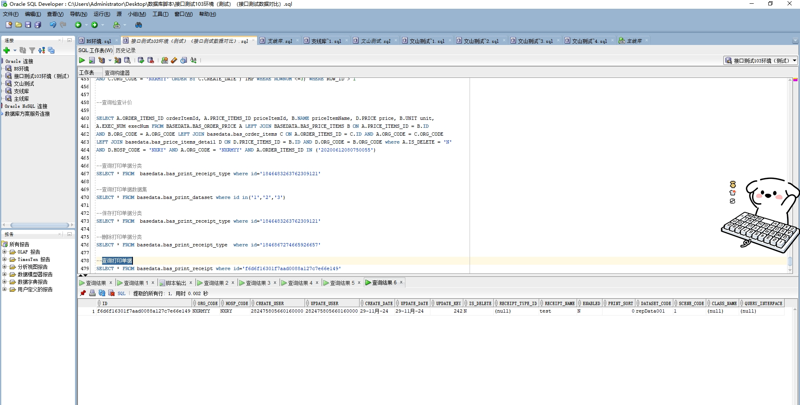

# 领域服务/基础领域 - 查询打印单据 - 查询打印单据 正向用例
## 请求参数：
``` json
{
  "orgCode": "NXRMYY",
  "pageIndex": 1,
  "pageSize": 3
}
```
## 返回参数：
``` json
{
    "exception": null,
    "apiCode": null,
    "data": {
        "list": [
            {
                "id": "f6d6f16301f7aad0088a127c7e66e149",
                "orgCode": "NXRMYY",
                "hospCode": "NXRY",
                "createDate": "2024-11-29 09:49:01",
                "updateDate": "2024-11-29 09:49:01",
                "isDelete": "N",
                "updatekey": 242,
                "receiptTypeId": null,
                "receiptTypeName": null,
                "receiptName": "test",
                "enabled": "N",
                "printSort": 0.0,
                "dataSetCode": "repData001",
                "sceneCode": "1",
                "className": null,
                "queryInterface": null,
                "createUserName": "CS彭彭彭",
                "updateUserName": "CS彭彭彭",
                "dataSetName": "门诊处方数据集",
                "receiptReports": null,
                "receiptLimits": null,
                "createUserId": "282475805660160000",
                "updateUserId": "282475805660160000"
            }
        ],
        "totalCount": 1,
        "pageSize": 3,
        "pageNo": 1,
        "pageCount": 1
    },
    "Code": 200,
    "Message": "操作成功"
}
```
## 数据校验：

# 领域服务/基础领域 - 查询打印单据 - 必填校验-[orgCode]为空
## 请求参数：
``` json
{
  "hospCode": "NXRY",
  "orgCode": "",
  "pageIndex": 1,
  "pageSize": 3,
  "receiptName": "",
  "receiptTypeIds": [],
  "sceneCode": "1"
}
```
## 返回参数：
``` json
{
  "exception": null,
  "apiCode": null,
  "data": null,
  "Code": 1,
  "Message": "医院编码不能为空"
}
```
# 领域服务/基础领域 - 查询打印单据 - 必填校验-[pageIndex]为空
## 请求参数：
``` json
{
  "hospCode": "NXRY",
  "orgCode": "NXRMYY",
  "pageIndex": null,
  "pageSize": 3,
  "receiptName": "",
  "receiptTypeIds": [],
  "sceneCode": "1"
}
```
## 返回参数：
``` json
{
  "exception": null,
  "apiCode": null,
  "data": null,
  "Code": 1,
  "Message": "系统内部异常"
}
```
# 领域服务/基础领域 - 查询打印单据 - 必填校验-[pageSize]为空
## 请求参数：
``` json
{
  "hospCode": "NXRY",
  "orgCode": "NXRMYY",
  "pageIndex": 1,
  "pageSize": null,
  "receiptName": "",
  "receiptTypeIds": [],
  "sceneCode": "1"
}
```
## 返回参数：
``` json
{
  "exception": null,
  "apiCode": null,
  "data": null,
  "Code": 1,
  "Message": "系统内部异常"
}
```
# 领域服务/基础领域 - 查询打印单据 - 类型校验-[pageSize]类型错误
## 请求参数：
``` json
{
  "hospCode": "NXRY",
  "orgCode": "NXRMYY",
  "pageIndex": 1,
  "pageSize": "abc",
  "receiptName": "",
  "receiptTypeIds": [],
  "sceneCode": "1"
}
```
## 返回参数：
``` json
{
  "exception": null,
  "apiCode": null,
  "data": null,
  "Code": 1,
  "Message": "请求参数错误"
}
```
# 领域服务/基础领域 - 查询打印单据 - 类型校验-[pageIndex]类型错误
## 请求参数：
``` json
{
  "hospCode": "NXRY",
  "orgCode": "NXRMYY",
  "pageIndex": "abc",
  "pageSize": 3,
  "receiptName": "",
  "receiptTypeIds": [],
  "sceneCode": "1"
}
```
## 返回参数：
``` json
{
  "exception": null,
  "apiCode": null,
  "data": null,
  "Code": 1,
  "Message": "请求参数错误"
}
```
# 领域服务/基础领域 - 查询打印单据 - 依赖用例-[orgCode]赋值为依赖用例测试值
## 请求参数：
``` json
{
  "hospCode": "NXRY",
  "orgCode": "依赖用例测试值",
  "pageIndex": 1,
  "pageSize": 3,
  "receiptName": "",
  "receiptTypeIds": [],
  "sceneCode": "1"
}
```
## 返回参数：
``` json
{
  "exception": null,
  "apiCode": null,
  "data": {
    "list": [],
    "totalCount": 0,
    "pageSize": 3,
    "pageNo": 1,
    "pageCount": 0
  },
  "Code": 200,
  "Message": "操作成功"
}
```