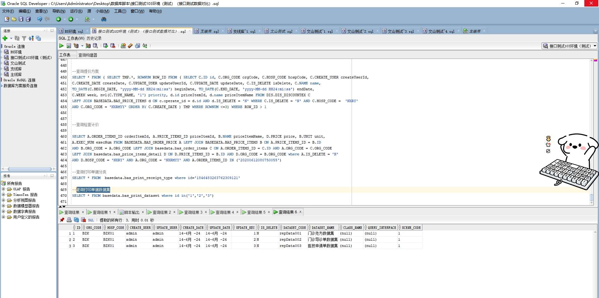

# 领域服务/基础领域 - 查询打印单据数据集 - 查询打印单据数据集 正向用例
## 请求参数：
``` json
{
  "hospCode": "NXRY",
  "orgCode": "NXRMYY",
  "pageIndex": 1,
  "pageSize": 3,
  "sceneCode": "1"
}
```
## 返回参数：
``` json
{
  "exception": null,
  "apiCode": null,
  "data": {
    "list": [
      {
        "className": null,
        "createDate": "2024-06-14 00:00:00",
        "createUserId": "admin",
        "dataSetCode": "repData001",
        "dataSetName": "门诊处方数据集",
        "hospCode": "BZK01",
        "id": "1",
        "isDelete": "N",
        "orgCode": "BZK",
        "queryInterface": null,
        "sceneCode": "1",
        "updateDate": "2024-06-14 00:00:00",
        "updateUserId": "admin"
      },
      {
        "className": null,
        "createDate": "2024-06-14 00:00:00",
        "createUserId": "admin",
        "dataSetCode": "repData002",
        "dataSetName": "门诊导诊单数据集",
        "hospCode": "BZK01",
        "id": "2",
        "isDelete": "N",
        "orgCode": "BZK",
        "queryInterface": null,
        "sceneCode": "1",
        "updateDate": "2024-06-14 00:00:00",
        "updateUserId": "admin"
      },
      {
        "className": null,
        "createDate": "2024-06-14 00:00:00",
        "createUserId": "admin",
        "dataSetCode": "repData003",
        "dataSetName": "医技申请单数据集",
        "hospCode": "BZK01",
        "id": "3",
        "isDelete": "N",
        "orgCode": "BZK",
        "queryInterface": null,
        "sceneCode": "1",
        "updateDate": "2024-06-14 00:00:00",
        "updateUserId": "admin"
      }
    ],
    "totalCount": 3,
    "pageSize": 3,
    "pageNo": 1,
    "pageCount": 1
  },
  "Code": 200,
  "Message": "操作成功"
}
```
## 数据校验：

# 领域服务/基础领域 - 查询打印单据数据集 - 必填校验-[pageIndex]为空
## 请求参数：
``` json
{
  "hospCode": "NXRY",
  "orgCode": "NXRMYY",
  "pageIndex": null,
  "pageSize": 3,
  "sceneCode": "1"
}
```
## 返回参数：
``` json
{
  "exception": null,
  "apiCode": null,
  "data": null,
  "Code": 1,
  "Message": "系统内部异常"
}
```
# 领域服务/基础领域 - 查询打印单据数据集 - 必填校验-[pageSize]为空
## 请求参数：
``` json
{
  "hospCode": "NXRY",
  "orgCode": "NXRMYY",
  "pageIndex": 1,
  "pageSize": null,
  "sceneCode": "1"
}
```
## 返回参数：
``` json
{
  "exception": null,
  "apiCode": null,
  "data": null,
  "Code": 1,
  "Message": "系统内部异常"
}
```
# 领域服务/基础领域 - 查询打印单据数据集 - 必填校验-[sceneCode]为空
## 请求参数：
``` json
{
  "hospCode": "NXRY",
  "orgCode": "NXRMYY",
  "pageIndex": 1,
  "pageSize": 3,
  "sceneCode": ""
}
```
## 返回参数：
``` json
{
  "exception": null,
  "apiCode": null,
  "data": null,
  "Code": 1,
  "Message": "场景编码不可为空"
}
```
# 领域服务/基础领域 - 查询打印单据数据集 - 类型校验-[pageSize]类型错误
## 请求参数：
``` json
{
  "hospCode": "NXRY",
  "orgCode": "NXRMYY",
  "pageIndex": 1,
  "pageSize": "abc",
  "sceneCode": "1"
}
```
## 返回参数：
``` json
{
  "exception": null,
  "apiCode": null,
  "data": null,
  "Code": 1,
  "Message": "请求参数错误"
}
```
# 领域服务/基础领域 - 查询打印单据数据集 - 类型校验-[pageIndex]类型错误
## 请求参数：
``` json
{
  "hospCode": "NXRY",
  "orgCode": "NXRMYY",
  "pageIndex": "abc",
  "pageSize": 3,
  "sceneCode": "1"
}
```
## 返回参数：
``` json
{
  "exception": null,
  "apiCode": null,
  "data": null,
  "Code": 1,
  "Message": "请求参数错误"
}
```
# 领域服务/基础领域 - 查询打印单据数据集 - 枚举用例-[sceneCode] 枚举值为 1(场景编码为门诊医生站打印)
## 请求参数：
``` json
{
  "hospCode": "NXRY",
  "orgCode": "NXRMYY",
  "pageIndex": 1,
  "pageSize": 3,
  "sceneCode": "1"
}
```
## 返回参数：
``` json
{
  "exception": null,
  "apiCode": null,
  "data": {
    "list": [
      {
        "className": null,
        "createDate": "2024-06-14 00:00:00",
        "createUserId": "admin",
        "dataSetCode": "repData001",
        "dataSetName": "门诊处方数据集",
        "hospCode": "BZK01",
        "id": "1",
        "isDelete": "N",
        "orgCode": "BZK",
        "queryInterface": null,
        "sceneCode": "1",
        "updateDate": "2024-06-14 00:00:00",
        "updateUserId": "admin"
      },
      {
        "className": null,
        "createDate": "2024-06-14 00:00:00",
        "createUserId": "admin",
        "dataSetCode": "repData002",
        "dataSetName": "门诊导诊单数据集",
        "hospCode": "BZK01",
        "id": "2",
        "isDelete": "N",
        "orgCode": "BZK",
        "queryInterface": null,
        "sceneCode": "1",
        "updateDate": "2024-06-14 00:00:00",
        "updateUserId": "admin"
      },
      {
        "className": null,
        "createDate": "2024-06-14 00:00:00",
        "createUserId": "admin",
        "dataSetCode": "repData003",
        "dataSetName": "医技申请单数据集",
        "hospCode": "BZK01",
        "id": "3",
        "isDelete": "N",
        "orgCode": "BZK",
        "queryInterface": null,
        "sceneCode": "1",
        "updateDate": "2024-06-14 00:00:00",
        "updateUserId": "admin"
      }
    ],
    "totalCount": 3,
    "pageSize": 3,
    "pageNo": 1,
    "pageCount": 1
  },
  "Code": 200,
  "Message": "操作成功"
}
```
# 领域服务/基础领域 - 查询打印单据数据集 - 枚举用例-[sceneCode] 枚举值为 2(场景编码为住院护士站执行单打印)
## 请求参数：
``` json
{
  "hospCode": "NXRY",
  "orgCode": "NXRMYY",
  "pageIndex": 1,
  "pageSize": 3,
  "sceneCode": "2"
}
```
## 返回参数：
``` json
{
  "exception": null,
  "apiCode": null,
  "data": {
    "list": [],
    "totalCount": 0,
    "pageSize": 3,
    "pageNo": 1,
    "pageCount": 0
  },
  "Code": 200,
  "Message": "操作成功"
}
```
# 领域服务/基础领域 - 查询打印单据数据集 - 枚举用例-[sceneCode] 枚举值为 3(场景编码为其他(待扩展))
## 请求参数：
``` json
{
  "hospCode": "NXRY",
  "orgCode": "NXRMYY",
  "pageIndex": 1,
  "pageSize": 3,
  "sceneCode": "3"
}
```
## 返回参数：
``` json
{
  "exception": null,
  "apiCode": null,
  "data": {
    "list": [],
    "totalCount": 0,
    "pageSize": 3,
    "pageNo": 1,
    "pageCount": 0
  },
  "Code": 200,
  "Message": "操作成功"
}
```