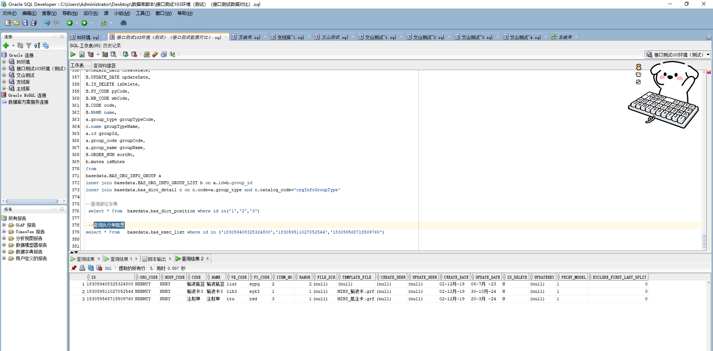

# 领域服务/基础领域 - 查询执行单配置 - 查询执行单配置 正向用例
## 请求参数：
``` json
{
  "hospCode": "NXRY",
  "orgCode": "NXRMYY",
  "pageSize": 3,
  "pageIndex": 1
}
```
## 返回参数：
``` json
{
  "exception": null,
  "apiCode": null,
  "data": {
    "list": [
      {
        "id": "183059408325324800",
        "orgCode": "NXRMYY",
        "hospCode": "NXRY",
        "createDate": "2019-12-02 11:32:44",
        "updateDate": "2023-07-08 11:10:31",
        "isDelete": "N",
        "code": "输液瓶签",
        "name": "输液瓶签",
        "wbCode": "liut",
        "pyCode": "sypq",
        "itemNo": "2",
        "range": 2,
        "fileDir": null,
        "templateFile": null,
        "printModel": "1",
        "createUserId": null,
        "updateUserId": null,
        "updatekey": null
      },
      {
        "id": "183059511027052544",
        "orgCode": "NXRMYY",
        "hospCode": "NXRY",
        "createDate": "2019-12-02 11:33:08",
        "updateDate": "2024-10-30 13:51:09",
        "isDelete": "N",
        "code": "输液卡3",
        "name": "输液卡3",
        "wbCode": "lih3",
        "pyCode": "syk3",
        "itemNo": "1",
        "range": 1,
        "fileDir": null,
        "templateFile": "MZHS_输液卡.grf",
        "printModel": "1",
        "createUserId": null,
        "updateUserId": null,
        "updatekey": null
      },
      {
        "id": "183059568715509760",
        "orgCode": "NXRMYY",
        "hospCode": "NXRY",
        "createDate": "2019-12-02 11:33:22",
        "updateDate": "2024-03-20 15:36:55",
        "isDelete": "N",
        "code": "注射单",
        "name": "注射单",
        "wbCode": "itu",
        "pyCode": "zsd",
        "itemNo": "3",
        "range": 1,
        "fileDir": null,
        "templateFile": "MZHS_肌注卡.grf",
        "printModel": "1",
        "createUserId": null,
        "updateUserId": null,
        "updatekey": null
      }
    ],
    "totalCount": 46,
    "pageSize": 3,
    "pageNo": 1,
    "pageCount": 16
  },
  "Code": 200,
  "Message": "操作成功"
}
```
## 数据校验：

# 领域服务/基础领域 - 查询执行单配置 - 必填校验-[orgCode]为空
## 请求参数：
``` json
{
  "hospCode": "NXRY",
  "orgCode": "",
  "pageSize": 3,
  "pageIndex": 1
}
```
## 返回参数：
``` json
{
  "exception": null,
  "apiCode": null,
  "data": null,
  "Code": 1,
  "Message": "医院编码不能为空"
}
```
# 领域服务/基础领域 - 查询执行单配置 - 必填校验-[hospCode]为空
## 请求参数：
``` json
{
  "hospCode": "",
  "orgCode": "NXRMYY",
  "pageSize": 3,
  "pageIndex": 1
}
```
## 返回参数：
``` json
{
  "exception": null,
  "apiCode": null,
  "data": null,
  "Code": 1,
  "Message": "院区编码不能为空"
}
```
# 领域服务/基础领域 - 查询执行单配置 - 必填校验-[pageIndex]为空
## 请求参数：
``` json
{
  "hospCode": "NXRY",
  "orgCode": "NXRMYY",
  "pageSize": 3,
  "pageIndex": null
}
```
## 返回参数：
``` json
{
  "exception": null,
  "apiCode": null,
  "data": null,
  "Code": 1,
  "Message": "系统内部异常"
}
```
# 领域服务/基础领域 - 查询执行单配置 - 必填校验-[pageSize]为空
## 请求参数：
``` json
{
  "hospCode": "NXRY",
  "orgCode": "NXRMYY",
  "pageSize": null,
  "pageIndex": 1
}
```
## 返回参数：
``` json
{
  "exception": null,
  "apiCode": null,
  "data": null,
  "Code": 1,
  "Message": "系统内部异常"
}
```
# 领域服务/基础领域 - 查询执行单配置 - 类型校验-[pageIndex]类型错误
## 请求参数：
``` json
{
  "hospCode": "NXRY",
  "orgCode": "NXRMYY",
  "pageSize": 3,
  "pageIndex": "abc"
}
```
## 返回参数：
``` json
{
  "exception": null,
  "apiCode": null,
  "data": null,
  "Code": 1,
  "Message": "请求参数错误"
}
```
# 领域服务/基础领域 - 查询执行单配置 - 类型校验-[pageSize]类型错误
## 请求参数：
``` json
{
  "hospCode": "NXRY",
  "orgCode": "NXRMYY",
  "pageSize": "abc",
  "pageIndex": 1
}
```
## 返回参数：
``` json
{
  "exception": null,
  "apiCode": null,
  "data": null,
  "Code": 1,
  "Message": "请求参数错误"
}
```
# 领域服务/基础领域 - 查询执行单配置 - 依赖用例-[orgCode]赋值为依赖用例测试值
## 请求参数：
``` json
{
  "hospCode": "NXRY",
  "orgCode": "依赖用例测试值",
  "pageSize": 3,
  "pageIndex": 1
}
```
## 返回参数：
``` json
{
  "exception": null,
  "apiCode": null,
  "data": {
    "list": [],
    "totalCount": 0,
    "pageSize": 3,
    "pageNo": 1,
    "pageCount": 0
  },
  "Code": 200,
  "Message": "操作成功"
}
```
# 领域服务/基础领域 - 查询执行单配置 - 依赖用例-[hospCode]赋值为依赖用例测试值
## 请求参数：
``` json
{
  "hospCode": "依赖用例测试值",
  "orgCode": "NXRMYY",
  "pageSize": 3,
  "pageIndex": 1
}
```
## 返回参数：
``` json
{
  "exception": null,
  "apiCode": null,
  "data": {
    "list": [],
    "totalCount": 0,
    "pageSize": 3,
    "pageNo": 1,
    "pageCount": 0
  },
  "Code": 200,
  "Message": "操作成功"
}
```