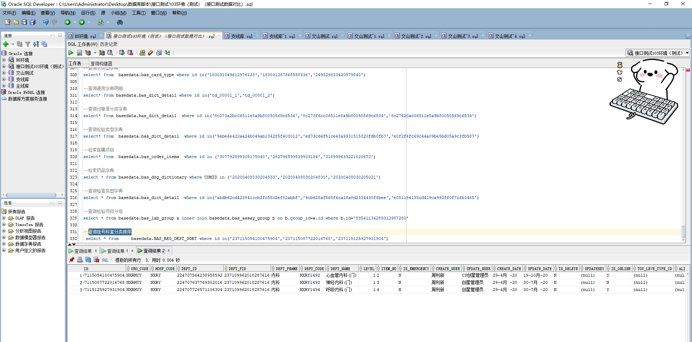

# 领域服务/基础领域 - 查询挂号科室分类排序 - 查询挂号科室分类排序 正向用例
## 请求参数：
``` json
{
  "hospCode": "NXRY",
  "isDelete": "N",
  "pageSize": 3,
  "pageIndex": 1,
  "orgCode": "NXRMYY",
  "deptIds": [
    "224706929653346304",
    "224707035295281152",
    "224707127704186880",
    "224707312907874304",
    "224707418222653440",
    "224707564238958592",
    "224707637769302016",
    "224707726571106304",
    "224707726571106304",
    "224707805541462016",
    "224707910793326592",
    "224707985045090304",
    "224708099402788864",
    "224708099402788864",
    "224708613729316864",
    "224708613729316864",
    "224708701809700864",
    "224708824887357440",
    "224708904646242304",
    "224708989908054016",
    "224709176751714304",
    "224710203634774016",
    "224710203634774016",
    "224710319502422016",
    "224710412037156864",
    "224710478294577152",
    "224710549731962880",
    "224710617625161728",
    "224710783233060864",
    "224710852179030016",
    "224710938422308864",
    "224711078214266880",
    "224711154428964864",
    "224711215837769728",
    "224711316106801152",
    "224711376269897728",
    "224711436038729728",
    "224711501050441728",
    "224711571237924864",
    "224711644445306880",
    "231597861971857408",
    "257040017372504064",
    "258828164246822912"
  ]
}
```
## 返回参数：
``` json
{
  "exception": null,
  "apiCode": null,
  "data": {
    "list": [
      {
        "id": "237115054100475904",
        "orgCode": "NXRMYY",
        "hospCode": "NXRY",
        "createDate": "2020-04-29 15:30:34",
        "updateDate": "2020-10-19 15:18:20",
        "isDelete": "N",
        "deptId": "224707564238958592",
        "deptPid": "237109962018287616",
        "deptPname": "内科",
        "deptCode": "NXRY1492",
        "deptName": "心血管内科(门)",
        "level": 1,
        "isEmergency": "N",
        "isOnline": "Y",
        "towLeveTypeId": null,
        "aliasName": null,
        "createUserId": "周利新",
        "updateUserId": "CS创星管理员",
        "sortNo": "2",
        "updatekey": null
      },
      {
        "id": "237115087722016768",
        "orgCode": "NXRMYY",
        "hospCode": "NXRY",
        "createDate": "2020-04-29 15:30:42",
        "updateDate": "2020-07-30 17:23:49",
        "isDelete": "N",
        "deptId": "224707637769302016",
        "deptPid": "237109962018287616",
        "deptPname": "内科",
        "deptCode": "NXRY1493",
        "deptName": "神经内科(门)",
        "level": 1,
        "isEmergency": "N",
        "isOnline": "N",
        "towLeveTypeId": null,
        "aliasName": null,
        "createUserId": "周利新",
        "updateUserId": "创星管理员",
        "sortNo": "3",
        "updatekey": null
      },
      {
        "id": "237115125927931904",
        "orgCode": "NXRMYY",
        "hospCode": "NXRY",
        "createDate": "2020-04-29 15:30:51",
        "updateDate": "2020-07-30 17:23:57",
        "isDelete": "N",
        "deptId": "224707726571106304",
        "deptPid": "237109962018287616",
        "deptPname": "内科",
        "deptCode": "NXRY1494",
        "deptName": "呼吸内科(门)",
        "level": 1,
        "isEmergency": "N",
        "isOnline": "Y",
        "towLeveTypeId": null,
        "aliasName": null,
        "createUserId": "周利新",
        "updateUserId": "创星管理员",
        "sortNo": "4",
        "updatekey": null
      }
    ],
    "totalCount": 36,
    "pageSize": 3,
    "pageNo": 1,
    "pageCount": 12
  },
  "Code": 200,
  "Message": "操作成功"
}
```
## 数据校验：

# 领域服务/基础领域 - 查询挂号科室分类排序 - 必填校验-[orgCode]为空
## 请求参数：
``` json
{
  "hospCode": "NXRY",
  "isDelete": "N",
  "pageSize": 3,
  "pageIndex": 1,
  "orgCode": "",
  "deptIds": [
    "224706929653346304",
    "224707035295281152",
    "224707127704186880",
    "224707312907874304",
    "224707418222653440",
    "224707564238958592",
    "224707637769302016",
    "224707726571106304",
    "224707726571106304",
    "224707805541462016",
    "224707910793326592",
    "224707985045090304",
    "224708099402788864",
    "224708099402788864",
    "224708613729316864",
    "224708613729316864",
    "224708701809700864",
    "224708824887357440",
    "224708904646242304",
    "224708989908054016",
    "224709176751714304",
    "224710203634774016",
    "224710203634774016",
    "224710319502422016",
    "224710412037156864",
    "224710478294577152",
    "224710549731962880",
    "224710617625161728",
    "224710783233060864",
    "224710852179030016",
    "224710938422308864",
    "224711078214266880",
    "224711154428964864",
    "224711215837769728",
    "224711316106801152",
    "224711376269897728",
    "224711436038729728",
    "224711501050441728",
    "224711571237924864",
    "224711644445306880",
    "231597861971857408",
    "257040017372504064",
    "258828164246822912"
  ]
}
```
## 返回参数：
``` json
{
  "exception": null,
  "apiCode": null,
  "data": null,
  "Code": 1,
  "Message": "医院编码不能为空"
}
```
# 领域服务/基础领域 - 查询挂号科室分类排序 - 必填校验-[hospCode]为空
## 请求参数：
``` json
{
  "hospCode": "",
  "isDelete": "N",
  "pageSize": 3,
  "pageIndex": 1,
  "orgCode": "NXRMYY",
  "deptIds": [
    "224706929653346304",
    "224707035295281152",
    "224707127704186880",
    "224707312907874304",
    "224707418222653440",
    "224707564238958592",
    "224707637769302016",
    "224707726571106304",
    "224707726571106304",
    "224707805541462016",
    "224707910793326592",
    "224707985045090304",
    "224708099402788864",
    "224708099402788864",
    "224708613729316864",
    "224708613729316864",
    "224708701809700864",
    "224708824887357440",
    "224708904646242304",
    "224708989908054016",
    "224709176751714304",
    "224710203634774016",
    "224710203634774016",
    "224710319502422016",
    "224710412037156864",
    "224710478294577152",
    "224710549731962880",
    "224710617625161728",
    "224710783233060864",
    "224710852179030016",
    "224710938422308864",
    "224711078214266880",
    "224711154428964864",
    "224711215837769728",
    "224711316106801152",
    "224711376269897728",
    "224711436038729728",
    "224711501050441728",
    "224711571237924864",
    "224711644445306880",
    "231597861971857408",
    "257040017372504064",
    "258828164246822912"
  ]
}
```
## 返回参数：
``` json
{
  "exception": null,
  "apiCode": null,
  "data": null,
  "Code": 1,
  "Message": "院区编码不能为空"
}
```
# 领域服务/基础领域 - 查询挂号科室分类排序 - 必填校验-[pageIndex]为空
## 请求参数：
``` json
{
  "hospCode": "NXRY",
  "isDelete": "N",
  "pageSize": 3,
  "pageIndex": null,
  "orgCode": "NXRMYY",
  "deptIds": [
    "224706929653346304",
    "224707035295281152",
    "224707127704186880",
    "224707312907874304",
    "224707418222653440",
    "224707564238958592",
    "224707637769302016",
    "224707726571106304",
    "224707726571106304",
    "224707805541462016",
    "224707910793326592",
    "224707985045090304",
    "224708099402788864",
    "224708099402788864",
    "224708613729316864",
    "224708613729316864",
    "224708701809700864",
    "224708824887357440",
    "224708904646242304",
    "224708989908054016",
    "224709176751714304",
    "224710203634774016",
    "224710203634774016",
    "224710319502422016",
    "224710412037156864",
    "224710478294577152",
    "224710549731962880",
    "224710617625161728",
    "224710783233060864",
    "224710852179030016",
    "224710938422308864",
    "224711078214266880",
    "224711154428964864",
    "224711215837769728",
    "224711316106801152",
    "224711376269897728",
    "224711436038729728",
    "224711501050441728",
    "224711571237924864",
    "224711644445306880",
    "231597861971857408",
    "257040017372504064",
    "258828164246822912"
  ]
}
```
## 返回参数：
``` json
{
  "exception": null,
  "apiCode": null,
  "data": null,
  "Code": 1,
  "Message": "系统内部异常"
}
```
# 领域服务/基础领域 - 查询挂号科室分类排序 - 必填校验-[pageSize]为空
## 请求参数：
``` json
{
  "hospCode": "NXRY",
  "isDelete": "N",
  "pageSize": null,
  "pageIndex": 1,
  "orgCode": "NXRMYY",
  "deptIds": [
    "224706929653346304",
    "224707035295281152",
    "224707127704186880",
    "224707312907874304",
    "224707418222653440",
    "224707564238958592",
    "224707637769302016",
    "224707726571106304",
    "224707726571106304",
    "224707805541462016",
    "224707910793326592",
    "224707985045090304",
    "224708099402788864",
    "224708099402788864",
    "224708613729316864",
    "224708613729316864",
    "224708701809700864",
    "224708824887357440",
    "224708904646242304",
    "224708989908054016",
    "224709176751714304",
    "224710203634774016",
    "224710203634774016",
    "224710319502422016",
    "224710412037156864",
    "224710478294577152",
    "224710549731962880",
    "224710617625161728",
    "224710783233060864",
    "224710852179030016",
    "224710938422308864",
    "224711078214266880",
    "224711154428964864",
    "224711215837769728",
    "224711316106801152",
    "224711376269897728",
    "224711436038729728",
    "224711501050441728",
    "224711571237924864",
    "224711644445306880",
    "231597861971857408",
    "257040017372504064",
    "258828164246822912"
  ]
}
```
## 返回参数：
``` json
{
  "exception": null,
  "apiCode": null,
  "data": null,
  "Code": 1,
  "Message": "系统内部异常"
}
```
# 领域服务/基础领域 - 查询挂号科室分类排序 - 必填校验-[isDelete]为空
## 请求参数：
``` json
{
  "hospCode": "NXRY",
  "isDelete": "",
  "pageSize": 3,
  "pageIndex": 1,
  "orgCode": "NXRMYY",
  "deptIds": [
    "224706929653346304",
    "224707035295281152",
    "224707127704186880",
    "224707312907874304",
    "224707418222653440",
    "224707564238958592",
    "224707637769302016",
    "224707726571106304",
    "224707726571106304",
    "224707805541462016",
    "224707910793326592",
    "224707985045090304",
    "224708099402788864",
    "224708099402788864",
    "224708613729316864",
    "224708613729316864",
    "224708701809700864",
    "224708824887357440",
    "224708904646242304",
    "224708989908054016",
    "224709176751714304",
    "224710203634774016",
    "224710203634774016",
    "224710319502422016",
    "224710412037156864",
    "224710478294577152",
    "224710549731962880",
    "224710617625161728",
    "224710783233060864",
    "224710852179030016",
    "224710938422308864",
    "224711078214266880",
    "224711154428964864",
    "224711215837769728",
    "224711316106801152",
    "224711376269897728",
    "224711436038729728",
    "224711501050441728",
    "224711571237924864",
    "224711644445306880",
    "231597861971857408",
    "257040017372504064",
    "258828164246822912"
  ]
}
```
## 返回参数：
``` json
{
  "exception": null,
  "apiCode": null,
  "data": null,
  "Code": 1,
  "Message": "删除标志不能为空"
}
```
# 领域服务/基础领域 - 查询挂号科室分类排序 - 类型校验-[pageIndex]类型错误
## 请求参数：
``` json
{
  "hospCode": "NXRY",
  "isDelete": "N",
  "pageSize": 3,
  "pageIndex": "abc",
  "orgCode": "NXRMYY",
  "deptIds": [
    "224706929653346304",
    "224707035295281152",
    "224707127704186880",
    "224707312907874304",
    "224707418222653440",
    "224707564238958592",
    "224707637769302016",
    "224707726571106304",
    "224707726571106304",
    "224707805541462016",
    "224707910793326592",
    "224707985045090304",
    "224708099402788864",
    "224708099402788864",
    "224708613729316864",
    "224708613729316864",
    "224708701809700864",
    "224708824887357440",
    "224708904646242304",
    "224708989908054016",
    "224709176751714304",
    "224710203634774016",
    "224710203634774016",
    "224710319502422016",
    "224710412037156864",
    "224710478294577152",
    "224710549731962880",
    "224710617625161728",
    "224710783233060864",
    "224710852179030016",
    "224710938422308864",
    "224711078214266880",
    "224711154428964864",
    "224711215837769728",
    "224711316106801152",
    "224711376269897728",
    "224711436038729728",
    "224711501050441728",
    "224711571237924864",
    "224711644445306880",
    "231597861971857408",
    "257040017372504064",
    "258828164246822912"
  ]
}
```
## 返回参数：
``` json
{
  "exception": null,
  "apiCode": null,
  "data": null,
  "Code": 1,
  "Message": "请求参数错误"
}
```
# 领域服务/基础领域 - 查询挂号科室分类排序 - 类型校验-[pageSize]类型错误
## 请求参数：
``` json
{
  "hospCode": "NXRY",
  "isDelete": "N",
  "pageSize": "abc",
  "pageIndex": 1,
  "orgCode": "NXRMYY",
  "deptIds": [
    "224706929653346304",
    "224707035295281152",
    "224707127704186880",
    "224707312907874304",
    "224707418222653440",
    "224707564238958592",
    "224707637769302016",
    "224707726571106304",
    "224707726571106304",
    "224707805541462016",
    "224707910793326592",
    "224707985045090304",
    "224708099402788864",
    "224708099402788864",
    "224708613729316864",
    "224708613729316864",
    "224708701809700864",
    "224708824887357440",
    "224708904646242304",
    "224708989908054016",
    "224709176751714304",
    "224710203634774016",
    "224710203634774016",
    "224710319502422016",
    "224710412037156864",
    "224710478294577152",
    "224710549731962880",
    "224710617625161728",
    "224710783233060864",
    "224710852179030016",
    "224710938422308864",
    "224711078214266880",
    "224711154428964864",
    "224711215837769728",
    "224711316106801152",
    "224711376269897728",
    "224711436038729728",
    "224711501050441728",
    "224711571237924864",
    "224711644445306880",
    "231597861971857408",
    "257040017372504064",
    "258828164246822912"
  ]
}
```
## 返回参数：
``` json
{
  "exception": null,
  "apiCode": null,
  "data": null,
  "Code": 1,
  "Message": "请求参数错误"
}
```
# 领域服务/基础领域 - 查询挂号科室分类排序 - 枚举用例-[isDelete] 枚举值为 N(删除标志为否)
## 请求参数：
``` json
{
  "hospCode": "NXRY",
  "isDelete": "N",
  "pageSize": 3,
  "pageIndex": 1,
  "orgCode": "NXRMYY",
  "deptIds": [
    "224706929653346304",
    "224707035295281152",
    "224707127704186880",
    "224707312907874304",
    "224707418222653440",
    "224707564238958592",
    "224707637769302016",
    "224707726571106304",
    "224707726571106304",
    "224707805541462016",
    "224707910793326592",
    "224707985045090304",
    "224708099402788864",
    "224708099402788864",
    "224708613729316864",
    "224708613729316864",
    "224708701809700864",
    "224708824887357440",
    "224708904646242304",
    "224708989908054016",
    "224709176751714304",
    "224710203634774016",
    "224710203634774016",
    "224710319502422016",
    "224710412037156864",
    "224710478294577152",
    "224710549731962880",
    "224710617625161728",
    "224710783233060864",
    "224710852179030016",
    "224710938422308864",
    "224711078214266880",
    "224711154428964864",
    "224711215837769728",
    "224711316106801152",
    "224711376269897728",
    "224711436038729728",
    "224711501050441728",
    "224711571237924864",
    "224711644445306880",
    "231597861971857408",
    "257040017372504064",
    "258828164246822912"
  ]
}
```
## 返回参数：
``` json
{
  "exception": null,
  "apiCode": null,
  "data": {
    "list": [
      {
        "id": "237115054100475904",
        "orgCode": "NXRMYY",
        "hospCode": "NXRY",
        "createDate": "2020-04-29 15:30:34",
        "updateDate": "2020-10-19 15:18:20",
        "isDelete": "N",
        "deptId": "224707564238958592",
        "deptPid": "237109962018287616",
        "deptPname": "内科",
        "deptCode": "NXRY1492",
        "deptName": "心血管内科(门)",
        "level": 1,
        "isEmergency": "N",
        "isOnline": "Y",
        "towLeveTypeId": null,
        "aliasName": null,
        "createUserId": "周利新",
        "updateUserId": "CS创星管理员",
        "sortNo": "2",
        "updatekey": null
      },
      {
        "id": "237115087722016768",
        "orgCode": "NXRMYY",
        "hospCode": "NXRY",
        "createDate": "2020-04-29 15:30:42",
        "updateDate": "2020-07-30 17:23:49",
        "isDelete": "N",
        "deptId": "224707637769302016",
        "deptPid": "237109962018287616",
        "deptPname": "内科",
        "deptCode": "NXRY1493",
        "deptName": "神经内科(门)",
        "level": 1,
        "isEmergency": "N",
        "isOnline": "N",
        "towLeveTypeId": null,
        "aliasName": null,
        "createUserId": "周利新",
        "updateUserId": "创星管理员",
        "sortNo": "3",
        "updatekey": null
      },
      {
        "id": "237115125927931904",
        "orgCode": "NXRMYY",
        "hospCode": "NXRY",
        "createDate": "2020-04-29 15:30:51",
        "updateDate": "2020-07-30 17:23:57",
        "isDelete": "N",
        "deptId": "224707726571106304",
        "deptPid": "237109962018287616",
        "deptPname": "内科",
        "deptCode": "NXRY1494",
        "deptName": "呼吸内科(门)",
        "level": 1,
        "isEmergency": "N",
        "isOnline": "Y",
        "towLeveTypeId": null,
        "aliasName": null,
        "createUserId": "周利新",
        "updateUserId": "创星管理员",
        "sortNo": "4",
        "updatekey": null
      }
    ],
    "totalCount": 36,
    "pageSize": 3,
    "pageNo": 1,
    "pageCount": 12
  },
  "Code": 200,
  "Message": "操作成功"
}
```
# 领域服务/基础领域 - 查询挂号科室分类排序 - 枚举用例-[isDelete] 枚举值为 Y(删除标志为是)
## 请求参数：
``` json
{
  "hospCode": "NXRY",
  "isDelete": "Y",
  "pageSize": 3,
  "pageIndex": 1,
  "orgCode": "NXRMYY",
  "deptIds": [
    "224706929653346304",
    "224707035295281152",
    "224707127704186880",
    "224707312907874304",
    "224707418222653440",
    "224707564238958592",
    "224707637769302016",
    "224707726571106304",
    "224707726571106304",
    "224707805541462016",
    "224707910793326592",
    "224707985045090304",
    "224708099402788864",
    "224708099402788864",
    "224708613729316864",
    "224708613729316864",
    "224708701809700864",
    "224708824887357440",
    "224708904646242304",
    "224708989908054016",
    "224709176751714304",
    "224710203634774016",
    "224710203634774016",
    "224710319502422016",
    "224710412037156864",
    "224710478294577152",
    "224710549731962880",
    "224710617625161728",
    "224710783233060864",
    "224710852179030016",
    "224710938422308864",
    "224711078214266880",
    "224711154428964864",
    "224711215837769728",
    "224711316106801152",
    "224711376269897728",
    "224711436038729728",
    "224711501050441728",
    "224711571237924864",
    "224711644445306880",
    "231597861971857408",
    "257040017372504064",
    "258828164246822912"
  ]
}
```
## 返回参数：
``` json
{
  "exception": null,
  "apiCode": null,
  "data": {
    "list": [
      {
        "id": "247614760018264064",
        "orgCode": "NXRMYY",
        "hospCode": "NXRY",
        "createDate": "2020-05-28 14:52:39",
        "updateDate": "2024-02-19 16:07:36",
        "isDelete": "Y",
        "deptId": "224711376269897728",
        "deptPid": "237109877742137344",
        "deptPname": "普通",
        "deptCode": "NXRY1520",
        "deptName": "肠道门诊",
        "level": 1,
        "isEmergency": "N",
        "isOnline": "N",
        "towLeveTypeId": null,
        "aliasName": null,
        "createUserId": "周利新",
        "updateUserId": "CS创星管理员",
        "sortNo": "2",
        "updatekey": null
      },
      {
        "id": "255851306848497664",
        "orgCode": "NXRMYY",
        "hospCode": "NXRY",
        "createDate": "2020-06-20 08:21:45",
        "updateDate": "2024-07-09 09:37:01",
        "isDelete": "Y",
        "deptId": "224707312907874304",
        "deptPid": "237109841956335616",
        "deptPname": "急诊",
        "deptCode": null,
        "deptName": "急诊儿科",
        "level": 1,
        "isEmergency": "Y",
        "isOnline": "N",
        "towLeveTypeId": null,
        "aliasName": null,
        "createUserId": "邓鹏",
        "updateUserId": "CS创星管理员",
        "sortNo": "3",
        "updatekey": null
      },
      {
        "id": "81974204856624286592",
        "orgCode": "NXRMYY",
        "hospCode": "NXRY",
        "createDate": "2024-09-27 16:08:39",
        "updateDate": "2024-09-27 16:11:49",
        "isDelete": "Y",
        "deptId": "224707985045090304",
        "deptPid": "81974204785531897984",
        "deptPname": "测试123",
        "deptCode": null,
        "deptName": "医保科 中医专家",
        "level": 1,
        "isEmergency": "N",
        "isOnline": "N",
        "towLeveTypeId": null,
        "aliasName": "别名",
        "createUserId": "CS创星管理员",
        "updateUserId": null,
        "sortNo": "3",
        "updatekey": null
      }
    ],
    "totalCount": 4,
    "pageSize": 3,
    "pageNo": 1,
    "pageCount": 2
  },
  "Code": 200,
  "Message": "操作成功"
}
```
# 领域服务/基础领域 - 查询挂号科室分类排序 - 依赖用例-[orgCode]赋值为依赖用例测试值
## 请求参数：
``` json
{
  "hospCode": "NXRY",
  "isDelete": "N",
  "pageSize": 3,
  "pageIndex": 1,
  "orgCode": "依赖用例测试值",
  "deptIds": [
    "224706929653346304",
    "224707035295281152",
    "224707127704186880",
    "224707312907874304",
    "224707418222653440",
    "224707564238958592",
    "224707637769302016",
    "224707726571106304",
    "224707726571106304",
    "224707805541462016",
    "224707910793326592",
    "224707985045090304",
    "224708099402788864",
    "224708099402788864",
    "224708613729316864",
    "224708613729316864",
    "224708701809700864",
    "224708824887357440",
    "224708904646242304",
    "224708989908054016",
    "224709176751714304",
    "224710203634774016",
    "224710203634774016",
    "224710319502422016",
    "224710412037156864",
    "224710478294577152",
    "224710549731962880",
    "224710617625161728",
    "224710783233060864",
    "224710852179030016",
    "224710938422308864",
    "224711078214266880",
    "224711154428964864",
    "224711215837769728",
    "224711316106801152",
    "224711376269897728",
    "224711436038729728",
    "224711501050441728",
    "224711571237924864",
    "224711644445306880",
    "231597861971857408",
    "257040017372504064",
    "258828164246822912"
  ]
}
```
## 返回参数：
``` json
{
  "exception": null,
  "apiCode": null,
  "data": {
    "list": [],
    "totalCount": 0,
    "pageSize": 3,
    "pageNo": 1,
    "pageCount": 0
  },
  "Code": 200,
  "Message": "操作成功"
}
```
# 领域服务/基础领域 - 查询挂号科室分类排序 - 依赖用例-[hospCode]赋值为依赖用例测试值
## 请求参数：
``` json
{
  "hospCode": "依赖用例测试值",
  "isDelete": "N",
  "pageSize": 3,
  "pageIndex": 1,
  "orgCode": "NXRMYY",
  "deptIds": [
    "224706929653346304",
    "224707035295281152",
    "224707127704186880",
    "224707312907874304",
    "224707418222653440",
    "224707564238958592",
    "224707637769302016",
    "224707726571106304",
    "224707726571106304",
    "224707805541462016",
    "224707910793326592",
    "224707985045090304",
    "224708099402788864",
    "224708099402788864",
    "224708613729316864",
    "224708613729316864",
    "224708701809700864",
    "224708824887357440",
    "224708904646242304",
    "224708989908054016",
    "224709176751714304",
    "224710203634774016",
    "224710203634774016",
    "224710319502422016",
    "224710412037156864",
    "224710478294577152",
    "224710549731962880",
    "224710617625161728",
    "224710783233060864",
    "224710852179030016",
    "224710938422308864",
    "224711078214266880",
    "224711154428964864",
    "224711215837769728",
    "224711316106801152",
    "224711376269897728",
    "224711436038729728",
    "224711501050441728",
    "224711571237924864",
    "224711644445306880",
    "231597861971857408",
    "257040017372504064",
    "258828164246822912"
  ]
}
```
## 返回参数：
``` json
{
  "exception": null,
  "apiCode": null,
  "data": {
    "list": [],
    "totalCount": 0,
    "pageSize": 3,
    "pageNo": 1,
    "pageCount": 0
  },
  "Code": 200,
  "Message": "操作成功"
}
```