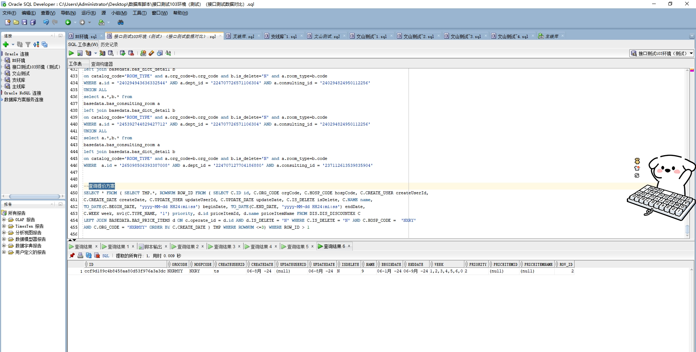

# 领域服务/基础领域 - 查询提价方案 - 查询提价方案 正向用例
## 请求参数：
``` json
{
  "isGetDetail": "0",
  "hospCode": "NXRY",
  "pageIndex": 1,
  "orgCode": "NXRMYY",
  "pageSize": 3
}
```
## 返回参数：
``` json
{
  "exception": null,
  "apiCode": null,
  "data": {
    "list": [
      {
        "isDelete": "N",
        "createUserId": "1047",
        "createDate": "2023-08-18 09:05:40",
        "updateUserId": null,
        "updateDate": "2023-10-09 15:41:38",
        "beginDate": "2023-08-18 00:00:00",
        "endDate": "2224-02-04 23:59:59",
        "hospCode": "NXRY",
        "id": "395040835a924e6ea34952f8977f3816",
        "name": "ww",
        "orgCode": "NXRMYY",
        "priority": "1",
        "week": "2,3,4,5,6,0",
        "priceItemId": null,
        "priceItemName": null,
        "itemDetails": null,
        "limits": [
          {
            "discountId": "395040835a924e6ea34952f8977f3816",
            "id": "cd4176058aa44e5eb6453009f85b2f3a",
            "limitValue": "0,1,2,3,4,5,35,25",
            "limitType": "AgeYears"
          }
        ]
      }
    ],
    "totalCount": 1,
    "pageSize": 3,
    "pageNo": 1,
    "pageCount": 1
  },
  "Code": 200,
  "Message": "操作成功"
}
```
## 数据校验：

# 领域服务/基础领域 - 查询提价方案 - 必填校验-[orgCode]为空
## 请求参数：
``` json
{
  "isGetDetail": "0",
  "hospCode": "NXRY",
  "pageIndex": 1,
  "orgCode": "",
  "pageSize": 3
}
```
## 返回参数：
``` json
{
  "exception": null,
  "apiCode": null,
  "data": null,
  "Code": 1,
  "Message": "医院编码不可为空"
}
```
# 领域服务/基础领域 - 查询提价方案 - 必填校验-[hospCode]为空
## 请求参数：
``` json
{
  "isGetDetail": "0",
  "hospCode": "",
  "pageIndex": 1,
  "orgCode": "NXRMYY",
  "pageSize": 3
}
```
## 返回参数：
``` json
{
  "exception": null,
  "apiCode": null,
  "data": null,
  "Code": 1,
  "Message": "院区编码不可为空"
}
```
# 领域服务/基础领域 - 查询提价方案 - 必填校验-[pageIndex]为空
## 请求参数：
``` json
{
  "isGetDetail": "0",
  "hospCode": "NXRY",
  "pageIndex": null,
  "orgCode": "NXRMYY",
  "pageSize": 3
}
```
## 返回参数：
``` json
{
  "exception": null,
  "apiCode": null,
  "data": null,
  "Code": 1,
  "Message": "系统内部异常"
}
```
# 领域服务/基础领域 - 查询提价方案 - 必填校验-[pageSize]为空
## 请求参数：
``` json
{
  "isGetDetail": "0",
  "hospCode": "NXRY",
  "pageIndex": 1,
  "orgCode": "NXRMYY",
  "pageSize": null
}
```
## 返回参数：
``` json
{
  "exception": null,
  "apiCode": null,
  "data": null,
  "Code": 1,
  "Message": "系统内部异常"
}
```
# 领域服务/基础领域 - 查询提价方案 - 类型校验-[pageSize]类型错误
## 请求参数：
``` json
{
  "isGetDetail": "0",
  "hospCode": "NXRY",
  "pageIndex": 1,
  "orgCode": "NXRMYY",
  "pageSize": "abc"
}
```
## 返回参数：
``` json
{
  "exception": null,
  "apiCode": null,
  "data": null,
  "Code": 1,
  "Message": "请求参数错误"
}
```
# 领域服务/基础领域 - 查询提价方案 - 类型校验-[pageIndex]类型错误
## 请求参数：
``` json
{
  "isGetDetail": "0",
  "hospCode": "NXRY",
  "pageIndex": "abc",
  "orgCode": "NXRMYY",
  "pageSize": 3
}
```
## 返回参数：
``` json
{
  "exception": null,
  "apiCode": null,
  "data": null,
  "Code": 1,
  "Message": "请求参数错误"
}
```
# 领域服务/基础领域 - 查询提价方案 - 依赖用例-[orgCode]赋值为依赖用例测试值
## 请求参数：
``` json
{
  "isGetDetail": "0",
  "hospCode": "NXRY",
  "pageIndex": 1,
  "orgCode": "依赖用例测试值",
  "pageSize": 3
}
```
## 返回参数：
``` json
{
  "exception": null,
  "apiCode": null,
  "data": {
    "list": [],
    "totalCount": 0,
    "pageSize": 3,
    "pageNo": 1,
    "pageCount": 0
  },
  "Code": 200,
  "Message": "操作成功"
}
```
# 领域服务/基础领域 - 查询提价方案 - 依赖用例-[hospCode]赋值为依赖用例测试值
## 请求参数：
``` json
{
  "isGetDetail": "0",
  "hospCode": "依赖用例测试值",
  "pageIndex": 1,
  "orgCode": "NXRMYY",
  "pageSize": 3
}
```
## 返回参数：
``` json
{
  "exception": null,
  "apiCode": null,
  "data": {
    "list": [],
    "totalCount": 0,
    "pageSize": 3,
    "pageNo": 1,
    "pageCount": 0
  },
  "Code": 200,
  "Message": "操作成功"
}
```