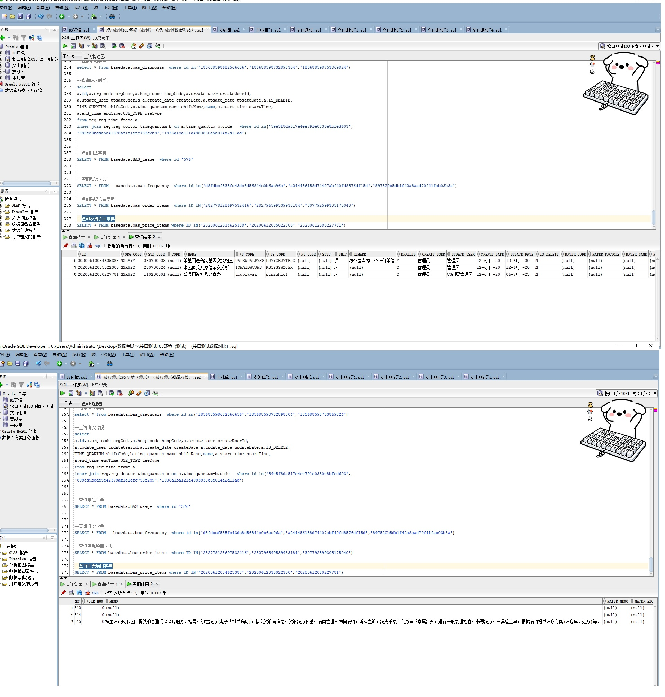

# 领域服务/基础领域 - 查询收费项目字典 - 查询收费项目字典 正向用例
## 请求参数：
``` json
{
  "hospCode": "NXRY",
  "pageIndex": 1,
  "orgCode": "NXRMYY",
  "pageSize": 3
}
```
## 返回参数：
``` json
{
  "exception": null,
  "apiCode": null,
  "data": {
    "list": [
      {
        "auditEnable": null,
        "bidCode": null,
        "bidPrice": null,
        "code": null,
        "compareCode": null,
        "createDate": "2020-06-12 15:46:25",
        "createUserId": "管理员",
        "docNum": null,
        "enabled": "Y",
        "goodsId": null,
        "hospCode": "NXRY",
        "hospPrices": [
          {
            "costPrice": 270,
            "enabled": "Y",
            "hospCode": "NXRY",
            "price": 270,
            "priceItemId": "20200612034625388"
          }
        ],
        "id": "20200612034625388",
        "insMaterCode": null,
        "insStatus": "1",
        "insUser": null,
        "isDelete": "N",
        "isDomestic": "0",
        "isHighValueMater": "0",
        "isImplantMater": "0",
        "isInsCatalog": null,
        "limitCeilPrice": null,
        "limitPriceMaxNum": null,
        "limitPriceNum": null,
        "limitPriceUnit": null,
        "materBatchNo": null,
        "materBrand": null,
        "materCode": null,
        "materFactory": null,
        "materModel": null,
        "materName": null,
        "materQuality": null,
        "materSpec": null,
        "memo": null,
        "name": "单基因遗传病基因突变检查",
        "nuCode": null,
        "orgCode": "NXRMYY",
        "paymentRatio": null,
        "platId": null,
        "price": 270,
        "priceDoctorFlag": "0",
        "priceExcept": null,
        "priceManaMode": null,
        "priceMemo": null,
        "pyCode": "DJYYCBJYTBJC",
        "reimburseClass": null,
        "remark": "每个位点为一个计价单位",
        "riskDegree": null,
        "skillClass": null,
        "skillDifficulty": null,
        "spec": null,
        "statCalculateCode": "08",
        "statCalculateName": "检验费",
        "statInpAccountCode": "04",
        "statInpAccountName": "化验收入",
        "statInpInvoiceCode": "07",
        "statInpInvoiceName": "化验费",
        "statMajorCode": "08",
        "statMajorName": "检验费",
        "statMedicalRecCode": null,
        "statMedicalRecName": null,
        "statOutAccountCode": "04",
        "statOutAccountName": "化验收入",
        "statOutInvoiceCode": "07",
        "statOutInvoiceName": "检验费",
        "statSubCalculateCode": "08",
        "statSubCalculateName": "检验费",
        "stdCode": "250700023",
        "stdCodeSecondary": null,
        "stdName": null,
        "udi": null,
        "unit": "项",
        "updateDate": "2020-06-12 15:46:25",
        "updateUserId": "管理员",
        "wbCode": "UALKWUALPYSS"
      },
      {
        "auditEnable": null,
        "bidCode": null,
        "bidPrice": null,
        "code": null,
        "compareCode": null,
        "createDate": "2020-06-12 15:50:22",
        "createUserId": "管理员",
        "docNum": null,
        "enabled": "Y",
        "goodsId": null,
        "hospCode": "NXRY",
        "hospPrices": [
          {
            "costPrice": 1242,
            "enabled": "Y",
            "hospCode": "NXRY",
            "price": 1242,
            "priceItemId": "20200612035022300"
          }
        ],
        "id": "20200612035022300",
        "insMaterCode": null,
        "insStatus": "1",
        "insUser": null,
        "isDelete": "N",
        "isDomestic": "0",
        "isHighValueMater": "0",
        "isImplantMater": "0",
        "isInsCatalog": null,
        "limitCeilPrice": null,
        "limitPriceMaxNum": null,
        "limitPriceNum": null,
        "limitPriceUnit": null,
        "materBatchNo": null,
        "materBrand": null,
        "materCode": null,
        "materFactory": null,
        "materModel": null,
        "materName": null,
        "materQuality": null,
        "materSpec": null,
        "memo": null,
        "name": "染色体荧光原位杂交分析",
        "nuCode": null,
        "orgCode": "NXRMYY",
        "paymentRatio": null,
        "platId": null,
        "price": 1242,
        "priceDoctorFlag": "0",
        "priceExcept": null,
        "priceManaMode": null,
        "priceMemo": null,
        "pyCode": "RSTYGYWZJFX",
        "reimburseClass": null,
        "remark": null,
        "riskDegree": null,
        "skillClass": null,
        "skillDifficulty": null,
        "spec": null,
        "statCalculateCode": "08",
        "statCalculateName": "检验费",
        "statInpAccountCode": "04",
        "statInpAccountName": "化验收入",
        "statInpInvoiceCode": "07",
        "statInpInvoiceName": "化验费",
        "statMajorCode": "08",
        "statMajorName": "检验费",
        "statMedicalRecCode": null,
        "statMedicalRecName": null,
        "statOutAccountCode": "04",
        "statOutAccountName": "化验收入",
        "statOutInvoiceCode": "07",
        "statOutInvoiceName": "检验费",
        "statSubCalculateCode": "08",
        "statSubCalculateName": "检验费",
        "stdCode": "250700024",
        "stdCodeSecondary": null,
        "stdName": null,
        "udi": null,
        "unit": "次",
        "updateDate": "2020-06-12 15:50:22",
        "updateUserId": "管理员",
        "wbCode": "IQWAIDWVUWS"
      },
      {
        "auditEnable": null,
        "bidCode": null,
        "bidPrice": null,
        "code": null,
        "compareCode": null,
        "createDate": "2020-06-12 20:02:27",
        "createUserId": "管理员",
        "docNum": null,
        "enabled": "Y",
        "goodsId": null,
        "hospCode": "NXRY",
        "hospPrices": [
          {
            "costPrice": 6,
            "enabled": "Y",
            "hospCode": "NXRY",
            "price": 6,
            "priceItemId": "20200612080227781"
          }
        ],
        "id": "20200612080227781",
        "insMaterCode": null,
        "insStatus": "1",
        "insUser": "CS创星管理员",
        "isDelete": "N",
        "isDomestic": "0",
        "isHighValueMater": "0",
        "isImplantMater": "0",
        "isInsCatalog": null,
        "limitCeilPrice": null,
        "limitPriceMaxNum": null,
        "limitPriceNum": null,
        "limitPriceUnit": null,
        "materBatchNo": null,
        "materBrand": null,
        "materCode": null,
        "materFactory": null,
        "materModel": null,
        "materName": null,
        "materQuality": null,
        "materSpec": null,
        "memo": "指主治及以下医师提供的普通门诊诊疗服务。挂号，初建病历(电子或纸质病历)，核实就诊者信息，就诊病历传送，病案管理。询问病情，听取主诉，病史采集，向患者或家属告知，进行一般物理检查，书写病历，开具检查单，根据病情提供治疗方案(治疗单、处方)等。",
        "name": "普通门诊挂号诊查费",
        "nuCode": null,
        "orgCode": "NXRMYY",
        "paymentRatio": null,
        "platId": null,
        "price": 6,
        "priceDoctorFlag": "0",
        "priceExcept": null,
        "priceManaMode": null,
        "priceMemo": null,
        "pyCode": "ptmzghzcf",
        "reimburseClass": null,
        "remark": null,
        "riskDegree": null,
        "skillClass": null,
        "skillDifficulty": null,
        "spec": null,
        "statCalculateCode": "49",
        "statCalculateName": "其他",
        "statInpAccountCode": "12",
        "statInpAccountName": "其他住院收入",
        "statInpInvoiceCode": "14",
        "statInpInvoiceName": "其他",
        "statMajorCode": "50",
        "statMajorName": "诊查费",
        "statMedicalRecCode": "27",
        "statMedicalRecName": "其他费",
        "statOutAccountCode": "14",
        "statOutAccountName": "其他门诊收入",
        "statOutInvoiceCode": "05",
        "statOutInvoiceName": "诊察费",
        "statSubCalculateCode": "49",
        "statSubCalculateName": "其他",
        "stdCode": "110200001",
        "stdCodeSecondary": null,
        "stdName": null,
        "udi": null,
        "unit": "次",
        "updateDate": "2023-07-06 14:41:29",
        "updateUserId": "CS创星管理员",
        "wbCode": "ucuyrkysx"
      }
    ],
    "totalCount": 10451,
    "pageSize": 3,
    "pageNo": 1,
    "pageCount": 3484
  },
  "Code": 200,
  "Message": "操作成功"
}
```
## 数据校验：

# 领域服务/基础领域 - 查询收费项目字典 - 必填校验-[orgCode]为空
## 请求参数：
``` json
{
  "hospCode": "NXRY",
  "pageIndex": 1,
  "orgCode": "",
  "pageSize": 3
}
```
## 返回参数：
``` json
{
  "exception": null,
  "apiCode": null,
  "data": null,
  "Code": 1,
  "Message": "医院编码不能为空"
}
```
# 领域服务/基础领域 - 查询收费项目字典 - 必填校验-[hospCode]为空
## 请求参数：
``` json
{
  "hospCode": "",
  "pageIndex": 1,
  "orgCode": "NXRMYY",
  "pageSize": 3
}
```
## 返回参数：
``` json
{
  "exception": null,
  "apiCode": null,
  "data": null,
  "Code": 1,
  "Message": "院区编码不能为空"
}
```
# 领域服务/基础领域 - 查询收费项目字典 - 必填校验-[pageIndex]为空
## 请求参数：
``` json
{
  "hospCode": "NXRY",
  "pageIndex": null,
  "orgCode": "NXRMYY",
  "pageSize": 3
}
```
## 返回参数：
``` json
{
  "exception": null,
  "apiCode": null,
  "data": null,
  "Code": 1,
  "Message": "系统内部异常"
}
```
# 领域服务/基础领域 - 查询收费项目字典 - 必填校验-[pageSize]为空
## 请求参数：
``` json
{
  "hospCode": "NXRY",
  "pageIndex": 1,
  "orgCode": "NXRMYY",
  "pageSize": null
}
```
## 返回参数：
``` json
{
  "exception": null,
  "apiCode": null,
  "data": null,
  "Code": 1,
  "Message": "系统内部异常"
}
```
# 领域服务/基础领域 - 查询收费项目字典 - 类型校验-[pageSize]类型错误
## 请求参数：
``` json
{
  "hospCode": "NXRY",
  "pageIndex": 1,
  "orgCode": "NXRMYY",
  "pageSize": "abc"
}
```
## 返回参数：
``` json
{
  "exception": null,
  "apiCode": null,
  "data": null,
  "Code": 1,
  "Message": "请求参数错误"
}
```
# 领域服务/基础领域 - 查询收费项目字典 - 类型校验-[pageIndex]类型错误
## 请求参数：
``` json
{
  "hospCode": "NXRY",
  "pageIndex": "abc",
  "orgCode": "NXRMYY",
  "pageSize": 3
}
```
## 返回参数：
``` json
{
  "exception": null,
  "apiCode": null,
  "data": null,
  "Code": 1,
  "Message": "请求参数错误"
}
```
# 领域服务/基础领域 - 查询收费项目字典 - 依赖用例-[orgCode]赋值为依赖用例测试值
## 请求参数：
``` json
{
  "hospCode": "NXRY",
  "pageIndex": 1,
  "orgCode": "依赖用例测试值",
  "pageSize": 3
}
```
## 返回参数：
``` json
{
  "exception": null,
  "apiCode": null,
  "data": {
    "list": [],
    "totalCount": 0,
    "pageSize": 3,
    "pageNo": 1,
    "pageCount": 0
  },
  "Code": 200,
  "Message": "操作成功"
}
```
# 领域服务/基础领域 - 查询收费项目字典 - 依赖用例-[hospCode]赋值为依赖用例测试值
## 请求参数：
``` json
{
  "hospCode": "依赖用例测试值",
  "pageIndex": 1,
  "orgCode": "NXRMYY",
  "pageSize": 3
}
```
## 返回参数：
``` json
{
  "exception": null,
  "apiCode": null,
  "data": {
    "list": [],
    "totalCount": 0,
    "pageSize": 3,
    "pageNo": 1,
    "pageCount": 0
  },
  "Code": 200,
  "Message": "操作成功"
}
```