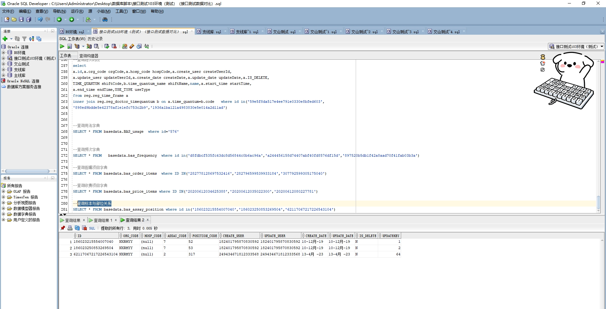

# 领域服务/基础领域 - 查询标本与部位关系 - 查询标本与部位关系 正向用例
## 请求参数：
``` json
{
  "hospCode": "NXRY",
  "orgCode": "NXRMYY",
  "pageSize": 3,
  "pageIndex": 1
}
```
## 返回参数：
``` json
{
  "exception": null,
  "apiCode": null,
  "data": {
    "list": [
      {
        "bodyCode": "52",
        "bodyName": "喉咽部",
        "createDate": "2019-12-10 15:49:50",
        "createUserId": "182401795870830592",
        "id": "186023215554007040",
        "isDelete": "N",
        "orgCode": "NXRMYY",
        "sampleCode": "7",
        "sampleName": "全血",
        "updateDate": "2019-12-10 15:49:50",
        "updateUserId": "182401795870830592"
      },
      {
        "bodyCode": "53",
        "bodyName": "颅颈交界",
        "createDate": "2019-12-10 15:49:59",
        "createUserId": "182401795870830592",
        "id": "186023250853269504",
        "isDelete": "N",
        "orgCode": "NXRMYY",
        "sampleCode": "7",
        "sampleName": "全血",
        "updateDate": "2019-12-10 15:49:59",
        "updateUserId": "182401795870830592"
      },
      {
        "bodyCode": "317",
        "bodyName": "泌尿系",
        "createDate": "2023-04-13 15:58:58",
        "createUserId": "249434671812333568",
        "id": "62117067217226543104",
        "isDelete": "N",
        "orgCode": "NXRMYY",
        "sampleCode": "2",
        "sampleName": "尿液",
        "updateDate": "2023-04-13 15:58:58",
        "updateUserId": "249434671812333568"
      }
    ],
    "totalCount": 26,
    "pageSize": 1,
    "pageNo": 3,
    "pageCount": 9
  },
  "Code": 200,
  "Message": "操作成功"
}
```
## 数据校验：

# 领域服务/基础领域 - 查询标本与部位关系 - 必填校验-[orgCode]为空
## 请求参数：
``` json
{
  "hospCode": "NXRY",
  "orgCode": "",
  "pageSize": 3,
  "pageIndex": 1
}
```
## 返回参数：
``` json
{
  "exception": null,
  "apiCode": null,
  "data": null,
  "Code": 1,
  "Message": "医院编码不允许为空"
}
```
# 领域服务/基础领域 - 查询标本与部位关系 - 必填校验-[pageIndex]为空
## 请求参数：
``` json
{
  "hospCode": "NXRY",
  "orgCode": "NXRMYY",
  "pageSize": 3,
  "pageIndex": null
}
```
## 返回参数：
``` json
{
  "exception": null,
  "apiCode": null,
  "data": null,
  "Code": 1,
  "Message": "系统内部异常"
}
```
# 领域服务/基础领域 - 查询标本与部位关系 - 必填校验-[pageSize]为空
## 请求参数：
``` json
{
  "hospCode": "NXRY",
  "orgCode": "NXRMYY",
  "pageSize": null,
  "pageIndex": 1
}
```
## 返回参数：
``` json
{
  "exception": null,
  "apiCode": null,
  "data": null,
  "Code": 1,
  "Message": "系统内部异常"
}
```
# 领域服务/基础领域 - 查询标本与部位关系 - 类型校验-[pageIndex]类型错误
## 请求参数：
``` json
{
  "hospCode": "NXRY",
  "orgCode": "NXRMYY",
  "pageSize": 3,
  "pageIndex": "abc"
}
```
## 返回参数：
``` json
{
  "exception": null,
  "apiCode": null,
  "data": null,
  "Code": 1,
  "Message": "请求参数错误"
}
```
# 领域服务/基础领域 - 查询标本与部位关系 - 类型校验-[pageSize]类型错误
## 请求参数：
``` json
{
  "hospCode": "NXRY",
  "orgCode": "NXRMYY",
  "pageSize": "abc",
  "pageIndex": 1
}
```
## 返回参数：
``` json
{
  "exception": null,
  "apiCode": null,
  "data": null,
  "Code": 1,
  "Message": "请求参数错误"
}
```
# 领域服务/基础领域 - 查询标本与部位关系 - 依赖用例-[orgCode]赋值为依赖用例测试值
## 请求参数：
``` json
{
  "hospCode": "NXRY",
  "orgCode": "依赖用例测试值",
  "pageSize": 3,
  "pageIndex": 1
}
```
## 返回参数：
``` json
{
  "exception": null,
  "apiCode": null,
  "data": {
    "list": [],
    "totalCount": 0,
    "pageSize": 1,
    "pageNo": 3,
    "pageCount": 0
  },
  "Code": 200,
  "Message": "操作成功"
}
```