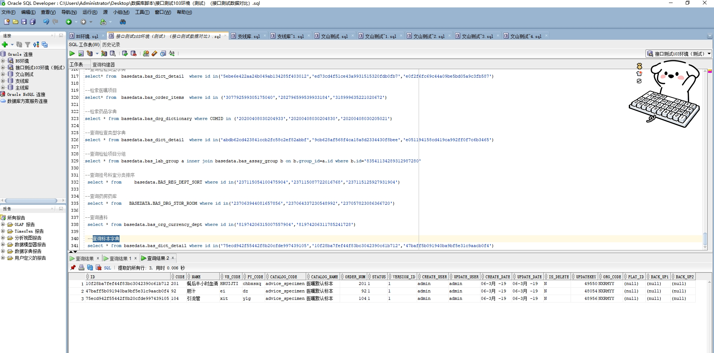

# 领域服务/基础领域 - 查询标本字典 - 查询标本字典 正向用例
## 请求参数：
``` json
{
  "isDelete": "N",
  "pageSize": 3,
  "pageIndex": 1,
  "orgCode": "NXRMYY"
}
```
## 返回参数：
``` json
{
  "exception": null,
  "apiCode": null,
  "data": {
    "list": [
      {
        "id": "75ecd942f55442f8b20cfde997439105",
        "orgCode": "NXRMYY",
        "hospCode": null,
        "createDate": "2019-03-06 18:43:06",
        "updateDate": "2019-03-06 18:43:06",
        "isDelete": "N",
        "code": "104",
        "name": "引流管",
        "wbCode": "xit",
        "pyCode": "ylg",
        "catalogCode": "advice_specimen",
        "catalogName": "医嘱默认标本",
        "orderNum": 104,
        "status": "1",
        "versionId": "1",
        "platId": null,
        "backUp1": null,
        "backUp2": null,
        "createUserId": "admin",
        "updateUserId": "admin",
        "updatekey": 48956
      },
      {
        "id": "10f28ba7fef44f83bc3042390c61b712",
        "orgCode": "NXRMYY",
        "hospCode": null,
        "createDate": "2019-03-06 18:43:06",
        "updateDate": "2019-03-06 18:43:06",
        "isDelete": "N",
        "code": "201",
        "name": "餐后半小时血清",
        "wbCode": "HRUIJTI",
        "pyCode": "chbxsxq",
        "catalogCode": "advice_specimen",
        "catalogName": "医嘱默认标本",
        "orderNum": 201,
        "status": "1",
        "versionId": "1",
        "platId": null,
        "backUp1": null,
        "backUp2": null,
        "createUserId": "admin",
        "updateUserId": "admin",
        "updatekey": 49550
      },
      {
        "id": "47baff5b091940ba9bf5e31c9aacb0f4",
        "orgCode": "NXRMYY",
        "hospCode": null,
        "createDate": "2019-03-06 18:43:06",
        "updateDate": "2019-03-06 18:43:06",
        "isDelete": "N",
        "code": "92",
        "name": "胆汁",
        "wbCode": "ei",
        "pyCode": "dz",
        "catalogCode": "advice_specimen",
        "catalogName": "医嘱默认标本",
        "orderNum": 92,
        "status": "1",
        "versionId": "1",
        "platId": null,
        "backUp1": null,
        "backUp2": null,
        "createUserId": "admin",
        "updateUserId": "admin",
        "updatekey": 48054
      }
    ],
    "totalCount": 123,
    "pageSize": 3,
    "pageNo": 1,
    "pageCount": 41
  },
  "Code": 200,
  "Message": "操作成功"
}
```
## 数据校验：

# 领域服务/基础领域 - 查询标本字典 - 必填校验-[orgCode]为空
## 请求参数：
``` json
{
  "isDelete": "N",
  "pageSize": 3,
  "pageIndex": 1,
  "orgCode": ""
}
```
## 返回参数：
``` json
{
  "exception": null,
  "apiCode": null,
  "data": null,
  "Code": 1,
  "Message": "医院编码不能为空"
}
```
# 领域服务/基础领域 - 查询标本字典 - 必填校验-[pageIndex]为空
## 请求参数：
``` json
{
  "isDelete": "N",
  "pageSize": 3,
  "pageIndex": null,
  "orgCode": "NXRMYY"
}
```
## 返回参数：
``` json
{
  "exception": null,
  "apiCode": null,
  "data": null,
  "Code": 1,
  "Message": "系统内部异常"
}
```
# 领域服务/基础领域 - 查询标本字典 - 必填校验-[pageSize]为空
## 请求参数：
``` json
{
  "isDelete": "N",
  "pageSize": null,
  "pageIndex": 1,
  "orgCode": "NXRMYY"
}
```
## 返回参数：
``` json
{
  "exception": null,
  "apiCode": null,
  "data": null,
  "Code": 1,
  "Message": "系统内部异常"
}
```
# 领域服务/基础领域 - 查询标本字典 - 类型校验-[pageIndex]类型错误
## 请求参数：
``` json
{
  "isDelete": "N",
  "pageSize": 3,
  "pageIndex": "abc",
  "orgCode": "NXRMYY"
}
```
## 返回参数：
``` json
{
  "exception": null,
  "apiCode": null,
  "data": null,
  "Code": 1,
  "Message": "请求参数错误"
}
```
# 领域服务/基础领域 - 查询标本字典 - 类型校验-[pageSize]类型错误
## 请求参数：
``` json
{
  "isDelete": "N",
  "pageSize": "abc",
  "pageIndex": 1,
  "orgCode": "NXRMYY"
}
```
## 返回参数：
``` json
{
  "exception": null,
  "apiCode": null,
  "data": null,
  "Code": 1,
  "Message": "请求参数错误"
}
```
# 领域服务/基础领域 - 查询标本字典 - 依赖用例-[orgCode]赋值为依赖用例测试值
## 请求参数：
``` json
{
  "isDelete": "N",
  "pageSize": 3,
  "pageIndex": 1,
  "orgCode": "依赖用例测试值"
}
```
## 返回参数：
``` json
{
  "exception": null,
  "apiCode": null,
  "data": {
    "list": [
      {
        "id": "75ecd942f55442f8b20cfde997439105",
        "orgCode": "NXRMYY",
        "hospCode": null,
        "createDate": "2019-03-06 18:43:06",
        "updateDate": "2019-03-06 18:43:06",
        "isDelete": "N",
        "code": "104",
        "name": "引流管",
        "wbCode": "xit",
        "pyCode": "ylg",
        "catalogCode": "advice_specimen",
        "catalogName": "医嘱默认标本",
        "orderNum": 104,
        "status": "1",
        "versionId": "1",
        "platId": null,
        "backUp1": null,
        "backUp2": null,
        "createUserId": "admin",
        "updateUserId": "admin",
        "updatekey": 48956
      },
      {
        "id": "10f28ba7fef44f83bc3042390c61b712",
        "orgCode": "NXRMYY",
        "hospCode": null,
        "createDate": "2019-03-06 18:43:06",
        "updateDate": "2019-03-06 18:43:06",
        "isDelete": "N",
        "code": "201",
        "name": "餐后半小时血清",
        "wbCode": "HRUIJTI",
        "pyCode": "chbxsxq",
        "catalogCode": "advice_specimen",
        "catalogName": "医嘱默认标本",
        "orderNum": 201,
        "status": "1",
        "versionId": "1",
        "platId": null,
        "backUp1": null,
        "backUp2": null,
        "createUserId": "admin",
        "updateUserId": "admin",
        "updatekey": 49550
      },
      {
        "id": "47baff5b091940ba9bf5e31c9aacb0f4",
        "orgCode": "NXRMYY",
        "hospCode": null,
        "createDate": "2019-03-06 18:43:06",
        "updateDate": "2019-03-06 18:43:06",
        "isDelete": "N",
        "code": "92",
        "name": "胆汁",
        "wbCode": "ei",
        "pyCode": "dz",
        "catalogCode": "advice_specimen",
        "catalogName": "医嘱默认标本",
        "orderNum": 92,
        "status": "1",
        "versionId": "1",
        "platId": null,
        "backUp1": null,
        "backUp2": null,
        "createUserId": "admin",
        "updateUserId": "admin",
        "updatekey": 48054
      }
    ],
    "totalCount": 123,
    "pageSize": 3,
    "pageNo": 1,
    "pageCount": 41
  },
  "Code": 200,
  "Message": "操作成功"
}
```