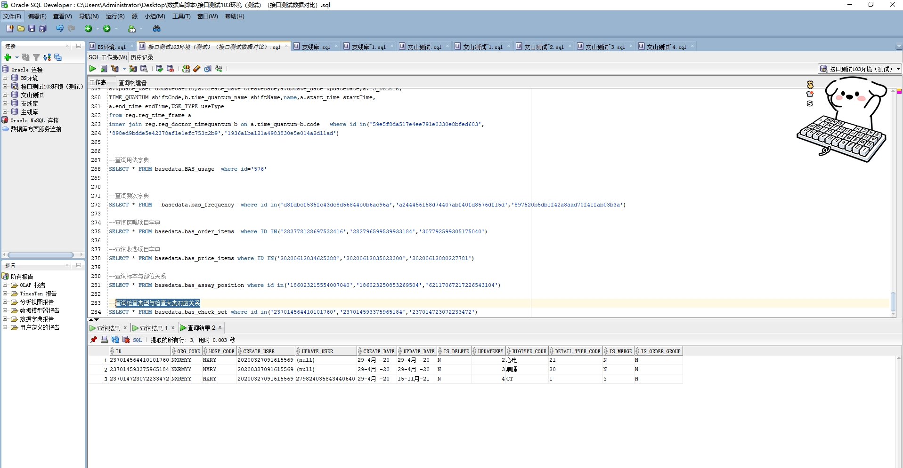

# 领域服务/基础领域 - 查询检查类型与检查大类对应关系 - 查询检查类型与检查大类对应关系 正向用例
## 请求参数：
``` json
{
  "hospCode": "NXRY",
  "orgCode": "NXRMYY",
  "pageSize": 3,
  "pageIndex": 1
}
```
## 返回参数：
``` json
{
  "exception": null,
  "apiCode": null,
  "data": {
    "list": [
      {
        "createDate": "2020-04-29 08:51:15",
        "createUserId": "20200327091615569",
        "examBigTypeName": "心电",
        "examTypeCode": "21",
        "examTypeName": "心电图",
        "hospCode": "NXRY",
        "id": "237014564410101760",
        "isDelete": "N",
        "orgCode": "NXRMYY",
        "updateDate": "2020-04-29 08:51:15",
        "updateUserId": null,
        "isMerge": "N",
        "isOrderGroup": "N",
        "examBigTypeCode": null
      },
      {
        "createDate": "2020-04-29 08:51:22",
        "createUserId": "20200327091615569",
        "examBigTypeName": "病理",
        "examTypeCode": "20",
        "examTypeName": "病理检查",
        "hospCode": "NXRY",
        "id": "237014593375965184",
        "isDelete": "N",
        "orgCode": "NXRMYY",
        "updateDate": "2020-04-29 08:51:22",
        "updateUserId": null,
        "isMerge": "N",
        "isOrderGroup": "N",
        "examBigTypeCode": null
      },
      {
        "createDate": "2020-04-29 08:51:53",
        "createUserId": "20200327091615569",
        "examBigTypeName": "CT",
        "examTypeCode": "1",
        "examTypeName": "CT检查",
        "hospCode": "NXRY",
        "id": "237014723072233472",
        "isDelete": "N",
        "orgCode": "NXRMYY",
        "updateDate": "2021-11-15 14:58:19",
        "updateUserId": "279824035843440640",
        "isMerge": "Y",
        "isOrderGroup": "N",
        "examBigTypeCode": null
      }
    ],
    "totalCount": 19,
    "pageSize": 3,
    "pageNo": 1,
    "pageCount": 7
  },
  "Code": 200,
  "Message": "操作成功"
}
```
## 数据校验：

# 领域服务/基础领域 - 查询检查类型与检查大类对应关系 - 必填校验-[orgCode]为空
## 请求参数：
``` json
{
  "hospCode": "NXRY",
  "orgCode": "",
  "pageSize": 3,
  "pageIndex": 1
}
```
## 返回参数：
``` json
{
  "exception": null,
  "apiCode": null,
  "data": null,
  "Code": 1,
  "Message": "医院编码不允许为空"
}
```
# 领域服务/基础领域 - 查询检查类型与检查大类对应关系 - 必填校验-[pageIndex]为空
## 请求参数：
``` json
{
  "hospCode": "NXRY",
  "orgCode": "NXRMYY",
  "pageSize": 3,
  "pageIndex": null
}
```
## 返回参数：
``` json
{
  "exception": null,
  "apiCode": null,
  "data": null,
  "Code": 1,
  "Message": "系统内部异常"
}
```
# 领域服务/基础领域 - 查询检查类型与检查大类对应关系 - 必填校验-[pageSize]为空
## 请求参数：
``` json
{
  "hospCode": "NXRY",
  "orgCode": "NXRMYY",
  "pageSize": null,
  "pageIndex": 1
}
```
## 返回参数：
``` json
{
  "exception": null,
  "apiCode": null,
  "data": null,
  "Code": 1,
  "Message": "系统内部异常"
}
```
# 领域服务/基础领域 - 查询检查类型与检查大类对应关系 - 类型校验-[pageIndex]类型错误
## 请求参数：
``` json
{
  "hospCode": "NXRY",
  "orgCode": "NXRMYY",
  "pageSize": 3,
  "pageIndex": "abc"
}
```
## 返回参数：
``` json
{
  "exception": null,
  "apiCode": null,
  "data": null,
  "Code": 1,
  "Message": "请求参数错误"
}
```
# 领域服务/基础领域 - 查询检查类型与检查大类对应关系 - 类型校验-[pageSize]类型错误
## 请求参数：
``` json
{
  "hospCode": "NXRY",
  "orgCode": "NXRMYY",
  "pageSize": "abc",
  "pageIndex": 1
}
```
## 返回参数：
``` json
{
  "exception": null,
  "apiCode": null,
  "data": null,
  "Code": 1,
  "Message": "请求参数错误"
}
```
# 领域服务/基础领域 - 查询检查类型与检查大类对应关系 - 依赖用例-[orgCode]赋值为依赖用例测试值
## 请求参数：
``` json
{
  "hospCode": "NXRY",
  "orgCode": "依赖用例测试值",
  "pageSize": 3,
  "pageIndex": 1
}
```
## 返回参数：
``` json
{
  "exception": null,
  "apiCode": null,
  "data": {
    "list": [],
    "totalCount": 0,
    "pageSize": 3,
    "pageNo": 1,
    "pageCount": 0
  },
  "Code": 200,
  "Message": "操作成功"
}
```