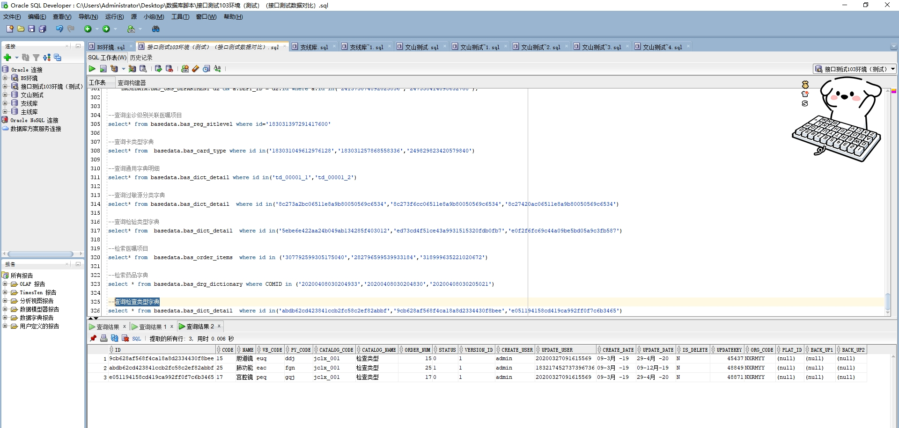

# 领域服务/基础领域 - 查询检查类型字典 - 查询检查类型字典 正向用例
## 请求参数：
``` json
{
  "isDelete": "N",
  "pageSize": 3,
  "pageIndex": 1,
  "orgCode": "NXRMYY"
}
```
## 返回参数：
``` json
{
  "exception": null,
  "apiCode": null,
  "data": {
    "list": [
      {
        "id": "abdb62cd423841ccb2fc58c2ef82abbf",
        "orgCode": "NXRMYY",
        "hospCode": null,
        "createDate": "2019-03-09 15:47:11",
        "updateDate": "2019-12-09 16:25:35",
        "isDelete": "N",
        "code": "25",
        "name": "肺功能",
        "wbCode": "eac",
        "pyCode": "fgn",
        "catalogCode": "jclx_001",
        "catalogName": "检查类型",
        "orderNum": 25,
        "status": "1",
        "versionId": "1",
        "platId": null,
        "backUp1": null,
        "backUp2": null,
        "createUserId": "admin",
        "updateUserId": "183217452737396736",
        "updatekey": 48849
      },
      {
        "id": "9cb628af568f4ca18a8d2334430f8bee",
        "orgCode": "NXRMYY",
        "hospCode": null,
        "createDate": "2019-03-09 15:47:11",
        "updateDate": "2020-04-29 08:54:34",
        "isDelete": "N",
        "code": "15",
        "name": "胆道镜",
        "wbCode": "euq",
        "pyCode": "ddj",
        "catalogCode": "jclx_001",
        "catalogName": "检查类型",
        "orderNum": 15,
        "status": "0",
        "versionId": "1",
        "platId": null,
        "backUp1": null,
        "backUp2": null,
        "createUserId": "admin",
        "updateUserId": "20200327091615569",
        "updatekey": 45437
      },
      {
        "id": "e051194158cd419ca992ff0f7c6b3465",
        "orgCode": "NXRMYY",
        "hospCode": null,
        "createDate": "2019-03-09 15:47:11",
        "updateDate": "2020-04-29 08:54:43",
        "isDelete": "N",
        "code": "17",
        "name": "宫腔镜",
        "wbCode": "peq",
        "pyCode": "gqj",
        "catalogCode": "jclx_001",
        "catalogName": "检查类型",
        "orderNum": 17,
        "status": "0",
        "versionId": "1",
        "platId": null,
        "backUp1": null,
        "backUp2": null,
        "createUserId": "admin",
        "updateUserId": "20200327091615569",
        "updatekey": 48871
      }
    ],
    "totalCount": 45,
    "pageSize": 3,
    "pageNo": 1,
    "pageCount": 15
  },
  "Code": 200,
  "Message": "操作成功"
}
```
## 数据校验：

# 领域服务/基础领域 - 查询检查类型字典 - 必填校验-[orgCode]为空
## 请求参数：
``` json
{
  "isDelete": "N",
  "pageSize": 3,
  "pageIndex": 1,
  "orgCode": ""
}
```
## 返回参数：
``` json
{
  "exception": null,
  "apiCode": null,
  "data": null,
  "Code": 1,
  "Message": "医院编码不能为空"
}
```
# 领域服务/基础领域 - 查询检查类型字典 - 必填校验-[pageIndex]为空
## 请求参数：
``` json
{
  "isDelete": "N",
  "pageSize": 3,
  "pageIndex": null,
  "orgCode": "NXRMYY"
}
```
## 返回参数：
``` json
{
  "exception": null,
  "apiCode": null,
  "data": null,
  "Code": 1,
  "Message": "系统内部异常"
}
```
# 领域服务/基础领域 - 查询检查类型字典 - 必填校验-[pageSize]为空
## 请求参数：
``` json
{
  "isDelete": "N",
  "pageSize": null,
  "pageIndex": 1,
  "orgCode": "NXRMYY"
}
```
## 返回参数：
``` json
{
  "exception": null,
  "apiCode": null,
  "data": null,
  "Code": 1,
  "Message": "系统内部异常"
}
```
# 领域服务/基础领域 - 查询检查类型字典 - 必填校验-[isDelete]为空
## 请求参数：
``` json
{
  "isDelete": "",
  "pageSize": 3,
  "pageIndex": 1,
  "orgCode": "NXRMYY"
}
```
## 返回参数：
``` json
{
  "exception": null,
  "apiCode": null,
  "data": null,
  "Code": 1,
  "Message": "删除标志不能为空"
}
```
# 领域服务/基础领域 - 查询检查类型字典 - 类型校验-[pageIndex]类型错误
## 请求参数：
``` json
{
  "isDelete": "N",
  "pageSize": 3,
  "pageIndex": "abc",
  "orgCode": "NXRMYY"
}
```
## 返回参数：
``` json
{
  "exception": null,
  "apiCode": null,
  "data": null,
  "Code": 1,
  "Message": "请求参数错误"
}
```
# 领域服务/基础领域 - 查询检查类型字典 - 类型校验-[pageSize]类型错误
## 请求参数：
``` json
{
  "isDelete": "N",
  "pageSize": "abc",
  "pageIndex": 1,
  "orgCode": "NXRMYY"
}
```
## 返回参数：
``` json
{
  "exception": null,
  "apiCode": null,
  "data": null,
  "Code": 1,
  "Message": "请求参数错误"
}
```
# 领域服务/基础领域 - 查询检查类型字典 - 枚举用例-[isDelete] 枚举值为 N(删除标志为否)
## 请求参数：
``` json
{
  "isDelete": "N",
  "pageSize": 3,
  "pageIndex": 1,
  "orgCode": "NXRMYY"
}
```
## 返回参数：
``` json
{
  "exception": null,
  "apiCode": null,
  "data": {
    "list": [
      {
        "id": "abdb62cd423841ccb2fc58c2ef82abbf",
        "orgCode": "NXRMYY",
        "hospCode": null,
        "createDate": "2019-03-09 15:47:11",
        "updateDate": "2019-12-09 16:25:35",
        "isDelete": "N",
        "code": "25",
        "name": "肺功能",
        "wbCode": "eac",
        "pyCode": "fgn",
        "catalogCode": "jclx_001",
        "catalogName": "检查类型",
        "orderNum": 25,
        "status": "1",
        "versionId": "1",
        "platId": null,
        "backUp1": null,
        "backUp2": null,
        "createUserId": "admin",
        "updateUserId": "183217452737396736",
        "updatekey": 48849
      },
      {
        "id": "9cb628af568f4ca18a8d2334430f8bee",
        "orgCode": "NXRMYY",
        "hospCode": null,
        "createDate": "2019-03-09 15:47:11",
        "updateDate": "2020-04-29 08:54:34",
        "isDelete": "N",
        "code": "15",
        "name": "胆道镜",
        "wbCode": "euq",
        "pyCode": "ddj",
        "catalogCode": "jclx_001",
        "catalogName": "检查类型",
        "orderNum": 15,
        "status": "0",
        "versionId": "1",
        "platId": null,
        "backUp1": null,
        "backUp2": null,
        "createUserId": "admin",
        "updateUserId": "20200327091615569",
        "updatekey": 45437
      },
      {
        "id": "e051194158cd419ca992ff0f7c6b3465",
        "orgCode": "NXRMYY",
        "hospCode": null,
        "createDate": "2019-03-09 15:47:11",
        "updateDate": "2020-04-29 08:54:43",
        "isDelete": "N",
        "code": "17",
        "name": "宫腔镜",
        "wbCode": "peq",
        "pyCode": "gqj",
        "catalogCode": "jclx_001",
        "catalogName": "检查类型",
        "orderNum": 17,
        "status": "0",
        "versionId": "1",
        "platId": null,
        "backUp1": null,
        "backUp2": null,
        "createUserId": "admin",
        "updateUserId": "20200327091615569",
        "updatekey": 48871
      }
    ],
    "totalCount": 45,
    "pageSize": 3,
    "pageNo": 1,
    "pageCount": 15
  },
  "Code": 200,
  "Message": "操作成功"
}
```
# 领域服务/基础领域 - 查询检查类型字典 - 枚举用例-[isDelete] 枚举值为 Y(删除标志为是)
## 请求参数：
``` json
{
  "isDelete": "Y",
  "pageSize": 3,
  "pageIndex": 1,
  "orgCode": "NXRMYY"
}
```
## 返回参数：
``` json
{
  "exception": null,
  "apiCode": null,
  "data": {
    "list": [],
    "totalCount": 0,
    "pageSize": 3,
    "pageNo": 1,
    "pageCount": 0
  },
  "Code": 200,
  "Message": "操作成功"
}
```
# 领域服务/基础领域 - 查询检查类型字典 - 依赖用例-[orgCode]赋值为依赖用例测试值
## 请求参数：
``` json
{
  "isDelete": "N",
  "pageSize": 3,
  "pageIndex": 1,
  "orgCode": "依赖用例测试值"
}
```
## 返回参数：
``` json
{
  "exception": null,
  "apiCode": null,
  "data": {
    "list": [],
    "totalCount": 0,
    "pageSize": 3,
    "pageNo": 1,
    "pageCount": 0
  },
  "Code": 200,
  "Message": "操作成功"
}
```