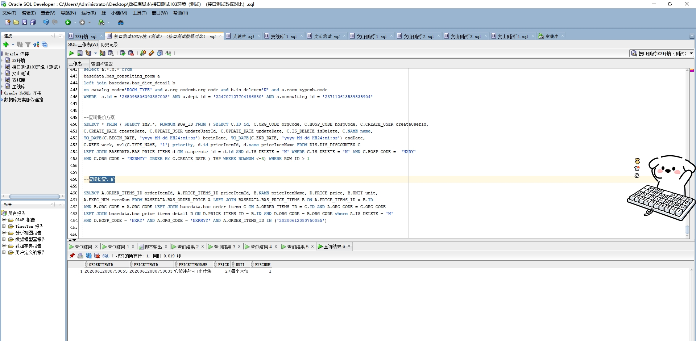

# 领域服务/基础领域 - 查询检查计价 - 查询检查计价 正向用例
## 请求参数：
``` json
{
  "hospCode": "NXRY",
  "pageIndex": 1,
  "orgCode": "NXRMYY",
  "orderItemIds": [
    "20200612080750055"
  ],
  "pageSize": 3
}
```
## 返回参数：
``` json
{
  "exception": null,
  "apiCode": null,
  "data": {
    "list": [
      {
        "checkTypeCode": null,
        "checkTypeName": null,
        "halfPriceItems": null,
        "hospCode": "NXRY",
        "isMerge": "N",
        "orderItemId": "20200612080750055",
        "orderItemName": "穴位注射-自血疗法",
        "orgCode": "NXRMYY",
        "price": 27,
        "priceItems": [
          {
            "execNum": 1,
            "orderItemId": "20200612080750055",
            "price": 27,
            "priceItemId": "20200612080750033",
            "priceItemName": "穴位注射-自血疗法",
            "unit": "每个穴位"
          }
        ]
      }
    ],
    "totalCount": 1,
    "pageSize": 3,
    "pageNo": 1,
    "pageCount": 1
  },
  "Code": 200,
  "Message": "操作成功"
}
```
## 数据校验：

# 领域服务/基础领域 - 查询检查计价 - 必填校验-[orgCode]为空
## 请求参数：
``` json
{
  "hospCode": "NXRY",
  "pageIndex": 1,
  "orgCode": "",
  "orderItemIds": [
    "20200612080750055"
  ],
  "pageSize": 3
}
```
## 返回参数：
``` json
{
  "exception": null,
  "apiCode": null,
  "data": null,
  "Code": 1,
  "Message": "医院编码不可为空"
}
```
# 领域服务/基础领域 - 查询检查计价 - 必填校验-[hospCode]为空
## 请求参数：
``` json
{
  "hospCode": "",
  "pageIndex": 1,
  "orgCode": "NXRMYY",
  "orderItemIds": [
    "20200612080750055"
  ],
  "pageSize": 3
}
```
## 返回参数：
``` json
{
  "exception": null,
  "apiCode": null,
  "data": null,
  "Code": 1,
  "Message": "院区编码不可为空"
}
```
# 领域服务/基础领域 - 查询检查计价 - 必填校验-[pageIndex]为空
## 请求参数：
``` json
{
  "hospCode": "NXRY",
  "pageIndex": null,
  "orgCode": "NXRMYY",
  "orderItemIds": [
    "20200612080750055"
  ],
  "pageSize": 3
}
```
## 返回参数：
``` json
{
  "exception": null,
  "apiCode": null,
  "data": null,
  "Code": 1,
  "Message": "系统内部异常"
}
```
# 领域服务/基础领域 - 查询检查计价 - 必填校验-[pageSize]为空
## 请求参数：
``` json
{
  "hospCode": "NXRY",
  "pageIndex": 1,
  "orgCode": "NXRMYY",
  "orderItemIds": [
    "20200612080750055"
  ],
  "pageSize": null
}
```
## 返回参数：
``` json
{
  "exception": null,
  "apiCode": null,
  "data": null,
  "Code": 1,
  "Message": "系统内部异常"
}
```
# 领域服务/基础领域 - 查询检查计价 - 类型校验-[pageSize]类型错误
## 请求参数：
``` json
{
  "hospCode": "NXRY",
  "pageIndex": 1,
  "orgCode": "NXRMYY",
  "orderItemIds": [
    "20200612080750055"
  ],
  "pageSize": "abc"
}
```
## 返回参数：
``` json
{
  "exception": null,
  "apiCode": null,
  "data": null,
  "Code": 1,
  "Message": "请求参数错误"
}
```
# 领域服务/基础领域 - 查询检查计价 - 类型校验-[pageIndex]类型错误
## 请求参数：
``` json
{
  "hospCode": "NXRY",
  "pageIndex": "abc",
  "orgCode": "NXRMYY",
  "orderItemIds": [
    "20200612080750055"
  ],
  "pageSize": 3
}
```
## 返回参数：
``` json
{
  "exception": null,
  "apiCode": null,
  "data": null,
  "Code": 1,
  "Message": "请求参数错误"
}
```
# 领域服务/基础领域 - 查询检查计价 - 依赖用例-[orgCode]赋值为依赖用例测试值
## 请求参数：
``` json
{
  "hospCode": "NXRY",
  "pageIndex": 1,
  "orgCode": "依赖用例测试值",
  "orderItemIds": [
    "20200612080750055"
  ],
  "pageSize": 3
}
```
## 返回参数：
``` json
{
  "exception": null,
  "apiCode": null,
  "data": {
    "list": [],
    "totalCount": 0,
    "pageSize": 3,
    "pageNo": 1,
    "pageCount": 0
  },
  "Code": 200,
  "Message": "操作成功"
}
```
# 领域服务/基础领域 - 查询检查计价 - 依赖用例-[hospCode]赋值为依赖用例测试值
## 请求参数：
``` json
{
  "hospCode": "依赖用例测试值",
  "pageIndex": 1,
  "orgCode": "NXRMYY",
  "orderItemIds": [
    "20200612080750055"
  ],
  "pageSize": 3
}
```
## 返回参数：
``` json
{
  "exception": null,
  "apiCode": null,
  "data": null,
  "Code": 1,
  "Message": "系统内部异常"
}
```