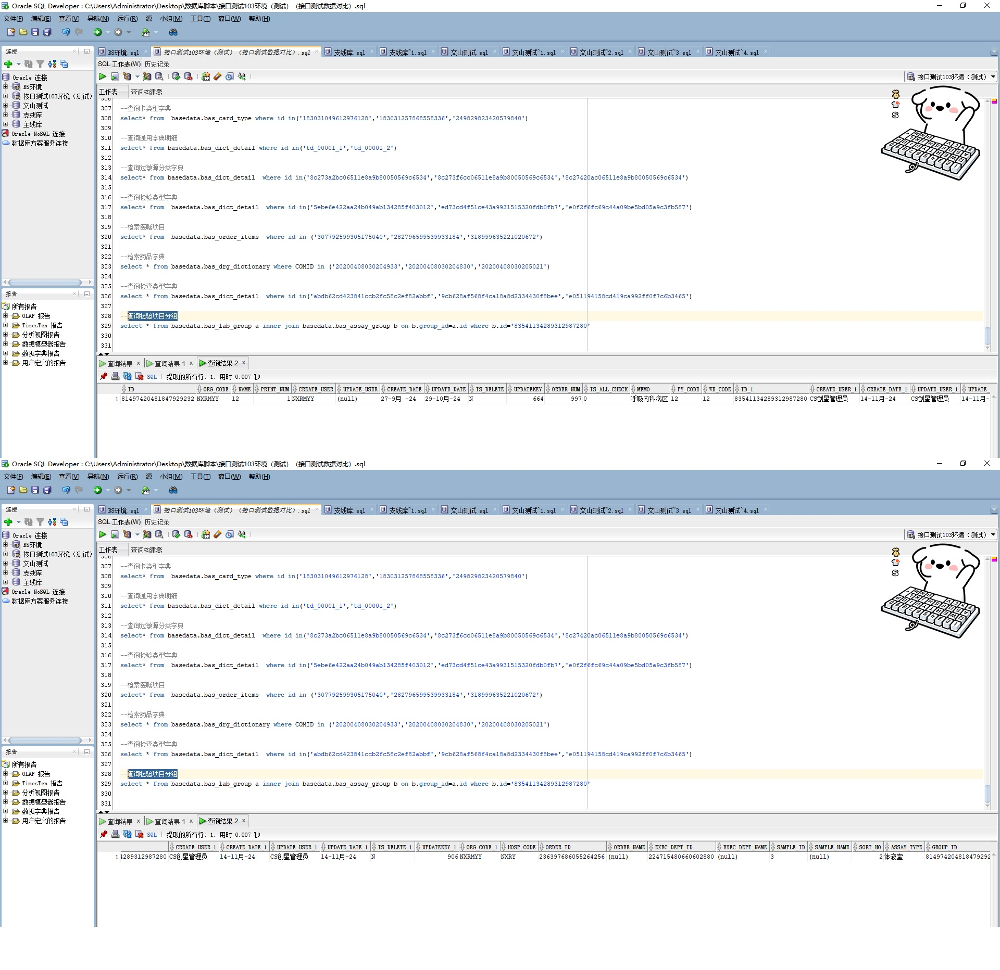

# 领域服务/基础领域 - 查询检验项目分组 - 查询检验项目分组 正向用例
## 请求参数：
``` json
{
  "pageIndex": 1,
  "orgCode": "NXRMYY",
  "isDelete": "N",
  "testTypeCodes": [
    "4"
  ],
  "pageSize": 3,
  "status": "1",
  "execDeptIds": []
}
```
## 返回参数：
``` json
{
  "exception": null,
  "apiCode": null,
  "data": {
    "list": [
      {
        "id": "83541134289312987280",
        "orgCode": "NXRMYY",
        "hospCode": "NXRY",
        "createDate": "2024-11-14 11:44:10",
        "updateDate": "2024-11-14 11:44:10",
        "isDelete": "N",
        "execDeptId": "224715480660602880",
        "execDeptName": null,
        "groupId": "81497420481847929232",
        "groupName": "12",
        "orderPirce": 144,
        "sampleName": null,
        "sortNo": 2,
        "orderItemId": "236397686055264256",
        "orderItemName": null,
        "createUserId": "CS创星管理员",
        "updateUserId": "CS创星管理员",
        "sampleCode": "3"
      }
    ],
    "totalCount": 1,
    "pageSize": 3,
    "pageNo": 1,
    "pageCount": 1
  },
  "Code": 200,
  "Message": "操作成功"
}
```
## 数据校验：

# 领域服务/基础领域 - 查询检验项目分组 - 必填校验-[orgCode]为空
## 请求参数：
``` json
{
  "pageIndex": 1,
  "orgCode": "",
  "isDelete": "N",
  "testTypeCodes": [
    "4"
  ],
  "pageSize": 3,
  "status": "1",
  "execDeptIds": []
}
```
## 返回参数：
``` json
{
  "exception": null,
  "apiCode": null,
  "data": null,
  "Code": 1,
  "Message": "医院编码不能为空"
}
```
# 领域服务/基础领域 - 查询检验项目分组 - 必填校验-[pageIndex]为空
## 请求参数：
``` json
{
  "pageIndex": null,
  "orgCode": "NXRMYY",
  "isDelete": "N",
  "testTypeCodes": [
    "4"
  ],
  "pageSize": 3,
  "status": "1",
  "execDeptIds": []
}
```
## 返回参数：
``` json
{
  "exception": null,
  "apiCode": null,
  "data": null,
  "Code": 1,
  "Message": "系统内部异常"
}
```
# 领域服务/基础领域 - 查询检验项目分组 - 必填校验-[pageSize]为空
## 请求参数：
``` json
{
  "pageIndex": 1,
  "orgCode": "NXRMYY",
  "isDelete": "N",
  "testTypeCodes": [
    "4"
  ],
  "pageSize": null,
  "status": "1",
  "execDeptIds": []
}
```
## 返回参数：
``` json
{
  "exception": null,
  "apiCode": null,
  "data": null,
  "Code": 1,
  "Message": "系统内部异常"
}
```
# 领域服务/基础领域 - 查询检验项目分组 - 必填校验-[isDelete]为空
## 请求参数：
``` json
{
  "pageIndex": 1,
  "orgCode": "NXRMYY",
  "isDelete": "",
  "testTypeCodes": [
    "4"
  ],
  "pageSize": 3,
  "status": "1",
  "execDeptIds": []
}
```
## 返回参数：
``` json
{
  "exception": null,
  "apiCode": null,
  "data": null,
  "Code": 1,
  "Message": "删除标志不能为空"
}
```
# 领域服务/基础领域 - 查询检验项目分组 - 类型校验-[pageSize]类型错误
## 请求参数：
``` json
{
  "pageIndex": 1,
  "orgCode": "NXRMYY",
  "isDelete": "N",
  "testTypeCodes": [
    "4"
  ],
  "pageSize": "abc",
  "status": "1",
  "execDeptIds": []
}
```
## 返回参数：
``` json
{
  "exception": null,
  "apiCode": null,
  "data": null,
  "Code": 1,
  "Message": "请求参数错误"
}
```
# 领域服务/基础领域 - 查询检验项目分组 - 类型校验-[pageIndex]类型错误
## 请求参数：
``` json
{
  "pageIndex": "abc",
  "orgCode": "NXRMYY",
  "isDelete": "N",
  "testTypeCodes": [
    "4"
  ],
  "pageSize": 3,
  "status": "1",
  "execDeptIds": []
}
```
## 返回参数：
``` json
{
  "exception": null,
  "apiCode": null,
  "data": null,
  "Code": 1,
  "Message": "请求参数错误"
}
```
# 领域服务/基础领域 - 查询检验项目分组 - 枚举用例-[isDelete] 枚举值为 N(删除标志为否)
## 请求参数：
``` json
{
  "pageIndex": 1,
  "orgCode": "NXRMYY",
  "isDelete": "N",
  "testTypeCodes": [
    "4"
  ],
  "pageSize": 3,
  "status": "1",
  "execDeptIds": []
}
```
## 返回参数：
``` json
{
  "exception": null,
  "apiCode": null,
  "data": {
    "list": [
      {
        "id": "83541134289312987280",
        "orgCode": "NXRMYY",
        "hospCode": "NXRY",
        "createDate": "2024-11-14 11:44:10",
        "updateDate": "2024-11-14 11:44:10",
        "isDelete": "N",
        "execDeptId": "224715480660602880",
        "execDeptName": null,
        "groupId": "81497420481847929232",
        "groupName": "12",
        "orderPirce": 144,
        "sampleName": null,
        "sortNo": 2,
        "orderItemId": "236397686055264256",
        "orderItemName": null,
        "createUserId": "CS创星管理员",
        "updateUserId": "CS创星管理员",
        "sampleCode": "3"
      }
    ],
    "totalCount": 1,
    "pageSize": 3,
    "pageNo": 1,
    "pageCount": 1
  },
  "Code": 200,
  "Message": "操作成功"
}
```
# 领域服务/基础领域 - 查询检验项目分组 - 枚举用例-[isDelete] 枚举值为 Y(删除标志为是)
## 请求参数：
``` json
{
  "pageIndex": 1,
  "orgCode": "NXRMYY",
  "isDelete": "Y",
  "testTypeCodes": [
    "4"
  ],
  "pageSize": 3,
  "status": "1",
  "execDeptIds": []
}
```
## 返回参数：
``` json
{
  "exception": null,
  "apiCode": null,
  "data": {
    "list": [],
    "totalCount": 0,
    "pageSize": 3,
    "pageNo": 1,
    "pageCount": 0
  },
  "Code": 200,
  "Message": "操作成功"
}
```
# 领域服务/基础领域 - 查询检验项目分组 - 依赖用例-[orgCode]赋值为依赖用例测试值
## 请求参数：
``` json
{
  "pageIndex": 1,
  "orgCode": "依赖用例测试值",
  "isDelete": "N",
  "testTypeCodes": [
    "4"
  ],
  "pageSize": 3,
  "status": "1",
  "execDeptIds": []
}
```
## 返回参数：
``` json
{
  "exception": null,
  "apiCode": null,
  "data": {
    "list": [],
    "totalCount": 0,
    "pageSize": 3,
    "pageNo": 1,
    "pageCount": 0
  },
  "Code": 200,
  "Message": "操作成功"
}
```