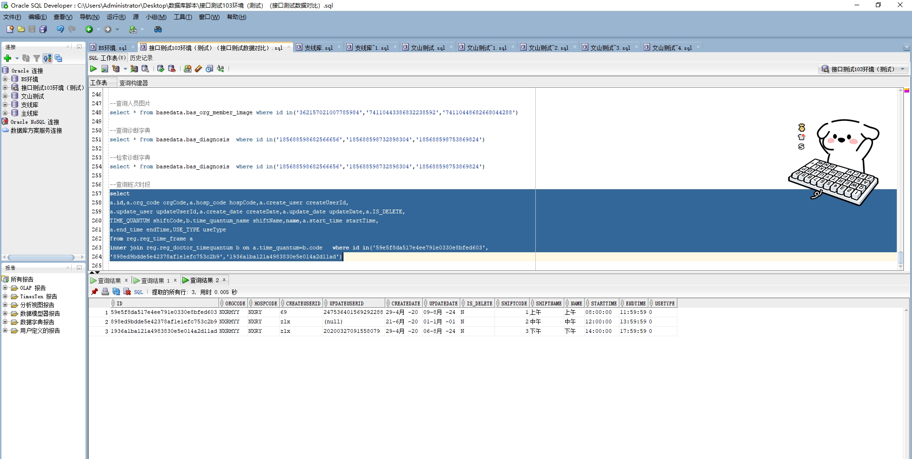

# 领域服务/基础领域 - 查询班次时段 - 查询班次时段 正向用例
## 请求参数：
``` json
{
  "hospCode": "NXRY",
  "pageIndex": 1,
  "orgCode": "NXRMYY",
  "pageSize": 3,
  "useType": 0
}
```
## 返回参数：
``` json
{
  "exception": null,
  "apiCode": null,
  "data": {
    "list": [
      {
        "createDate": "2020-04-29 09:46:21",
        "createUserId": "69",
        "endTime": "11:59:59",
        "hospCode": "NXRY",
        "id": "59e5f8da517e4ee791e0330e8bfed603",
        "isDelete": "N",
        "name": "上午",
        "orgCode": "NXRMYY",
        "shiftCode": "1",
        "shiftName": "上午",
        "startTime": "08:00:00",
        "updateDate": "2024-08-09 15:28:24",
        "updateUserId": "247536401569292288",
        "useType": 0
      },
      {
        "createDate": "2020-06-21 14:22:41",
        "createUserId": "zlx",
        "endTime": "13:59:59",
        "hospCode": "NXRY",
        "id": "898ed9bdde5e42378af1e1efc753c2b9",
        "isDelete": "N",
        "name": "中午",
        "orgCode": "NXRMYY",
        "shiftCode": "2",
        "shiftName": "中午",
        "startTime": "12:00:00",
        "updateDate": "0001-01-01 00:00:00",
        "updateUserId": null,
        "useType": 0
      },
      {
        "createDate": "2020-04-29 15:26:47",
        "createUserId": "zlx",
        "endTime": "17:59:59",
        "hospCode": "NXRY",
        "id": "1936a1ba121a4983830e5e014a2d11ad",
        "isDelete": "N",
        "name": "下午",
        "orgCode": "NXRMYY",
        "shiftCode": "3",
        "shiftName": "下午",
        "startTime": "14:00:00",
        "updateDate": "2024-08-06 10:08:48",
        "updateUserId": "20200327091558079",
        "useType": 0
      }
    ],
    "totalCount": 4,
    "pageSize": 3,
    "pageNo": 1,
    "pageCount": 2
  },
  "Code": 200,
  "Message": "操作成功"
}
```
## 数据校验：

# 领域服务/基础领域 - 查询班次时段 - 必填校验-[orgCode]为空
## 请求参数：
``` json
{
  "hospCode": "NXRY",
  "pageIndex": 1,
  "orgCode": "",
  "pageSize": 3,
  "useType": 0
}
```
## 返回参数：
``` json
{
  "exception": null,
  "apiCode": null,
  "data": null,
  "Code": 1,
  "Message": "机构编码不可为空"
}
```
# 领域服务/基础领域 - 查询班次时段 - 必填校验-[pageIndex]为空
## 请求参数：
``` json
{
  "hospCode": "NXRY",
  "pageIndex": null,
  "orgCode": "NXRMYY",
  "pageSize": 3,
  "useType": 0
}
```
## 返回参数：
``` json
{
  "exception": null,
  "apiCode": null,
  "data": null,
  "Code": 1,
  "Message": "系统内部异常"
}
```
# 领域服务/基础领域 - 查询班次时段 - 必填校验-[pageSize]为空
## 请求参数：
``` json
{
  "hospCode": "NXRY",
  "pageIndex": 1,
  "orgCode": "NXRMYY",
  "pageSize": null,
  "useType": 0
}
```
## 返回参数：
``` json
{
  "exception": null,
  "apiCode": null,
  "data": null,
  "Code": 1,
  "Message": "系统内部异常"
}
```
# 领域服务/基础领域 - 查询班次时段 - 类型校验-[pageSize]类型错误
## 请求参数：
``` json
{
  "hospCode": "NXRY",
  "pageIndex": 1,
  "orgCode": "NXRMYY",
  "pageSize": "abc",
  "useType": 0
}
```
## 返回参数：
``` json
{
  "exception": null,
  "apiCode": null,
  "data": null,
  "Code": 1,
  "Message": "请求参数错误"
}
```
# 领域服务/基础领域 - 查询班次时段 - 类型校验-[pageIndex]类型错误
## 请求参数：
``` json
{
  "hospCode": "NXRY",
  "pageIndex": "abc",
  "orgCode": "NXRMYY",
  "pageSize": 3,
  "useType": 0
}
```
## 返回参数：
``` json
{
  "exception": null,
  "apiCode": null,
  "data": null,
  "Code": 1,
  "Message": "请求参数错误"
}
```
# 领域服务/基础领域 - 查询班次时段 - 依赖用例-[orgCode]赋值为依赖用例测试值
## 请求参数：
``` json
{
  "hospCode": "NXRY",
  "pageIndex": 1,
  "orgCode": "依赖用例测试值",
  "pageSize": 3,
  "useType": 0
}
```
## 返回参数：
``` json
{
  "exception": null,
  "apiCode": null,
  "data": {
    "list": [],
    "totalCount": 0,
    "pageSize": 3,
    "pageNo": 1,
    "pageCount": 0
  },
  "Code": 200,
  "Message": "操作成功"
}
```