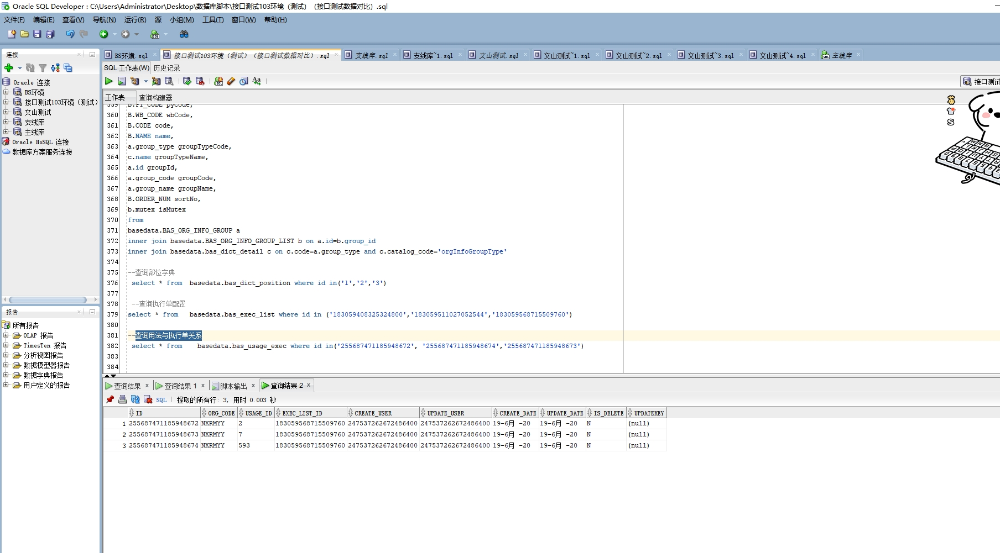

# 领域服务/基础领域 - 查询用法与执行单关系 - 查询用法与执行单关系 正向用例
## 请求参数：
``` json
{
  "hospCode": "NXRY",
  "orgCode": "NXRMYY",
  "pageSize": 3,
  "pageIndex": 1
}
```
## 返回参数：
``` json
{
  "exception": null,
  "apiCode": null,
  "data": {
    "list": [
      {
        "id": "255687471185948672",
        "orgCode": "NXRMYY",
        "hospCode": null,
        "createDate": "2020-06-19 21:30:43",
        "updateDate": "2020-06-19 21:30:43",
        "isDelete": "N",
        "usageId": "2",
        "execListId": "183059568715509760",
        "usageCode": "01",
        "usageName": "肌注",
        "execListCode": "注射单",
        "execListName": "注射单",
        "createUserId": "247537262672486400",
        "updateUserId": "247537262672486400",
        "updatekey": null
      },
      {
        "id": "255687471185948674",
        "orgCode": "NXRMYY",
        "hospCode": null,
        "createDate": "2020-06-19 21:30:43",
        "updateDate": "2020-06-19 21:30:43",
        "isDelete": "N",
        "usageId": "593",
        "execListId": "183059568715509760",
        "usageCode": "88",
        "usageName": "球内注射",
        "execListCode": "注射单",
        "execListName": "注射单",
        "createUserId": "247537262672486400",
        "updateUserId": "247537262672486400",
        "updatekey": null
      },
      {
        "id": "255687471185948673",
        "orgCode": "NXRMYY",
        "hospCode": null,
        "createDate": "2020-06-19 21:30:43",
        "updateDate": "2020-06-19 21:30:43",
        "isDelete": "N",
        "usageId": "7",
        "execListId": "183059568715509760",
        "usageCode": "05",
        "usageName": "静推",
        "execListCode": "注射单",
        "execListName": "注射单",
        "createUserId": "247537262672486400",
        "updateUserId": "247537262672486400",
        "updatekey": null
      }
    ],
    "totalCount": 267,
    "pageSize": 3,
    "pageNo": 1,
    "pageCount": 89
  },
  "Code": 200,
  "Message": "操作成功"
}
```
## 数据校验：

# 领域服务/基础领域 - 查询用法与执行单关系 - 必填校验-[orgCode]为空
## 请求参数：
``` json
{
  "hospCode": "NXRY",
  "orgCode": "",
  "pageSize": 3,
  "pageIndex": 1
}
```
## 返回参数：
``` json
{
  "exception": null,
  "apiCode": null,
  "data": null,
  "Code": 1,
  "Message": "医院编码不能为空"
}
```
# 领域服务/基础领域 - 查询用法与执行单关系 - 必填校验-[pageIndex]为空
## 请求参数：
``` json
{
  "hospCode": "NXRY",
  "orgCode": "NXRMYY",
  "pageSize": 3,
  "pageIndex": null
}
```
## 返回参数：
``` json
{
  "exception": null,
  "apiCode": null,
  "data": null,
  "Code": 1,
  "Message": "系统内部异常"
}
```
# 领域服务/基础领域 - 查询用法与执行单关系 - 必填校验-[pageSize]为空
## 请求参数：
``` json
{
  "hospCode": "NXRY",
  "orgCode": "NXRMYY",
  "pageSize": null,
  "pageIndex": 1
}
```
## 返回参数：
``` json
{
  "exception": null,
  "apiCode": null,
  "data": null,
  "Code": 1,
  "Message": "系统内部异常"
}
```
# 领域服务/基础领域 - 查询用法与执行单关系 - 类型校验-[pageIndex]类型错误
## 请求参数：
``` json
{
  "hospCode": "NXRY",
  "orgCode": "NXRMYY",
  "pageSize": 3,
  "pageIndex": "abc"
}
```
## 返回参数：
``` json
{
  "exception": null,
  "apiCode": null,
  "data": null,
  "Code": 1,
  "Message": "请求参数错误"
}
```
# 领域服务/基础领域 - 查询用法与执行单关系 - 类型校验-[pageSize]类型错误
## 请求参数：
``` json
{
  "hospCode": "NXRY",
  "orgCode": "NXRMYY",
  "pageSize": "abc",
  "pageIndex": 1
}
```
## 返回参数：
``` json
{
  "exception": null,
  "apiCode": null,
  "data": null,
  "Code": 1,
  "Message": "请求参数错误"
}
```
# 领域服务/基础领域 - 查询用法与执行单关系 - 依赖用例-[orgCode]赋值为依赖用例测试值
## 请求参数：
``` json
{
  "hospCode": "NXRY",
  "orgCode": "依赖用例测试值",
  "pageSize": 3,
  "pageIndex": 1
}
```
## 返回参数：
``` json
{
  "exception": null,
  "apiCode": null,
  "data": {
    "list": [],
    "totalCount": 0,
    "pageSize": 3,
    "pageNo": 1,
    "pageCount": 0
  },
  "Code": 200,
  "Message": "操作成功"
}
```