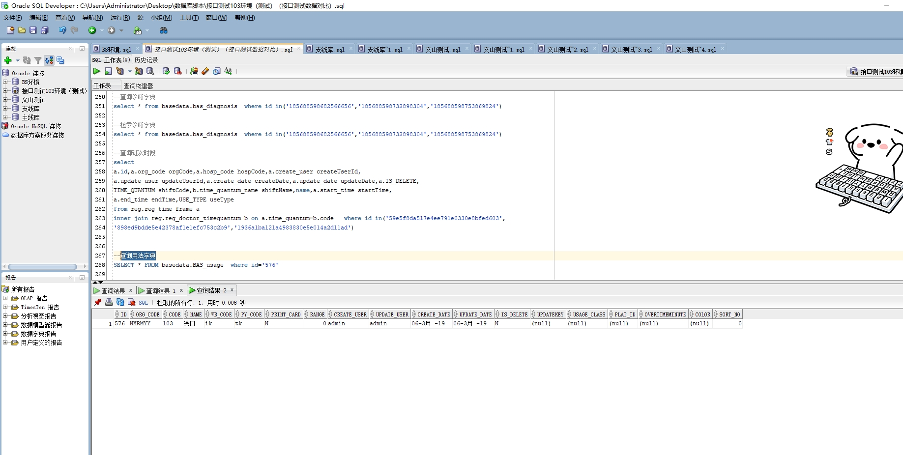

# 领域服务/基础领域 - 查询用法字典 - 查询用法字典 正向用例
## 请求参数：
``` json
{
  "isDelete": "N",
  "pageSize": 3,
  "range": 0,
  "pageIndex": 1,
  "orgCode": "NXRMYY",
  "keyword": "tk"
}
```
## 返回参数：
``` json
{
  "exception": null,
  "apiCode": null,
  "data": {
    "list": [
      {
        "code": "103",
        "color": null,
        "createDate": "2019-03-06 13:48:51",
        "createUserId": "admin",
        "id": "576",
        "isDelete": "N",
        "name": "涂口",
        "orgCode": "NXRMYY",
        "overTimeMinute": null,
        "printCard": "N",
        "pyCode": "tk",
        "range": 0,
        "sortNo": 0,
        "updateDate": "2019-03-06 13:48:51",
        "updateUserId": "admin",
        "usageClass": null,
        "usageClassName": null,
        "wbCode": "ik"
      }
    ],
    "totalCount": 1,
    "pageSize": 1,
    "pageNo": 3,
    "pageCount": 1
  },
  "Code": 200,
  "Message": "操作成功"
}
```
## 数据校验：

# 领域服务/基础领域 - 查询用法字典 - 必填校验-[orgCode]为空
## 请求参数：
``` json
{
  "isDelete": "N",
  "pageSize": 3,
  "range": 0,
  "pageIndex": 1,
  "orgCode": "",
  "keyword": "tk"
}
```
## 返回参数：
``` json
{
  "exception": null,
  "apiCode": null,
  "data": null,
  "Code": 1,
  "Message": "医院编码不可为空"
}
```
# 领域服务/基础领域 - 查询用法字典 - 必填校验-[pageIndex]为空
## 请求参数：
``` json
{
  "isDelete": "N",
  "pageSize": 3,
  "range": 0,
  "pageIndex": null,
  "orgCode": "NXRMYY",
  "keyword": "tk"
}
```
## 返回参数：
``` json
{
  "exception": null,
  "apiCode": null,
  "data": null,
  "Code": 1,
  "Message": "系统内部异常"
}
```
# 领域服务/基础领域 - 查询用法字典 - 必填校验-[pageSize]为空
## 请求参数：
``` json
{
  "isDelete": "N",
  "pageSize": null,
  "range": 0,
  "pageIndex": 1,
  "orgCode": "NXRMYY",
  "keyword": "tk"
}
```
## 返回参数：
``` json
{
  "exception": null,
  "apiCode": null,
  "data": null,
  "Code": 1,
  "Message": "系统内部异常"
}
```
# 领域服务/基础领域 - 查询用法字典 - 必填校验-[range]为空
## 请求参数：
``` json
{
  "isDelete": "N",
  "pageSize": 3,
  "range": null,
  "pageIndex": 1,
  "orgCode": "NXRMYY",
  "keyword": "tk"
}
```
## 返回参数：
``` json
{
  "exception": null,
  "apiCode": null,
  "data": null,
  "Code": 1,
  "Message": "应用范围不可为空"
}
```
# 领域服务/基础领域 - 查询用法字典 - 类型校验-[pageIndex]类型错误
## 请求参数：
``` json
{
  "isDelete": "N",
  "pageSize": 3,
  "range": 0,
  "pageIndex": "abc",
  "orgCode": "NXRMYY",
  "keyword": "tk"
}
```
## 返回参数：
``` json
{
  "exception": null,
  "apiCode": null,
  "data": null,
  "Code": 1,
  "Message": "请求参数错误"
}
```
# 领域服务/基础领域 - 查询用法字典 - 类型校验-[range]类型错误
## 请求参数：
``` json
{
  "isDelete": "N",
  "pageSize": 3,
  "range": "abc",
  "pageIndex": 1,
  "orgCode": "NXRMYY",
  "keyword": "tk"
}
```
## 返回参数：
``` json
{
  "exception": null,
  "apiCode": null,
  "data": null,
  "Code": 1,
  "Message": "请求参数错误"
}
```
# 领域服务/基础领域 - 查询用法字典 - 类型校验-[pageSize]类型错误
## 请求参数：
``` json
{
  "isDelete": "N",
  "pageSize": "abc",
  "range": 0,
  "pageIndex": 1,
  "orgCode": "NXRMYY",
  "keyword": "tk"
}
```
## 返回参数：
``` json
{
  "exception": null,
  "apiCode": null,
  "data": null,
  "Code": 1,
  "Message": "请求参数错误"
}
```
# 领域服务/基础领域 - 查询用法字典 - 枚举用例-[range] 枚举值为 0(应用范围为全院)
## 请求参数：
``` json
{
  "isDelete": "N",
  "pageSize": 3,
  "range": 0,
  "pageIndex": 1,
  "orgCode": "NXRMYY",
  "keyword": "tk"
}
```
## 返回参数：
``` json
{
  "exception": null,
  "apiCode": null,
  "data": {
    "list": [
      {
        "code": "103",
        "color": null,
        "createDate": "2019-03-06 13:48:51",
        "createUserId": "admin",
        "id": "576",
        "isDelete": "N",
        "name": "涂口",
        "orgCode": "NXRMYY",
        "overTimeMinute": null,
        "printCard": "N",
        "pyCode": "tk",
        "range": 0,
        "sortNo": 0,
        "updateDate": "2019-03-06 13:48:51",
        "updateUserId": "admin",
        "usageClass": null,
        "usageClassName": null,
        "wbCode": "ik"
      }
    ],
    "totalCount": 1,
    "pageSize": 1,
    "pageNo": 3,
    "pageCount": 1
  },
  "Code": 200,
  "Message": "操作成功"
}
```
# 领域服务/基础领域 - 查询用法字典 - 枚举用例-[range] 枚举值为 1(应用范围为门诊)
## 请求参数：
``` json
{
  "isDelete": "N",
  "pageSize": 3,
  "range": 1,
  "pageIndex": 1,
  "orgCode": "NXRMYY",
  "keyword": "tk"
}
```
## 返回参数：
``` json
{
  "exception": null,
  "apiCode": null,
  "data": {
    "list": [
      {
        "code": "103",
        "color": null,
        "createDate": "2019-03-06 13:48:51",
        "createUserId": "admin",
        "id": "576",
        "isDelete": "N",
        "name": "涂口",
        "orgCode": "NXRMYY",
        "overTimeMinute": null,
        "printCard": "N",
        "pyCode": "tk",
        "range": 0,
        "sortNo": 0,
        "updateDate": "2019-03-06 13:48:51",
        "updateUserId": "admin",
        "usageClass": null,
        "usageClassName": null,
        "wbCode": "ik"
      }
    ],
    "totalCount": 1,
    "pageSize": 1,
    "pageNo": 3,
    "pageCount": 1
  },
  "Code": 200,
  "Message": "操作成功"
}
```
# 领域服务/基础领域 - 查询用法字典 - 枚举用例-[range] 枚举值为 2(应用范围为住院)
## 请求参数：
``` json
{
  "isDelete": "N",
  "pageSize": 3,
  "range": 2,
  "pageIndex": 1,
  "orgCode": "NXRMYY",
  "keyword": "tk"
}
```
## 返回参数：
``` json
{
  "exception": null,
  "apiCode": null,
  "data": {
    "list": [
      {
        "code": "103",
        "color": null,
        "createDate": "2019-03-06 13:48:51",
        "createUserId": "admin",
        "id": "576",
        "isDelete": "N",
        "name": "涂口",
        "orgCode": "NXRMYY",
        "overTimeMinute": null,
        "printCard": "N",
        "pyCode": "tk",
        "range": 0,
        "sortNo": 0,
        "updateDate": "2019-03-06 13:48:51",
        "updateUserId": "admin",
        "usageClass": null,
        "usageClassName": null,
        "wbCode": "ik"
      }
    ],
    "totalCount": 1,
    "pageSize": 1,
    "pageNo": 3,
    "pageCount": 1
  },
  "Code": 200,
  "Message": "操作成功"
}
```
# 领域服务/基础领域 - 查询用法字典 - 依赖用例-[orgCode]赋值为依赖用例测试值
## 请求参数：
``` json
{
  "isDelete": "N",
  "pageSize": 3,
  "range": 0,
  "pageIndex": 1,
  "orgCode": "依赖用例测试值",
  "keyword": "tk"
}
```
## 返回参数：
``` json
{
  "exception": null,
  "apiCode": null,
  "data": {
    "list": [],
    "totalCount": 0,
    "pageSize": 1,
    "pageNo": 3,
    "pageCount": 0
  },
  "Code": 200,
  "Message": "操作成功"
}
```