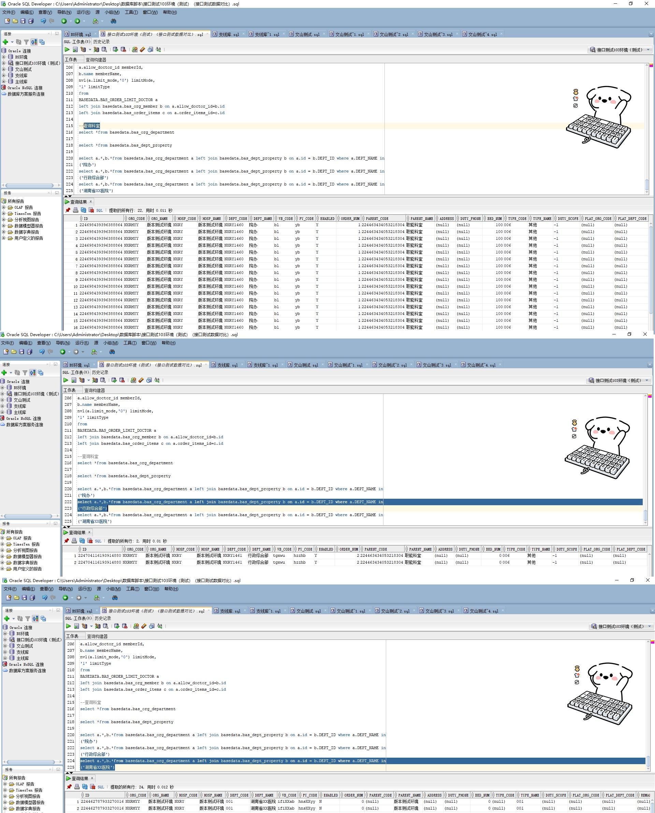

# 领域服务/基础领域 - 查询科室字典 - 查询科室字典 正向用例
## 请求参数：
``` json
{
  "hospCode": "NXRY",
  "pageIndex": 1,
  "orgCode": "NXRMYY",
  "pageSize": 3
}
```
## 返回参数：
``` json
{
  "exception": null,
  "apiCode": null,
  "data": {
    "list": [
      {
        "address": null,
        "bedNum": 0,
        "belongWardId": null,
        "belongWardName": null,
        "createDate": "2020-03-25 17:34:58",
        "createUserId": "系统管理员",
        "deptCode": "001",
        "drugTypeA": null,
        "drugTypeB": null,
        "dutyPhone": null,
        "dutyScope": null,
        "enabled": "N",
        "headDeptId": null,
        "headDeptName": null,
        "headNurseId": null,
        "headNurseName": null,
        "hospCode": "NXRY",
        "hospName": "版本测试环境",
        "id": "224462787933270016",
        "introduce": null,
        "isAccount": "0",
        "isAnesthesia": "0",
        "isAutoConfirmaFee": "0",
        "isCheckLevel2": "0",
        "isClinic": "0",
        "isConsulation": "0",
        "isCriticalValue": "0",
        "isDelete": "N",
        "isDelivery": "0",
        "isDrug": "0",
        "isDrugStateFlag": "0",
        "isDrugStoreRoom": "0",
        "isEmergency": "0",
        "isFact": 0,
        "isFunction": "0",
        "isGetMedication": "0",
        "isInPat": "0",
        "isLaboratoryLevel2": "0",
        "isLogistics": "0",
        "isMaterStore": "0",
        "isMaterZeroStore": "0",
        "isMedicalTechConfirmFee": "0",
        "isMedicalTechnology": "0",
        "isOperation": "0",
        "isOutPat": "0",
        "isSmallDrugRoom": "0",
        "isSpecialTreatment": "0",
        "isVillageInvoic": "0",
        "isWard": "0",
        "layer": 0,
        "leaderId": null,
        "leaderName": null,
        "materStoreName": null,
        "name": "湖南省XX医院",
        "nsDeptCode": null,
        "nuCode": null,
        "orderNum": 0,
        "orgCode": "NXRMYY",
        "orgName": "版本测试环境",
        "parentCode": null,
        "parentName": "版本测试环境",
        "platDeptCode": null,
        "platId": null,
        "platOrgCode": null,
        "property": null,
        "pyCode": "hnsXXyy",
        "remark": null,
        "simpDeptName": null,
        "source": "1",
        "subject": null,
        "subjectCode": null,
        "subjectOrder": "0",
        "typeCode": null,
        "typeName": "001",
        "updateDate": "2024-11-01 08:51:42",
        "updateUserId": null,
        "wardId": null,
        "wardName": null,
        "wbCode": "ifiXXab"
      },
      {
        "address": null,
        "bedNum": 100,
        "belongWardId": null,
        "belongWardName": null,
        "createDate": "2020-03-26 09:11:22",
        "createUserId": "admin",
        "deptCode": "NXRY1460",
        "drugTypeA": null,
        "drugTypeB": null,
        "dutyPhone": null,
        "dutyScope": "-1",
        "enabled": "Y",
        "headDeptId": null,
        "headDeptName": null,
        "headNurseId": null,
        "headNurseName": null,
        "hospCode": "NXRY",
        "hospName": "版本测试环境",
        "id": "224698439396388864",
        "introduce": null,
        "isAccount": "0",
        "isAnesthesia": "0",
        "isAutoConfirmaFee": "0",
        "isCheckLevel2": "0",
        "isClinic": "0",
        "isConsulation": "0",
        "isCriticalValue": "0",
        "isDelete": "N",
        "isDelivery": "0",
        "isDrug": "0",
        "isDrugStateFlag": "0",
        "isDrugStoreRoom": "0",
        "isEmergency": "0",
        "isFact": 1,
        "isFunction": "0",
        "isGetMedication": "0",
        "isInPat": "0",
        "isLaboratoryLevel2": "0",
        "isLogistics": "0",
        "isMaterStore": "0",
        "isMaterZeroStore": "0",
        "isMedicalTechConfirmFee": "0",
        "isMedicalTechnology": "0",
        "isOperation": "0",
        "isOutPat": "0",
        "isSmallDrugRoom": "0",
        "isSpecialTreatment": "0",
        "isVillageInvoic": "0",
        "isWard": "0",
        "layer": 3,
        "leaderId": null,
        "leaderName": null,
        "materStoreName": null,
        "name": "院办",
        "nsDeptCode": null,
        "nuCode": "1460",
        "orderNum": 1,
        "orgCode": "NXRMYY",
        "orgName": "版本测试环境",
        "parentCode": "224463434053218304",
        "parentName": "职能科室",
        "platDeptCode": null,
        "platId": null,
        "platOrgCode": null,
        "property": null,
        "pyCode": "yb",
        "remark": null,
        "simpDeptName": "院办",
        "source": "1",
        "subject": "其他业务科室",
        "subjectCode": "A69",
        "subjectOrder": "0",
        "typeCode": "006",
        "typeName": "其他",
        "updateDate": "2024-03-12 16:01:43",
        "updateUserId": "CS创星管理员",
        "wardId": null,
        "wardName": null,
        "wbCode": "bl"
      },
      {
        "address": null,
        "bedNum": 0,
        "belongWardId": "81974206667908172288",
        "belongWardName": "修改病区TUVG",
        "createDate": "2020-03-26 09:33:56",
        "createUserId": "224699170585210880",
        "deptCode": "NXRY1461",
        "drugTypeA": null,
        "drugTypeB": null,
        "dutyPhone": null,
        "dutyScope": "-1",
        "enabled": "Y",
        "headDeptId": null,
        "headDeptName": null,
        "headNurseId": null,
        "headNurseName": null,
        "hospCode": "NXRY",
        "hospName": "版本测试环境",
        "id": "224704116193914880",
        "introduce": null,
        "isAccount": "0",
        "isAnesthesia": "0",
        "isAutoConfirmaFee": "0",
        "isCheckLevel2": "0",
        "isClinic": "0",
        "isConsulation": "0",
        "isCriticalValue": "0",
        "isDelete": "N",
        "isDelivery": "0",
        "isDrug": "0",
        "isDrugStateFlag": "0",
        "isDrugStoreRoom": "0",
        "isEmergency": "0",
        "isFact": 1,
        "isFunction": "0",
        "isGetMedication": "0",
        "isInPat": "0",
        "isLaboratoryLevel2": "0",
        "isLogistics": "0",
        "isMaterStore": "0",
        "isMaterZeroStore": "0",
        "isMedicalTechConfirmFee": "0",
        "isMedicalTechnology": "0",
        "isOperation": "0",
        "isOutPat": "0",
        "isSmallDrugRoom": "0",
        "isSpecialTreatment": "0",
        "isVillageInvoic": "0",
        "isWard": "1",
        "layer": 3,
        "leaderId": null,
        "leaderName": null,
        "materStoreName": null,
        "name": "行政综合部",
        "nsDeptCode": null,
        "nuCode": "1461",
        "orderNum": 2,
        "orgCode": "NXRMYY",
        "orgName": "版本测试环境",
        "parentCode": "224463434053218304",
        "parentName": "职能科室",
        "platDeptCode": null,
        "platId": null,
        "platOrgCode": null,
        "property": null,
        "pyCode": "hzzhb",
        "remark": null,
        "simpDeptName": "行政综合部",
        "source": "1",
        "subject": null,
        "subjectCode": null,
        "subjectOrder": "0",
        "typeCode": "006",
        "typeName": "其他",
        "updateDate": "2023-07-08 10:50:07",
        "updateUserId": "247536401569292288",
        "wardId": "81974206667908172288",
        "wardName": "修改病区TUVG",
        "wbCode": "tgxwu"
      }
    ],
    "totalCount": 218,
    "pageSize": 1,
    "pageNo": 3,
    "pageCount": 73
  },
  "Code": 200,
  "Message": "操作成功"
}
```
## 数据校验：

# 领域服务/基础领域 - 查询科室字典 - 必填校验-[orgCode]为空
## 请求参数：
``` json
{
  "hospCode": "NXRY",
  "pageIndex": 1,
  "orgCode": "",
  "pageSize": 3
}
```
## 返回参数：
``` json
{
  "exception": null,
  "apiCode": null,
  "data": null,
  "Code": 1,
  "Message": "医院编码不能为空"
}
```
# 领域服务/基础领域 - 查询科室字典 - 必填校验-[pageIndex]为空
## 请求参数：
``` json
{
  "hospCode": "NXRY",
  "pageIndex": null,
  "orgCode": "NXRMYY",
  "pageSize": 3
}
```
## 返回参数：
``` json
{
  "exception": null,
  "apiCode": null,
  "data": null,
  "Code": 1,
  "Message": "系统内部异常"
}
```
# 领域服务/基础领域 - 查询科室字典 - 必填校验-[pageSize]为空
## 请求参数：
``` json
{
  "hospCode": "NXRY",
  "pageIndex": 1,
  "orgCode": "NXRMYY",
  "pageSize": null
}
```
## 返回参数：
``` json
{
  "exception": null,
  "apiCode": null,
  "data": null,
  "Code": 1,
  "Message": "系统内部异常"
}
```
# 领域服务/基础领域 - 查询科室字典 - 类型校验-[pageSize]类型错误
## 请求参数：
``` json
{
  "hospCode": "NXRY",
  "pageIndex": 1,
  "orgCode": "NXRMYY",
  "pageSize": "abc"
}
```
## 返回参数：
``` json
{
  "exception": null,
  "apiCode": null,
  "data": null,
  "Code": 1,
  "Message": "请求参数错误"
}
```
# 领域服务/基础领域 - 查询科室字典 - 类型校验-[pageIndex]类型错误
## 请求参数：
``` json
{
  "hospCode": "NXRY",
  "pageIndex": "abc",
  "orgCode": "NXRMYY",
  "pageSize": 3
}
```
## 返回参数：
``` json
{
  "exception": null,
  "apiCode": null,
  "data": null,
  "Code": 1,
  "Message": "请求参数错误"
}
```
# 领域服务/基础领域 - 查询科室字典 - 依赖用例-[orgCode]赋值为依赖用例测试值
## 请求参数：
``` json
{
  "hospCode": "NXRY",
  "pageIndex": 1,
  "orgCode": "依赖用例测试值",
  "pageSize": 3
}
```
## 返回参数：
``` json
{
  "exception": null,
  "apiCode": null,
  "data": {
    "list": [],
    "totalCount": 0,
    "pageSize": 1,
    "pageNo": 3,
    "pageCount": 0
  },
  "Code": 200,
  "Message": "操作成功"
}
```