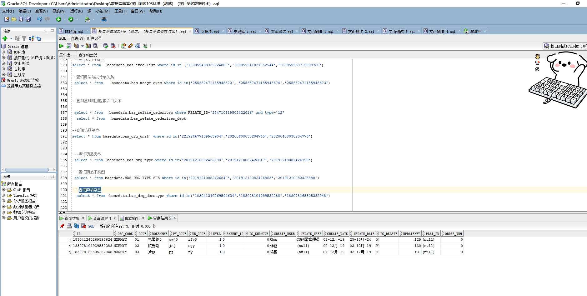

# 领域服务/基础领域 - 查询药品剂型 - 查询药品剂型 正向用例
## 请求参数：
``` json
{
  "hospCode": "NXRY",
  "pageIndex": 1,
  "orgCode": "NXRMYY",
  "pageSize": 3
}
```
## 返回参数：
``` json
{
  "exception": null,
  "apiCode": null,
  "data": {
    "list": [
      {
        "id": "183041240269594624",
        "orgCode": "NXRMYY",
        "hospCode": null,
        "createDate": "2019-12-02 10:20:31",
        "updateDate": "2024-10-25 09:54:51",
        "isDelete": "N",
        "code": "01",
        "pyCode": "qwj0",
        "wbCode": "rfy0",
        "level": 1,
        "parentId": "0",
        "isEndnode": 0,
        "platId": null,
        "createUserId": "杨智",
        "updateUserId": "CS创星管理员",
        "name": "气雾剂0",
        "updatekey": 129,
        "sortNo": 0
      },
      {
        "id": "183078104939532288",
        "orgCode": "NXRMYY",
        "hospCode": null,
        "createDate": "2019-12-02 12:47:01",
        "updateDate": "2019-12-02 12:47:01",
        "isDelete": "N",
        "code": "02",
        "pyCode": "jnj",
        "wbCode": "egy",
        "level": 1,
        "parentId": "0",
        "isEndnode": 0,
        "platId": null,
        "createUserId": "杨智",
        "updateUserId": null,
        "name": "胶囊剂",
        "updatekey": 130,
        "sortNo": 0
      },
      {
        "id": "183078165505282048",
        "orgCode": "NXRMYY",
        "hospCode": null,
        "createDate": "2019-12-02 12:47:16",
        "updateDate": "2019-12-02 12:47:16",
        "isDelete": "N",
        "code": "03",
        "pyCode": "pj",
        "wbCode": "ty",
        "level": 1,
        "parentId": "0",
        "isEndnode": 0,
        "platId": null,
        "createUserId": "杨智",
        "updateUserId": null,
        "name": "片剂",
        "updatekey": 131,
        "sortNo": 0
      }
    ],
    "totalCount": 106,
    "pageSize": 3,
    "pageNo": 1,
    "pageCount": 36
  },
  "Code": 200,
  "Message": "操作成功"
}
```
## 数据校验：

# 领域服务/基础领域 - 查询药品剂型 - 必填校验-[orgCode]为空
## 请求参数：
``` json
{
  "hospCode": "NXRY",
  "pageIndex": 1,
  "orgCode": "",
  "pageSize": 3
}
```
## 返回参数：
``` json
{
  "exception": null,
  "apiCode": null,
  "data": null,
  "Code": 1,
  "Message": "医院编码不能为空"
}
```
# 领域服务/基础领域 - 查询药品剂型 - 必填校验-[pageIndex]为空
## 请求参数：
``` json
{
  "hospCode": "NXRY",
  "pageIndex": null,
  "orgCode": "NXRMYY",
  "pageSize": 3
}
```
## 返回参数：
``` json
{
  "exception": null,
  "apiCode": null,
  "data": null,
  "Code": 1,
  "Message": "系统内部异常"
}
```
# 领域服务/基础领域 - 查询药品剂型 - 必填校验-[pageSize]为空
## 请求参数：
``` json
{
  "hospCode": "NXRY",
  "pageIndex": 1,
  "orgCode": "NXRMYY",
  "pageSize": null
}
```
## 返回参数：
``` json
{
  "exception": null,
  "apiCode": null,
  "data": null,
  "Code": 1,
  "Message": "系统内部异常"
}
```
# 领域服务/基础领域 - 查询药品剂型 - 类型校验-[pageSize]类型错误
## 请求参数：
``` json
{
  "hospCode": "NXRY",
  "pageIndex": 1,
  "orgCode": "NXRMYY",
  "pageSize": "abc"
}
```
## 返回参数：
``` json
{
  "exception": null,
  "apiCode": null,
  "data": null,
  "Code": 1,
  "Message": "请求参数错误"
}
```
# 领域服务/基础领域 - 查询药品剂型 - 类型校验-[pageIndex]类型错误
## 请求参数：
``` json
{
  "hospCode": "NXRY",
  "pageIndex": "abc",
  "orgCode": "NXRMYY",
  "pageSize": 3
}
```
## 返回参数：
``` json
{
  "exception": null,
  "apiCode": null,
  "data": null,
  "Code": 1,
  "Message": "请求参数错误"
}
```
# 领域服务/基础领域 - 查询药品剂型 - 依赖用例-[orgCode]赋值为依赖用例测试值
## 请求参数：
``` json
{
  "hospCode": "NXRY",
  "pageIndex": 1,
  "orgCode": "依赖用例测试值",
  "pageSize": 3
}
```
## 返回参数：
``` json
{
  "exception": null,
  "apiCode": null,
  "data": {
    "list": [],
    "totalCount": 0,
    "pageSize": 3,
    "pageNo": 1,
    "pageCount": 0
  },
  "Code": 200,
  "Message": "操作成功"
}
```