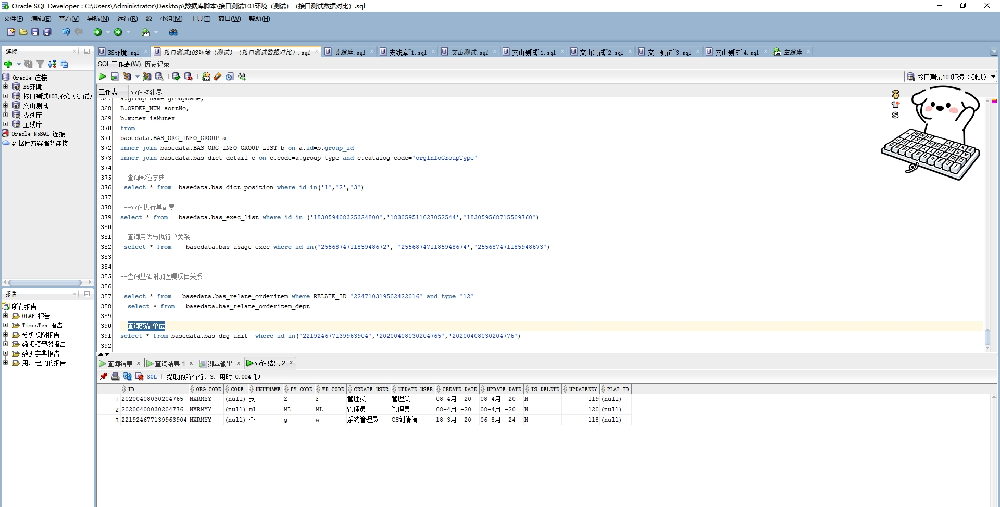

# 领域服务/基础领域 - 查询药品单位 - 查询药品单位 正向用例
## 请求参数：
``` json
{
  "pageSize": 3,
  "pageIndex": 1,
  "orgCode": "NXRMYY",
  "ids": []
}
```
## 返回参数：
``` json
{
  "exception": null,
  "apiCode": null,
  "data": {
    "list": [
      {
        "id": "221924677139963904",
        "orgCode": "NXRMYY",
        "hospCode": null,
        "createDate": "2020-03-18 17:29:26",
        "updateDate": "2024-08-06 16:44:50",
        "isDelete": "N",
        "code": null,
        "unitName": "个",
        "pyCode": "g",
        "wbCode": "w",
        "createUserId": "系统管理员",
        "updateUserId": "CS刘倩倩"
      },
      {
        "id": "20200408030204765",
        "orgCode": "NXRMYY",
        "hospCode": null,
        "createDate": "2020-04-08 15:02:04",
        "updateDate": "2020-04-08 15:02:04",
        "isDelete": "N",
        "code": null,
        "unitName": "支",
        "pyCode": "Z",
        "wbCode": "F",
        "createUserId": "管理员",
        "updateUserId": "管理员"
      },
      {
        "id": "20200408030204776",
        "orgCode": "NXRMYY",
        "hospCode": null,
        "createDate": "2020-04-08 15:02:04",
        "updateDate": "2020-04-08 15:02:04",
        "isDelete": "N",
        "code": null,
        "unitName": "ml",
        "pyCode": "ML",
        "wbCode": "ML",
        "createUserId": "管理员",
        "updateUserId": "管理员"
      }
    ],
    "totalCount": 171,
    "pageSize": 3,
    "pageNo": 1,
    "pageCount": 57
  },
  "Code": 200,
  "Message": "操作成功"
}
```
## 数据校验：

# 领域服务/基础领域 - 查询药品单位 - 必填校验-[orgCode]为空
## 请求参数：
``` json
{
  "pageSize": 3,
  "pageIndex": 1,
  "orgCode": "",
  "ids": []
}
```
## 返回参数：
``` json
{
  "exception": null,
  "apiCode": null,
  "data": null,
  "Code": 1,
  "Message": "医院编码不能为空"
}
```
# 领域服务/基础领域 - 查询药品单位 - 必填校验-[pageIndex]为空
## 请求参数：
``` json
{
  "pageSize": 3,
  "pageIndex": null,
  "orgCode": "NXRMYY",
  "ids": []
}
```
## 返回参数：
``` json
{
  "exception": null,
  "apiCode": null,
  "data": null,
  "Code": 1,
  "Message": "系统内部异常"
}
```
# 领域服务/基础领域 - 查询药品单位 - 必填校验-[pageSize]为空
## 请求参数：
``` json
{
  "pageSize": null,
  "pageIndex": 1,
  "orgCode": "NXRMYY",
  "ids": []
}
```
## 返回参数：
``` json
{
  "exception": null,
  "apiCode": null,
  "data": null,
  "Code": 1,
  "Message": "系统内部异常"
}
```
# 领域服务/基础领域 - 查询药品单位 - 类型校验-[pageIndex]类型错误
## 请求参数：
``` json
{
  "pageSize": 3,
  "pageIndex": "abc",
  "orgCode": "NXRMYY",
  "ids": []
}
```
## 返回参数：
``` json
{
  "exception": null,
  "apiCode": null,
  "data": null,
  "Code": 1,
  "Message": "请求参数错误"
}
```
# 领域服务/基础领域 - 查询药品单位 - 类型校验-[pageSize]类型错误
## 请求参数：
``` json
{
  "pageSize": "abc",
  "pageIndex": 1,
  "orgCode": "NXRMYY",
  "ids": []
}
```
## 返回参数：
``` json
{
  "exception": null,
  "apiCode": null,
  "data": null,
  "Code": 1,
  "Message": "请求参数错误"
}
```
# 领域服务/基础领域 - 查询药品单位 - 依赖用例-[orgCode]赋值为依赖用例测试值
## 请求参数：
``` json
{
  "pageSize": 3,
  "pageIndex": 1,
  "orgCode": "依赖用例测试值",
  "ids": []
}
```
## 返回参数：
``` json
{
  "exception": null,
  "apiCode": null,
  "data": {
    "list": [],
    "totalCount": 0,
    "pageSize": 3,
    "pageNo": 1,
    "pageCount": 0
  },
  "Code": 200,
  "Message": "操作成功"
}
```