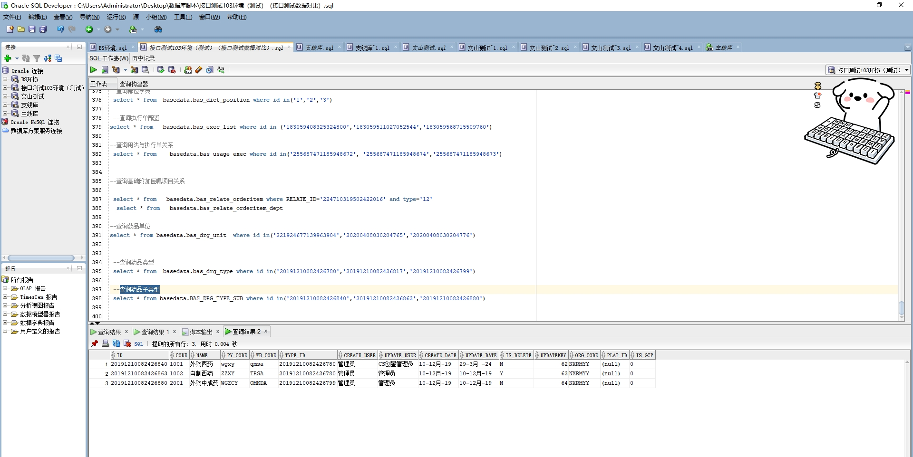

# 领域服务/基础领域 - 查询药品子类型 - 查询药品子类型 正向用例
## 请求参数：
``` json
{
  "hospCode": "NXRY",
  "orgCode": "NXRMYY",
  "pageSize": 3,
  "pageIndex": 1
}
```
## 返回参数：
``` json
{
  "exception": null,
  "apiCode": null,
  "data": {
    "list": [
      {
        "id": "20191210082426840",
        "orgCode": "NXRMYY",
        "hospCode": null,
        "createDate": "2019-12-10 20:24:26",
        "updateDate": "2024-03-29 15:41:03",
        "isDelete": "N",
        "code": "1001",
        "name": "外购西药",
        "pyCode": "wgxy",
        "wbCode": "qmsa",
        "typeId": "20191210082426780",
        "platId": null,
        "isGcp": "0",
        "typeName": "西药",
        "createUserId": "管理员",
        "updateUserId": "CS创星管理员",
        "updatekey": 62
      },
      {
        "id": "20191210082426863",
        "orgCode": "NXRMYY",
        "hospCode": null,
        "createDate": "2019-12-10 20:24:26",
        "updateDate": "2019-12-10 20:24:26",
        "isDelete": "Y",
        "code": "1002",
        "name": "自制西药",
        "pyCode": "ZZXY",
        "wbCode": "TRSA",
        "typeId": "20191210082426780",
        "platId": null,
        "isGcp": "0",
        "typeName": "西药",
        "createUserId": "管理员",
        "updateUserId": "管理员",
        "updatekey": 63
      },
      {
        "id": "20191210082426880",
        "orgCode": "NXRMYY",
        "hospCode": null,
        "createDate": "2019-12-10 20:24:26",
        "updateDate": "2019-12-10 20:24:26",
        "isDelete": "N",
        "code": "2001",
        "name": "外购中成药",
        "pyCode": "WGZCY",
        "wbCode": "QMKDA",
        "typeId": "20191210082426799",
        "platId": null,
        "isGcp": "0",
        "typeName": "中成药",
        "createUserId": "管理员",
        "updateUserId": "管理员",
        "updatekey": 64
      }
    ],
    "totalCount": 171,
    "pageSize": 3,
    "pageNo": 1,
    "pageCount": 57
  },
  "Code": 200,
  "Message": "操作成功"
}
```
## 数据校验：

# 领域服务/基础领域 - 查询药品子类型 - 必填校验-[orgCode]为空
## 请求参数：
``` json
{
  "hospCode": "NXRY",
  "orgCode": "",
  "pageSize": 3,
  "pageIndex": 1
}
```
## 返回参数：
``` json
{
  "exception": null,
  "apiCode": null,
  "data": null,
  "Code": 1,
  "Message": "医院编码不能为空"
}
```
# 领域服务/基础领域 - 查询药品子类型 - 必填校验-[pageIndex]为空
## 请求参数：
``` json
{
  "hospCode": "NXRY",
  "orgCode": "NXRMYY",
  "pageSize": 3,
  "pageIndex": null
}
```
## 返回参数：
``` json
{
  "exception": null,
  "apiCode": null,
  "data": null,
  "Code": 1,
  "Message": "系统内部异常"
}
```
# 领域服务/基础领域 - 查询药品子类型 - 必填校验-[pageSize]为空
## 请求参数：
``` json
{
  "hospCode": "NXRY",
  "orgCode": "NXRMYY",
  "pageSize": null,
  "pageIndex": 1
}
```
## 返回参数：
``` json
{
  "exception": null,
  "apiCode": null,
  "data": null,
  "Code": 1,
  "Message": "系统内部异常"
}
```
# 领域服务/基础领域 - 查询药品子类型 - 类型校验-[pageIndex]类型错误
## 请求参数：
``` json
{
  "hospCode": "NXRY",
  "orgCode": "NXRMYY",
  "pageSize": 3,
  "pageIndex": "abc"
}
```
## 返回参数：
``` json
{
  "exception": null,
  "apiCode": null,
  "data": null,
  "Code": 1,
  "Message": "请求参数错误"
}
```
# 领域服务/基础领域 - 查询药品子类型 - 类型校验-[pageSize]类型错误
## 请求参数：
``` json
{
  "hospCode": "NXRY",
  "orgCode": "NXRMYY",
  "pageSize": "abc",
  "pageIndex": 1
}
```
## 返回参数：
``` json
{
  "exception": null,
  "apiCode": null,
  "data": null,
  "Code": 1,
  "Message": "请求参数错误"
}
```
# 领域服务/基础领域 - 查询药品子类型 - 依赖用例-[orgCode]赋值为依赖用例测试值
## 请求参数：
``` json
{
  "hospCode": "NXRY",
  "orgCode": "依赖用例测试值",
  "pageSize": 3,
  "pageIndex": 1
}
```
## 返回参数：
``` json
{
  "exception": null,
  "apiCode": null,
  "data": {
    "list": [],
    "totalCount": 0,
    "pageSize": 3,
    "pageNo": 1,
    "pageCount": 0
  },
  "Code": 200,
  "Message": "操作成功"
}
```