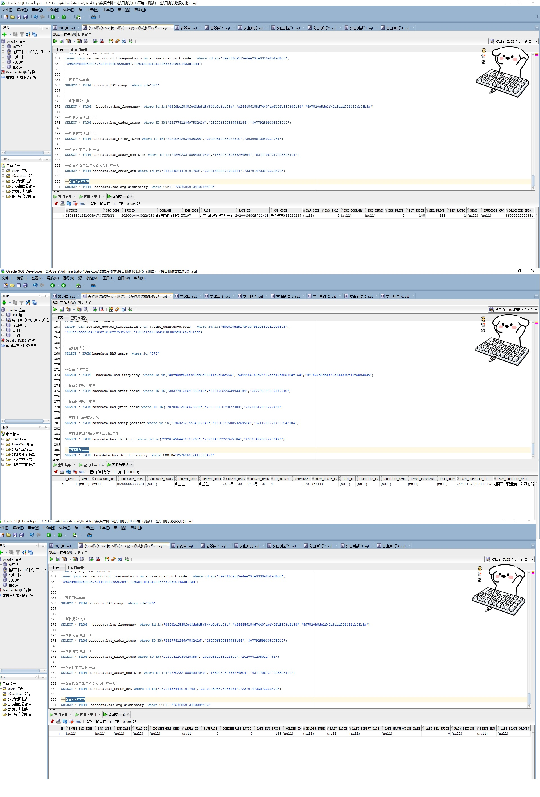

# 领域服务/基础领域 - 查询药品字典 - 查询药品字典 正向用例
## 请求参数：
``` json
{
  "pageSize": 3,
  "range": "1",
  "orgCode": "NXRMYY",
  "drugIds": [
    "257686012410089473"
  ],
  "hospCode": "NXRY",
  "isGetDrugProperty": "1",
  "pageIndex": 1
}
```
## 返回参数：
``` json
{
  "exception": null,
  "apiCode": null,
  "data": {
    "list": [
      {
        "id": "257686012410089473",
        "orgCode": "NXRMYY",
        "hospCode": null,
        "createDate": "2020-06-25 09:52:12",
        "updateDate": "2020-06-29 11:05:00",
        "isDelete": "N",
        "antibioticLevelCode": "-1",
        "antiGradeCode": "-1",
        "appCode": "国药准字H11020289",
        "barCode": null,
        "batchPurchase": null,
        "buyPrice": 185,
        "catalgoSourceCode": null,
        "catalgoSourceName": null,
        "chemicalName": "硝酸甘油注射液",
        "chineseHerbMemo": null,
        "comName": "硝酸甘油注射液",
        "content": 5,
        "contentUnitId": "20200408030204885",
        "contentUnitName": "mg",
        "dddDose": 0,
        "dddUnitId": null,
        "dddUnitName": null,
        "dddValue": 0,
        "defaultUsageId": null,
        "defaultUsageName": null,
        "dosageFormId": "183388604042743808",
        "dosageFormName": "注射液",
        "dose": 1,
        "doseUnitId": "20200408030204776",
        "doseUnitName": "ml",
        "drgDicPropertys": null,
        "drgRealType": "1",
        "drgSpecsPropertys": null,
        "drgSpecsStats": null,
        "drgSubTypeId": "20191210082426840",
        "drgSubTypeName": "外购西药",
        "drgTypeId": "20191210082426780",
        "drgTypeName": "西药",
        "englishName": null,
        "entrustment": null,
        "factId": "20200408025711445",
        "factName": "北京益民药业有限公司",
        "groupId": null,
        "groupTakeClassCode": "02",
        "groupTakeClassName": "注射类",
        "highRiskLevelCode": "0",
        "insCode": null,
        "insDosageForm": null,
        "insName": null,
        "insRemark": null,
        "insSpecDesc": null,
        "insType": null,
        "isBasic": "0",
        "isExternalUse": "0",
        "isGcp": null,
        "isHormone": "0",
        "isNacotic": "0",
        "isOnlineOpen": "0",
        "isOtc": "0",
        "isPoison": "0",
        "isPrecious": "0",
        "isPregnancyTermination": "0",
        "isProtonPump": "0",
        "isSkinTest": "0",
        "mainDisase": null,
        "memo": null,
        "ndcStandardCode": "86900202000351",
        "packNum": 10,
        "packUnitId": "20200408030204765",
        "packUnitName": "盒",
        "pharClassId": "100",
        "pharClassName": "西药",
        "prescLevelCode": "4",
        "prescLevelName": "住院医师",
        "pyCode": null,
        "pyCodeOfSpec": "XSGYZSY",
        "range": "12",
        "selPrice": 185,
        "shhCode": "XY197",
        "specDesc": "5mg:1ml*10支/盒",
        "specId": "20200408030226253",
        "specMemo": null,
        "spiritLevelCode": "0",
        "takeDrugClassCode": 1,
        "unitId": "20200408030204965",
        "unitName": "盒",
        "wbCode": null,
        "wbCodeOfSpec": "DSAIITI",
        "createUserId": "熊兰兰",
        "updateUserId": "熊兰兰"
      }
    ],
    "totalCount": 1,
    "pageSize": 3,
    "pageNo": 1,
    "pageCount": 1
  },
  "Code": 200,
  "Message": "操作成功"
}
```
## 数据校验：

# 领域服务/基础领域 - 查询药品字典 - 必填校验-[orgCode]为空
## 请求参数：
``` json
{
  "pageSize": 3,
  "range": "1",
  "orgCode": "",
  "drugIds": [
    "257686012410089473"
  ],
  "hospCode": "NXRY",
  "isGetDrugProperty": "1",
  "pageIndex": 1
}
```
## 返回参数：
``` json
{
  "exception": null,
  "apiCode": null,
  "data": null,
  "Code": 1,
  "Message": "医院编码不能为空"
}
```
# 领域服务/基础领域 - 查询药品字典 - 必填校验-[pageIndex]为空
## 请求参数：
``` json
{
  "pageSize": 3,
  "range": "1",
  "orgCode": "NXRMYY",
  "drugIds": [
    "257686012410089473"
  ],
  "hospCode": "NXRY",
  "isGetDrugProperty": "1",
  "pageIndex": null
}
```
## 返回参数：
``` json
{
  "exception": null,
  "apiCode": null,
  "data": null,
  "Code": 1,
  "Message": "系统内部异常"
}
```
# 领域服务/基础领域 - 查询药品字典 - 必填校验-[pageSize]为空
## 请求参数：
``` json
{
  "pageSize": null,
  "range": "1",
  "orgCode": "NXRMYY",
  "drugIds": [
    "257686012410089473"
  ],
  "hospCode": "NXRY",
  "isGetDrugProperty": "1",
  "pageIndex": 1
}
```
## 返回参数：
``` json
{
  "exception": null,
  "apiCode": null,
  "data": null,
  "Code": 1,
  "Message": "系统内部异常"
}
```
# 领域服务/基础领域 - 查询药品字典 - 类型校验-[pageIndex]类型错误
## 请求参数：
``` json
{
  "pageSize": 3,
  "range": "1",
  "orgCode": "NXRMYY",
  "drugIds": [
    "257686012410089473"
  ],
  "hospCode": "NXRY",
  "isGetDrugProperty": "1",
  "pageIndex": "abc"
}
```
## 返回参数：
``` json
{
  "exception": null,
  "apiCode": null,
  "data": null,
  "Code": 1,
  "Message": "请求参数错误"
}
```
# 领域服务/基础领域 - 查询药品字典 - 类型校验-[pageSize]类型错误
## 请求参数：
``` json
{
  "pageSize": "abc",
  "range": "1",
  "orgCode": "NXRMYY",
  "drugIds": [
    "257686012410089473"
  ],
  "hospCode": "NXRY",
  "isGetDrugProperty": "1",
  "pageIndex": 1
}
```
## 返回参数：
``` json
{
  "exception": null,
  "apiCode": null,
  "data": null,
  "Code": 1,
  "Message": "请求参数错误"
}
```
# 领域服务/基础领域 - 查询药品字典 - 依赖用例-[orgCode]赋值为依赖用例测试值
## 请求参数：
``` json
{
  "pageSize": 3,
  "range": "1",
  "orgCode": "依赖用例测试值",
  "drugIds": [
    "257686012410089473"
  ],
  "hospCode": "NXRY",
  "isGetDrugProperty": "1",
  "pageIndex": 1
}
```
## 返回参数：
``` json
{
  "exception": null,
  "apiCode": null,
  "data": {
    "list": [],
    "totalCount": 0,
    "pageSize": 3,
    "pageNo": 1,
    "pageCount": 0
  },
  "Code": 200,
  "Message": "操作成功"
}
```