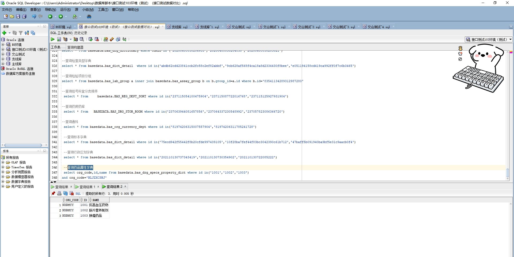

# 领域服务/基础领域 - 查询药品属性字典 - 查询药品属性字典 正向用例
## 请求参数：
``` json
{
  "pageIndex": 1,
  "orgCode": "NXRMYY",
  "isDelete": "N",
  "pageSize": 3
}
```
## 返回参数：
``` json
{
  "exception": null,
  "apiCode": null,
  "data": {
    "list": [
      {
        "createDate": "2018-12-26 18:49:56",
        "createUserId": "admin",
        "id": "1001",
        "isDelete": "N",
        "name": "抗高血压药物",
        "orgCode": "NXRMYY",
        "platId": null,
        "updateDate": "2018-12-26 18:49:56",
        "updateUserId": "admin"
      },
      {
        "createDate": "2018-12-26 18:49:56",
        "createUserId": "admin",
        "id": "1002",
        "isDelete": "N",
        "name": "肠外营养制剂",
        "orgCode": "NXRMYY",
        "platId": null,
        "updateDate": "2018-12-26 18:49:56",
        "updateUserId": "admin"
      },
      {
        "createDate": "2018-12-26 18:49:56",
        "createUserId": "admin",
        "id": "1003",
        "isDelete": "N",
        "name": "肿瘤药品",
        "orgCode": "NXRMYY",
        "platId": null,
        "updateDate": "2021-01-29 16:00:09",
        "updateUserId": "247536401569292288"
      }
    ],
    "totalCount": 68,
    "pageSize": 3,
    "pageNo": 1,
    "pageCount": 23
  },
  "Code": 200,
  "Message": "操作成功"
}
```
## 数据校验：

# 领域服务/基础领域 - 查询药品属性字典 - 必填校验-[orgCode]为空
## 请求参数：
``` json
{
  "pageIndex": 1,
  "orgCode": "",
  "isDelete": "N",
  "pageSize": 3
}
```
## 返回参数：
``` json
{
  "exception": null,
  "apiCode": null,
  "data": null,
  "Code": 1,
  "Message": "机构编码不能为空"
}
```
# 领域服务/基础领域 - 查询药品属性字典 - 必填校验-[pageIndex]为空
## 请求参数：
``` json
{
  "pageIndex": null,
  "orgCode": "NXRMYY",
  "isDelete": "N",
  "pageSize": 3
}
```
## 返回参数：
``` json
{
  "exception": null,
  "apiCode": null,
  "data": null,
  "Code": 1,
  "Message": "系统内部异常"
}
```
# 领域服务/基础领域 - 查询药品属性字典 - 必填校验-[pageSize]为空
## 请求参数：
``` json
{
  "pageIndex": 1,
  "orgCode": "NXRMYY",
  "isDelete": "N",
  "pageSize": null
}
```
## 返回参数：
``` json
{
  "exception": null,
  "apiCode": null,
  "data": null,
  "Code": 1,
  "Message": "系统内部异常"
}
```
# 领域服务/基础领域 - 查询药品属性字典 - 必填校验-[isDelete]为空
## 请求参数：
``` json
{
  "pageIndex": 1,
  "orgCode": "NXRMYY",
  "isDelete": "",
  "pageSize": 3
}
```
## 返回参数：
``` json
{
  "exception": null,
  "apiCode": null,
  "data": null,
  "Code": 1,
  "Message": "删除标志不能为空"
}
```
# 领域服务/基础领域 - 查询药品属性字典 - 类型校验-[pageSize]类型错误
## 请求参数：
``` json
{
  "pageIndex": 1,
  "orgCode": "NXRMYY",
  "isDelete": "N",
  "pageSize": "abc"
}
```
## 返回参数：
``` json
{
  "exception": null,
  "apiCode": null,
  "data": null,
  "Code": 1,
  "Message": "请求参数错误"
}
```
# 领域服务/基础领域 - 查询药品属性字典 - 类型校验-[pageIndex]类型错误
## 请求参数：
``` json
{
  "pageIndex": "abc",
  "orgCode": "NXRMYY",
  "isDelete": "N",
  "pageSize": 3
}
```
## 返回参数：
``` json
{
  "exception": null,
  "apiCode": null,
  "data": null,
  "Code": 1,
  "Message": "请求参数错误"
}
```
# 领域服务/基础领域 - 查询药品属性字典 - 枚举用例-[isDelete] 枚举值为 N(删除标志为否)
## 请求参数：
``` json
{
  "pageIndex": 1,
  "orgCode": "NXRMYY",
  "isDelete": "N",
  "pageSize": 3
}
```
## 返回参数：
``` json
{
  "exception": null,
  "apiCode": null,
  "data": {
    "list": [
      {
        "createDate": "2018-12-26 18:49:56",
        "createUserId": "admin",
        "id": "1001",
        "isDelete": "N",
        "name": "抗高血压药物",
        "orgCode": "NXRMYY",
        "platId": null,
        "updateDate": "2018-12-26 18:49:56",
        "updateUserId": "admin"
      },
      {
        "createDate": "2018-12-26 18:49:56",
        "createUserId": "admin",
        "id": "1002",
        "isDelete": "N",
        "name": "肠外营养制剂",
        "orgCode": "NXRMYY",
        "platId": null,
        "updateDate": "2018-12-26 18:49:56",
        "updateUserId": "admin"
      },
      {
        "createDate": "2018-12-26 18:49:56",
        "createUserId": "admin",
        "id": "1003",
        "isDelete": "N",
        "name": "肿瘤药品",
        "orgCode": "NXRMYY",
        "platId": null,
        "updateDate": "2021-01-29 16:00:09",
        "updateUserId": "247536401569292288"
      }
    ],
    "totalCount": 68,
    "pageSize": 3,
    "pageNo": 1,
    "pageCount": 23
  },
  "Code": 200,
  "Message": "操作成功"
}
```
# 领域服务/基础领域 - 查询药品属性字典 - 枚举用例-[isDelete] 枚举值为 Y(删除标志为是)
## 请求参数：
``` json
{
  "pageIndex": 1,
  "orgCode": "NXRMYY",
  "isDelete": "Y",
  "pageSize": 3
}
```
## 返回参数：
``` json
{
  "exception": null,
  "apiCode": null,
  "data": {
    "list": [
      {
        "createDate": "2018-12-26 18:49:57",
        "createUserId": "admin",
        "id": "1018",
        "isDelete": "Y",
        "name": "麻醉药品",
        "orgCode": "NXRMYY",
        "platId": null,
        "updateDate": "2024-11-15 11:00:18",
        "updateUserId": "admin"
      },
      {
        "createDate": "2018-12-26 18:49:57",
        "createUserId": "admin",
        "id": "1019",
        "isDelete": "Y",
        "name": "贵重药品",
        "orgCode": "NXRMYY",
        "platId": null,
        "updateDate": "2024-11-15 11:00:23",
        "updateUserId": "admin"
      },
      {
        "createDate": "2018-12-26 18:49:57",
        "createUserId": "admin",
        "id": "1024",
        "isDelete": "Y",
        "name": "非处方药",
        "orgCode": "NXRMYY",
        "platId": null,
        "updateDate": "2024-10-29 19:28:04",
        "updateUserId": "admin"
      }
    ],
    "totalCount": 11,
    "pageSize": 3,
    "pageNo": 1,
    "pageCount": 4
  },
  "Code": 200,
  "Message": "操作成功"
}
```
# 领域服务/基础领域 - 查询药品属性字典 - 依赖用例-[orgCode]赋值为依赖用例测试值
## 请求参数：
``` json
{
  "pageIndex": 1,
  "orgCode": "依赖用例测试值",
  "isDelete": "N",
  "pageSize": 3
}
```
## 返回参数：
``` json
{
  "exception": null,
  "apiCode": null,
  "data": {
    "list": [],
    "totalCount": 0,
    "pageSize": 3,
    "pageNo": 1,
    "pageCount": 0
  },
  "Code": 200,
  "Message": "操作成功"
}
```