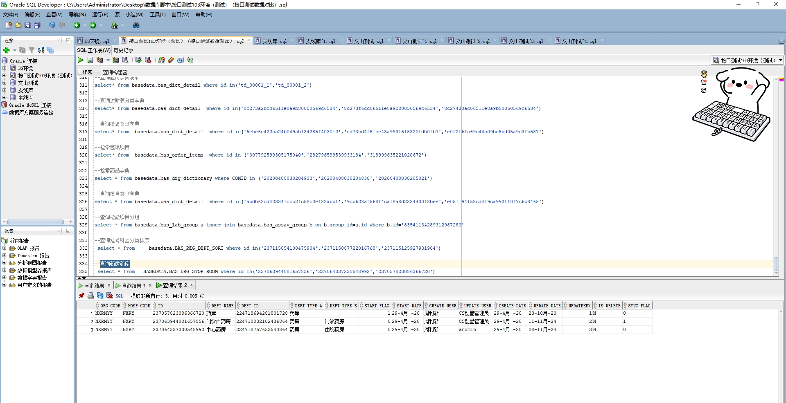

# 领域服务/基础领域 - 查询药房药库 - 查询药房药库 正向用例
## 请求参数：
``` json
{
  "hospCode": "NXRY",
  "orgCode": "NXRMYY",
  "pageSize": 3,
  "pageIndex": 1
}
```
## 返回参数：
``` json
{
  "exception": null,
  "apiCode": null,
  "data": {
    "list": [
      {
        "createDate": "2020-04-29T12:07:28Z",
        "createUserId": "周利新",
        "deptId": "224718832102436864",
        "deptName": "门诊西药房",
        "deptType": "药房",
        "hospCode": "NXRY",
        "id": "237063944081657856",
        "isDelete": "N",
        "orgCode": "NXRMYY",
        "startDate": "2020-04-29T12:08:13Z",
        "startFlag": 0,
        "syncFlag": "1",
        "updateDate": "2024-11-11T09:39:00Z",
        "updateUserId": "CS创星管理员"
      },
      {
        "createDate": "2020-04-29T12:09:02Z",
        "createUserId": "周利新",
        "deptId": "224718757653540864",
        "deptName": "中心药房",
        "deptType": "药房",
        "hospCode": "NXRY",
        "id": "237064337230548992",
        "isDelete": "N",
        "orgCode": "NXRMYY",
        "startDate": "2020-04-29T12:09:47Z",
        "startFlag": 0,
        "syncFlag": "0",
        "updateDate": "2024-11-08T10:05:51Z",
        "updateUserId": "andmin"
      },
      {
        "createDate": "2020-04-29T11:43:09Z",
        "createUserId": "周利新",
        "deptId": "224718694281801728",
        "deptName": "药库",
        "deptType": "药库",
        "hospCode": "NXRY",
        "id": "237057823086366720",
        "isDelete": "N",
        "orgCode": "NXRMYY",
        "startDate": "2020-04-29T11:43:54Z",
        "startFlag": 1,
        "syncFlag": "0",
        "updateDate": "2020-10-23T11:42:49Z",
        "updateUserId": "CS创星管理员"
      }
    ],
    "totalCount": 11,
    "pageSize": 3,
    "pageNo": 1,
    "pageCount": 4
  },
  "Code": 200,
  "Message": "操作成功"
}
```
## 数据校验：

# 领域服务/基础领域 - 查询药房药库 - 必填校验-[orgCode]为空
## 请求参数：
``` json
{
  "hospCode": "NXRY",
  "orgCode": "",
  "pageSize": 3,
  "pageIndex": 1
}
```
## 返回参数：
``` json
{
  "exception": null,
  "apiCode": null,
  "data": null,
  "Code": 1,
  "Message": "医院编码不能为空"
}
```
# 领域服务/基础领域 - 查询药房药库 - 必填校验-[pageIndex]为空
## 请求参数：
``` json
{
  "hospCode": "NXRY",
  "orgCode": "NXRMYY",
  "pageSize": 3,
  "pageIndex": null
}
```
## 返回参数：
``` json
{
  "exception": null,
  "apiCode": null,
  "data": null,
  "Code": 1,
  "Message": "系统内部异常"
}
```
# 领域服务/基础领域 - 查询药房药库 - 必填校验-[pageSize]为空
## 请求参数：
``` json
{
  "hospCode": "NXRY",
  "orgCode": "NXRMYY",
  "pageSize": null,
  "pageIndex": 1
}
```
## 返回参数：
``` json
{
  "exception": null,
  "apiCode": null,
  "data": null,
  "Code": 1,
  "Message": "系统内部异常"
}
```
# 领域服务/基础领域 - 查询药房药库 - 类型校验-[pageIndex]类型错误
## 请求参数：
``` json
{
  "hospCode": "NXRY",
  "orgCode": "NXRMYY",
  "pageSize": 3,
  "pageIndex": "abc"
}
```
## 返回参数：
``` json
{
  "exception": null,
  "apiCode": null,
  "data": null,
  "Code": 1,
  "Message": "请求参数错误"
}
```
# 领域服务/基础领域 - 查询药房药库 - 类型校验-[pageSize]类型错误
## 请求参数：
``` json
{
  "hospCode": "NXRY",
  "orgCode": "NXRMYY",
  "pageSize": "abc",
  "pageIndex": 1
}
```
## 返回参数：
``` json
{
  "exception": null,
  "apiCode": null,
  "data": null,
  "Code": 1,
  "Message": "请求参数错误"
}
```
# 领域服务/基础领域 - 查询药房药库 - 依赖用例-[orgCode]赋值为依赖用例测试值
## 请求参数：
``` json
{
  "hospCode": "NXRY",
  "orgCode": "依赖用例测试值",
  "pageSize": 3,
  "pageIndex": 1
}
```
## 返回参数：
``` json
{
  "exception": null,
  "apiCode": null,
  "data": {
    "list": [],
    "totalCount": 0,
    "pageSize": 3,
    "pageNo": 1,
    "pageCount": 0
  },
  "Code": 200,
  "Message": "操作成功"
}
```