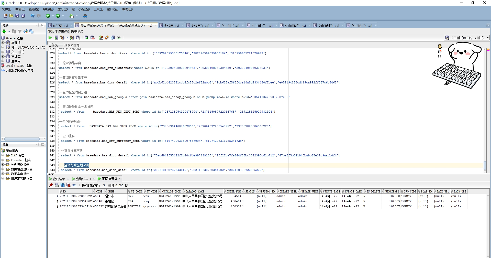

# 领域服务/基础领域 - 查询行政区划字典 - 查询行政区划字典 正向用例
## 请求参数：
``` json
{
  "isDelete": "N",
  "pageSize": 3,
  "pageIndex": 1,
  "orgCode": "NXRMYY"
}
```
## 返回参数：
``` json
{
  "exception": null,
  "apiCode": null,
  "data": {
    "list": [
      {
        "id": "202110130737343419",
        "orgCode": "NXRMYY",
        "createUserId": "admin",
        "updateUserId": "admin",
        "createDate": "2022-04-14 10:32:19",
        "updateDate": "2022-04-14 10:32:19",
        "isDelete": "N",
        "code": "450332",
        "name": "恭城瑶族自治县",
        "wbCode": "AFGYTIE",
        "pyCode": "gcyzzzx",
        "catalogCode": "GBT2260-1999",
        "catalogName": "中华人民共和国行政区划代码",
        "orderNum": "450332",
        "status": "1"
      },
      {
        "id": "202110130730354902",
        "orgCode": "NXRMYY",
        "createUserId": "admin",
        "updateUserId": "admin",
        "createDate": "2022-04-14 10:32:19",
        "updateDate": "2022-04-14 10:32:19",
        "isDelete": "N",
        "code": "450401",
        "name": "市辖区",
        "wbCode": "YLA",
        "pyCode": "sxq",
        "catalogCode": "GBT2260-1999",
        "catalogName": "中华人民共和国行政区划代码",
        "orderNum": "450401",
        "status": "1"
      },
      {
        "id": "202110130722085222",
        "orgCode": "NXRMYY",
        "createUserId": "admin",
        "updateUserId": "admin",
        "createDate": "2022-04-14 10:32:19",
        "updateDate": "2022-04-14 10:32:19",
        "isDelete": "N",
        "code": "4504",
        "name": "梧州市",
        "wbCode": "SYY",
        "pyCode": "wzs",
        "catalogCode": "GBT2260-1999",
        "catalogName": "中华人民共和国行政区划代码",
        "orderNum": "4504",
        "status": "1"
      }
    ],
    "totalCount": 3520,
    "pageSize": 3,
    "pageNo": 1,
    "pageCount": 1174
  },
  "Code": 200,
  "Message": "操作成功"
}
```
## 数据校验：

# 领域服务/基础领域 - 查询行政区划字典 - 必填校验-[orgCode]为空
## 请求参数：
``` json
{
  "isDelete": "N",
  "pageSize": 3,
  "pageIndex": 1,
  "orgCode": ""
}
```
## 返回参数：
``` json
{
  "exception": null,
  "apiCode": null,
  "data": null,
  "Code": 1,
  "Message": "医院编码不能为空"
}
```
# 领域服务/基础领域 - 查询行政区划字典 - 必填校验-[pageIndex]为空
## 请求参数：
``` json
{
  "isDelete": "N",
  "pageSize": 3,
  "pageIndex": null,
  "orgCode": "NXRMYY"
}
```
## 返回参数：
``` json
{
  "exception": null,
  "apiCode": null,
  "data": null,
  "Code": 1,
  "Message": "系统内部异常"
}
```
# 领域服务/基础领域 - 查询行政区划字典 - 必填校验-[pageSize]为空
## 请求参数：
``` json
{
  "isDelete": "N",
  "pageSize": null,
  "pageIndex": 1,
  "orgCode": "NXRMYY"
}
```
## 返回参数：
``` json
{
  "exception": null,
  "apiCode": null,
  "data": null,
  "Code": 1,
  "Message": "系统内部异常"
}
```
# 领域服务/基础领域 - 查询行政区划字典 - 类型校验-[pageIndex]类型错误
## 请求参数：
``` json
{
  "isDelete": "N",
  "pageSize": 3,
  "pageIndex": "abc",
  "orgCode": "NXRMYY"
}
```
## 返回参数：
``` json
{
  "exception": null,
  "apiCode": null,
  "data": null,
  "Code": 1,
  "Message": "请求参数错误"
}
```
# 领域服务/基础领域 - 查询行政区划字典 - 类型校验-[pageSize]类型错误
## 请求参数：
``` json
{
  "isDelete": "N",
  "pageSize": "abc",
  "pageIndex": 1,
  "orgCode": "NXRMYY"
}
```
## 返回参数：
``` json
{
  "exception": null,
  "apiCode": null,
  "data": null,
  "Code": 1,
  "Message": "请求参数错误"
}
```
# 领域服务/基础领域 - 查询行政区划字典 - 依赖用例-[orgCode]赋值为依赖用例测试值
## 请求参数：
``` json
{
  "isDelete": "N",
  "pageSize": 3,
  "pageIndex": 1,
  "orgCode": "依赖用例测试值"
}
```
## 返回参数：
``` json
{
  "exception": null,
  "apiCode": null,
  "data": {
    "list": [],
    "totalCount": 0,
    "pageSize": 3,
    "pageNo": 1,
    "pageCount": 0
  },
  "Code": 200,
  "Message": "操作成功"
}
```