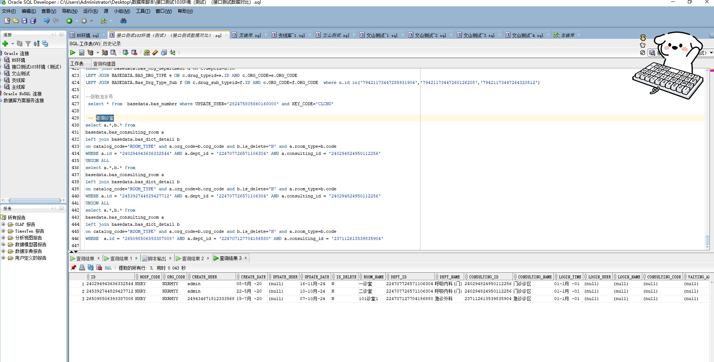

# 领域服务/基础领域 - 查询诊室 - 查询诊室 正向用例
## 请求参数：
``` json
{
  "hospCode": "NXRY",
  "orgCode": "NXRMYY",
  "pageSize": 3,
  "pageIndex": 1
}
```
## 返回参数：
``` json
{
  "exception": null,
  "apiCode": null,
  "data": {
    "list": [
      {
        "id": null,
        "orgCode": null,
        "hospCode": null,
        "createDate": "2020-05-08 10:06:19",
        "updateDate": "2024-11-16 09:59:49",
        "isDelete": "N",
        "consultingRoomId": "240294943636332544",
        "consultingRoomName": "一诊室",
        "consultingAreaId": "240294824950112256",
        "consultingAreaName": "门诊诊区",
        "deptId": "224707726571106304",
        "deptName": "呼吸内科(门)",
        "loginUserId": null,
        "loginUserName": null,
        "loginDateTime": "0001-01-01 00:00:00",
        "consultingRoomType": "1",
        "consultingRoomTypeName": "看诊",
        "isOpen": "Y",
        "ipAddress": "192.168.81.134",
        "sortNo": null,
        "createUserId": "admin",
        "updateUserId": null
      },
      {
        "id": null,
        "orgCode": null,
        "hospCode": null,
        "createDate": "2020-05-22 11:43:09",
        "updateDate": "2024-10-10 08:56:01",
        "isDelete": "N",
        "consultingRoomId": "245392744829427712",
        "consultingRoomName": "二诊室",
        "consultingAreaId": "240294824950112256",
        "consultingAreaName": "门诊诊区",
        "deptId": "224707726571106304",
        "deptName": "呼吸内科(门)",
        "loginUserId": null,
        "loginUserName": null,
        "loginDateTime": "0001-01-01 00:00:00",
        "consultingRoomType": "1",
        "consultingRoomTypeName": "看诊",
        "isOpen": "N",
        "ipAddress": "192.168.1.1",
        "sortNo": null,
        "createUserId": "admin",
        "updateUserId": null
      },
      {
        "id": null,
        "orgCode": null,
        "hospCode": null,
        "createDate": "2020-07-15 20:46:49",
        "updateDate": "2024-10-07 10:47:28",
        "isDelete": "N",
        "consultingRoomId": "265098506393387008",
        "consultingRoomName": "101诊室1",
        "consultingAreaId": "237112613539835904",
        "consultingAreaName": "急诊诊区",
        "deptId": "224707127704186880",
        "deptName": "急诊外科",
        "loginUserId": null,
        "loginUserName": null,
        "loginDateTime": "0001-01-01 00:00:00",
        "consultingRoomType": "1",
        "consultingRoomTypeName": "看诊",
        "isOpen": "N",
        "ipAddress": "4124",
        "sortNo": null,
        "createUserId": "249434671812333568",
        "updateUserId": null
      }
    ],
    "totalCount": 61,
    "pageSize": 1,
    "pageNo": 3,
    "pageCount": 21
  },
  "Code": 200,
  "Message": "操作成功"
}
```
## 数据校验：

# 领域服务/基础领域 - 查询诊室 - 必填校验-[orgCode]为空
## 请求参数：
``` json
{
  "hospCode": "NXRY",
  "orgCode": "",
  "pageSize": 3,
  "pageIndex": 1
}
```
## 返回参数：
``` json
{
  "exception": null,
  "apiCode": null,
  "data": null,
  "Code": 1,
  "Message": "医院编码不能为空"
}
```
# 领域服务/基础领域 - 查询诊室 - 必填校验-[pageIndex]为空
## 请求参数：
``` json
{
  "hospCode": "NXRY",
  "orgCode": "NXRMYY",
  "pageSize": 3,
  "pageIndex": null
}
```
## 返回参数：
``` json
{
  "exception": null,
  "apiCode": null,
  "data": null,
  "Code": 1,
  "Message": "系统内部异常"
}
```
# 领域服务/基础领域 - 查询诊室 - 必填校验-[pageSize]为空
## 请求参数：
``` json
{
  "hospCode": "NXRY",
  "orgCode": "NXRMYY",
  "pageSize": null,
  "pageIndex": 1
}
```
## 返回参数：
``` json
{
  "exception": null,
  "apiCode": null,
  "data": null,
  "Code": 1,
  "Message": "系统内部异常"
}
```
# 领域服务/基础领域 - 查询诊室 - 类型校验-[pageIndex]类型错误
## 请求参数：
``` json
{
  "hospCode": "NXRY",
  "orgCode": "NXRMYY",
  "pageSize": 3,
  "pageIndex": "abc"
}
```
## 返回参数：
``` json
{
  "exception": null,
  "apiCode": null,
  "data": null,
  "Code": 1,
  "Message": "请求参数错误"
}
```
# 领域服务/基础领域 - 查询诊室 - 类型校验-[pageSize]类型错误
## 请求参数：
``` json
{
  "hospCode": "NXRY",
  "orgCode": "NXRMYY",
  "pageSize": "abc",
  "pageIndex": 1
}
```
## 返回参数：
``` json
{
  "exception": null,
  "apiCode": null,
  "data": null,
  "Code": 1,
  "Message": "请求参数错误"
}
```
# 领域服务/基础领域 - 查询诊室 - 依赖用例-[orgCode]赋值为依赖用例测试值
## 请求参数：
``` json
{
  "hospCode": "NXRY",
  "orgCode": "依赖用例测试值",
  "pageSize": 3,
  "pageIndex": 1
}
```
## 返回参数：
``` json
{
  "exception": null,
  "apiCode": null,
  "data": {
    "list": [],
    "totalCount": 0,
    "pageSize": 1,
    "pageNo": 3,
    "pageCount": 0
  },
  "Code": 200,
  "Message": "操作成功"
}
```
# 领域服务/基础领域 - 查询诊室 - 依赖用例-[hospCode]赋值为依赖用例测试值
## 请求参数：
``` json
{
  "hospCode": "依赖用例测试值",
  "orgCode": "NXRMYY",
  "pageSize": 3,
  "pageIndex": 1
}
```
## 返回参数：
``` json
{
  "exception": null,
  "apiCode": null,
  "data": {
    "list": [],
    "totalCount": 0,
    "pageSize": 1,
    "pageNo": 3,
    "pageCount": 0
  },
  "Code": 200,
  "Message": "操作成功"
}
```