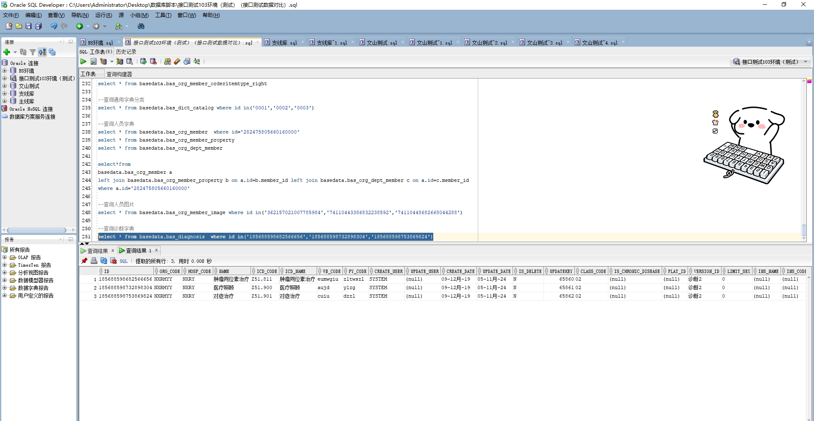

# 领域服务/基础领域 - 查询诊断字典 - 查询诊断字典 正向用例
## 请求参数：
``` json
{
  "pageSize": 3,
  "pageIndex": 1,
  "orgCode": "NXRMYY"
}
```
## 返回参数：
``` json
{
  "exception": null,
  "apiCode": null,
  "data": {
    "list": [
      {
        "id": "185688598682566656",
        "orgCode": "NXRMYY",
        "hospCode": "NXRY",
        "createDate": "2019-12-09 15:19:49",
        "updateDate": "2024-11-05 14:00:06",
        "isDelete": "N",
        "classCode": "02",
        "className": null,
        "diagnosisClassId": null,
        "icdCode": "Z51.811",
        "icdName": "肿瘤同位素治疗",
        "insCode": null,
        "insName": null,
        "isChronicDisease": null,
        "isFluSymptom": null,
        "limitSex": "0",
        "name": "肿瘤同位素治疗",
        "noMajorDiagnosis": null,
        "platId": null,
        "pyCode": "zltwszl",
        "versionId": "诊断2",
        "versionName": null,
        "wbCode": "eumwgiu",
        "createUserId": "SYSTEM",
        "updateUserId": null
      },
      {
        "id": "185688598732898304",
        "orgCode": "NXRMYY",
        "hospCode": "NXRY",
        "createDate": "2019-12-09 15:19:49",
        "updateDate": "2024-11-05 14:00:06",
        "isDelete": "N",
        "classCode": "02",
        "className": null,
        "diagnosisClassId": null,
        "icdCode": "Z51.900",
        "icdName": "医疗照顾",
        "insCode": null,
        "insName": null,
        "isChronicDisease": null,
        "isFluSymptom": null,
        "limitSex": "0",
        "name": "医疗照顾",
        "noMajorDiagnosis": null,
        "platId": null,
        "pyCode": "ylzg",
        "versionId": "诊断2",
        "versionName": null,
        "wbCode": "aujd",
        "createUserId": "SYSTEM",
        "updateUserId": null
      },
      {
        "id": "185688598753869824",
        "orgCode": "NXRMYY",
        "hospCode": "NXRY",
        "createDate": "2019-12-09 15:19:49",
        "updateDate": "2024-11-05 14:00:06",
        "isDelete": "N",
        "classCode": "02",
        "className": null,
        "diagnosisClassId": null,
        "icdCode": "Z51.901",
        "icdName": "对症治疗",
        "insCode": null,
        "insName": null,
        "isChronicDisease": null,
        "isFluSymptom": null,
        "limitSex": "0",
        "name": "对症治疗",
        "noMajorDiagnosis": null,
        "platId": null,
        "pyCode": "dzzl",
        "versionId": "诊断2",
        "versionName": null,
        "wbCode": "cuiu",
        "createUserId": "SYSTEM",
        "updateUserId": null
      }
    ],
    "totalCount": 40319,
    "pageSize": 1,
    "pageNo": 3,
    "pageCount": 13440
  },
  "Code": 200,
  "Message": "操作成功"
}
```
## 数据校验：

# 领域服务/基础领域 - 查询诊断字典 - 必填校验-[orgCode]为空
## 请求参数：
``` json
{
  "pageSize": 3,
  "pageIndex": 1,
  "orgCode": ""
}
```
## 返回参数：
``` json
{
  "exception": null,
  "apiCode": null,
  "data": null,
  "Code": 1,
  "Message": "医院编码不可为空"
}
```
# 领域服务/基础领域 - 查询诊断字典 - 必填校验-[pageIndex]为空
## 请求参数：
``` json
{
  "pageSize": 3,
  "pageIndex": null,
  "orgCode": "NXRMYY"
}
```
## 返回参数：
``` json
{
  "exception": null,
  "apiCode": null,
  "data": null,
  "Code": 1,
  "Message": "系统内部异常"
}
```
# 领域服务/基础领域 - 查询诊断字典 - 必填校验-[pageSize]为空
## 请求参数：
``` json
{
  "pageSize": null,
  "pageIndex": 1,
  "orgCode": "NXRMYY"
}
```
## 返回参数：
``` json
{
  "exception": null,
  "apiCode": null,
  "data": null,
  "Code": 1,
  "Message": "系统内部异常"
}
```
# 领域服务/基础领域 - 查询诊断字典 - 类型校验-[pageIndex]类型错误
## 请求参数：
``` json
{
  "pageSize": 3,
  "pageIndex": "abc",
  "orgCode": "NXRMYY"
}
```
## 返回参数：
``` json
{
  "exception": null,
  "apiCode": null,
  "data": null,
  "Code": 1,
  "Message": "请求参数错误"
}
```
# 领域服务/基础领域 - 查询诊断字典 - 类型校验-[pageSize]类型错误
## 请求参数：
``` json
{
  "pageSize": "abc",
  "pageIndex": 1,
  "orgCode": "NXRMYY"
}
```
## 返回参数：
``` json
{
  "exception": null,
  "apiCode": null,
  "data": null,
  "Code": 1,
  "Message": "请求参数错误"
}
```
# 领域服务/基础领域 - 查询诊断字典 - 依赖用例-[orgCode]赋值为依赖用例测试值
## 请求参数：
``` json
{
  "pageSize": 3,
  "pageIndex": 1,
  "orgCode": "依赖用例测试值"
}
```
## 返回参数：
``` json
{
  "exception": null,
  "apiCode": null,
  "data": {
    "list": [],
    "totalCount": 0,
    "pageSize": 1,
    "pageNo": 3,
    "pageCount": 0
  },
  "Code": 200,
  "Message": "操作成功"
}
```