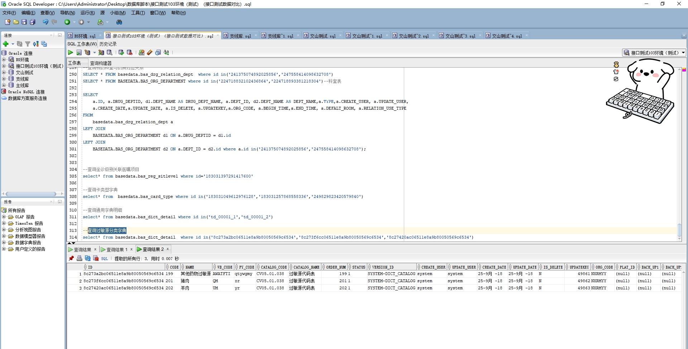

# 领域服务/基础领域 - 查询过敏源分类字典 - 查询过敏源分类字典 正向用例
## 请求参数：
``` json
{
  "isDelete": "N",
  "pageSize": 3,
  "pageIndex": 1,
  "orgCode": "NXRMYY"
}
```
## 返回参数：
``` json
{
  "exception": null,
  "apiCode": null,
  "data": {
    "list": [
      {
        "id": "8c273a2bc06511e8a9b80050569c6534",
        "orgCode": "NXRMYY",
        "hospCode": null,
        "createDate": "2018-09-25 09:51:40",
        "updateDate": "2018-09-25 09:51:40",
        "isDelete": "N",
        "code": "199",
        "name": "其他药物过敏源",
        "wbCode": "AWATFTI",
        "pyCode": "qtywgmy",
        "catalogCode": "CV05.01.038",
        "catalogName": "过敏源代码表",
        "orderNum": 199,
        "status": "1",
        "versionId": "SYSTEM-DICT_CATALOG",
        "platId": null,
        "backUp1": null,
        "backUp2": null,
        "createUserId": "system",
        "updateUserId": "system",
        "updatekey": 49861
      },
      {
        "id": "8c273f6cc06511e8a9b80050569c6534",
        "orgCode": "NXRMYY",
        "hospCode": null,
        "createDate": "2018-09-25 09:51:40",
        "updateDate": "2018-09-25 09:51:40",
        "isDelete": "N",
        "code": "201",
        "name": "猪肉",
        "wbCode": "QM",
        "pyCode": "zr",
        "catalogCode": "CV05.01.038",
        "catalogName": "过敏源代码表",
        "orderNum": 201,
        "status": "1",
        "versionId": "SYSTEM-DICT_CATALOG",
        "platId": null,
        "backUp1": null,
        "backUp2": null,
        "createUserId": "system",
        "updateUserId": "system",
        "updatekey": 49862
      },
      {
        "id": "8c27420ac06511e8a9b80050569c6534",
        "orgCode": "NXRMYY",
        "hospCode": null,
        "createDate": "2018-09-25 09:51:40",
        "updateDate": "2018-09-25 09:51:40",
        "isDelete": "N",
        "code": "202",
        "name": "羊肉",
        "wbCode": "UM",
        "pyCode": "yr",
        "catalogCode": "CV05.01.038",
        "catalogName": "过敏源代码表",
        "orderNum": 202,
        "status": "1",
        "versionId": "SYSTEM-DICT_CATALOG",
        "platId": null,
        "backUp1": null,
        "backUp2": null,
        "createUserId": "system",
        "updateUserId": "system",
        "updatekey": 49863
      }
    ],
    "totalCount": 25,
    "pageSize": 3,
    "pageNo": 1,
    "pageCount": 9
  },
  "Code": 200,
  "Message": "操作成功"
}
```
## 数据校验：

# 领域服务/基础领域 - 查询过敏源分类字典 - 必填校验-[orgCode]为空
## 请求参数：
``` json
{
  "isDelete": "N",
  "pageSize": 3,
  "pageIndex": 1,
  "orgCode": ""
}
```
## 返回参数：
``` json
{
  "exception": null,
  "apiCode": null,
  "data": null,
  "Code": 1,
  "Message": "医院编码不能为空"
}
```
# 领域服务/基础领域 - 查询过敏源分类字典 - 必填校验-[pageIndex]为空
## 请求参数：
``` json
{
  "isDelete": "N",
  "pageSize": 3,
  "pageIndex": null,
  "orgCode": "NXRMYY"
}
```
## 返回参数：
``` json
{
  "exception": null,
  "apiCode": null,
  "data": null,
  "Code": 1,
  "Message": "系统内部异常"
}
```
# 领域服务/基础领域 - 查询过敏源分类字典 - 必填校验-[pageSize]为空
## 请求参数：
``` json
{
  "isDelete": "N",
  "pageSize": null,
  "pageIndex": 1,
  "orgCode": "NXRMYY"
}
```
## 返回参数：
``` json
{
  "exception": null,
  "apiCode": null,
  "data": null,
  "Code": 1,
  "Message": "系统内部异常"
}
```
# 领域服务/基础领域 - 查询过敏源分类字典 - 必填校验-[isDelete]为空
## 请求参数：
``` json
{
  "isDelete": "",
  "pageSize": 3,
  "pageIndex": 1,
  "orgCode": "NXRMYY"
}
```
## 返回参数：
``` json
{
  "exception": null,
  "apiCode": null,
  "data": null,
  "Code": 1,
  "Message": "删除标志不能为空"
}
```
# 领域服务/基础领域 - 查询过敏源分类字典 - 类型校验-[pageIndex]类型错误
## 请求参数：
``` json
{
  "isDelete": "N",
  "pageSize": 3,
  "pageIndex": "abc",
  "orgCode": "NXRMYY"
}
```
## 返回参数：
``` json
{
  "exception": null,
  "apiCode": null,
  "data": null,
  "Code": 1,
  "Message": "请求参数错误"
}
```
# 领域服务/基础领域 - 查询过敏源分类字典 - 类型校验-[pageSize]类型错误
## 请求参数：
``` json
{
  "isDelete": "N",
  "pageSize": "abc",
  "pageIndex": 1,
  "orgCode": "NXRMYY"
}
```
## 返回参数：
``` json
{
  "exception": null,
  "apiCode": null,
  "data": null,
  "Code": 1,
  "Message": "请求参数错误"
}
```
# 领域服务/基础领域 - 查询过敏源分类字典 - 枚举用例-[isDelete] 枚举值为 N(删除标志为否)
## 请求参数：
``` json
{
  "isDelete": "N",
  "pageSize": 3,
  "pageIndex": 1,
  "orgCode": "NXRMYY"
}
```
## 返回参数：
``` json
{
  "exception": null,
  "apiCode": null,
  "data": {
    "list": [
      {
        "id": "8c273a2bc06511e8a9b80050569c6534",
        "orgCode": "NXRMYY",
        "hospCode": null,
        "createDate": "2018-09-25 09:51:40",
        "updateDate": "2018-09-25 09:51:40",
        "isDelete": "N",
        "code": "199",
        "name": "其他药物过敏源",
        "wbCode": "AWATFTI",
        "pyCode": "qtywgmy",
        "catalogCode": "CV05.01.038",
        "catalogName": "过敏源代码表",
        "orderNum": 199,
        "status": "1",
        "versionId": "SYSTEM-DICT_CATALOG",
        "platId": null,
        "backUp1": null,
        "backUp2": null,
        "createUserId": "system",
        "updateUserId": "system",
        "updatekey": 49861
      },
      {
        "id": "8c273f6cc06511e8a9b80050569c6534",
        "orgCode": "NXRMYY",
        "hospCode": null,
        "createDate": "2018-09-25 09:51:40",
        "updateDate": "2018-09-25 09:51:40",
        "isDelete": "N",
        "code": "201",
        "name": "猪肉",
        "wbCode": "QM",
        "pyCode": "zr",
        "catalogCode": "CV05.01.038",
        "catalogName": "过敏源代码表",
        "orderNum": 201,
        "status": "1",
        "versionId": "SYSTEM-DICT_CATALOG",
        "platId": null,
        "backUp1": null,
        "backUp2": null,
        "createUserId": "system",
        "updateUserId": "system",
        "updatekey": 49862
      },
      {
        "id": "8c27420ac06511e8a9b80050569c6534",
        "orgCode": "NXRMYY",
        "hospCode": null,
        "createDate": "2018-09-25 09:51:40",
        "updateDate": "2018-09-25 09:51:40",
        "isDelete": "N",
        "code": "202",
        "name": "羊肉",
        "wbCode": "UM",
        "pyCode": "yr",
        "catalogCode": "CV05.01.038",
        "catalogName": "过敏源代码表",
        "orderNum": 202,
        "status": "1",
        "versionId": "SYSTEM-DICT_CATALOG",
        "platId": null,
        "backUp1": null,
        "backUp2": null,
        "createUserId": "system",
        "updateUserId": "system",
        "updatekey": 49863
      }
    ],
    "totalCount": 25,
    "pageSize": 3,
    "pageNo": 1,
    "pageCount": 9
  },
  "Code": 200,
  "Message": "操作成功"
}
```
# 领域服务/基础领域 - 查询过敏源分类字典 - 枚举用例-[isDelete] 枚举值为 Y(删除标志为是)
## 请求参数：
``` json
{
  "isDelete": "Y",
  "pageSize": 3,
  "pageIndex": 1,
  "orgCode": "NXRMYY"
}
```
## 返回参数：
``` json
{
  "exception": null,
  "apiCode": null,
  "data": {
    "list": [],
    "totalCount": 0,
    "pageSize": 3,
    "pageNo": 1,
    "pageCount": 0
  },
  "Code": 200,
  "Message": "操作成功"
}
```
# 领域服务/基础领域 - 查询过敏源分类字典 - 依赖用例-[orgCode]赋值为依赖用例测试值
## 请求参数：
``` json
{
  "isDelete": "N",
  "pageSize": 3,
  "pageIndex": 1,
  "orgCode": "依赖用例测试值"
}
```
## 返回参数：
``` json
{
  "exception": null,
  "apiCode": null,
  "data": {
    "list": [],
    "totalCount": 0,
    "pageSize": 3,
    "pageNo": 1,
    "pageCount": 0
  },
  "Code": 200,
  "Message": "操作成功"
}
```