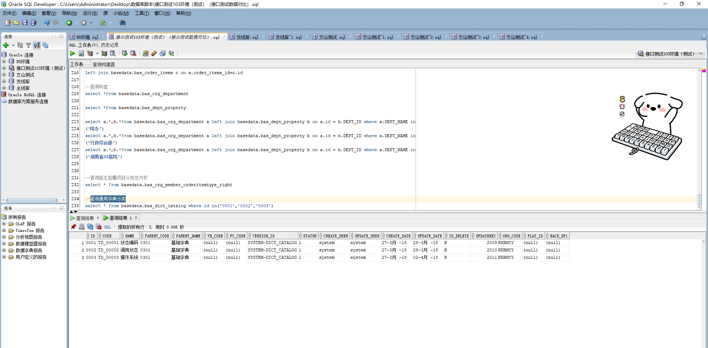

# 领域服务/基础领域 - 查询通用字典分类 - 查询通用字典分类 正向用例
## 请求参数：
``` json
{
  "hospCode": "NXRY",
  "pageIndex": 1,
  "orgCode": "NXRMYY",
  "isDelete": "N",
  "pageSize": 3
}
```
## 返回参数：
``` json
{
  "exception": null,
  "apiCode": null,
  "data": {
    "list": [
      {
        "id": "0001",
        "orgCode": "NXRMYY",
        "hospCode": null,
        "createDate": "2018-03-27 09:31:26",
        "updateDate": "2018-03-28 18:25:21",
        "isDelete": "N",
        "code": "TD_00001",
        "name": "状态编码",
        "parentCode": "0301",
        "parentName": "基础字典",
        "wbCode": null,
        "pyCode": null,
        "versionId": "SYSTEM-DICT_CATALOG",
        "status": "1",
        "platId": null,
        "backUp1": null,
        "createUserId": "system",
        "updateUserId": "system",
        "updatekey": 2009
      },
      {
        "id": "0003",
        "orgCode": "NXRMYY",
        "hospCode": null,
        "createDate": "2018-03-27 09:31:26",
        "updateDate": "2018-04-02 11:16:47",
        "isDelete": "N",
        "code": "TD_00003",
        "name": "操作系统",
        "parentCode": "0301",
        "parentName": "基础字典",
        "wbCode": null,
        "pyCode": null,
        "versionId": "SYSTEM-DICT_CATALOG",
        "status": "1",
        "platId": null,
        "backUp1": null,
        "createUserId": "system",
        "updateUserId": "system",
        "updatekey": 2011
      },
      {
        "id": "0002",
        "orgCode": "NXRMYY",
        "hospCode": null,
        "createDate": "2018-03-27 09:31:26",
        "updateDate": "2018-03-29 10:09:09",
        "isDelete": "N",
        "code": "TD_00002",
        "name": "调用状态",
        "parentCode": "0301",
        "parentName": "基础字典",
        "wbCode": null,
        "pyCode": null,
        "versionId": "SYSTEM-DICT_CATALOG",
        "status": "1",
        "platId": null,
        "backUp1": null,
        "createUserId": "system",
        "updateUserId": "system",
        "updatekey": 2010
      }
    ],
    "totalCount": 570,
    "pageSize": 1,
    "pageNo": 3,
    "pageCount": 190
  },
  "Code": 200,
  "Message": "操作成功"
}
```
## 数据校验：

# 领域服务/基础领域 - 查询通用字典分类 - 必填校验-[orgCode]为空
## 请求参数：
``` json
{
  "hospCode": "NXRY",
  "pageIndex": 1,
  "orgCode": "",
  "isDelete": "N",
  "pageSize": 3
}
```
## 返回参数：
``` json
{
  "exception": null,
  "apiCode": null,
  "data": null,
  "Code": 1,
  "Message": "医院编码不能为空"
}
```
# 领域服务/基础领域 - 查询通用字典分类 - 必填校验-[pageIndex]为空
## 请求参数：
``` json
{
  "hospCode": "NXRY",
  "pageIndex": null,
  "orgCode": "NXRMYY",
  "isDelete": "N",
  "pageSize": 3
}
```
## 返回参数：
``` json
{
  "exception": null,
  "apiCode": null,
  "data": null,
  "Code": 1,
  "Message": "系统内部异常"
}
```
# 领域服务/基础领域 - 查询通用字典分类 - 必填校验-[pageSize]为空
## 请求参数：
``` json
{
  "hospCode": "NXRY",
  "pageIndex": 1,
  "orgCode": "NXRMYY",
  "isDelete": "N",
  "pageSize": null
}
```
## 返回参数：
``` json
{
  "exception": null,
  "apiCode": null,
  "data": null,
  "Code": 1,
  "Message": "系统内部异常"
}
```
# 领域服务/基础领域 - 查询通用字典分类 - 必填校验-[isDelete]为空
## 请求参数：
``` json
{
  "hospCode": "NXRY",
  "pageIndex": 1,
  "orgCode": "NXRMYY",
  "isDelete": "",
  "pageSize": 3
}
```
## 返回参数：
``` json
{
  "exception": null,
  "apiCode": null,
  "data": null,
  "Code": 1,
  "Message": "删除标志不能为空"
}
```
# 领域服务/基础领域 - 查询通用字典分类 - 类型校验-[pageSize]类型错误
## 请求参数：
``` json
{
  "hospCode": "NXRY",
  "pageIndex": 1,
  "orgCode": "NXRMYY",
  "isDelete": "N",
  "pageSize": "abc"
}
```
## 返回参数：
``` json
{
  "exception": null,
  "apiCode": null,
  "data": null,
  "Code": 1,
  "Message": "请求参数错误"
}
```
# 领域服务/基础领域 - 查询通用字典分类 - 类型校验-[pageIndex]类型错误
## 请求参数：
``` json
{
  "hospCode": "NXRY",
  "pageIndex": "abc",
  "orgCode": "NXRMYY",
  "isDelete": "N",
  "pageSize": 3
}
```
## 返回参数：
``` json
{
  "exception": null,
  "apiCode": null,
  "data": null,
  "Code": 1,
  "Message": "请求参数错误"
}
```
# 领域服务/基础领域 - 查询通用字典分类 - 枚举用例-[isDelete] 枚举值为 N(删除标志为否)
## 请求参数：
``` json
{
  "hospCode": "NXRY",
  "pageIndex": 1,
  "orgCode": "NXRMYY",
  "isDelete": "N",
  "pageSize": 3
}
```
## 返回参数：
``` json
{
  "exception": null,
  "apiCode": null,
  "data": {
    "list": [
      {
        "id": "0001",
        "orgCode": "NXRMYY",
        "hospCode": null,
        "createDate": "2018-03-27 09:31:26",
        "updateDate": "2018-03-28 18:25:21",
        "isDelete": "N",
        "code": "TD_00001",
        "name": "状态编码",
        "parentCode": "0301",
        "parentName": "基础字典",
        "wbCode": null,
        "pyCode": null,
        "versionId": "SYSTEM-DICT_CATALOG",
        "status": "1",
        "platId": null,
        "backUp1": null,
        "createUserId": "system",
        "updateUserId": "system",
        "updatekey": 2009
      },
      {
        "id": "0003",
        "orgCode": "NXRMYY",
        "hospCode": null,
        "createDate": "2018-03-27 09:31:26",
        "updateDate": "2018-04-02 11:16:47",
        "isDelete": "N",
        "code": "TD_00003",
        "name": "操作系统",
        "parentCode": "0301",
        "parentName": "基础字典",
        "wbCode": null,
        "pyCode": null,
        "versionId": "SYSTEM-DICT_CATALOG",
        "status": "1",
        "platId": null,
        "backUp1": null,
        "createUserId": "system",
        "updateUserId": "system",
        "updatekey": 2011
      },
      {
        "id": "0002",
        "orgCode": "NXRMYY",
        "hospCode": null,
        "createDate": "2018-03-27 09:31:26",
        "updateDate": "2018-03-29 10:09:09",
        "isDelete": "N",
        "code": "TD_00002",
        "name": "调用状态",
        "parentCode": "0301",
        "parentName": "基础字典",
        "wbCode": null,
        "pyCode": null,
        "versionId": "SYSTEM-DICT_CATALOG",
        "status": "1",
        "platId": null,
        "backUp1": null,
        "createUserId": "system",
        "updateUserId": "system",
        "updatekey": 2010
      }
    ],
    "totalCount": 570,
    "pageSize": 1,
    "pageNo": 3,
    "pageCount": 190
  },
  "Code": 200,
  "Message": "操作成功"
}
```
# 领域服务/基础领域 - 查询通用字典分类 - 枚举用例-[isDelete] 枚举值为 Y(删除标志为是)
## 请求参数：
``` json
{
  "hospCode": "NXRY",
  "pageIndex": 1,
  "orgCode": "NXRMYY",
  "isDelete": "Y",
  "pageSize": 3
}
```
## 返回参数：
``` json
{
  "exception": null,
  "apiCode": null,
  "data": {
    "list": [],
    "totalCount": 0,
    "pageSize": 1,
    "pageNo": 3,
    "pageCount": 0
  },
  "Code": 200,
  "Message": "操作成功"
}
```
# 领域服务/基础领域 - 查询通用字典分类 - 依赖用例-[orgCode]赋值为依赖用例测试值
## 请求参数：
``` json
{
  "hospCode": "NXRY",
  "pageIndex": 1,
  "orgCode": "依赖用例测试值",
  "isDelete": "N",
  "pageSize": 3
}
```
## 返回参数：
``` json
{
  "exception": null,
  "apiCode": null,
  "data": {
    "list": [],
    "totalCount": 0,
    "pageSize": 1,
    "pageNo": 3,
    "pageCount": 0
  },
  "Code": 200,
  "Message": "操作成功"
}
```