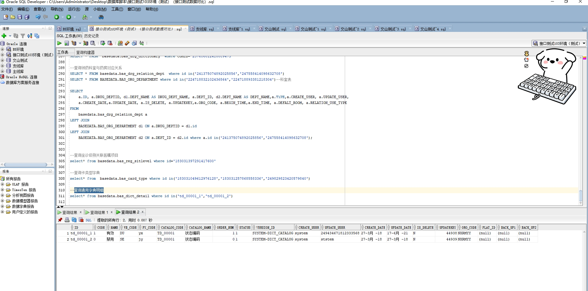

# 领域服务/基础领域 - 查询通用字典明细 - 查询通用字典明细 正向用例
## 请求参数：
``` json
{
  "catalogCodes": [
    "TD_00001"
  ],
  "isDelete": "N",
  "pageSize": 3,
  "pageIndex": 1,
  "orgCode": "NXRMYY"
}
```
## 返回参数：
``` json
{
    "exception": null,
    "apiCode": null,
    "data": {
        "list": [
            {
                "id": "td_00001_1",
                "orgCode": "NXRMYY",
                "hospCode": null,
                "createDate": "2018-03-27 09:34:37",
                "updateDate": "2021-06-17 15:09:36",
                "isDelete": "N",
                "code": "1",
                "name": "有效",
                "wbCode": "DU",
                "pyCode": "yx",
                "catalogCode": "TD_00001",
                "catalogName": "状态编码",
                "orderNum": 1,
                "status": "1",
                "versionId": "SYSTEM-DICT_CATALOG",
                "platId": null,
                "backUp1": null,
                "backUp2": null,
                "createUserId": "system",
                "updateUserId": "249434671812333568",
                "updatekey": 44938
            },
            {
                "id": "td_00001_2",
                "orgCode": "NXRMYY",
                "hospCode": null,
                "createDate": "2018-03-27 09:34:37",
                "updateDate": "2018-03-27 09:34:39",
                "isDelete": "N",
                "code": "0",
                "name": "禁用",
                "wbCode": "SE",
                "pyCode": "jy",
                "catalogCode": "TD_00001",
                "catalogName": "状态编码",
                "orderNum": 0,
                "status": "1",
                "versionId": "SYSTEM-DICT_CATALOG",
                "platId": null,
                "backUp1": null,
                "backUp2": null,
                "createUserId": "system",
                "updateUserId": "ststem",
                "updatekey": 44939
            }
        ],
        "totalCount": 2,
        "pageSize": 3,
        "pageNo": 1,
        "pageCount": 1
    },
    "Code": 200,
    "Message": "操作成功"
}
```
## 数据校验：

# 领域服务/基础领域 - 查询通用字典明细 - 必填校验-[orgCode]为空
## 请求参数：
``` json
{
  "catalogCodes": [
    "1008613"
  ],
  "isDelete": "N",
  "pageSize": 3,
  "pageIndex": 1,
  "orgCode": ""
}
```
## 返回参数：
``` json
{
  "exception": null,
  "apiCode": null,
  "data": null,
  "Code": 1,
  "Message": "医院编码不能为空"
}
```
# 领域服务/基础领域 - 查询通用字典明细 - 必填校验-[pageIndex]为空
## 请求参数：
``` json
{
  "catalogCodes": [
    "1008613"
  ],
  "isDelete": "N",
  "pageSize": 3,
  "pageIndex": null,
  "orgCode": "NXRMYY"
}
```
## 返回参数：
``` json
{
  "exception": null,
  "apiCode": null,
  "data": null,
  "Code": 1,
  "Message": "系统内部异常"
}
```
# 领域服务/基础领域 - 查询通用字典明细 - 必填校验-[pageSize]为空
## 请求参数：
``` json
{
  "catalogCodes": [
    "1008613"
  ],
  "isDelete": "N",
  "pageSize": null,
  "pageIndex": 1,
  "orgCode": "NXRMYY"
}
```
## 返回参数：
``` json
{
  "exception": null,
  "apiCode": null,
  "data": null,
  "Code": 1,
  "Message": "系统内部异常"
}
```
# 领域服务/基础领域 - 查询通用字典明细 - 必填校验-[isDelete]为空
## 请求参数：
``` json
{
  "catalogCodes": [
    "1008613"
  ],
  "isDelete": "",
  "pageSize": 3,
  "pageIndex": 1,
  "orgCode": "NXRMYY"
}
```
## 返回参数：
``` json
{
  "exception": null,
  "apiCode": null,
  "data": null,
  "Code": 1,
  "Message": "删除标志不能为空"
}
```
# 领域服务/基础领域 - 查询通用字典明细 - 类型校验-[pageIndex]类型错误
## 请求参数：
``` json
{
  "catalogCodes": [
    "1008613"
  ],
  "isDelete": "N",
  "pageSize": 3,
  "pageIndex": "abc",
  "orgCode": "NXRMYY"
}
```
## 返回参数：
``` json
{
  "exception": null,
  "apiCode": null,
  "data": null,
  "Code": 1,
  "Message": "请求参数错误"
}
```
# 领域服务/基础领域 - 查询通用字典明细 - 类型校验-[pageSize]类型错误
## 请求参数：
``` json
{
  "catalogCodes": [
    "1008613"
  ],
  "isDelete": "N",
  "pageSize": "abc",
  "pageIndex": 1,
  "orgCode": "NXRMYY"
}
```
## 返回参数：
``` json
{
  "exception": null,
  "apiCode": null,
  "data": null,
  "Code": 1,
  "Message": "请求参数错误"
}
```
# 领域服务/基础领域 - 查询通用字典明细 - 枚举用例-[isDelete] 枚举值为 N(删除标志为否)
## 请求参数：
``` json
{
  "catalogCodes": [
    "1008613"
  ],
  "isDelete": "N",
  "pageSize": 3,
  "pageIndex": 1,
  "orgCode": "NXRMYY"
}
```
## 返回参数：
``` json
{
  "exception": null,
  "apiCode": null,
  "data": {
    "list": [],
    "totalCount": 0,
    "pageSize": 3,
    "pageNo": 1,
    "pageCount": 0
  },
  "Code": 200,
  "Message": "操作成功"
}
```
# 领域服务/基础领域 - 查询通用字典明细 - 枚举用例-[isDelete] 枚举值为 Y(删除标志为是)
## 请求参数：
``` json
{
  "catalogCodes": [
    "1008613"
  ],
  "isDelete": "Y",
  "pageSize": 3,
  "pageIndex": 1,
  "orgCode": "NXRMYY"
}
```
## 返回参数：
``` json
{
  "exception": null,
  "apiCode": null,
  "data": {
    "list": [],
    "totalCount": 0,
    "pageSize": 3,
    "pageNo": 1,
    "pageCount": 0
  },
  "Code": 200,
  "Message": "操作成功"
}
```
# 领域服务/基础领域 - 查询通用字典明细 - 依赖用例-[orgCode]赋值为依赖用例测试值
## 请求参数：
``` json
{
  "catalogCodes": [
    "1008613"
  ],
  "isDelete": "N",
  "pageSize": 3,
  "pageIndex": 1,
  "orgCode": "依赖用例测试值"
}
```
## 返回参数：
``` json
{
  "exception": null,
  "apiCode": null,
  "data": {
    "list": [],
    "totalCount": 0,
    "pageSize": 3,
    "pageNo": 1,
    "pageCount": 0
  },
  "Code": 200,
  "Message": "操作成功"
}
```