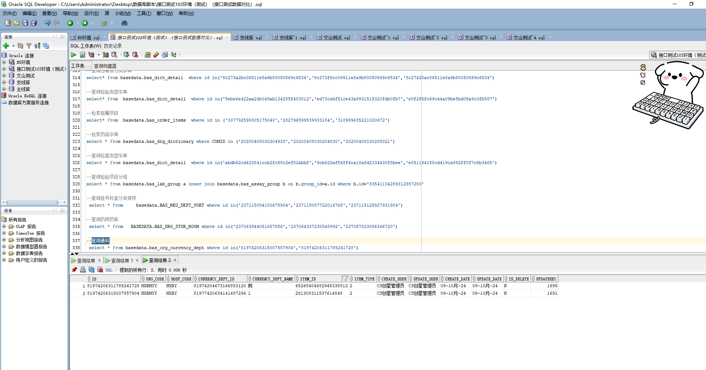

# 领域服务/基础领域 - 查询通科 - 查询通科 正向用例
## 请求参数：
``` json
{
  "hospCode": "NXRY",
  "pageIndex": 1,
  "orgCode": "NXRMYY",
  "pageSize": 3
}
```
## 返回参数：
``` json
{
    "exception": null,
    "apiCode": null,
    "data": {
        "list": [
            {
                "id": "81974206315007557904",
                "orgCode": "NXRMYY",
                "hospCode": "NXRY",
                "createDate": "2024-10-09 16:31:46",
                "updateDate": "2024-10-09 16:31:46",
                "isDelete": "N",
                "currencyDeptId": "81977420634141687296",
                "currencyDeptName": "1",
                "itemId": "281308311537614848",
                "itemType": "2",
                "deptId": "224707224106070016",
                "deptName": "120急救中心",
                "memberId": "281308311537614848",
                "memberName": "CS陈正好1",
                "createUserId": "CS创星管理员",
                "updateUserId": "CS创星管理员",
                "updatekey": 1691
            },
            {
                "id": "81974206311785241728",
                "orgCode": "NXRMYY",
                "hospCode": "NXRY",
                "createDate": "2024-10-09 16:33:03",
                "updateDate": "2024-10-09 16:33:03",
                "isDelete": "N",
                "currencyDeptId": "81974204673166853120",
                "currencyDeptName": "测",
                "itemId": "65268404682945338812",
                "itemType": "2",
                "deptId": "224707224106070016",
                "deptName": "120急救中心",
                "memberId": "65268404682945338812",
                "memberName": "张沿1",
                "createUserId": "CS创星管理员",
                "updateUserId": "CS创星管理员",
                "updatekey": 1695
            }
        ],
        "totalCount": 2,
        "pageSize": 3,
        "pageNo": 1,
        "pageCount": 1
    },
    "Code": 200,
    "Message": "操作成功"
}
```
## 数据校验：

# 领域服务/基础领域 - 查询通科 - 必填校验-[orgCode]为空
## 请求参数：
``` json
{
  "hospCode": "NXRY",
  "pageIndex": 1,
  "orgCode": "",
  "pageSize": 3,
  "memberIds": [
    "349365436797001728"
  ]
}
```
## 返回参数：
``` json
{
  "exception": null,
  "apiCode": null,
  "data": null,
  "Code": 1,
  "Message": "医院编码不能为空"
}
```
# 领域服务/基础领域 - 查询通科 - 必填校验-[hospCode]为空
## 请求参数：
``` json
{
  "hospCode": "",
  "pageIndex": 1,
  "orgCode": "NXRMYY",
  "pageSize": 3,
  "memberIds": [
    "349365436797001728"
  ]
}
```
## 返回参数：
``` json
{
  "exception": null,
  "apiCode": null,
  "data": null,
  "Code": 1,
  "Message": "院区编码不能为空"
}
```
# 领域服务/基础领域 - 查询通科 - 必填校验-[pageIndex]为空
## 请求参数：
``` json
{
  "hospCode": "NXRY",
  "pageIndex": null,
  "orgCode": "NXRMYY",
  "pageSize": 3,
  "memberIds": [
    "349365436797001728"
  ]
}
```
## 返回参数：
``` json
{
  "exception": null,
  "apiCode": null,
  "data": null,
  "Code": 1,
  "Message": "系统内部异常"
}
```
# 领域服务/基础领域 - 查询通科 - 必填校验-[pageSize]为空
## 请求参数：
``` json
{
  "hospCode": "NXRY",
  "pageIndex": 1,
  "orgCode": "NXRMYY",
  "pageSize": null,
  "memberIds": [
    "349365436797001728"
  ]
}
```
## 返回参数：
``` json
{
  "exception": null,
  "apiCode": null,
  "data": null,
  "Code": 1,
  "Message": "系统内部异常"
}
```
# 领域服务/基础领域 - 查询通科 - 类型校验-[pageSize]类型错误
## 请求参数：
``` json
{
  "hospCode": "NXRY",
  "pageIndex": 1,
  "orgCode": "NXRMYY",
  "pageSize": "abc",
  "memberIds": [
    "349365436797001728"
  ]
}
```
## 返回参数：
``` json
{
  "exception": null,
  "apiCode": null,
  "data": null,
  "Code": 1,
  "Message": "请求参数错误"
}
```
# 领域服务/基础领域 - 查询通科 - 类型校验-[pageIndex]类型错误
## 请求参数：
``` json
{
  "hospCode": "NXRY",
  "pageIndex": "abc",
  "orgCode": "NXRMYY",
  "pageSize": 3,
  "memberIds": [
    "349365436797001728"
  ]
}
```
## 返回参数：
``` json
{
  "exception": null,
  "apiCode": null,
  "data": null,
  "Code": 1,
  "Message": "请求参数错误"
}
```
# 领域服务/基础领域 - 查询通科 - 依赖用例-[orgCode]赋值为依赖用例测试值
## 请求参数：
``` json
{
  "hospCode": "NXRY",
  "pageIndex": 1,
  "orgCode": "依赖用例测试值",
  "pageSize": 3,
  "memberIds": [
    "349365436797001728"
  ]
}
```
## 返回参数：
``` json
{
  "exception": null,
  "apiCode": null,
  "data": {
    "list": [],
    "totalCount": 0,
    "pageSize": 3,
    "pageNo": 1,
    "pageCount": 0
  },
  "Code": 200,
  "Message": "操作成功"
}
```
# 领域服务/基础领域 - 查询通科 - 依赖用例-[hospCode]赋值为依赖用例测试值
## 请求参数：
``` json
{
  "hospCode": "依赖用例测试值",
  "pageIndex": 1,
  "orgCode": "NXRMYY",
  "pageSize": 3,
  "memberIds": [
    "349365436797001728"
  ]
}
```
## 返回参数：
``` json
{
  "exception": null,
  "apiCode": null,
  "data": {
    "list": [],
    "totalCount": 0,
    "pageSize": 3,
    "pageNo": 1,
    "pageCount": 0
  },
  "Code": 200,
  "Message": "操作成功"
}
```