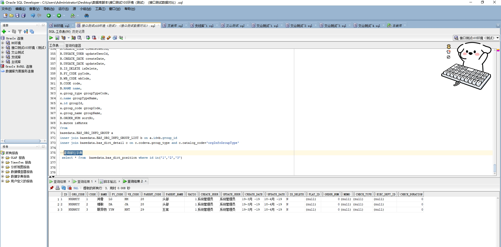

# 领域服务/基础领域 - 查询部位字典 - 查询部位字典 正向用例
## 请求参数：
``` json
{
  "isDelete": "N",
  "pageSize": 3,
  "pageIndex": 1,
  "orgCode": "NXRMYY",
  "keyword": ""
}
```
## 返回参数：
``` json
{
  "exception": null,
  "apiCode": null,
  "data": {
    "list": [
      {
        "id": "1",
        "orgCode": "NXRMYY",
        "isDelete": "N",
        "createDate": "2019-03-19 09:06:00",
        "updateDate": "2019-04-18 10:03:00",
        "code": "1",
        "name": "颅骨",
        "pyCode": "LG",
        "wbCode": "HM",
        "parentCode": "28",
        "parentName": "头部",
        "ratio": 1,
        "orderNum": 0,
        "memo": null,
        "createUserId": "系统管理员",
        "updateUserId": "系统管理员"
      },
      {
        "id": "3",
        "orgCode": "NXRMYY",
        "isDelete": "N",
        "createDate": "2019-03-19 09:06:00",
        "updateDate": "2019-04-18 10:03:00",
        "code": "3",
        "name": "眼异物",
        "pyCode": "YYW",
        "wbCode": "HNT",
        "parentCode": "29",
        "parentName": "五官",
        "ratio": 1,
        "orderNum": 0,
        "memo": null,
        "createUserId": "系统管理员",
        "updateUserId": "系统管理员"
      },
      {
        "id": "2",
        "orgCode": "NXRMYY",
        "isDelete": "N",
        "createDate": "2019-03-19 09:06:00",
        "updateDate": "2019-04-18 10:03:00",
        "code": "2",
        "name": "蝶鞍",
        "pyCode": "DA",
        "wbCode": "JA",
        "parentCode": "28",
        "parentName": "头部",
        "ratio": 1,
        "orderNum": 0,
        "memo": null,
        "createUserId": "系统管理员",
        "updateUserId": "系统管理员"
      }
    ],
    "totalCount": 372,
    "pageSize": 3,
    "pageNo": 1,
    "pageCount": 124
  },
  "Code": 200,
  "Message": "操作成功"
}
```
## 数据校验：

# 领域服务/基础领域 - 查询部位字典 - 必填校验-[orgCode]为空
## 请求参数：
``` json
{
  "isDelete": "N",
  "pageSize": 3,
  "pageIndex": 1,
  "orgCode": "",
  "keyword": ""
}
```
## 返回参数：
``` json
{
  "exception": null,
  "apiCode": null,
  "data": null,
  "Code": 1,
  "Message": "医院编码不能为空"
}
```
# 领域服务/基础领域 - 查询部位字典 - 必填校验-[pageIndex]为空
## 请求参数：
``` json
{
  "isDelete": "N",
  "pageSize": 3,
  "pageIndex": null,
  "orgCode": "NXRMYY",
  "keyword": ""
}
```
## 返回参数：
``` json
{
  "exception": null,
  "apiCode": null,
  "data": null,
  "Code": 1,
  "Message": "系统内部异常"
}
```
# 领域服务/基础领域 - 查询部位字典 - 必填校验-[pageSize]为空
## 请求参数：
``` json
{
  "isDelete": "N",
  "pageSize": null,
  "pageIndex": 1,
  "orgCode": "NXRMYY",
  "keyword": ""
}
```
## 返回参数：
``` json
{
  "exception": null,
  "apiCode": null,
  "data": null,
  "Code": 1,
  "Message": "系统内部异常"
}
```
# 领域服务/基础领域 - 查询部位字典 - 类型校验-[pageIndex]类型错误
## 请求参数：
``` json
{
  "isDelete": "N",
  "pageSize": 3,
  "pageIndex": "abc",
  "orgCode": "NXRMYY",
  "keyword": ""
}
```
## 返回参数：
``` json
{
  "exception": null,
  "apiCode": null,
  "data": null,
  "Code": 1,
  "Message": "请求参数错误"
}
```
# 领域服务/基础领域 - 查询部位字典 - 类型校验-[pageSize]类型错误
## 请求参数：
``` json
{
  "isDelete": "N",
  "pageSize": "abc",
  "pageIndex": 1,
  "orgCode": "NXRMYY",
  "keyword": ""
}
```
## 返回参数：
``` json
{
  "exception": null,
  "apiCode": null,
  "data": null,
  "Code": 1,
  "Message": "请求参数错误"
}
```
# 领域服务/基础领域 - 查询部位字典 - 依赖用例-[orgCode]赋值为依赖用例测试值
## 请求参数：
``` json
{
  "isDelete": "N",
  "pageSize": 3,
  "pageIndex": 1,
  "orgCode": "依赖用例测试值",
  "keyword": ""
}
```
## 返回参数：
``` json
{
  "exception": null,
  "apiCode": null,
  "data": {
    "list": [],
    "totalCount": 0,
    "pageSize": 3,
    "pageNo": 1,
    "pageCount": 0
  },
  "Code": 200,
  "Message": "操作成功"
}
```