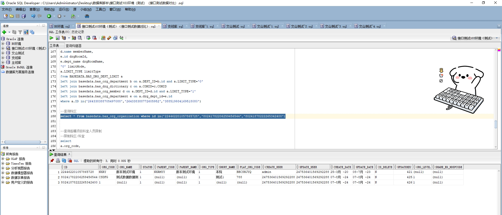

# 领域服务/基础领域 - 查询院区 - 查询院区 正向用例
## 请求参数：
``` json
{
  "pageSize": 3,
  "pageIndex": 1
}
```
## 返回参数：
``` json
{
  "exception": null,
  "apiCode": null,
  "data": {
    "list": [
      {
        "id": "224462201057865728",
        "createDate": "2020-03-25 17:32:39",
        "createUserId": "admin",
        "hospCode": null,
        "hospName": null,
        "isDelete": "N",
        "orgCode": "NXRY",
        "orgName": "版本测试环境",
        "parentCode": "NXRMYY",
        "parentName": "版本测试环境",
        "status": "1",
        "updateDate": "2023-07-08 10:50:07",
        "updateUserId": "247536401569292288"
      },
      {
        "id": "80241782206259456544",
        "createDate": "2024-08-07 17:11:02",
        "createUserId": "247536401569292288",
        "hospCode": null,
        "hospName": null,
        "isDelete": "N",
        "orgCode": "CSDFG",
        "orgName": "测试数据数据测",
        "parentCode": null,
        "parentName": null,
        "status": "1",
        "updateDate": "2024-08-07 17:25:15",
        "updateUserId": "247536401569292288"
      },
      {
        "id": "80241878222265342400",
        "createDate": "2024-08-07 17:18:30",
        "createUserId": "247536401569292288",
        "hospCode": null,
        "hospName": null,
        "isDelete": "N",
        "orgCode": "1",
        "orgName": null,
        "parentCode": null,
        "parentName": null,
        "status": "1",
        "updateDate": "2024-08-07 17:18:30",
        "updateUserId": "247536401569292288"
      }
    ],
    "totalCount": 16,
    "pageSize": 1,
    "pageNo": 3,
    "pageCount": 6
  },
  "Code": 200,
  "Message": "操作成功"
}
```
## 数据校验：




# 领域服务/基础领域 - 查询院区 - 必填校验-[pageIndex]为空
## 请求参数：
``` json
{
  "pageSize": 3,
  "pageIndex": null
}
```
## 返回参数：
``` json
{
  "exception": null,
  "apiCode": null,
  "data": null,
  "Code": 1,
  "Message": null
}
```
# 领域服务/基础领域 - 查询院区 - 必填校验-[pageSize]为空
## 请求参数：
``` json
{
  "pageSize": null,
  "pageIndex": 1
}
```
## 返回参数：
``` json
{
  "exception": null,
  "apiCode": null,
  "data": null,
  "Code": 1,
  "Message": null
}
```
# 领域服务/基础领域 - 查询院区 - 类型校验-[pageIndex]类型错误
## 请求参数：
``` json
{
  "pageSize": 3,
  "pageIndex": "abc"
}
```
## 返回参数：
``` json
{
  "exception": null,
  "apiCode": null,
  "data": null,
  "Code": 1,
  "Message": "请求参数错误"
}
```
# 领域服务/基础领域 - 查询院区 - 类型校验-[pageSize]类型错误
## 请求参数：
``` json
{
  "pageSize": "abc",
  "pageIndex": 1
}
```
## 返回参数：
``` json
{
  "exception": null,
  "apiCode": null,
  "data": null,
  "Code": 1,
  "Message": "请求参数错误"
}
```