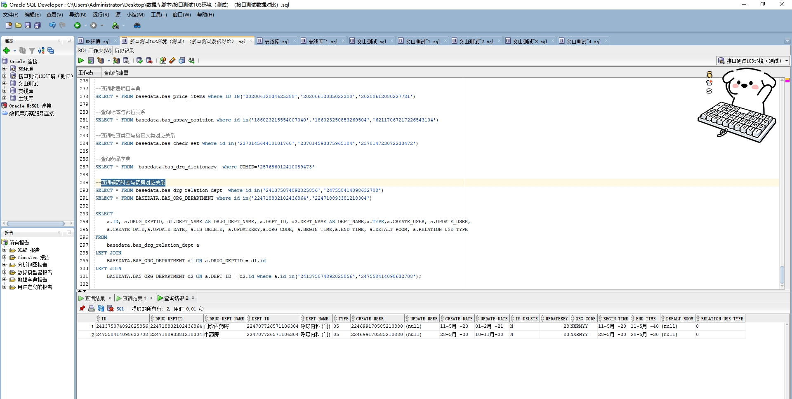

# 领域服务/基础领域 - 查询领药科室与药房对应关系 - 查询领药科室与药房对应关系 正向用例
## 请求参数：
``` json
{
  "pageIndex": 1,
  "orgCode": "NXRMYY",
  "pageSize": 3,
  "deptIds": [
    "224707726571106304"
  ]
}
```
## 返回参数：
``` json
{
  "exception": null,
  "apiCode": null,
  "data": {
    "list": [
      {
        "id": "241375074892025856",
        "orgCode": "NXRMYY",
        "hospCode": null,
        "createDate": "2020-05-11 09:38:22",
        "updateDate": "2021-02-01 15:42:24",
        "isDelete": "N",
        "deptId": "224707726571106304",
        "beginTime": "2020-05-11 00:00:00",
        "endTime": "2040-05-11 23:59:59",
        "defaltRoom": null,
        "deptName": "呼吸内科(门)",
        "drgRoomDeptName": "门诊西药房",
        "workTimes": [
          {
            "endTime": "11:59:59",
            "relationId": "241375074892025856",
            "startTime": "12:00:00"
          }
        ],
        "createUserId": "224699170585210880",
        "updateUserId": null,
        "drgRoomDeptId": "224718832102436864",
        "relationType": "05",
        "updatekey": 28,
        "range": "0"
      },
      {
        "id": "247558414098632708",
        "orgCode": "NXRMYY",
        "hospCode": null,
        "createDate": "2020-05-28 11:08:45",
        "updateDate": "2020-11-10 14:26:58",
        "isDelete": "N",
        "deptId": "224707726571106304",
        "beginTime": "2020-05-28 00:00:00",
        "endTime": "2030-05-28 23:59:59",
        "defaltRoom": null,
        "deptName": "呼吸内科(门)",
        "drgRoomDeptName": "中药房",
        "workTimes": [
          {
            "endTime": "11:59:59",
            "relationId": "247558414098632708",
            "startTime": "12:00:00"
          }
        ],
        "createUserId": "224699170585210880",
        "updateUserId": null,
        "drgRoomDeptId": "224718893381218304",
        "relationType": "05",
        "updatekey": 83,
        "range": "0"
      }
    ],
    "totalCount": 2,
    "pageSize": 3,
    "pageNo": 1,
    "pageCount": 1
  },
  "Code": 200,
  "Message": "操作成功"
}
```
## 数据校验：

# 领域服务/基础领域 - 查询领药科室与药房对应关系 - 必填校验-[orgCode]为空
## 请求参数：
``` json
{
  "pageIndex": 1,
  "orgCode": "",
  "pageSize": 3,
  "deptIds": [
    "224707726571106304"
  ]
}
```
## 返回参数：
``` json
{
  "exception": null,
  "apiCode": null,
  "data": null,
  "Code": 1,
  "Message": "医院编码不能为空"
}
```
# 领域服务/基础领域 - 查询领药科室与药房对应关系 - 必填校验-[pageIndex]为空
## 请求参数：
``` json
{
  "pageIndex": null,
  "orgCode": "NXRMYY",
  "pageSize": 3,
  "deptIds": [
    "224707726571106304"
  ]
}
```
## 返回参数：
``` json
{
  "exception": null,
  "apiCode": null,
  "data": null,
  "Code": 1,
  "Message": "系统内部异常"
}
```
# 领域服务/基础领域 - 查询领药科室与药房对应关系 - 必填校验-[pageSize]为空
## 请求参数：
``` json
{
  "pageIndex": 1,
  "orgCode": "NXRMYY",
  "pageSize": null,
  "deptIds": [
    "224707726571106304"
  ]
}
```
## 返回参数：
``` json
{
  "exception": null,
  "apiCode": null,
  "data": null,
  "Code": 1,
  "Message": "系统内部异常"
}
```
# 领域服务/基础领域 - 查询领药科室与药房对应关系 - 类型校验-[pageSize]类型错误
## 请求参数：
``` json
{
  "pageIndex": 1,
  "orgCode": "NXRMYY",
  "pageSize": "abc",
  "deptIds": [
    "224707726571106304"
  ]
}
```
## 返回参数：
``` json
{
  "exception": null,
  "apiCode": null,
  "data": null,
  "Code": 1,
  "Message": "请求参数错误"
}
```
# 领域服务/基础领域 - 查询领药科室与药房对应关系 - 类型校验-[pageIndex]类型错误
## 请求参数：
``` json
{
  "pageIndex": "abc",
  "orgCode": "NXRMYY",
  "pageSize": 3,
  "deptIds": [
    "224707726571106304"
  ]
}
```
## 返回参数：
``` json
{
  "exception": null,
  "apiCode": null,
  "data": null,
  "Code": 1,
  "Message": "请求参数错误"
}
```
# 领域服务/基础领域 - 查询领药科室与药房对应关系 - 依赖用例-[orgCode]赋值为依赖用例测试值
## 请求参数：
``` json
{
  "pageIndex": 1,
  "orgCode": "依赖用例测试值",
  "pageSize": 3,
  "deptIds": [
    "224707726571106304"
  ]
}
```
## 返回参数：
``` json
{
  "exception": null,
  "apiCode": null,
  "data": {
    "list": [],
    "totalCount": 0,
    "pageSize": 3,
    "pageNo": 1,
    "pageCount": 0
  },
  "Code": 200,
  "Message": "操作成功"
}
```