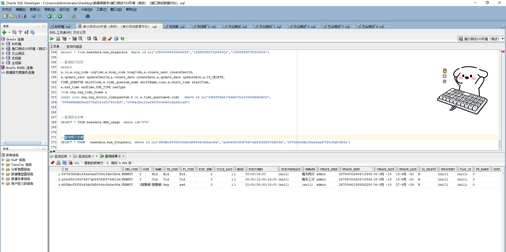

# 领域服务/基础领域 - 查询频次字典 - 查询频次字典 正向用例
## 请求参数：
``` json
{
  "pageIndex": 1,
  "orgCode": "NXRMYY",
  "pageSize": 3
}
```
## 返回参数：
``` json
{
    "exception": null,
    "apiCode": null,
    "data": {
        "list": [
            {
                "code": "1阿斯顿",
                "createDate": "2019-03-06 13:39:40",
                "createUserId": "admin",
                "cycleDays": 1,
                "execNum": 3,
                "execTimes": "01:00/08:30/16:00",
                "execWeekDays": null,
                "frRange": "0",
                "id": "d8fdbcf535fc43dc8d56844c0b6ac96a",
                "isDelete": "N",
                "mode": "1",
                "name": "阿斯顿",
                "orgCode": "NXRMYY",
                "pyCode": "asd",
                "remark": null,
                "sortNo": 1,
                "updateDate": "2024-09-27 16:24:28",
                "updateUserId": "247536401569292288",
                "wbCode": "bag"
            },
            {
                "code": "3",
                "createDate": "2019-03-06 13:39:40",
                "createUserId": "admin",
                "cycleDays": 1,
                "execNum": 3,
                "execTimes": "08:00/12:00/16:00",
                "execWeekDays": null,
                "frRange": "0",
                "id": "a244456158d74407abf40fd8576df15d",
                "isDelete": "N",
                "mode": "1",
                "name": "Tid",
                "orgCode": "NXRMYY",
                "pyCode": "Tid",
                "remark": "每天三次",
                "sortNo": 0,
                "updateDate": "2020-06-19 23:46:01",
                "updateUserId": "247560932484718592",
                "wbCode": "Tid"
            },
            {
                "code": "2",
                "createDate": "2019-03-06 13:39:40",
                "createUserId": "admin",
                "cycleDays": 1,
                "execNum": 2,
                "execTimes": "08:00/16:00",
                "execWeekDays": null,
                "frRange": "0",
                "id": "897520b5db1f42a8aad70f41fab03b3a",
                "isDelete": "N",
                "mode": "1",
                "name": "Bid",
                "orgCode": "NXRMYY",
                "pyCode": "Bid",
                "remark": "每天两次",
                "sortNo": 0,
                "updateDate": "2020-06-19 23:45:52",
                "updateUserId": "247560932484718592",
                "wbCode": "Bid"
            }
        ],
        "totalCount": 97,
        "pageSize": 1,
        "pageNo": 3,
        "pageCount": 33
    },
    "Code": 200,
    "Message": "操作成功"
}
```
## 数据校验：

# 领域服务/基础领域 - 查询频次字典 - 必填校验-[orgCode]为空
## 请求参数：
``` json
{
  "pageIndex": 1,
  "orgCode": "",
  "pageSize": 3,
  "ids": [
    null
  ]
}
```
## 返回参数：
``` json
{
  "exception": null,
  "apiCode": null,
  "data": null,
  "Code": 1,
  "Message": "医院编码不可为空"
}
```
# 领域服务/基础领域 - 查询频次字典 - 必填校验-[pageIndex]为空
## 请求参数：
``` json
{
  "pageIndex": null,
  "orgCode": "NXRMYY",
  "pageSize": 3,
  "ids": [
    null
  ]
}
```
## 返回参数：
``` json
{
  "exception": null,
  "apiCode": null,
  "data": null,
  "Code": 1,
  "Message": "系统内部异常"
}
```
# 领域服务/基础领域 - 查询频次字典 - 必填校验-[pageSize]为空
## 请求参数：
``` json
{
  "pageIndex": 1,
  "orgCode": "NXRMYY",
  "pageSize": null,
  "ids": [
    null
  ]
}
```
## 返回参数：
``` json
{
  "exception": null,
  "apiCode": null,
  "data": null,
  "Code": 1,
  "Message": "系统内部异常"
}
```
# 领域服务/基础领域 - 查询频次字典 - 类型校验-[pageSize]类型错误
## 请求参数：
``` json
{
  "pageIndex": 1,
  "orgCode": "NXRMYY",
  "pageSize": "abc",
  "ids": [
    null
  ]
}
```
## 返回参数：
``` json
{
  "exception": null,
  "apiCode": null,
  "data": null,
  "Code": 1,
  "Message": "请求参数错误"
}
```
# 领域服务/基础领域 - 查询频次字典 - 类型校验-[pageIndex]类型错误
## 请求参数：
``` json
{
  "pageIndex": "abc",
  "orgCode": "NXRMYY",
  "pageSize": 3,
  "ids": [
    null
  ]
}
```
## 返回参数：
``` json
{
  "exception": null,
  "apiCode": null,
  "data": null,
  "Code": 1,
  "Message": "请求参数错误"
}
```
# 领域服务/基础领域 - 查询频次字典 - 依赖用例-[orgCode]赋值为依赖用例测试值
## 请求参数：
``` json
{
  "pageIndex": 1,
  "orgCode": "依赖用例测试值",
  "pageSize": 3,
  "ids": [
    null
  ]
}
```
## 返回参数：
``` json
{
  "exception": null,
  "apiCode": null,
  "data": {
    "list": [],
    "totalCount": 0,
    "pageSize": 1,
    "pageNo": 3,
    "pageCount": 0
  },
  "Code": 200,
  "Message": "操作成功"
}
```