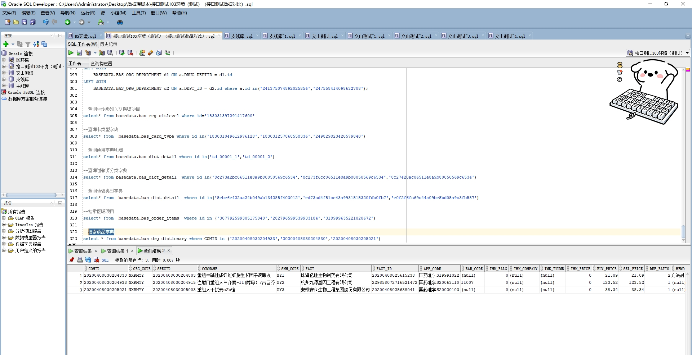

# 领域服务/基础领域 - 检索药品字典 - 检索药品字典 正向用例
## 请求参数：
``` json
{
  "hospCode": "NXRY",
  "orgCode": "NXRMYY",
  "pageSize": 3,
  "pageIndex": 1
}
```
## 返回参数：
``` json
{
  "exception": null,
  "apiCode": null,
  "data": {
    "list": [
      {
        "id": "20200408030204933",
        "orgCode": "NXRMYY",
        "hospCode": null,
        "createDate": null,
        "updateDate": null,
        "isDelete": null,
        "chemicalName": "注射用重组人白介素-11(酵母）/吉巨芬",
        "comName": "注射用重组人白介素-11(酵母）/吉巨芬",
        "dosageFormName": "冻干粉针",
        "drgSubTypeName": "外购西药",
        "drgTypeName": "西药",
        "englishName": null,
        "factName": "杭州九源基因工程有限公司",
        "pyCode": "zsyzzrbjs11jmjjf,ZZRBXBJS11ZS",
        "pyCodeOfSpec": "zsyczrbjs11jmjjf",
        "selPrice": 123.52,
        "shhCode": "XY2",
        "specDesc": "1.5mg/瓶",
        "specId": "20200408030204915",
        "unitName": "瓶",
        "wbCode": "itetxwrwg11sxfaa,ZZRBXBJS11ZS",
        "wbCodeOfSpec": "itetxwrwg11sxfaa",
        "createUserId": null,
        "updateUserId": null
      },
      {
        "id": "20200408030204830",
        "orgCode": "NXRMYY",
        "hospCode": null,
        "createDate": null,
        "updateDate": null,
        "isDelete": null,
        "chemicalName": "牛碱性成纤维细胞生长因子滴眼液",
        "comName": "重组牛碱性成纤维细胞生长因子滴眼液",
        "dosageFormName": "滴眼剂",
        "drgSubTypeName": "外购西药",
        "drgTypeName": "西药",
        "englishName": null,
        "factName": "珠海亿胜生物制药有限公司",
        "pyCode": "ZZNJXCXWXBSZYZDYY",
        "pyCodeOfSpec": "njxcxwxbscyzdyy",
        "selPrice": 21.09,
        "shhCode": "XY1",
        "specDesc": "21000IU:5ml/支",
        "specId": "20200408030204803",
        "unitName": "支",
        "wbCode": "ZZNJXCXWXBSZYZDYY",
        "wbCodeOfSpec": "rdndxxxettlbihi",
        "createUserId": null,
        "updateUserId": null
      },
      {
        "id": "20200408030205021",
        "orgCode": "NXRMYY",
        "hospCode": null,
        "createDate": null,
        "updateDate": null,
        "isDelete": null,
        "chemicalName": "重组人干扰素α2b栓",
        "comName": "重组人干扰素α2b栓",
        "dosageFormName": "栓剂",
        "drgSubTypeName": "外购西药",
        "drgTypeName": "西药",
        "englishName": null,
        "factName": "安徽安科生物工程集团股份有限公司",
        "pyCode": "ZZRGRS2BS",
        "pyCodeOfSpec": "CZRGRS2BS",
        "selPrice": 38.34,
        "shhCode": "XY3",
        "specDesc": "0.1MIU*10粒/盒",
        "specId": "20200408030205003",
        "unitName": "盒",
        "wbCode": "ZZRGRS2BS",
        "wbCodeOfSpec": "ADFS",
        "createUserId": null,
        "updateUserId": null
      }
    ],
    "totalCount": 1608,
    "pageSize": 3,
    "pageNo": 1,
    "pageCount": 536
  },
  "Code": 200,
  "Message": "操作成功"
}
```
## 数据校验：

# 领域服务/基础领域 - 检索药品字典 - 必填校验-[orgCode]为空
## 请求参数：
``` json
{
  "hospCode": "NXRY",
  "orgCode": "",
  "pageSize": 3,
  "pageIndex": 1
}
```
## 返回参数：
``` json
{
  "exception": null,
  "apiCode": null,
  "data": null,
  "Code": 1,
  "Message": "医院编码不能为空"
}
```
# 领域服务/基础领域 - 检索药品字典 - 必填校验-[pageIndex]为空
## 请求参数：
``` json
{
  "hospCode": "NXRY",
  "orgCode": "NXRMYY",
  "pageSize": 3,
  "pageIndex": null
}
```
## 返回参数：
``` json
{
  "exception": null,
  "apiCode": null,
  "data": null,
  "Code": 1,
  "Message": "系统内部异常"
}
```
# 领域服务/基础领域 - 检索药品字典 - 必填校验-[pageSize]为空
## 请求参数：
``` json
{
  "hospCode": "NXRY",
  "orgCode": "NXRMYY",
  "pageSize": null,
  "pageIndex": 1
}
```
## 返回参数：
``` json
{
  "exception": null,
  "apiCode": null,
  "data": null,
  "Code": 1,
  "Message": "系统内部异常"
}
```
# 领域服务/基础领域 - 检索药品字典 - 类型校验-[pageIndex]类型错误
## 请求参数：
``` json
{
  "hospCode": "NXRY",
  "orgCode": "NXRMYY",
  "pageSize": 3,
  "pageIndex": "abc"
}
```
## 返回参数：
``` json
{
  "exception": null,
  "apiCode": null,
  "data": null,
  "Code": 1,
  "Message": "请求参数错误"
}
```
# 领域服务/基础领域 - 检索药品字典 - 类型校验-[pageSize]类型错误
## 请求参数：
``` json
{
  "hospCode": "NXRY",
  "orgCode": "NXRMYY",
  "pageSize": "abc",
  "pageIndex": 1
}
```
## 返回参数：
``` json
{
  "exception": null,
  "apiCode": null,
  "data": null,
  "Code": 1,
  "Message": "请求参数错误"
}
```
# 领域服务/基础领域 - 检索药品字典 - 依赖用例-[orgCode]赋值为依赖用例测试值
## 请求参数：
``` json
{
  "hospCode": "NXRY",
  "orgCode": "依赖用例测试值",
  "pageSize": 3,
  "pageIndex": 1
}
```
## 返回参数：
``` json
{
  "exception": null,
  "apiCode": null,
  "data": {
    "list": [],
    "totalCount": 0,
    "pageSize": 3,
    "pageNo": 1,
    "pageCount": 0
  },
  "Code": 200,
  "Message": "操作成功"
}
```