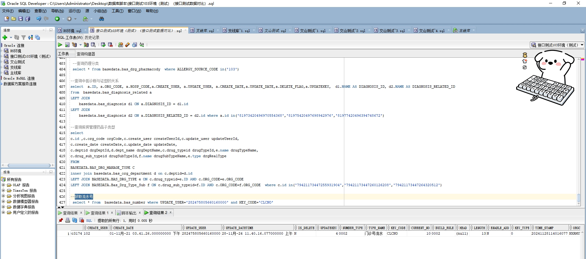

# 领域服务/基础领域 - 获取流水号 - 获取流水号 正向用例
## 请求参数：
``` json
{
  "keyCode": "CLCNO",
  "hospCode": "NXRY",
  "orgCode": "NXRMYY",
  "operatorId": "282475805660160000",
  "operatorName": "CS彭彭彭"
}
```
## 返回参数：
``` json
{
  "exception": null,
  "apiCode": null,
  "data": "2024112800006",
  "Code": 200,
  "Message": "操作成功"
}
```
## 数据校验：

# 领域服务/基础领域 - 获取流水号 - 必填校验-[orgCode]为空
## 请求参数：
``` json
{
  "keyCode": "CLCNO",
  "hospCode": "NXRY",
  "orgCode": "",
  "operatorId": "282475805660160000",
  "operatorName": "CS彭彭彭"
}
```
## 返回参数：
``` json
{
  "exception": null,
  "apiCode": null,
  "data": null,
  "Code": 1,
  "Message": "医院编码不能为空"
}
```
# 领域服务/基础领域 - 获取流水号 - 必填校验-[hospCode]为空
## 请求参数：
``` json
{
  "keyCode": "CLCNO",
  "hospCode": "",
  "orgCode": "NXRMYY",
  "operatorId": "282475805660160000",
  "operatorName": "CS彭彭彭"
}
```
## 返回参数：
``` json
{
  "exception": null,
  "apiCode": null,
  "data": null,
  "Code": 1,
  "Message": "院区编码不能为空"
}
```
# 领域服务/基础领域 - 获取流水号 - 必填校验-[operatorId]为空
## 请求参数：
``` json
{
  "keyCode": "CLCNO",
  "hospCode": "NXRY",
  "orgCode": "NXRMYY",
  "operatorId": "",
  "operatorName": "CS彭彭彭"
}
```
## 返回参数：
``` json
{
  "exception": null,
  "apiCode": null,
  "data": null,
  "Code": 1,
  "Message": "操作人id不能为空"
}
```
# 领域服务/基础领域 - 获取流水号 - 必填校验-[operatorName]为空
## 请求参数：
``` json
{
  "keyCode": "CLCNO",
  "hospCode": "NXRY",
  "orgCode": "NXRMYY",
  "operatorId": "282475805660160000",
  "operatorName": ""
}
```
## 返回参数：
``` json
{
  "exception": null,
  "apiCode": null,
  "data": null,
  "Code": 1,
  "Message": "操作人姓名不能为空"
}
```
# 领域服务/基础领域 - 获取流水号 - 必填校验-[keyCode]为空
## 请求参数：
``` json
{
  "keyCode": "",
  "hospCode": "NXRY",
  "orgCode": "NXRMYY",
  "operatorId": "282475805660160000",
  "operatorName": "CS彭彭彭"
}
```
## 返回参数：
``` json
{
  "exception": null,
  "apiCode": null,
  "data": null,
  "Code": 1,
  "Message": "流水号编码不能为空"
}
```
# 领域服务/基础领域 - 获取流水号 - 枚举用例-[keyCode] 枚举值为 CLCNO(流水号编码为门诊号流水)
## 请求参数：
``` json
{
  "keyCode": "CLCNO",
  "hospCode": "NXRY",
  "orgCode": "NXRMYY",
  "operatorId": "282475805660160000",
  "operatorName": "CS彭彭彭"
}
```
## 返回参数：
``` json
{
  "exception": null,
  "apiCode": null,
  "data": "2024112800007",
  "Code": 200,
  "Message": "操作成功"
}
```
# 领域服务/基础领域 - 获取流水号 - 枚举用例-[keyCode] 枚举值为 PATNO(流水号编码为病人编码流水)
## 请求参数：
``` json
{
  "keyCode": "PATNO",
  "hospCode": "NXRY",
  "orgCode": "NXRMYY",
  "operatorId": "282475805660160000",
  "operatorName": "CS彭彭彭"
}
```
## 返回参数：
``` json
{
  "exception": null,
  "apiCode": null,
  "data": "2024112801",
  "Code": 200,
  "Message": "操作成功"
}
```
# 领域服务/基础领域 - 获取流水号 - 枚举用例-[keyCode] 枚举值为 IPTNO(流水号编码为住院号流水)
## 请求参数：
``` json
{
  "keyCode": "IPTNO",
  "hospCode": "NXRY",
  "orgCode": "NXRMYY",
  "operatorId": "282475805660160000",
  "operatorName": "CS彭彭彭"
}
```
## 返回参数：
``` json
{
  "exception": null,
  "apiCode": null,
  "data": "2411280001",
  "Code": 200,
  "Message": "操作成功"
}
```
# 领域服务/基础领域 - 获取流水号 - 依赖用例-[operatorName]赋值为依赖用例测试值
## 请求参数：
``` json
{
  "keyCode": "CLCNO",
  "hospCode": "NXRY",
  "orgCode": "NXRMYY",
  "operatorId": "282475805660160000",
  "operatorName": "依赖用例测试值"
}
```
## 返回参数：
``` json
{
  "exception": null,
  "apiCode": null,
  "data": "2024112800008",
  "Code": 200,
  "Message": "操作成功"
}
```
# 领域服务/基础领域 - 获取流水号 - 依赖用例-[operatorId]赋值为依赖用例测试值
## 请求参数：
``` json
{
  "keyCode": "CLCNO",
  "hospCode": "NXRY",
  "orgCode": "NXRMYY",
  "operatorId": "依赖用例测试值",
  "operatorName": "CS彭彭彭"
}
```
## 返回参数：
``` json
{
  "exception": null,
  "apiCode": null,
  "data": "2024112800009",
  "Code": 200,
  "Message": "操作成功"
}
```
# 领域服务/基础领域 - 获取流水号 - 依赖用例-[orgCode]赋值为依赖用例测试值
## 请求参数：
``` json
{
  "keyCode": "CLCNO",
  "hospCode": "NXRY",
  "orgCode": "依赖用例测试值",
  "operatorId": "282475805660160000",
  "operatorName": "CS彭彭彭"
}
```
## 返回参数：
``` json
{
  "exception": null,
  "apiCode": null,
  "data": null,
  "Code": 400,
  "Message": "找不到流水号信息"
}
```
# 领域服务/基础领域 - 获取流水号 - 依赖用例-[hospCode]赋值为依赖用例测试值
## 请求参数：
``` json
{
  "keyCode": "CLCNO",
  "hospCode": "依赖用例测试值",
  "orgCode": "NXRMYY",
  "operatorId": "282475805660160000",
  "operatorName": "CS彭彭彭"
}
```
## 返回参数：
``` json
{
  "exception": null,
  "apiCode": null,
  "data": "2024112800010",
  "Code": 200,
  "Message": "操作成功"
}
```
# 领域服务/基础领域 - 获取流水号 - 依赖用例-[keyCode]赋值为依赖用例测试值
## 请求参数：
``` json
{
  "keyCode": "依赖用例测试值",
  "hospCode": "NXRY",
  "orgCode": "NXRMYY",
  "operatorId": "282475805660160000",
  "operatorName": "CS彭彭彭"
}
```
## 返回参数：
``` json
{
  "exception": null,
  "apiCode": null,
  "data": null,
  "Code": 400,
  "Message": "找不到流水号信息"
}
```