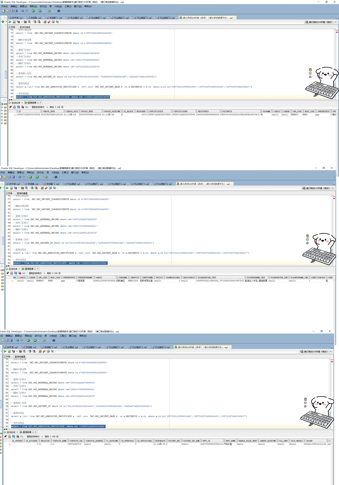

# 领域服务/基础领域 - 保存住院证 - 保存住院证 正向用例
## 请求参数：
``` json
{
  "patCertInfo": {
    "isCrossed": "0",
    "deptName": "产科诊室",
    "patientId": "93587a7c8028404c85b09f8bc9803a7c",
    "idCard": "430421199912121122",
    "source": 1,
    "inStatus": 1,
    "contactRelation": "11",
    "visitId": "1846383645695455234",
    "isOperToday": "0",
    "isChemoraDiotherapy": "0",
    "isAccident": "0",
    "isIndept": 0,
    "contactTelephone": "15574246715",
    "contactName": "111",
    "deptId": "224708989908054016",
    "diagnosis": "手术诊断",
    "wardId": "229431208567533568",
    "presenterName": "CS彭彭彭",
    "hasMedInsure": 0,
    "diagnoseWestId": "185688604210659328,78719228158610657280",
    "wardName": "妇科病区",
    "inMode": 1,
    "name": "与",
    "visitNo": "2024101600001",
    "birthday": "1999-12-12 00:00:00",
    "suggestInDate": "2024-02-19 16:38:31",
    "settleTypeCode": "0",
    "inDeptId": "NXRY1508",
    "inTimes": 1,
    "isGestational": "0",
    "advancePayment": 0,
    "diagnoseChnName": "",
    "isSingleDisease": "0",
    "presenterId": "ppp",
    "inDeptName": "妇科专家诊室",
    "sex": "2",
    "isIcu": "0",
    "diagnoseWestName": "硅油注入术后,微创修复",
    "diagnoseChnId": "",
    "attention": ""
  },
  "hospCode": "NXRY",
  "orgCode": "NXRMYY",
  "operatorId": "282475805660160000",
  "operatorName": "CS彭彭彭"
}
```
## 返回参数：
``` json
{
  "exception": null,
  "apiCode": null,
  "data": "1859471424830676994",
  "Code": 200,
  "Message": "操作成功"
}
```
## 数据校验：



# 领域服务/基础领域 - 保存住院证 - 必填校验-[orgCode]为空
## 请求参数：
``` json
{
  "patCertInfo": {
    "isCrossed": "0",
    "deptName": "产科诊室",
    "patientId": "93587a7c8028404c85b09f8bc9803a7c",
    "idCard": "430421199912121122",
    "source": 1,
    "inStatus": 1,
    "contactRelation": "11",
    "visitId": "1846383645695455234",
    "isOperToday": "0",
    "isChemoraDiotherapy": "0",
    "isAccident": "0",
    "isIndept": 0,
    "contactTelephone": "15574246715",
    "contactName": "111",
    "deptId": "224708989908054016",
    "diagnosis": "手术诊断",
    "wardId": "229431208567533568",
    "presenterName": "CS彭彭彭",
    "hasMedInsure": 0,
    "diagnoseWestId": "185688604210659328,78719228158610657280",
    "wardName": "妇科病区",
    "inMode": 1,
    "name": "与",
    "visitNo": "2024101600001",
    "birthday": "1999-12-12 00:00:00",
    "suggestInDate": "2024-02-19 16:38:31",
    "settleTypeCode": "0",
    "inDeptId": "NXRY1508",
    "inTimes": 1,
    "isGestational": "0",
    "advancePayment": 0,
    "diagnoseChnName": "",
    "isSingleDisease": "0",
    "presenterId": "ppp",
    "inDeptName": "妇科专家诊室",
    "sex": "2",
    "isIcu": "0",
    "diagnoseWestName": "硅油注入术后,微创修复",
    "diagnoseChnId": "",
    "attention": ""
  },
  "hospCode": "NXRY",
  "orgCode": "",
  "operatorId": "282475805660160000",
  "operatorName": "CS彭彭彭"
}
```
## 返回参数：
``` json
{
  "exception": null,
  "apiCode": null,
  "data": null,
  "Code": 1,
  "Message": "医院编码不能为空"
}
```
# 领域服务/基础领域 - 保存住院证 - 必填校验-[hospCode]为空
## 请求参数：
``` json
{
  "patCertInfo": {
    "isCrossed": "0",
    "deptName": "产科诊室",
    "patientId": "93587a7c8028404c85b09f8bc9803a7c",
    "idCard": "430421199912121122",
    "source": 1,
    "inStatus": 1,
    "contactRelation": "11",
    "visitId": "1846383645695455234",
    "isOperToday": "0",
    "isChemoraDiotherapy": "0",
    "isAccident": "0",
    "isIndept": 0,
    "contactTelephone": "15574246715",
    "contactName": "111",
    "deptId": "224708989908054016",
    "diagnosis": "手术诊断",
    "wardId": "229431208567533568",
    "presenterName": "CS彭彭彭",
    "hasMedInsure": 0,
    "diagnoseWestId": "185688604210659328,78719228158610657280",
    "wardName": "妇科病区",
    "inMode": 1,
    "name": "与",
    "visitNo": "2024101600001",
    "birthday": "1999-12-12 00:00:00",
    "suggestInDate": "2024-02-19 16:38:31",
    "settleTypeCode": "0",
    "inDeptId": "NXRY1508",
    "inTimes": 1,
    "isGestational": "0",
    "advancePayment": 0,
    "diagnoseChnName": "",
    "isSingleDisease": "0",
    "presenterId": "ppp",
    "inDeptName": "妇科专家诊室",
    "sex": "2",
    "isIcu": "0",
    "diagnoseWestName": "硅油注入术后,微创修复",
    "diagnoseChnId": "",
    "attention": ""
  },
  "hospCode": "",
  "orgCode": "NXRMYY",
  "operatorId": "282475805660160000",
  "operatorName": "CS彭彭彭"
}
```
## 返回参数：
``` json
{
  "exception": null,
  "apiCode": null,
  "data": null,
  "Code": 1,
  "Message": "院区编码不能为空"
}
```
# 领域服务/基础领域 - 保存住院证 - 必填校验-[operatorId]为空
## 请求参数：
``` json
{
  "patCertInfo": {
    "isCrossed": "0",
    "deptName": "产科诊室",
    "patientId": "93587a7c8028404c85b09f8bc9803a7c",
    "idCard": "430421199912121122",
    "source": 1,
    "inStatus": 1,
    "contactRelation": "11",
    "visitId": "1846383645695455234",
    "isOperToday": "0",
    "isChemoraDiotherapy": "0",
    "isAccident": "0",
    "isIndept": 0,
    "contactTelephone": "15574246715",
    "contactName": "111",
    "deptId": "224708989908054016",
    "diagnosis": "手术诊断",
    "wardId": "229431208567533568",
    "presenterName": "CS彭彭彭",
    "hasMedInsure": 0,
    "diagnoseWestId": "185688604210659328,78719228158610657280",
    "wardName": "妇科病区",
    "inMode": 1,
    "name": "与",
    "visitNo": "2024101600001",
    "birthday": "1999-12-12 00:00:00",
    "suggestInDate": "2024-02-19 16:38:31",
    "settleTypeCode": "0",
    "inDeptId": "NXRY1508",
    "inTimes": 1,
    "isGestational": "0",
    "advancePayment": 0,
    "diagnoseChnName": "",
    "isSingleDisease": "0",
    "presenterId": "ppp",
    "inDeptName": "妇科专家诊室",
    "sex": "2",
    "isIcu": "0",
    "diagnoseWestName": "硅油注入术后,微创修复",
    "diagnoseChnId": "",
    "attention": ""
  },
  "hospCode": "NXRY",
  "orgCode": "NXRMYY",
  "operatorId": "",
  "operatorName": "CS彭彭彭"
}
```
## 返回参数：
``` json
{
  "exception": null,
  "apiCode": null,
  "data": null,
  "Code": 1,
  "Message": "操作人id不能为空"
}
```
# 领域服务/基础领域 - 保存住院证 - 必填校验-[operatorName]为空
## 请求参数：
``` json
{
  "patCertInfo": {
    "isCrossed": "0",
    "deptName": "产科诊室",
    "patientId": "93587a7c8028404c85b09f8bc9803a7c",
    "idCard": "430421199912121122",
    "source": 1,
    "inStatus": 1,
    "contactRelation": "11",
    "visitId": "1846383645695455234",
    "isOperToday": "0",
    "isChemoraDiotherapy": "0",
    "isAccident": "0",
    "isIndept": 0,
    "contactTelephone": "15574246715",
    "contactName": "111",
    "deptId": "224708989908054016",
    "diagnosis": "手术诊断",
    "wardId": "229431208567533568",
    "presenterName": "CS彭彭彭",
    "hasMedInsure": 0,
    "diagnoseWestId": "185688604210659328,78719228158610657280",
    "wardName": "妇科病区",
    "inMode": 1,
    "name": "与",
    "visitNo": "2024101600001",
    "birthday": "1999-12-12 00:00:00",
    "suggestInDate": "2024-02-19 16:38:31",
    "settleTypeCode": "0",
    "inDeptId": "NXRY1508",
    "inTimes": 1,
    "isGestational": "0",
    "advancePayment": 0,
    "diagnoseChnName": "",
    "isSingleDisease": "0",
    "presenterId": "ppp",
    "inDeptName": "妇科专家诊室",
    "sex": "2",
    "isIcu": "0",
    "diagnoseWestName": "硅油注入术后,微创修复",
    "diagnoseChnId": "",
    "attention": ""
  },
  "hospCode": "NXRY",
  "orgCode": "NXRMYY",
  "operatorId": "282475805660160000",
  "operatorName": ""
}
```
## 返回参数：
``` json
{
  "exception": null,
  "apiCode": null,
  "data": null,
  "Code": 1,
  "Message": "操作人姓名不能为空"
}
```
# 领域服务/基础领域 - 保存住院证 - 必填校验-[patCertInfo.patientId]为空
## 请求参数：
``` json
{
  "patCertInfo": {
    "isCrossed": "0",
    "deptName": "产科诊室",
    "patientId": null,
    "idCard": "430421199912121122",
    "source": 1,
    "inStatus": 1,
    "contactRelation": "11",
    "visitId": "1846383645695455234",
    "isOperToday": "0",
    "isChemoraDiotherapy": "0",
    "isAccident": "0",
    "isIndept": 0,
    "contactTelephone": "15574246715",
    "contactName": "111",
    "deptId": "224708989908054016",
    "diagnosis": "手术诊断",
    "wardId": "229431208567533568",
    "presenterName": "CS彭彭彭",
    "hasMedInsure": 0,
    "diagnoseWestId": "185688604210659328,78719228158610657280",
    "wardName": "妇科病区",
    "inMode": 1,
    "name": "与",
    "visitNo": "2024101600001",
    "birthday": "1999-12-12 00:00:00",
    "suggestInDate": "2024-02-19 16:38:31",
    "settleTypeCode": "0",
    "inDeptId": "NXRY1508",
    "inTimes": 1,
    "isGestational": "0",
    "advancePayment": 0,
    "diagnoseChnName": "",
    "isSingleDisease": "0",
    "presenterId": "ppp",
    "inDeptName": "妇科专家诊室",
    "sex": "2",
    "isIcu": "0",
    "diagnoseWestName": "硅油注入术后,微创修复",
    "diagnoseChnId": "",
    "attention": ""
  },
  "hospCode": "NXRY",
  "orgCode": "NXRMYY",
  "operatorId": "282475805660160000",
  "operatorName": "CS彭彭彭"
}
```
## 返回参数：
``` json
{
  "exception": null,
  "apiCode": null,
  "data": null,
  "Code": 1,
  "Message": "病人id不能为空"
}
```
# 领域服务/基础领域 - 保存住院证 - 必填校验-[patCertInfo.name]为空
## 请求参数：
``` json
{
  "patCertInfo": {
    "isCrossed": "0",
    "deptName": "产科诊室",
    "patientId": "93587a7c8028404c85b09f8bc9803a7c",
    "idCard": "430421199912121122",
    "source": 1,
    "inStatus": 1,
    "contactRelation": "11",
    "visitId": "1846383645695455234",
    "isOperToday": "0",
    "isChemoraDiotherapy": "0",
    "isAccident": "0",
    "isIndept": 0,
    "contactTelephone": "15574246715",
    "contactName": "111",
    "deptId": "224708989908054016",
    "diagnosis": "手术诊断",
    "wardId": "229431208567533568",
    "presenterName": "CS彭彭彭",
    "hasMedInsure": 0,
    "diagnoseWestId": "185688604210659328,78719228158610657280",
    "wardName": "妇科病区",
    "inMode": 1,
    "name": null,
    "visitNo": "2024101600001",
    "birthday": "1999-12-12 00:00:00",
    "suggestInDate": "2024-02-19 16:38:31",
    "settleTypeCode": "0",
    "inDeptId": "NXRY1508",
    "inTimes": 1,
    "isGestational": "0",
    "advancePayment": 0,
    "diagnoseChnName": "",
    "isSingleDisease": "0",
    "presenterId": "ppp",
    "inDeptName": "妇科专家诊室",
    "sex": "2",
    "isIcu": "0",
    "diagnoseWestName": "硅油注入术后,微创修复",
    "diagnoseChnId": "",
    "attention": ""
  },
  "hospCode": "NXRY",
  "orgCode": "NXRMYY",
  "operatorId": "282475805660160000",
  "operatorName": "CS彭彭彭"
}
```
## 返回参数：
``` json
{
  "exception": null,
  "apiCode": null,
  "data": null,
  "Code": 1,
  "Message": "姓名不能为空"
}
```
# 领域服务/基础领域 - 保存住院证 - 必填校验-[patCertInfo.sex]为空
## 请求参数：
``` json
{
  "patCertInfo": {
    "isCrossed": "0",
    "deptName": "产科诊室",
    "patientId": "93587a7c8028404c85b09f8bc9803a7c",
    "idCard": "430421199912121122",
    "source": 1,
    "inStatus": 1,
    "contactRelation": "11",
    "visitId": "1846383645695455234",
    "isOperToday": "0",
    "isChemoraDiotherapy": "0",
    "isAccident": "0",
    "isIndept": 0,
    "contactTelephone": "15574246715",
    "contactName": "111",
    "deptId": "224708989908054016",
    "diagnosis": "手术诊断",
    "wardId": "229431208567533568",
    "presenterName": "CS彭彭彭",
    "hasMedInsure": 0,
    "diagnoseWestId": "185688604210659328,78719228158610657280",
    "wardName": "妇科病区",
    "inMode": 1,
    "name": "与",
    "visitNo": "2024101600001",
    "birthday": "1999-12-12 00:00:00",
    "suggestInDate": "2024-02-19 16:38:31",
    "settleTypeCode": "0",
    "inDeptId": "NXRY1508",
    "inTimes": 1,
    "isGestational": "0",
    "advancePayment": 0,
    "diagnoseChnName": "",
    "isSingleDisease": "0",
    "presenterId": "ppp",
    "inDeptName": "妇科专家诊室",
    "sex": null,
    "isIcu": "0",
    "diagnoseWestName": "硅油注入术后,微创修复",
    "diagnoseChnId": "",
    "attention": ""
  },
  "hospCode": "NXRY",
  "orgCode": "NXRMYY",
  "operatorId": "282475805660160000",
  "operatorName": "CS彭彭彭"
}
```
## 返回参数：
``` json
{
  "exception": null,
  "apiCode": null,
  "data": null,
  "Code": 1,
  "Message": "性别代码不能为空"
}
```
# 领域服务/基础领域 - 保存住院证 - 必填校验-[patCertInfo.birthday]为空
## 请求参数：
``` json
{
  "patCertInfo": {
    "isCrossed": "0",
    "deptName": "产科诊室",
    "patientId": "93587a7c8028404c85b09f8bc9803a7c",
    "idCard": "430421199912121122",
    "source": 1,
    "inStatus": 1,
    "contactRelation": "11",
    "visitId": "1846383645695455234",
    "isOperToday": "0",
    "isChemoraDiotherapy": "0",
    "isAccident": "0",
    "isIndept": 0,
    "contactTelephone": "15574246715",
    "contactName": "111",
    "deptId": "224708989908054016",
    "diagnosis": "手术诊断",
    "wardId": "229431208567533568",
    "presenterName": "CS彭彭彭",
    "hasMedInsure": 0,
    "diagnoseWestId": "185688604210659328,78719228158610657280",
    "wardName": "妇科病区",
    "inMode": 1,
    "name": "与",
    "visitNo": "2024101600001",
    "birthday": null,
    "suggestInDate": "2024-02-19 16:38:31",
    "settleTypeCode": "0",
    "inDeptId": "NXRY1508",
    "inTimes": 1,
    "isGestational": "0",
    "advancePayment": 0,
    "diagnoseChnName": "",
    "isSingleDisease": "0",
    "presenterId": "ppp",
    "inDeptName": "妇科专家诊室",
    "sex": "2",
    "isIcu": "0",
    "diagnoseWestName": "硅油注入术后,微创修复",
    "diagnoseChnId": "",
    "attention": ""
  },
  "hospCode": "NXRY",
  "orgCode": "NXRMYY",
  "operatorId": "282475805660160000",
  "operatorName": "CS彭彭彭"
}
```
## 返回参数：
``` json
{
  "exception": null,
  "apiCode": null,
  "data": null,
  "Code": 1,
  "Message": "出生日期不能为空"
}
```
# 领域服务/基础领域 - 保存住院证 - 必填校验-[patCertInfo.visitId]为空
## 请求参数：
``` json
{
  "patCertInfo": {
    "isCrossed": "0",
    "deptName": "产科诊室",
    "patientId": "93587a7c8028404c85b09f8bc9803a7c",
    "idCard": "430421199912121122",
    "source": 1,
    "inStatus": 1,
    "contactRelation": "11",
    "visitId": null,
    "isOperToday": "0",
    "isChemoraDiotherapy": "0",
    "isAccident": "0",
    "isIndept": 0,
    "contactTelephone": "15574246715",
    "contactName": "111",
    "deptId": "224708989908054016",
    "diagnosis": "手术诊断",
    "wardId": "229431208567533568",
    "presenterName": "CS彭彭彭",
    "hasMedInsure": 0,
    "diagnoseWestId": "185688604210659328,78719228158610657280",
    "wardName": "妇科病区",
    "inMode": 1,
    "name": "与",
    "visitNo": "2024101600001",
    "birthday": "1999-12-12 00:00:00",
    "suggestInDate": "2024-02-19 16:38:31",
    "settleTypeCode": "0",
    "inDeptId": "NXRY1508",
    "inTimes": 1,
    "isGestational": "0",
    "advancePayment": 0,
    "diagnoseChnName": "",
    "isSingleDisease": "0",
    "presenterId": "ppp",
    "inDeptName": "妇科专家诊室",
    "sex": "2",
    "isIcu": "0",
    "diagnoseWestName": "硅油注入术后,微创修复",
    "diagnoseChnId": "",
    "attention": ""
  },
  "hospCode": "NXRY",
  "orgCode": "NXRMYY",
  "operatorId": "282475805660160000",
  "operatorName": "CS彭彭彭"
}
```
## 返回参数：
``` json
{
  "exception": null,
  "apiCode": null,
  "data": null,
  "Code": 1,
  "Message": "挂号id不能为空"
}
```
# 领域服务/基础领域 - 保存住院证 - 必填校验-[patCertInfo.diagnosis]为空
## 请求参数：
``` json
{
  "patCertInfo": {
    "isCrossed": "0",
    "deptName": "产科诊室",
    "patientId": "93587a7c8028404c85b09f8bc9803a7c",
    "idCard": "430421199912121122",
    "source": 1,
    "inStatus": 1,
    "contactRelation": "11",
    "visitId": "1846383645695455234",
    "isOperToday": "0",
    "isChemoraDiotherapy": "0",
    "isAccident": "0",
    "isIndept": 0,
    "contactTelephone": "15574246715",
    "contactName": "111",
    "deptId": "224708989908054016",
    "diagnosis": null,
    "wardId": "229431208567533568",
    "presenterName": "CS彭彭彭",
    "hasMedInsure": 0,
    "diagnoseWestId": "185688604210659328,78719228158610657280",
    "wardName": "妇科病区",
    "inMode": 1,
    "name": "与",
    "visitNo": "2024101600001",
    "birthday": "1999-12-12 00:00:00",
    "suggestInDate": "2024-02-19 16:38:31",
    "settleTypeCode": "0",
    "inDeptId": "NXRY1508",
    "inTimes": 1,
    "isGestational": "0",
    "advancePayment": 0,
    "diagnoseChnName": "",
    "isSingleDisease": "0",
    "presenterId": "ppp",
    "inDeptName": "妇科专家诊室",
    "sex": "2",
    "isIcu": "0",
    "diagnoseWestName": "硅油注入术后,微创修复",
    "diagnoseChnId": "",
    "attention": ""
  },
  "hospCode": "NXRY",
  "orgCode": "NXRMYY",
  "operatorId": "282475805660160000",
  "operatorName": "CS彭彭彭"
}
```
## 返回参数：
``` json
{
  "exception": null,
  "apiCode": null,
  "data": null,
  "Code": 1,
  "Message": "门诊诊断不能为空"
}
```
# 领域服务/基础领域 - 保存住院证 - 必填校验-[patCertInfo.source]为空
## 请求参数：
``` json
{
  "patCertInfo": {
    "isCrossed": "0",
    "deptName": "产科诊室",
    "patientId": "93587a7c8028404c85b09f8bc9803a7c",
    "idCard": "430421199912121122",
    "source": null,
    "inStatus": 1,
    "contactRelation": "11",
    "visitId": "1846383645695455234",
    "isOperToday": "0",
    "isChemoraDiotherapy": "0",
    "isAccident": "0",
    "isIndept": 0,
    "contactTelephone": "15574246715",
    "contactName": "111",
    "deptId": "224708989908054016",
    "diagnosis": "手术诊断",
    "wardId": "229431208567533568",
    "presenterName": "CS彭彭彭",
    "hasMedInsure": 0,
    "diagnoseWestId": "185688604210659328,78719228158610657280",
    "wardName": "妇科病区",
    "inMode": 1,
    "name": "与",
    "visitNo": "2024101600001",
    "birthday": "1999-12-12 00:00:00",
    "suggestInDate": "2024-02-19 16:38:31",
    "settleTypeCode": "0",
    "inDeptId": "NXRY1508",
    "inTimes": 1,
    "isGestational": "0",
    "advancePayment": 0,
    "diagnoseChnName": "",
    "isSingleDisease": "0",
    "presenterId": "ppp",
    "inDeptName": "妇科专家诊室",
    "sex": "2",
    "isIcu": "0",
    "diagnoseWestName": "硅油注入术后,微创修复",
    "diagnoseChnId": "",
    "attention": ""
  },
  "hospCode": "NXRY",
  "orgCode": "NXRMYY",
  "operatorId": "282475805660160000",
  "operatorName": "CS彭彭彭"
}
```
## 返回参数：
``` json
{
  "exception": null,
  "apiCode": null,
  "data": null,
  "Code": 1,
  "Message": "入院途径不能为空"
}
```
# 领域服务/基础领域 - 保存住院证 - 必填校验-[patCertInfo.inMode]为空
## 请求参数：
``` json
{
  "patCertInfo": {
    "isCrossed": "0",
    "deptName": "产科诊室",
    "patientId": "93587a7c8028404c85b09f8bc9803a7c",
    "idCard": "430421199912121122",
    "source": 1,
    "inStatus": 1,
    "contactRelation": "11",
    "visitId": "1846383645695455234",
    "isOperToday": "0",
    "isChemoraDiotherapy": "0",
    "isAccident": "0",
    "isIndept": 0,
    "contactTelephone": "15574246715",
    "contactName": "111",
    "deptId": "224708989908054016",
    "diagnosis": "手术诊断",
    "wardId": "229431208567533568",
    "presenterName": "CS彭彭彭",
    "hasMedInsure": 0,
    "diagnoseWestId": "185688604210659328,78719228158610657280",
    "wardName": "妇科病区",
    "inMode": null,
    "name": "与",
    "visitNo": "2024101600001",
    "birthday": "1999-12-12 00:00:00",
    "suggestInDate": "2024-02-19 16:38:31",
    "settleTypeCode": "0",
    "inDeptId": "NXRY1508",
    "inTimes": 1,
    "isGestational": "0",
    "advancePayment": 0,
    "diagnoseChnName": "",
    "isSingleDisease": "0",
    "presenterId": "ppp",
    "inDeptName": "妇科专家诊室",
    "sex": "2",
    "isIcu": "0",
    "diagnoseWestName": "硅油注入术后,微创修复",
    "diagnoseChnId": "",
    "attention": ""
  },
  "hospCode": "NXRY",
  "orgCode": "NXRMYY",
  "operatorId": "282475805660160000",
  "operatorName": "CS彭彭彭"
}
```
## 返回参数：
``` json
{
  "exception": null,
  "apiCode": null,
  "data": null,
  "Code": 1,
  "Message": "入院方式不能为空"
}
```
# 领域服务/基础领域 - 保存住院证 - 必填校验-[patCertInfo.inStatus]为空
## 请求参数：
``` json
{
  "patCertInfo": {
    "isCrossed": "0",
    "deptName": "产科诊室",
    "patientId": "93587a7c8028404c85b09f8bc9803a7c",
    "idCard": "430421199912121122",
    "source": 1,
    "inStatus": null,
    "contactRelation": "11",
    "visitId": "1846383645695455234",
    "isOperToday": "0",
    "isChemoraDiotherapy": "0",
    "isAccident": "0",
    "isIndept": 0,
    "contactTelephone": "15574246715",
    "contactName": "111",
    "deptId": "224708989908054016",
    "diagnosis": "手术诊断",
    "wardId": "229431208567533568",
    "presenterName": "CS彭彭彭",
    "hasMedInsure": 0,
    "diagnoseWestId": "185688604210659328,78719228158610657280",
    "wardName": "妇科病区",
    "inMode": 1,
    "name": "与",
    "visitNo": "2024101600001",
    "birthday": "1999-12-12 00:00:00",
    "suggestInDate": "2024-02-19 16:38:31",
    "settleTypeCode": "0",
    "inDeptId": "NXRY1508",
    "inTimes": 1,
    "isGestational": "0",
    "advancePayment": 0,
    "diagnoseChnName": "",
    "isSingleDisease": "0",
    "presenterId": "ppp",
    "inDeptName": "妇科专家诊室",
    "sex": "2",
    "isIcu": "0",
    "diagnoseWestName": "硅油注入术后,微创修复",
    "diagnoseChnId": "",
    "attention": ""
  },
  "hospCode": "NXRY",
  "orgCode": "NXRMYY",
  "operatorId": "282475805660160000",
  "operatorName": "CS彭彭彭"
}
```
## 返回参数：
``` json
{
  "exception": null,
  "apiCode": null,
  "data": null,
  "Code": 1,
  "Message": "入院病情不能为空"
}
```
# 领域服务/基础领域 - 保存住院证 - 必填校验-[patCertInfo.inDeptId]为空
## 请求参数：
``` json
{
  "patCertInfo": {
    "isCrossed": "0",
    "deptName": "产科诊室",
    "patientId": "93587a7c8028404c85b09f8bc9803a7c",
    "idCard": "430421199912121122",
    "source": 1,
    "inStatus": 1,
    "contactRelation": "11",
    "visitId": "1846383645695455234",
    "isOperToday": "0",
    "isChemoraDiotherapy": "0",
    "isAccident": "0",
    "isIndept": 0,
    "contactTelephone": "15574246715",
    "contactName": "111",
    "deptId": "224708989908054016",
    "diagnosis": "手术诊断",
    "wardId": "229431208567533568",
    "presenterName": "CS彭彭彭",
    "hasMedInsure": 0,
    "diagnoseWestId": "185688604210659328,78719228158610657280",
    "wardName": "妇科病区",
    "inMode": 1,
    "name": "与",
    "visitNo": "2024101600001",
    "birthday": "1999-12-12 00:00:00",
    "suggestInDate": "2024-02-19 16:38:31",
    "settleTypeCode": "0",
    "inDeptId": null,
    "inTimes": 1,
    "isGestational": "0",
    "advancePayment": 0,
    "diagnoseChnName": "",
    "isSingleDisease": "0",
    "presenterId": "ppp",
    "inDeptName": "妇科专家诊室",
    "sex": "2",
    "isIcu": "0",
    "diagnoseWestName": "硅油注入术后,微创修复",
    "diagnoseChnId": "",
    "attention": ""
  },
  "hospCode": "NXRY",
  "orgCode": "NXRMYY",
  "operatorId": "282475805660160000",
  "operatorName": "CS彭彭彭"
}
```
## 返回参数：
``` json
{
  "exception": null,
  "apiCode": null,
  "data": null,
  "Code": 1,
  "Message": "入院科室不能为空"
}
```
# 领域服务/基础领域 - 保存住院证 - 必填校验-[patCertInfo.inDeptName]为空
## 请求参数：
``` json
{
  "patCertInfo": {
    "isCrossed": "0",
    "deptName": "产科诊室",
    "patientId": "93587a7c8028404c85b09f8bc9803a7c",
    "idCard": "430421199912121122",
    "source": 1,
    "inStatus": 1,
    "contactRelation": "11",
    "visitId": "1846383645695455234",
    "isOperToday": "0",
    "isChemoraDiotherapy": "0",
    "isAccident": "0",
    "isIndept": 0,
    "contactTelephone": "15574246715",
    "contactName": "111",
    "deptId": "224708989908054016",
    "diagnosis": "手术诊断",
    "wardId": "229431208567533568",
    "presenterName": "CS彭彭彭",
    "hasMedInsure": 0,
    "diagnoseWestId": "185688604210659328,78719228158610657280",
    "wardName": "妇科病区",
    "inMode": 1,
    "name": "与",
    "visitNo": "2024101600001",
    "birthday": "1999-12-12 00:00:00",
    "suggestInDate": "2024-02-19 16:38:31",
    "settleTypeCode": "0",
    "inDeptId": "NXRY1508",
    "inTimes": 1,
    "isGestational": "0",
    "advancePayment": 0,
    "diagnoseChnName": "",
    "isSingleDisease": "0",
    "presenterId": "ppp",
    "inDeptName": null,
    "sex": "2",
    "isIcu": "0",
    "diagnoseWestName": "硅油注入术后,微创修复",
    "diagnoseChnId": "",
    "attention": ""
  },
  "hospCode": "NXRY",
  "orgCode": "NXRMYY",
  "operatorId": "282475805660160000",
  "operatorName": "CS彭彭彭"
}
```
## 返回参数：
``` json
{
  "exception": null,
  "apiCode": null,
  "data": null,
  "Code": 1,
  "Message": "入院科室名不能为空"
}
```
# 领域服务/基础领域 - 保存住院证 - 必填校验-[patCertInfo.suggestInDate]为空
## 请求参数：
``` json
{
  "patCertInfo": {
    "isCrossed": "0",
    "deptName": "产科诊室",
    "patientId": "93587a7c8028404c85b09f8bc9803a7c",
    "idCard": "430421199912121122",
    "source": 1,
    "inStatus": 1,
    "contactRelation": "11",
    "visitId": "1846383645695455234",
    "isOperToday": "0",
    "isChemoraDiotherapy": "0",
    "isAccident": "0",
    "isIndept": 0,
    "contactTelephone": "15574246715",
    "contactName": "111",
    "deptId": "224708989908054016",
    "diagnosis": "手术诊断",
    "wardId": "229431208567533568",
    "presenterName": "CS彭彭彭",
    "hasMedInsure": 0,
    "diagnoseWestId": "185688604210659328,78719228158610657280",
    "wardName": "妇科病区",
    "inMode": 1,
    "name": "与",
    "visitNo": "2024101600001",
    "birthday": "1999-12-12 00:00:00",
    "suggestInDate": null,
    "settleTypeCode": "0",
    "inDeptId": "NXRY1508",
    "inTimes": 1,
    "isGestational": "0",
    "advancePayment": 0,
    "diagnoseChnName": "",
    "isSingleDisease": "0",
    "presenterId": "ppp",
    "inDeptName": "妇科专家诊室",
    "sex": "2",
    "isIcu": "0",
    "diagnoseWestName": "硅油注入术后,微创修复",
    "diagnoseChnId": "",
    "attention": ""
  },
  "hospCode": "NXRY",
  "orgCode": "NXRMYY",
  "operatorId": "282475805660160000",
  "operatorName": "CS彭彭彭"
}
```
## 返回参数：
``` json
{
  "exception": null,
  "apiCode": null,
  "data": null,
  "Code": 1,
  "Message": "建议入院时间不能为空"
}
```
# 领域服务/基础领域 - 保存住院证 - 必填校验-[patCertInfo.contactName]为空
## 请求参数：
``` json
{
  "patCertInfo": {
    "isCrossed": "0",
    "deptName": "产科诊室",
    "patientId": "93587a7c8028404c85b09f8bc9803a7c",
    "idCard": "430421199912121122",
    "source": 1,
    "inStatus": 1,
    "contactRelation": "11",
    "visitId": "1846383645695455234",
    "isOperToday": "0",
    "isChemoraDiotherapy": "0",
    "isAccident": "0",
    "isIndept": 0,
    "contactTelephone": "15574246715",
    "contactName": null,
    "deptId": "224708989908054016",
    "diagnosis": "手术诊断",
    "wardId": "229431208567533568",
    "presenterName": "CS彭彭彭",
    "hasMedInsure": 0,
    "diagnoseWestId": "185688604210659328,78719228158610657280",
    "wardName": "妇科病区",
    "inMode": 1,
    "name": "与",
    "visitNo": "2024101600001",
    "birthday": "1999-12-12 00:00:00",
    "suggestInDate": "2024-02-19 16:38:31",
    "settleTypeCode": "0",
    "inDeptId": "NXRY1508",
    "inTimes": 1,
    "isGestational": "0",
    "advancePayment": 0,
    "diagnoseChnName": "",
    "isSingleDisease": "0",
    "presenterId": "ppp",
    "inDeptName": "妇科专家诊室",
    "sex": "2",
    "isIcu": "0",
    "diagnoseWestName": "硅油注入术后,微创修复",
    "diagnoseChnId": "",
    "attention": ""
  },
  "hospCode": "NXRY",
  "orgCode": "NXRMYY",
  "operatorId": "282475805660160000",
  "operatorName": "CS彭彭彭"
}
```
## 返回参数：
``` json
{
  "exception": null,
  "apiCode": null,
  "data": null,
  "Code": 1,
  "Message": "联系人姓名不能为空"
}
```
# 领域服务/基础领域 - 保存住院证 - 必填校验-[patCertInfo.contactTelephone]为空
## 请求参数：
``` json
{
  "patCertInfo": {
    "isCrossed": "0",
    "deptName": "产科诊室",
    "patientId": "93587a7c8028404c85b09f8bc9803a7c",
    "idCard": "430421199912121122",
    "source": 1,
    "inStatus": 1,
    "contactRelation": "11",
    "visitId": "1846383645695455234",
    "isOperToday": "0",
    "isChemoraDiotherapy": "0",
    "isAccident": "0",
    "isIndept": 0,
    "contactTelephone": null,
    "contactName": "111",
    "deptId": "224708989908054016",
    "diagnosis": "手术诊断",
    "wardId": "229431208567533568",
    "presenterName": "CS彭彭彭",
    "hasMedInsure": 0,
    "diagnoseWestId": "185688604210659328,78719228158610657280",
    "wardName": "妇科病区",
    "inMode": 1,
    "name": "与",
    "visitNo": "2024101600001",
    "birthday": "1999-12-12 00:00:00",
    "suggestInDate": "2024-02-19 16:38:31",
    "settleTypeCode": "0",
    "inDeptId": "NXRY1508",
    "inTimes": 1,
    "isGestational": "0",
    "advancePayment": 0,
    "diagnoseChnName": "",
    "isSingleDisease": "0",
    "presenterId": "ppp",
    "inDeptName": "妇科专家诊室",
    "sex": "2",
    "isIcu": "0",
    "diagnoseWestName": "硅油注入术后,微创修复",
    "diagnoseChnId": "",
    "attention": ""
  },
  "hospCode": "NXRY",
  "orgCode": "NXRMYY",
  "operatorId": "282475805660160000",
  "operatorName": "CS彭彭彭"
}
```
## 返回参数：
``` json
{
  "exception": null,
  "apiCode": null,
  "data": null,
  "Code": 1,
  "Message": "联系人电话不能为空"
}
```
# 领域服务/基础领域 - 保存住院证 - 必填校验-[patCertInfo.contactRelation]为空
## 请求参数：
``` json
{
  "patCertInfo": {
    "isCrossed": "0",
    "deptName": "产科诊室",
    "patientId": "93587a7c8028404c85b09f8bc9803a7c",
    "idCard": "430421199912121122",
    "source": 1,
    "inStatus": 1,
    "contactRelation": null,
    "visitId": "1846383645695455234",
    "isOperToday": "0",
    "isChemoraDiotherapy": "0",
    "isAccident": "0",
    "isIndept": 0,
    "contactTelephone": "15574246715",
    "contactName": "111",
    "deptId": "224708989908054016",
    "diagnosis": "手术诊断",
    "wardId": "229431208567533568",
    "presenterName": "CS彭彭彭",
    "hasMedInsure": 0,
    "diagnoseWestId": "185688604210659328,78719228158610657280",
    "wardName": "妇科病区",
    "inMode": 1,
    "name": "与",
    "visitNo": "2024101600001",
    "birthday": "1999-12-12 00:00:00",
    "suggestInDate": "2024-02-19 16:38:31",
    "settleTypeCode": "0",
    "inDeptId": "NXRY1508",
    "inTimes": 1,
    "isGestational": "0",
    "advancePayment": 0,
    "diagnoseChnName": "",
    "isSingleDisease": "0",
    "presenterId": "ppp",
    "inDeptName": "妇科专家诊室",
    "sex": "2",
    "isIcu": "0",
    "diagnoseWestName": "硅油注入术后,微创修复",
    "diagnoseChnId": "",
    "attention": ""
  },
  "hospCode": "NXRY",
  "orgCode": "NXRMYY",
  "operatorId": "282475805660160000",
  "operatorName": "CS彭彭彭"
}
```
## 返回参数：
``` json
{
  "exception": null,
  "apiCode": null,
  "data": null,
  "Code": 1,
  "Message": "联系人关系名不能为空"
}
```
# 领域服务/基础领域 - 保存住院证 - 必填校验-[patCertInfo.hasMedInsure]为空
## 请求参数：
``` json
{
  "patCertInfo": {
    "isCrossed": "0",
    "deptName": "产科诊室",
    "patientId": "93587a7c8028404c85b09f8bc9803a7c",
    "idCard": "430421199912121122",
    "source": 1,
    "inStatus": 1,
    "contactRelation": "11",
    "visitId": "1846383645695455234",
    "isOperToday": "0",
    "isChemoraDiotherapy": "0",
    "isAccident": "0",
    "isIndept": 0,
    "contactTelephone": "15574246715",
    "contactName": "111",
    "deptId": "224708989908054016",
    "diagnosis": "手术诊断",
    "wardId": "229431208567533568",
    "presenterName": "CS彭彭彭",
    "hasMedInsure": null,
    "diagnoseWestId": "185688604210659328,78719228158610657280",
    "wardName": "妇科病区",
    "inMode": 1,
    "name": "与",
    "visitNo": "2024101600001",
    "birthday": "1999-12-12 00:00:00",
    "suggestInDate": "2024-02-19 16:38:31",
    "settleTypeCode": "0",
    "inDeptId": "NXRY1508",
    "inTimes": 1,
    "isGestational": "0",
    "advancePayment": 0,
    "diagnoseChnName": "",
    "isSingleDisease": "0",
    "presenterId": "ppp",
    "inDeptName": "妇科专家诊室",
    "sex": "2",
    "isIcu": "0",
    "diagnoseWestName": "硅油注入术后,微创修复",
    "diagnoseChnId": "",
    "attention": ""
  },
  "hospCode": "NXRY",
  "orgCode": "NXRMYY",
  "operatorId": "282475805660160000",
  "operatorName": "CS彭彭彭"
}
```
## 返回参数：
``` json
{
  "exception": null,
  "apiCode": null,
  "data": null,
  "Code": 1,
  "Message": "是否有医保不能为空"
}
```
# 领域服务/基础领域 - 保存住院证 - 必填校验-[patCertInfo.isIndept]为空
## 请求参数：
``` json
{
  "patCertInfo": {
    "isCrossed": "0",
    "deptName": "产科诊室",
    "patientId": "93587a7c8028404c85b09f8bc9803a7c",
    "idCard": "430421199912121122",
    "source": 1,
    "inStatus": 1,
    "contactRelation": "11",
    "visitId": "1846383645695455234",
    "isOperToday": "0",
    "isChemoraDiotherapy": "0",
    "isAccident": "0",
    "isIndept": null,
    "contactTelephone": "15574246715",
    "contactName": "111",
    "deptId": "224708989908054016",
    "diagnosis": "手术诊断",
    "wardId": "229431208567533568",
    "presenterName": "CS彭彭彭",
    "hasMedInsure": 0,
    "diagnoseWestId": "185688604210659328,78719228158610657280",
    "wardName": "妇科病区",
    "inMode": 1,
    "name": "与",
    "visitNo": "2024101600001",
    "birthday": "1999-12-12 00:00:00",
    "suggestInDate": "2024-02-19 16:38:31",
    "settleTypeCode": "0",
    "inDeptId": "NXRY1508",
    "inTimes": 1,
    "isGestational": "0",
    "advancePayment": 0,
    "diagnoseChnName": "",
    "isSingleDisease": "0",
    "presenterId": "ppp",
    "inDeptName": "妇科专家诊室",
    "sex": "2",
    "isIcu": "0",
    "diagnoseWestName": "硅油注入术后,微创修复",
    "diagnoseChnId": "",
    "attention": ""
  },
  "hospCode": "NXRY",
  "orgCode": "NXRMYY",
  "operatorId": "282475805660160000",
  "operatorName": "CS彭彭彭"
}
```
## 返回参数：
``` json
{
  "exception": null,
  "apiCode": null,
  "data": null,
  "Code": 1,
  "Message": "是否已入院不能为空"
}
```
# 领域服务/基础领域 - 保存住院证 - 必填校验-[patCertInfo.inTimes]为空
## 请求参数：
``` json
{
  "patCertInfo": {
    "isCrossed": "0",
    "deptName": "产科诊室",
    "patientId": "93587a7c8028404c85b09f8bc9803a7c",
    "idCard": "430421199912121122",
    "source": 1,
    "inStatus": 1,
    "contactRelation": "11",
    "visitId": "1846383645695455234",
    "isOperToday": "0",
    "isChemoraDiotherapy": "0",
    "isAccident": "0",
    "isIndept": 0,
    "contactTelephone": "15574246715",
    "contactName": "111",
    "deptId": "224708989908054016",
    "diagnosis": "手术诊断",
    "wardId": "229431208567533568",
    "presenterName": "CS彭彭彭",
    "hasMedInsure": 0,
    "diagnoseWestId": "185688604210659328,78719228158610657280",
    "wardName": "妇科病区",
    "inMode": 1,
    "name": "与",
    "visitNo": "2024101600001",
    "birthday": "1999-12-12 00:00:00",
    "suggestInDate": "2024-02-19 16:38:31",
    "settleTypeCode": "0",
    "inDeptId": "NXRY1508",
    "inTimes": null,
    "isGestational": "0",
    "advancePayment": 0,
    "diagnoseChnName": "",
    "isSingleDisease": "0",
    "presenterId": "ppp",
    "inDeptName": "妇科专家诊室",
    "sex": "2",
    "isIcu": "0",
    "diagnoseWestName": "硅油注入术后,微创修复",
    "diagnoseChnId": "",
    "attention": ""
  },
  "hospCode": "NXRY",
  "orgCode": "NXRMYY",
  "operatorId": "282475805660160000",
  "operatorName": "CS彭彭彭"
}
```
## 返回参数：
``` json
{
  "exception": null,
  "apiCode": null,
  "data": null,
  "Code": 1,
  "Message": "住院次数不能为空"
}
```
# 领域服务/基础领域 - 保存住院证 - 必填校验-[patCertInfo.wardId]为空
## 请求参数：
``` json
{
  "patCertInfo": {
    "isCrossed": "0",
    "deptName": "产科诊室",
    "patientId": "93587a7c8028404c85b09f8bc9803a7c",
    "idCard": "430421199912121122",
    "source": 1,
    "inStatus": 1,
    "contactRelation": "11",
    "visitId": "1846383645695455234",
    "isOperToday": "0",
    "isChemoraDiotherapy": "0",
    "isAccident": "0",
    "isIndept": 0,
    "contactTelephone": "15574246715",
    "contactName": "111",
    "deptId": "224708989908054016",
    "diagnosis": "手术诊断",
    "wardId": null,
    "presenterName": "CS彭彭彭",
    "hasMedInsure": 0,
    "diagnoseWestId": "185688604210659328,78719228158610657280",
    "wardName": "妇科病区",
    "inMode": 1,
    "name": "与",
    "visitNo": "2024101600001",
    "birthday": "1999-12-12 00:00:00",
    "suggestInDate": "2024-02-19 16:38:31",
    "settleTypeCode": "0",
    "inDeptId": "NXRY1508",
    "inTimes": 1,
    "isGestational": "0",
    "advancePayment": 0,
    "diagnoseChnName": "",
    "isSingleDisease": "0",
    "presenterId": "ppp",
    "inDeptName": "妇科专家诊室",
    "sex": "2",
    "isIcu": "0",
    "diagnoseWestName": "硅油注入术后,微创修复",
    "diagnoseChnId": "",
    "attention": ""
  },
  "hospCode": "NXRY",
  "orgCode": "NXRMYY",
  "operatorId": "282475805660160000",
  "operatorName": "CS彭彭彭"
}
```
## 返回参数：
``` json
{
  "exception": null,
  "apiCode": null,
  "data": null,
  "Code": 1,
  "Message": "病区id不能为空"
}
```
# 领域服务/基础领域 - 保存住院证 - 必填校验-[patCertInfo.wardName]为空
## 请求参数：
``` json
{
  "patCertInfo": {
    "isCrossed": "0",
    "deptName": "产科诊室",
    "patientId": "93587a7c8028404c85b09f8bc9803a7c",
    "idCard": "430421199912121122",
    "source": 1,
    "inStatus": 1,
    "contactRelation": "11",
    "visitId": "1846383645695455234",
    "isOperToday": "0",
    "isChemoraDiotherapy": "0",
    "isAccident": "0",
    "isIndept": 0,
    "contactTelephone": "15574246715",
    "contactName": "111",
    "deptId": "224708989908054016",
    "diagnosis": "手术诊断",
    "wardId": "229431208567533568",
    "presenterName": "CS彭彭彭",
    "hasMedInsure": 0,
    "diagnoseWestId": "185688604210659328,78719228158610657280",
    "wardName": null,
    "inMode": 1,
    "name": "与",
    "visitNo": "2024101600001",
    "birthday": "1999-12-12 00:00:00",
    "suggestInDate": "2024-02-19 16:38:31",
    "settleTypeCode": "0",
    "inDeptId": "NXRY1508",
    "inTimes": 1,
    "isGestational": "0",
    "advancePayment": 0,
    "diagnoseChnName": "",
    "isSingleDisease": "0",
    "presenterId": "ppp",
    "inDeptName": "妇科专家诊室",
    "sex": "2",
    "isIcu": "0",
    "diagnoseWestName": "硅油注入术后,微创修复",
    "diagnoseChnId": "",
    "attention": ""
  },
  "hospCode": "NXRY",
  "orgCode": "NXRMYY",
  "operatorId": "282475805660160000",
  "operatorName": "CS彭彭彭"
}
```
## 返回参数：
``` json
{
  "exception": null,
  "apiCode": null,
  "data": null,
  "Code": 1,
  "Message": "病区名不能为空"
}
```
# 领域服务/基础领域 - 保存住院证 - 必填校验-[patCertInfo.presenterId]为空
## 请求参数：
``` json
{
  "patCertInfo": {
    "isCrossed": "0",
    "deptName": "产科诊室",
    "patientId": "93587a7c8028404c85b09f8bc9803a7c",
    "idCard": "430421199912121122",
    "source": 1,
    "inStatus": 1,
    "contactRelation": "11",
    "visitId": "1846383645695455234",
    "isOperToday": "0",
    "isChemoraDiotherapy": "0",
    "isAccident": "0",
    "isIndept": 0,
    "contactTelephone": "15574246715",
    "contactName": "111",
    "deptId": "224708989908054016",
    "diagnosis": "手术诊断",
    "wardId": "229431208567533568",
    "presenterName": "CS彭彭彭",
    "hasMedInsure": 0,
    "diagnoseWestId": "185688604210659328,78719228158610657280",
    "wardName": "妇科病区",
    "inMode": 1,
    "name": "与",
    "visitNo": "2024101600001",
    "birthday": "1999-12-12 00:00:00",
    "suggestInDate": "2024-02-19 16:38:31",
    "settleTypeCode": "0",
    "inDeptId": "NXRY1508",
    "inTimes": 1,
    "isGestational": "0",
    "advancePayment": 0,
    "diagnoseChnName": "",
    "isSingleDisease": "0",
    "presenterId": null,
    "inDeptName": "妇科专家诊室",
    "sex": "2",
    "isIcu": "0",
    "diagnoseWestName": "硅油注入术后,微创修复",
    "diagnoseChnId": "",
    "attention": ""
  },
  "hospCode": "NXRY",
  "orgCode": "NXRMYY",
  "operatorId": "282475805660160000",
  "operatorName": "CS彭彭彭"
}
```
## 返回参数：
``` json
{
  "exception": null,
  "apiCode": null,
  "data": null,
  "Code": 1,
  "Message": "推荐医生id不能为空"
}
```
# 领域服务/基础领域 - 保存住院证 - 必填校验-[patCertInfo.presenterName]为空
## 请求参数：
``` json
{
  "patCertInfo": {
    "isCrossed": "0",
    "deptName": "产科诊室",
    "patientId": "93587a7c8028404c85b09f8bc9803a7c",
    "idCard": "430421199912121122",
    "source": 1,
    "inStatus": 1,
    "contactRelation": "11",
    "visitId": "1846383645695455234",
    "isOperToday": "0",
    "isChemoraDiotherapy": "0",
    "isAccident": "0",
    "isIndept": 0,
    "contactTelephone": "15574246715",
    "contactName": "111",
    "deptId": "224708989908054016",
    "diagnosis": "手术诊断",
    "wardId": "229431208567533568",
    "presenterName": null,
    "hasMedInsure": 0,
    "diagnoseWestId": "185688604210659328,78719228158610657280",
    "wardName": "妇科病区",
    "inMode": 1,
    "name": "与",
    "visitNo": "2024101600001",
    "birthday": "1999-12-12 00:00:00",
    "suggestInDate": "2024-02-19 16:38:31",
    "settleTypeCode": "0",
    "inDeptId": "NXRY1508",
    "inTimes": 1,
    "isGestational": "0",
    "advancePayment": 0,
    "diagnoseChnName": "",
    "isSingleDisease": "0",
    "presenterId": "ppp",
    "inDeptName": "妇科专家诊室",
    "sex": "2",
    "isIcu": "0",
    "diagnoseWestName": "硅油注入术后,微创修复",
    "diagnoseChnId": "",
    "attention": ""
  },
  "hospCode": "NXRY",
  "orgCode": "NXRMYY",
  "operatorId": "282475805660160000",
  "operatorName": "CS彭彭彭"
}
```
## 返回参数：
``` json
{
  "exception": null,
  "apiCode": null,
  "data": null,
  "Code": 1,
  "Message": "推荐医生名不能为空"
}
```
# 领域服务/基础领域 - 保存住院证 - 类型校验-[patCertInfo.source]类型错误
## 请求参数：
``` json
{
  "patCertInfo": {
    "isCrossed": "0",
    "deptName": "产科诊室",
    "patientId": "93587a7c8028404c85b09f8bc9803a7c",
    "idCard": "430421199912121122",
    "source": "\"abc\"",
    "inStatus": 1,
    "contactRelation": "11",
    "visitId": "1846383645695455234",
    "isOperToday": "0",
    "isChemoraDiotherapy": "0",
    "isAccident": "0",
    "isIndept": 0,
    "contactTelephone": "15574246715",
    "contactName": "111",
    "deptId": "224708989908054016",
    "diagnosis": "手术诊断",
    "wardId": "229431208567533568",
    "presenterName": "CS彭彭彭",
    "hasMedInsure": 0,
    "diagnoseWestId": "185688604210659328,78719228158610657280",
    "wardName": "妇科病区",
    "inMode": 1,
    "name": "与",
    "visitNo": "2024101600001",
    "birthday": "1999-12-12 00:00:00",
    "suggestInDate": "2024-02-19 16:38:31",
    "settleTypeCode": "0",
    "inDeptId": "NXRY1508",
    "inTimes": 1,
    "isGestational": "0",
    "advancePayment": 0,
    "diagnoseChnName": "",
    "isSingleDisease": "0",
    "presenterId": "ppp",
    "inDeptName": "妇科专家诊室",
    "sex": "2",
    "isIcu": "0",
    "diagnoseWestName": "硅油注入术后,微创修复",
    "diagnoseChnId": "",
    "attention": ""
  },
  "hospCode": "NXRY",
  "orgCode": "NXRMYY",
  "operatorId": "282475805660160000",
  "operatorName": "CS彭彭彭"
}
```
## 返回参数：
``` json
{
  "exception": null,
  "apiCode": null,
  "data": null,
  "Code": 1,
  "Message": "请求参数错误"
}
```
# 领域服务/基础领域 - 保存住院证 - 类型校验-[patCertInfo.inStatus]类型错误
## 请求参数：
``` json
{
  "patCertInfo": {
    "isCrossed": "0",
    "deptName": "产科诊室",
    "patientId": "93587a7c8028404c85b09f8bc9803a7c",
    "idCard": "430421199912121122",
    "source": 1,
    "inStatus": "\"abc\"",
    "contactRelation": "11",
    "visitId": "1846383645695455234",
    "isOperToday": "0",
    "isChemoraDiotherapy": "0",
    "isAccident": "0",
    "isIndept": 0,
    "contactTelephone": "15574246715",
    "contactName": "111",
    "deptId": "224708989908054016",
    "diagnosis": "手术诊断",
    "wardId": "229431208567533568",
    "presenterName": "CS彭彭彭",
    "hasMedInsure": 0,
    "diagnoseWestId": "185688604210659328,78719228158610657280",
    "wardName": "妇科病区",
    "inMode": 1,
    "name": "与",
    "visitNo": "2024101600001",
    "birthday": "1999-12-12 00:00:00",
    "suggestInDate": "2024-02-19 16:38:31",
    "settleTypeCode": "0",
    "inDeptId": "NXRY1508",
    "inTimes": 1,
    "isGestational": "0",
    "advancePayment": 0,
    "diagnoseChnName": "",
    "isSingleDisease": "0",
    "presenterId": "ppp",
    "inDeptName": "妇科专家诊室",
    "sex": "2",
    "isIcu": "0",
    "diagnoseWestName": "硅油注入术后,微创修复",
    "diagnoseChnId": "",
    "attention": ""
  },
  "hospCode": "NXRY",
  "orgCode": "NXRMYY",
  "operatorId": "282475805660160000",
  "operatorName": "CS彭彭彭"
}
```
## 返回参数：
``` json
{
  "exception": null,
  "apiCode": null,
  "data": null,
  "Code": 1,
  "Message": "请求参数错误"
}
```
# 领域服务/基础领域 - 保存住院证 - 类型校验-[patCertInfo.isIndept]类型错误
## 请求参数：
``` json
{
  "patCertInfo": {
    "isCrossed": "0",
    "deptName": "产科诊室",
    "patientId": "93587a7c8028404c85b09f8bc9803a7c",
    "idCard": "430421199912121122",
    "source": 1,
    "inStatus": 1,
    "contactRelation": "11",
    "visitId": "1846383645695455234",
    "isOperToday": "0",
    "isChemoraDiotherapy": "0",
    "isAccident": "0",
    "isIndept": "\"abc\"",
    "contactTelephone": "15574246715",
    "contactName": "111",
    "deptId": "224708989908054016",
    "diagnosis": "手术诊断",
    "wardId": "229431208567533568",
    "presenterName": "CS彭彭彭",
    "hasMedInsure": 0,
    "diagnoseWestId": "185688604210659328,78719228158610657280",
    "wardName": "妇科病区",
    "inMode": 1,
    "name": "与",
    "visitNo": "2024101600001",
    "birthday": "1999-12-12 00:00:00",
    "suggestInDate": "2024-02-19 16:38:31",
    "settleTypeCode": "0",
    "inDeptId": "NXRY1508",
    "inTimes": 1,
    "isGestational": "0",
    "advancePayment": 0,
    "diagnoseChnName": "",
    "isSingleDisease": "0",
    "presenterId": "ppp",
    "inDeptName": "妇科专家诊室",
    "sex": "2",
    "isIcu": "0",
    "diagnoseWestName": "硅油注入术后,微创修复",
    "diagnoseChnId": "",
    "attention": ""
  },
  "hospCode": "NXRY",
  "orgCode": "NXRMYY",
  "operatorId": "282475805660160000",
  "operatorName": "CS彭彭彭"
}
```
## 返回参数：
``` json
{
  "exception": null,
  "apiCode": null,
  "data": null,
  "Code": 1,
  "Message": "请求参数错误"
}
```
# 领域服务/基础领域 - 保存住院证 - 类型校验-[patCertInfo.hasMedInsure]类型错误
## 请求参数：
``` json
{
  "patCertInfo": {
    "isCrossed": "0",
    "deptName": "产科诊室",
    "patientId": "93587a7c8028404c85b09f8bc9803a7c",
    "idCard": "430421199912121122",
    "source": 1,
    "inStatus": 1,
    "contactRelation": "11",
    "visitId": "1846383645695455234",
    "isOperToday": "0",
    "isChemoraDiotherapy": "0",
    "isAccident": "0",
    "isIndept": 0,
    "contactTelephone": "15574246715",
    "contactName": "111",
    "deptId": "224708989908054016",
    "diagnosis": "手术诊断",
    "wardId": "229431208567533568",
    "presenterName": "CS彭彭彭",
    "hasMedInsure": "\"abc\"",
    "diagnoseWestId": "185688604210659328,78719228158610657280",
    "wardName": "妇科病区",
    "inMode": 1,
    "name": "与",
    "visitNo": "2024101600001",
    "birthday": "1999-12-12 00:00:00",
    "suggestInDate": "2024-02-19 16:38:31",
    "settleTypeCode": "0",
    "inDeptId": "NXRY1508",
    "inTimes": 1,
    "isGestational": "0",
    "advancePayment": 0,
    "diagnoseChnName": "",
    "isSingleDisease": "0",
    "presenterId": "ppp",
    "inDeptName": "妇科专家诊室",
    "sex": "2",
    "isIcu": "0",
    "diagnoseWestName": "硅油注入术后,微创修复",
    "diagnoseChnId": "",
    "attention": ""
  },
  "hospCode": "NXRY",
  "orgCode": "NXRMYY",
  "operatorId": "282475805660160000",
  "operatorName": "CS彭彭彭"
}
```
## 返回参数：
``` json
{
  "exception": null,
  "apiCode": null,
  "data": null,
  "Code": 1,
  "Message": "请求参数错误"
}
```
# 领域服务/基础领域 - 保存住院证 - 类型校验-[patCertInfo.inMode]类型错误
## 请求参数：
``` json
{
  "patCertInfo": {
    "isCrossed": "0",
    "deptName": "产科诊室",
    "patientId": "93587a7c8028404c85b09f8bc9803a7c",
    "idCard": "430421199912121122",
    "source": 1,
    "inStatus": 1,
    "contactRelation": "11",
    "visitId": "1846383645695455234",
    "isOperToday": "0",
    "isChemoraDiotherapy": "0",
    "isAccident": "0",
    "isIndept": 0,
    "contactTelephone": "15574246715",
    "contactName": "111",
    "deptId": "224708989908054016",
    "diagnosis": "手术诊断",
    "wardId": "229431208567533568",
    "presenterName": "CS彭彭彭",
    "hasMedInsure": 0,
    "diagnoseWestId": "185688604210659328,78719228158610657280",
    "wardName": "妇科病区",
    "inMode": "\"abc\"",
    "name": "与",
    "visitNo": "2024101600001",
    "birthday": "1999-12-12 00:00:00",
    "suggestInDate": "2024-02-19 16:38:31",
    "settleTypeCode": "0",
    "inDeptId": "NXRY1508",
    "inTimes": 1,
    "isGestational": "0",
    "advancePayment": 0,
    "diagnoseChnName": "",
    "isSingleDisease": "0",
    "presenterId": "ppp",
    "inDeptName": "妇科专家诊室",
    "sex": "2",
    "isIcu": "0",
    "diagnoseWestName": "硅油注入术后,微创修复",
    "diagnoseChnId": "",
    "attention": ""
  },
  "hospCode": "NXRY",
  "orgCode": "NXRMYY",
  "operatorId": "282475805660160000",
  "operatorName": "CS彭彭彭"
}
```
## 返回参数：
``` json
{
  "exception": null,
  "apiCode": null,
  "data": null,
  "Code": 1,
  "Message": "请求参数错误"
}
```
# 领域服务/基础领域 - 保存住院证 - 类型校验-[patCertInfo.inTimes]类型错误
## 请求参数：
``` json
{
  "patCertInfo": {
    "isCrossed": "0",
    "deptName": "产科诊室",
    "patientId": "93587a7c8028404c85b09f8bc9803a7c",
    "idCard": "430421199912121122",
    "source": 1,
    "inStatus": 1,
    "contactRelation": "11",
    "visitId": "1846383645695455234",
    "isOperToday": "0",
    "isChemoraDiotherapy": "0",
    "isAccident": "0",
    "isIndept": 0,
    "contactTelephone": "15574246715",
    "contactName": "111",
    "deptId": "224708989908054016",
    "diagnosis": "手术诊断",
    "wardId": "229431208567533568",
    "presenterName": "CS彭彭彭",
    "hasMedInsure": 0,
    "diagnoseWestId": "185688604210659328,78719228158610657280",
    "wardName": "妇科病区",
    "inMode": 1,
    "name": "与",
    "visitNo": "2024101600001",
    "birthday": "1999-12-12 00:00:00",
    "suggestInDate": "2024-02-19 16:38:31",
    "settleTypeCode": "0",
    "inDeptId": "NXRY1508",
    "inTimes": "\"abc\"",
    "isGestational": "0",
    "advancePayment": 0,
    "diagnoseChnName": "",
    "isSingleDisease": "0",
    "presenterId": "ppp",
    "inDeptName": "妇科专家诊室",
    "sex": "2",
    "isIcu": "0",
    "diagnoseWestName": "硅油注入术后,微创修复",
    "diagnoseChnId": "",
    "attention": ""
  },
  "hospCode": "NXRY",
  "orgCode": "NXRMYY",
  "operatorId": "282475805660160000",
  "operatorName": "CS彭彭彭"
}
```
## 返回参数：
``` json
{
  "exception": null,
  "apiCode": null,
  "data": null,
  "Code": 1,
  "Message": "请求参数错误"
}
```
# 领域服务/基础领域 - 保存住院证 - 枚举用例-[patCertInfo.source] 枚举值为 1(入院途径为门诊)
## 请求参数：
``` json
{
  "patCertInfo": {
    "isCrossed": "0",
    "deptName": "产科诊室",
    "patientId": "93587a7c8028404c85b09f8bc9803a7c",
    "idCard": "430421199912121122",
    "source": "1",
    "inStatus": 1,
    "contactRelation": "11",
    "visitId": "1846383645695455234",
    "isOperToday": "0",
    "isChemoraDiotherapy": "0",
    "isAccident": "0",
    "isIndept": 0,
    "contactTelephone": "15574246715",
    "contactName": "111",
    "deptId": "224708989908054016",
    "diagnosis": "手术诊断",
    "wardId": "229431208567533568",
    "presenterName": "CS彭彭彭",
    "hasMedInsure": 0,
    "diagnoseWestId": "185688604210659328,78719228158610657280",
    "wardName": "妇科病区",
    "inMode": 1,
    "name": "与",
    "visitNo": "2024101600001",
    "birthday": "1999-12-12 00:00:00",
    "suggestInDate": "2024-02-19 16:38:31",
    "settleTypeCode": "0",
    "inDeptId": "NXRY1508",
    "inTimes": 1,
    "isGestational": "0",
    "advancePayment": 0,
    "diagnoseChnName": "",
    "isSingleDisease": "0",
    "presenterId": "ppp",
    "inDeptName": "妇科专家诊室",
    "sex": "2",
    "isIcu": "0",
    "diagnoseWestName": "硅油注入术后,微创修复",
    "diagnoseChnId": "",
    "attention": ""
  },
  "hospCode": "NXRY",
  "orgCode": "NXRMYY",
  "operatorId": "282475805660160000",
  "operatorName": "CS彭彭彭"
}
```
## 返回参数：
``` json
{
  "exception": null,
  "apiCode": null,
  "data": "1859471600307773442",
  "Code": 200,
  "Message": "操作成功"
}
```
# 领域服务/基础领域 - 保存住院证 - 枚举用例-[patCertInfo.source] 枚举值为 2(入院途径为急诊)
## 请求参数：
``` json
{
  "patCertInfo": {
    "isCrossed": "0",
    "deptName": "产科诊室",
    "patientId": "93587a7c8028404c85b09f8bc9803a7c",
    "idCard": "430421199912121122",
    "source": "2",
    "inStatus": 1,
    "contactRelation": "11",
    "visitId": "1846383645695455234",
    "isOperToday": "0",
    "isChemoraDiotherapy": "0",
    "isAccident": "0",
    "isIndept": 0,
    "contactTelephone": "15574246715",
    "contactName": "111",
    "deptId": "224708989908054016",
    "diagnosis": "手术诊断",
    "wardId": "229431208567533568",
    "presenterName": "CS彭彭彭",
    "hasMedInsure": 0,
    "diagnoseWestId": "185688604210659328,78719228158610657280",
    "wardName": "妇科病区",
    "inMode": 1,
    "name": "与",
    "visitNo": "2024101600001",
    "birthday": "1999-12-12 00:00:00",
    "suggestInDate": "2024-02-19 16:38:31",
    "settleTypeCode": "0",
    "inDeptId": "NXRY1508",
    "inTimes": 1,
    "isGestational": "0",
    "advancePayment": 0,
    "diagnoseChnName": "",
    "isSingleDisease": "0",
    "presenterId": "ppp",
    "inDeptName": "妇科专家诊室",
    "sex": "2",
    "isIcu": "0",
    "diagnoseWestName": "硅油注入术后,微创修复",
    "diagnoseChnId": "",
    "attention": ""
  },
  "hospCode": "NXRY",
  "orgCode": "NXRMYY",
  "operatorId": "282475805660160000",
  "operatorName": "CS彭彭彭"
}
```
## 返回参数：
``` json
{
  "exception": null,
  "apiCode": null,
  "data": "1859471606276268033",
  "Code": 200,
  "Message": "操作成功"
}
```
# 领域服务/基础领域 - 保存住院证 - 枚举用例-[patCertInfo.inStatus] 枚举值为 1(入院病情为轻)
## 请求参数：
``` json
{
  "patCertInfo": {
    "isCrossed": "0",
    "deptName": "产科诊室",
    "patientId": "93587a7c8028404c85b09f8bc9803a7c",
    "idCard": "430421199912121122",
    "source": 1,
    "inStatus": "1",
    "contactRelation": "11",
    "visitId": "1846383645695455234",
    "isOperToday": "0",
    "isChemoraDiotherapy": "0",
    "isAccident": "0",
    "isIndept": 0,
    "contactTelephone": "15574246715",
    "contactName": "111",
    "deptId": "224708989908054016",
    "diagnosis": "手术诊断",
    "wardId": "229431208567533568",
    "presenterName": "CS彭彭彭",
    "hasMedInsure": 0,
    "diagnoseWestId": "185688604210659328,78719228158610657280",
    "wardName": "妇科病区",
    "inMode": 1,
    "name": "与",
    "visitNo": "2024101600001",
    "birthday": "1999-12-12 00:00:00",
    "suggestInDate": "2024-02-19 16:38:31",
    "settleTypeCode": "0",
    "inDeptId": "NXRY1508",
    "inTimes": 1,
    "isGestational": "0",
    "advancePayment": 0,
    "diagnoseChnName": "",
    "isSingleDisease": "0",
    "presenterId": "ppp",
    "inDeptName": "妇科专家诊室",
    "sex": "2",
    "isIcu": "0",
    "diagnoseWestName": "硅油注入术后,微创修复",
    "diagnoseChnId": "",
    "attention": ""
  },
  "hospCode": "NXRY",
  "orgCode": "NXRMYY",
  "operatorId": "282475805660160000",
  "operatorName": "CS彭彭彭"
}
```
## 返回参数：
``` json
{
  "exception": null,
  "apiCode": null,
  "data": "1859471612135710721",
  "Code": 200,
  "Message": "操作成功"
}
```
# 领域服务/基础领域 - 保存住院证 - 枚举用例-[patCertInfo.inStatus] 枚举值为 2(入院病情为重)
## 请求参数：
``` json
{
  "patCertInfo": {
    "isCrossed": "0",
    "deptName": "产科诊室",
    "patientId": "93587a7c8028404c85b09f8bc9803a7c",
    "idCard": "430421199912121122",
    "source": 1,
    "inStatus": "2",
    "contactRelation": "11",
    "visitId": "1846383645695455234",
    "isOperToday": "0",
    "isChemoraDiotherapy": "0",
    "isAccident": "0",
    "isIndept": 0,
    "contactTelephone": "15574246715",
    "contactName": "111",
    "deptId": "224708989908054016",
    "diagnosis": "手术诊断",
    "wardId": "229431208567533568",
    "presenterName": "CS彭彭彭",
    "hasMedInsure": 0,
    "diagnoseWestId": "185688604210659328,78719228158610657280",
    "wardName": "妇科病区",
    "inMode": 1,
    "name": "与",
    "visitNo": "2024101600001",
    "birthday": "1999-12-12 00:00:00",
    "suggestInDate": "2024-02-19 16:38:31",
    "settleTypeCode": "0",
    "inDeptId": "NXRY1508",
    "inTimes": 1,
    "isGestational": "0",
    "advancePayment": 0,
    "diagnoseChnName": "",
    "isSingleDisease": "0",
    "presenterId": "ppp",
    "inDeptName": "妇科专家诊室",
    "sex": "2",
    "isIcu": "0",
    "diagnoseWestName": "硅油注入术后,微创修复",
    "diagnoseChnId": "",
    "attention": ""
  },
  "hospCode": "NXRY",
  "orgCode": "NXRMYY",
  "operatorId": "282475805660160000",
  "operatorName": "CS彭彭彭"
}
```
## 返回参数：
``` json
{
  "exception": null,
  "apiCode": null,
  "data": "1859471617361813506",
  "Code": 200,
  "Message": "操作成功"
}
```
# 领域服务/基础领域 - 保存住院证 - 枚举用例-[patCertInfo.inStatus] 枚举值为 3(入院病情为病危)
## 请求参数：
``` json
{
  "patCertInfo": {
    "isCrossed": "0",
    "deptName": "产科诊室",
    "patientId": "93587a7c8028404c85b09f8bc9803a7c",
    "idCard": "430421199912121122",
    "source": 1,
    "inStatus": "3",
    "contactRelation": "11",
    "visitId": "1846383645695455234",
    "isOperToday": "0",
    "isChemoraDiotherapy": "0",
    "isAccident": "0",
    "isIndept": 0,
    "contactTelephone": "15574246715",
    "contactName": "111",
    "deptId": "224708989908054016",
    "diagnosis": "手术诊断",
    "wardId": "229431208567533568",
    "presenterName": "CS彭彭彭",
    "hasMedInsure": 0,
    "diagnoseWestId": "185688604210659328,78719228158610657280",
    "wardName": "妇科病区",
    "inMode": 1,
    "name": "与",
    "visitNo": "2024101600001",
    "birthday": "1999-12-12 00:00:00",
    "suggestInDate": "2024-02-19 16:38:31",
    "settleTypeCode": "0",
    "inDeptId": "NXRY1508",
    "inTimes": 1,
    "isGestational": "0",
    "advancePayment": 0,
    "diagnoseChnName": "",
    "isSingleDisease": "0",
    "presenterId": "ppp",
    "inDeptName": "妇科专家诊室",
    "sex": "2",
    "isIcu": "0",
    "diagnoseWestName": "硅油注入术后,微创修复",
    "diagnoseChnId": "",
    "attention": ""
  },
  "hospCode": "NXRY",
  "orgCode": "NXRMYY",
  "operatorId": "282475805660160000",
  "operatorName": "CS彭彭彭"
}
```
## 返回参数：
``` json
{
  "exception": null,
  "apiCode": null,
  "data": "1859471622621470721",
  "Code": 200,
  "Message": "操作成功"
}
```
# 领域服务/基础领域 - 保存住院证 - 枚举用例-[patCertInfo.isIndept] 枚举值为 0(是否已入院为否)
## 请求参数：
``` json
{
  "patCertInfo": {
    "isCrossed": "0",
    "deptName": "产科诊室",
    "patientId": "93587a7c8028404c85b09f8bc9803a7c",
    "idCard": "430421199912121122",
    "source": 1,
    "inStatus": 1,
    "contactRelation": "11",
    "visitId": "1846383645695455234",
    "isOperToday": "0",
    "isChemoraDiotherapy": "0",
    "isAccident": "0",
    "isIndept": "0",
    "contactTelephone": "15574246715",
    "contactName": "111",
    "deptId": "224708989908054016",
    "diagnosis": "手术诊断",
    "wardId": "229431208567533568",
    "presenterName": "CS彭彭彭",
    "hasMedInsure": 0,
    "diagnoseWestId": "185688604210659328,78719228158610657280",
    "wardName": "妇科病区",
    "inMode": 1,
    "name": "与",
    "visitNo": "2024101600001",
    "birthday": "1999-12-12 00:00:00",
    "suggestInDate": "2024-02-19 16:38:31",
    "settleTypeCode": "0",
    "inDeptId": "NXRY1508",
    "inTimes": 1,
    "isGestational": "0",
    "advancePayment": 0,
    "diagnoseChnName": "",
    "isSingleDisease": "0",
    "presenterId": "ppp",
    "inDeptName": "妇科专家诊室",
    "sex": "2",
    "isIcu": "0",
    "diagnoseWestName": "硅油注入术后,微创修复",
    "diagnoseChnId": "",
    "attention": ""
  },
  "hospCode": "NXRY",
  "orgCode": "NXRMYY",
  "operatorId": "282475805660160000",
  "operatorName": "CS彭彭彭"
}
```
## 返回参数：
``` json
{
  "exception": null,
  "apiCode": null,
  "data": "1859471627985985537",
  "Code": 200,
  "Message": "操作成功"
}
```
# 领域服务/基础领域 - 保存住院证 - 枚举用例-[patCertInfo.isIndept] 枚举值为 1(是否已入院为是)
## 请求参数：
``` json
{
  "patCertInfo": {
    "isCrossed": "0",
    "deptName": "产科诊室",
    "patientId": "93587a7c8028404c85b09f8bc9803a7c",
    "idCard": "430421199912121122",
    "source": 1,
    "inStatus": 1,
    "contactRelation": "11",
    "visitId": "1846383645695455234",
    "isOperToday": "0",
    "isChemoraDiotherapy": "0",
    "isAccident": "0",
    "isIndept": "1",
    "contactTelephone": "15574246715",
    "contactName": "111",
    "deptId": "224708989908054016",
    "diagnosis": "手术诊断",
    "wardId": "229431208567533568",
    "presenterName": "CS彭彭彭",
    "hasMedInsure": 0,
    "diagnoseWestId": "185688604210659328,78719228158610657280",
    "wardName": "妇科病区",
    "inMode": 1,
    "name": "与",
    "visitNo": "2024101600001",
    "birthday": "1999-12-12 00:00:00",
    "suggestInDate": "2024-02-19 16:38:31",
    "settleTypeCode": "0",
    "inDeptId": "NXRY1508",
    "inTimes": 1,
    "isGestational": "0",
    "advancePayment": 0,
    "diagnoseChnName": "",
    "isSingleDisease": "0",
    "presenterId": "ppp",
    "inDeptName": "妇科专家诊室",
    "sex": "2",
    "isIcu": "0",
    "diagnoseWestName": "硅油注入术后,微创修复",
    "diagnoseChnId": "",
    "attention": ""
  },
  "hospCode": "NXRY",
  "orgCode": "NXRMYY",
  "operatorId": "282475805660160000",
  "operatorName": "CS彭彭彭"
}
```
## 返回参数：
``` json
{
  "exception": null,
  "apiCode": null,
  "data": "1859471633228865538",
  "Code": 200,
  "Message": "操作成功"
}
```
# 领域服务/基础领域 - 保存住院证 - 枚举用例-[patCertInfo.hasMedInsure] 枚举值为 0(是否有医保为否)
## 请求参数：
``` json
{
  "patCertInfo": {
    "isCrossed": "0",
    "deptName": "产科诊室",
    "patientId": "93587a7c8028404c85b09f8bc9803a7c",
    "idCard": "430421199912121122",
    "source": 1,
    "inStatus": 1,
    "contactRelation": "11",
    "visitId": "1846383645695455234",
    "isOperToday": "0",
    "isChemoraDiotherapy": "0",
    "isAccident": "0",
    "isIndept": 0,
    "contactTelephone": "15574246715",
    "contactName": "111",
    "deptId": "224708989908054016",
    "diagnosis": "手术诊断",
    "wardId": "229431208567533568",
    "presenterName": "CS彭彭彭",
    "hasMedInsure": "0",
    "diagnoseWestId": "185688604210659328,78719228158610657280",
    "wardName": "妇科病区",
    "inMode": 1,
    "name": "与",
    "visitNo": "2024101600001",
    "birthday": "1999-12-12 00:00:00",
    "suggestInDate": "2024-02-19 16:38:31",
    "settleTypeCode": "0",
    "inDeptId": "NXRY1508",
    "inTimes": 1,
    "isGestational": "0",
    "advancePayment": 0,
    "diagnoseChnName": "",
    "isSingleDisease": "0",
    "presenterId": "ppp",
    "inDeptName": "妇科专家诊室",
    "sex": "2",
    "isIcu": "0",
    "diagnoseWestName": "硅油注入术后,微创修复",
    "diagnoseChnId": "",
    "attention": ""
  },
  "hospCode": "NXRY",
  "orgCode": "NXRMYY",
  "operatorId": "282475805660160000",
  "operatorName": "CS彭彭彭"
}
```
## 返回参数：
``` json
{
  "exception": null,
  "apiCode": null,
  "data": "1859471638543048705",
  "Code": 200,
  "Message": "操作成功"
}
```
# 领域服务/基础领域 - 保存住院证 - 枚举用例-[patCertInfo.hasMedInsure] 枚举值为 1(是否有医保为是)
## 请求参数：
``` json
{
  "patCertInfo": {
    "isCrossed": "0",
    "deptName": "产科诊室",
    "patientId": "93587a7c8028404c85b09f8bc9803a7c",
    "idCard": "430421199912121122",
    "source": 1,
    "inStatus": 1,
    "contactRelation": "11",
    "visitId": "1846383645695455234",
    "isOperToday": "0",
    "isChemoraDiotherapy": "0",
    "isAccident": "0",
    "isIndept": 0,
    "contactTelephone": "15574246715",
    "contactName": "111",
    "deptId": "224708989908054016",
    "diagnosis": "手术诊断",
    "wardId": "229431208567533568",
    "presenterName": "CS彭彭彭",
    "hasMedInsure": "1",
    "diagnoseWestId": "185688604210659328,78719228158610657280",
    "wardName": "妇科病区",
    "inMode": 1,
    "name": "与",
    "visitNo": "2024101600001",
    "birthday": "1999-12-12 00:00:00",
    "suggestInDate": "2024-02-19 16:38:31",
    "settleTypeCode": "0",
    "inDeptId": "NXRY1508",
    "inTimes": 1,
    "isGestational": "0",
    "advancePayment": 0,
    "diagnoseChnName": "",
    "isSingleDisease": "0",
    "presenterId": "ppp",
    "inDeptName": "妇科专家诊室",
    "sex": "2",
    "isIcu": "0",
    "diagnoseWestName": "硅油注入术后,微创修复",
    "diagnoseChnId": "",
    "attention": ""
  },
  "hospCode": "NXRY",
  "orgCode": "NXRMYY",
  "operatorId": "282475805660160000",
  "operatorName": "CS彭彭彭"
}
```
## 返回参数：
``` json
{
  "exception": null,
  "apiCode": null,
  "data": "1859471644087918594",
  "Code": 200,
  "Message": "操作成功"
}
```
# 领域服务/基础领域 - 保存住院证 - 枚举用例-[patCertInfo.inMode] 枚举值为 1(入院方式为步行)
## 请求参数：
``` json
{
  "patCertInfo": {
    "isCrossed": "0",
    "deptName": "产科诊室",
    "patientId": "93587a7c8028404c85b09f8bc9803a7c",
    "idCard": "430421199912121122",
    "source": 1,
    "inStatus": 1,
    "contactRelation": "11",
    "visitId": "1846383645695455234",
    "isOperToday": "0",
    "isChemoraDiotherapy": "0",
    "isAccident": "0",
    "isIndept": 0,
    "contactTelephone": "15574246715",
    "contactName": "111",
    "deptId": "224708989908054016",
    "diagnosis": "手术诊断",
    "wardId": "229431208567533568",
    "presenterName": "CS彭彭彭",
    "hasMedInsure": 0,
    "diagnoseWestId": "185688604210659328,78719228158610657280",
    "wardName": "妇科病区",
    "inMode": "1",
    "name": "与",
    "visitNo": "2024101600001",
    "birthday": "1999-12-12 00:00:00",
    "suggestInDate": "2024-02-19 16:38:31",
    "settleTypeCode": "0",
    "inDeptId": "NXRY1508",
    "inTimes": 1,
    "isGestational": "0",
    "advancePayment": 0,
    "diagnoseChnName": "",
    "isSingleDisease": "0",
    "presenterId": "ppp",
    "inDeptName": "妇科专家诊室",
    "sex": "2",
    "isIcu": "0",
    "diagnoseWestName": "硅油注入术后,微创修复",
    "diagnoseChnId": "",
    "attention": ""
  },
  "hospCode": "NXRY",
  "orgCode": "NXRMYY",
  "operatorId": "282475805660160000",
  "operatorName": "CS彭彭彭"
}
```
## 返回参数：
``` json
{
  "exception": null,
  "apiCode": null,
  "data": "1859471649548902402",
  "Code": 200,
  "Message": "操作成功"
}
```
# 领域服务/基础领域 - 保存住院证 - 枚举用例-[patCertInfo.inMode] 枚举值为 2(入院方式为担架)
## 请求参数：
``` json
{
  "patCertInfo": {
    "isCrossed": "0",
    "deptName": "产科诊室",
    "patientId": "93587a7c8028404c85b09f8bc9803a7c",
    "idCard": "430421199912121122",
    "source": 1,
    "inStatus": 1,
    "contactRelation": "11",
    "visitId": "1846383645695455234",
    "isOperToday": "0",
    "isChemoraDiotherapy": "0",
    "isAccident": "0",
    "isIndept": 0,
    "contactTelephone": "15574246715",
    "contactName": "111",
    "deptId": "224708989908054016",
    "diagnosis": "手术诊断",
    "wardId": "229431208567533568",
    "presenterName": "CS彭彭彭",
    "hasMedInsure": 0,
    "diagnoseWestId": "185688604210659328,78719228158610657280",
    "wardName": "妇科病区",
    "inMode": "2",
    "name": "与",
    "visitNo": "2024101600001",
    "birthday": "1999-12-12 00:00:00",
    "suggestInDate": "2024-02-19 16:38:31",
    "settleTypeCode": "0",
    "inDeptId": "NXRY1508",
    "inTimes": 1,
    "isGestational": "0",
    "advancePayment": 0,
    "diagnoseChnName": "",
    "isSingleDisease": "0",
    "presenterId": "ppp",
    "inDeptName": "妇科专家诊室",
    "sex": "2",
    "isIcu": "0",
    "diagnoseWestName": "硅油注入术后,微创修复",
    "diagnoseChnId": "",
    "attention": ""
  },
  "hospCode": "NXRY",
  "orgCode": "NXRMYY",
  "operatorId": "282475805660160000",
  "operatorName": "CS彭彭彭"
}
```
## 返回参数：
``` json
{
  "exception": null,
  "apiCode": null,
  "data": "1859471654917611522",
  "Code": 200,
  "Message": "操作成功"
}
```
# 领域服务/基础领域 - 保存住院证 - 枚举用例-[patCertInfo.suggestInDate] 枚举值为 yyyy(建议入院时间为格式:)
## 请求参数：
``` json
{
  "patCertInfo": {
    "isCrossed": "0",
    "deptName": "产科诊室",
    "patientId": "93587a7c8028404c85b09f8bc9803a7c",
    "idCard": "430421199912121122",
    "source": 1,
    "inStatus": 1,
    "contactRelation": "11",
    "visitId": "1846383645695455234",
    "isOperToday": "0",
    "isChemoraDiotherapy": "0",
    "isAccident": "0",
    "isIndept": 0,
    "contactTelephone": "15574246715",
    "contactName": "111",
    "deptId": "224708989908054016",
    "diagnosis": "手术诊断",
    "wardId": "229431208567533568",
    "presenterName": "CS彭彭彭",
    "hasMedInsure": 0,
    "diagnoseWestId": "185688604210659328,78719228158610657280",
    "wardName": "妇科病区",
    "inMode": 1,
    "name": "与",
    "visitNo": "2024101600001",
    "birthday": "1999-12-12 00:00:00",
    "suggestInDate": "yyyy",
    "settleTypeCode": "0",
    "inDeptId": "NXRY1508",
    "inTimes": 1,
    "isGestational": "0",
    "advancePayment": 0,
    "diagnoseChnName": "",
    "isSingleDisease": "0",
    "presenterId": "ppp",
    "inDeptName": "妇科专家诊室",
    "sex": "2",
    "isIcu": "0",
    "diagnoseWestName": "硅油注入术后,微创修复",
    "diagnoseChnId": "",
    "attention": ""
  },
  "hospCode": "NXRY",
  "orgCode": "NXRMYY",
  "operatorId": "282475805660160000",
  "operatorName": "CS彭彭彭"
}
```
## 返回参数：
``` json
{
  "exception": null,
  "apiCode": null,
  "data": "1859471660248571905",
  "Code": 200,
  "Message": "操作成功"
}
```
# 领域服务/基础领域 - 保存住院证 - 枚举用例-[patCertInfo.sex] 枚举值为 1(性别代码为男)
## 请求参数：
``` json
{
  "patCertInfo": {
    "isCrossed": "0",
    "deptName": "产科诊室",
    "patientId": "93587a7c8028404c85b09f8bc9803a7c",
    "idCard": "430421199912121122",
    "source": 1,
    "inStatus": 1,
    "contactRelation": "11",
    "visitId": "1846383645695455234",
    "isOperToday": "0",
    "isChemoraDiotherapy": "0",
    "isAccident": "0",
    "isIndept": 0,
    "contactTelephone": "15574246715",
    "contactName": "111",
    "deptId": "224708989908054016",
    "diagnosis": "手术诊断",
    "wardId": "229431208567533568",
    "presenterName": "CS彭彭彭",
    "hasMedInsure": 0,
    "diagnoseWestId": "185688604210659328,78719228158610657280",
    "wardName": "妇科病区",
    "inMode": 1,
    "name": "与",
    "visitNo": "2024101600001",
    "birthday": "1999-12-12 00:00:00",
    "suggestInDate": "2024-02-19 16:38:31",
    "settleTypeCode": "0",
    "inDeptId": "NXRY1508",
    "inTimes": 1,
    "isGestational": "0",
    "advancePayment": 0,
    "diagnoseChnName": "",
    "isSingleDisease": "0",
    "presenterId": "ppp",
    "inDeptName": "妇科专家诊室",
    "sex": "1",
    "isIcu": "0",
    "diagnoseWestName": "硅油注入术后,微创修复",
    "diagnoseChnId": "",
    "attention": ""
  },
  "hospCode": "NXRY",
  "orgCode": "NXRMYY",
  "operatorId": "282475805660160000",
  "operatorName": "CS彭彭彭"
}
```
## 返回参数：
``` json
{
  "exception": null,
  "apiCode": null,
  "data": "1859471665680195586",
  "Code": 200,
  "Message": "操作成功"
}
```
# 领域服务/基础领域 - 保存住院证 - 枚举用例-[patCertInfo.sex] 枚举值为 2(性别代码为女)
## 请求参数：
``` json
{
  "patCertInfo": {
    "isCrossed": "0",
    "deptName": "产科诊室",
    "patientId": "93587a7c8028404c85b09f8bc9803a7c",
    "idCard": "430421199912121122",
    "source": 1,
    "inStatus": 1,
    "contactRelation": "11",
    "visitId": "1846383645695455234",
    "isOperToday": "0",
    "isChemoraDiotherapy": "0",
    "isAccident": "0",
    "isIndept": 0,
    "contactTelephone": "15574246715",
    "contactName": "111",
    "deptId": "224708989908054016",
    "diagnosis": "手术诊断",
    "wardId": "229431208567533568",
    "presenterName": "CS彭彭彭",
    "hasMedInsure": 0,
    "diagnoseWestId": "185688604210659328,78719228158610657280",
    "wardName": "妇科病区",
    "inMode": 1,
    "name": "与",
    "visitNo": "2024101600001",
    "birthday": "1999-12-12 00:00:00",
    "suggestInDate": "2024-02-19 16:38:31",
    "settleTypeCode": "0",
    "inDeptId": "NXRY1508",
    "inTimes": 1,
    "isGestational": "0",
    "advancePayment": 0,
    "diagnoseChnName": "",
    "isSingleDisease": "0",
    "presenterId": "ppp",
    "inDeptName": "妇科专家诊室",
    "sex": "2",
    "isIcu": "0",
    "diagnoseWestName": "硅油注入术后,微创修复",
    "diagnoseChnId": "",
    "attention": ""
  },
  "hospCode": "NXRY",
  "orgCode": "NXRMYY",
  "operatorId": "282475805660160000",
  "operatorName": "CS彭彭彭"
}
```
## 返回参数：
``` json
{
  "exception": null,
  "apiCode": null,
  "data": "1859471671241842690",
  "Code": 200,
  "Message": "操作成功"
}
```
# 领域服务/基础领域 - 保存住院证 - 枚举用例-[patCertInfo.sex] 枚举值为 0(性别代码为未知)
## 请求参数：
``` json
{
  "patCertInfo": {
    "isCrossed": "0",
    "deptName": "产科诊室",
    "patientId": "93587a7c8028404c85b09f8bc9803a7c",
    "idCard": "430421199912121122",
    "source": 1,
    "inStatus": 1,
    "contactRelation": "11",
    "visitId": "1846383645695455234",
    "isOperToday": "0",
    "isChemoraDiotherapy": "0",
    "isAccident": "0",
    "isIndept": 0,
    "contactTelephone": "15574246715",
    "contactName": "111",
    "deptId": "224708989908054016",
    "diagnosis": "手术诊断",
    "wardId": "229431208567533568",
    "presenterName": "CS彭彭彭",
    "hasMedInsure": 0,
    "diagnoseWestId": "185688604210659328,78719228158610657280",
    "wardName": "妇科病区",
    "inMode": 1,
    "name": "与",
    "visitNo": "2024101600001",
    "birthday": "1999-12-12 00:00:00",
    "suggestInDate": "2024-02-19 16:38:31",
    "settleTypeCode": "0",
    "inDeptId": "NXRY1508",
    "inTimes": 1,
    "isGestational": "0",
    "advancePayment": 0,
    "diagnoseChnName": "",
    "isSingleDisease": "0",
    "presenterId": "ppp",
    "inDeptName": "妇科专家诊室",
    "sex": "0",
    "isIcu": "0",
    "diagnoseWestName": "硅油注入术后,微创修复",
    "diagnoseChnId": "",
    "attention": ""
  },
  "hospCode": "NXRY",
  "orgCode": "NXRMYY",
  "operatorId": "282475805660160000",
  "operatorName": "CS彭彭彭"
}
```
## 返回参数：
``` json
{
  "exception": null,
  "apiCode": null,
  "data": "1859471676426002433",
  "Code": 200,
  "Message": "操作成功"
}
```
# 领域服务/基础领域 - 保存住院证 - 枚举用例-[patCertInfo.sex] 枚举值为 9(性别代码为未说明)
## 请求参数：
``` json
{
  "patCertInfo": {
    "isCrossed": "0",
    "deptName": "产科诊室",
    "patientId": "93587a7c8028404c85b09f8bc9803a7c",
    "idCard": "430421199912121122",
    "source": 1,
    "inStatus": 1,
    "contactRelation": "11",
    "visitId": "1846383645695455234",
    "isOperToday": "0",
    "isChemoraDiotherapy": "0",
    "isAccident": "0",
    "isIndept": 0,
    "contactTelephone": "15574246715",
    "contactName": "111",
    "deptId": "224708989908054016",
    "diagnosis": "手术诊断",
    "wardId": "229431208567533568",
    "presenterName": "CS彭彭彭",
    "hasMedInsure": 0,
    "diagnoseWestId": "185688604210659328,78719228158610657280",
    "wardName": "妇科病区",
    "inMode": 1,
    "name": "与",
    "visitNo": "2024101600001",
    "birthday": "1999-12-12 00:00:00",
    "suggestInDate": "2024-02-19 16:38:31",
    "settleTypeCode": "0",
    "inDeptId": "NXRY1508",
    "inTimes": 1,
    "isGestational": "0",
    "advancePayment": 0,
    "diagnoseChnName": "",
    "isSingleDisease": "0",
    "presenterId": "ppp",
    "inDeptName": "妇科专家诊室",
    "sex": "9",
    "isIcu": "0",
    "diagnoseWestName": "硅油注入术后,微创修复",
    "diagnoseChnId": "",
    "attention": ""
  },
  "hospCode": "NXRY",
  "orgCode": "NXRMYY",
  "operatorId": "282475805660160000",
  "operatorName": "CS彭彭彭"
}
```
## 返回参数：
``` json
{
  "exception": null,
  "apiCode": null,
  "data": "1859471681756962818",
  "Code": 200,
  "Message": "操作成功"
}
```
# 领域服务/基础领域 - 保存住院证 - 依赖用例-[operatorName]赋值为依赖用例测试值
## 请求参数：
``` json
{
  "patCertInfo": {
    "isCrossed": "0",
    "deptName": "产科诊室",
    "patientId": "93587a7c8028404c85b09f8bc9803a7c",
    "idCard": "430421199912121122",
    "source": 1,
    "inStatus": 1,
    "contactRelation": "11",
    "visitId": "1846383645695455234",
    "isOperToday": "0",
    "isChemoraDiotherapy": "0",
    "isAccident": "0",
    "isIndept": 0,
    "contactTelephone": "15574246715",
    "contactName": "111",
    "deptId": "224708989908054016",
    "diagnosis": "手术诊断",
    "wardId": "229431208567533568",
    "presenterName": "CS彭彭彭",
    "hasMedInsure": 0,
    "diagnoseWestId": "185688604210659328,78719228158610657280",
    "wardName": "妇科病区",
    "inMode": 1,
    "name": "与",
    "visitNo": "2024101600001",
    "birthday": "1999-12-12 00:00:00",
    "suggestInDate": "2024-02-19 16:38:31",
    "settleTypeCode": "0",
    "inDeptId": "NXRY1508",
    "inTimes": 1,
    "isGestational": "0",
    "advancePayment": 0,
    "diagnoseChnName": "",
    "isSingleDisease": "0",
    "presenterId": "ppp",
    "inDeptName": "妇科专家诊室",
    "sex": "2",
    "isIcu": "0",
    "diagnoseWestName": "硅油注入术后,微创修复",
    "diagnoseChnId": "",
    "attention": ""
  },
  "hospCode": "NXRY",
  "orgCode": "NXRMYY",
  "operatorId": "282475805660160000",
  "operatorName": "依赖用例测试值"
}
```
## 返回参数：
``` json
{
  "exception": null,
  "apiCode": null,
  "data": "1859471687549296642",
  "Code": 200,
  "Message": "操作成功"
}
```
# 领域服务/基础领域 - 保存住院证 - 依赖用例-[operatorId]赋值为依赖用例测试值
## 请求参数：
``` json
{
  "patCertInfo": {
    "isCrossed": "0",
    "deptName": "产科诊室",
    "patientId": "93587a7c8028404c85b09f8bc9803a7c",
    "idCard": "430421199912121122",
    "source": 1,
    "inStatus": 1,
    "contactRelation": "11",
    "visitId": "1846383645695455234",
    "isOperToday": "0",
    "isChemoraDiotherapy": "0",
    "isAccident": "0",
    "isIndept": 0,
    "contactTelephone": "15574246715",
    "contactName": "111",
    "deptId": "224708989908054016",
    "diagnosis": "手术诊断",
    "wardId": "229431208567533568",
    "presenterName": "CS彭彭彭",
    "hasMedInsure": 0,
    "diagnoseWestId": "185688604210659328,78719228158610657280",
    "wardName": "妇科病区",
    "inMode": 1,
    "name": "与",
    "visitNo": "2024101600001",
    "birthday": "1999-12-12 00:00:00",
    "suggestInDate": "2024-02-19 16:38:31",
    "settleTypeCode": "0",
    "inDeptId": "NXRY1508",
    "inTimes": 1,
    "isGestational": "0",
    "advancePayment": 0,
    "diagnoseChnName": "",
    "isSingleDisease": "0",
    "presenterId": "ppp",
    "inDeptName": "妇科专家诊室",
    "sex": "2",
    "isIcu": "0",
    "diagnoseWestName": "硅油注入术后,微创修复",
    "diagnoseChnId": "",
    "attention": ""
  },
  "hospCode": "NXRY",
  "orgCode": "NXRMYY",
  "operatorId": "依赖用例测试值",
  "operatorName": "CS彭彭彭"
}
```
## 返回参数：
``` json
{
  "exception": null,
  "apiCode": null,
  "data": "1859471694381817858",
  "Code": 200,
  "Message": "操作成功"
}
```
# 领域服务/基础领域 - 保存住院证 - 依赖用例-[orgCode]赋值为依赖用例测试值
## 请求参数：
``` json
{
  "patCertInfo": {
    "isCrossed": "0",
    "deptName": "产科诊室",
    "patientId": "93587a7c8028404c85b09f8bc9803a7c",
    "idCard": "430421199912121122",
    "source": 1,
    "inStatus": 1,
    "contactRelation": "11",
    "visitId": "1846383645695455234",
    "isOperToday": "0",
    "isChemoraDiotherapy": "0",
    "isAccident": "0",
    "isIndept": 0,
    "contactTelephone": "15574246715",
    "contactName": "111",
    "deptId": "224708989908054016",
    "diagnosis": "手术诊断",
    "wardId": "229431208567533568",
    "presenterName": "CS彭彭彭",
    "hasMedInsure": 0,
    "diagnoseWestId": "185688604210659328,78719228158610657280",
    "wardName": "妇科病区",
    "inMode": 1,
    "name": "与",
    "visitNo": "2024101600001",
    "birthday": "1999-12-12 00:00:00",
    "suggestInDate": "2024-02-19 16:38:31",
    "settleTypeCode": "0",
    "inDeptId": "NXRY1508",
    "inTimes": 1,
    "isGestational": "0",
    "advancePayment": 0,
    "diagnoseChnName": "",
    "isSingleDisease": "0",
    "presenterId": "ppp",
    "inDeptName": "妇科专家诊室",
    "sex": "2",
    "isIcu": "0",
    "diagnoseWestName": "硅油注入术后,微创修复",
    "diagnoseChnId": "",
    "attention": ""
  },
  "hospCode": "NXRY",
  "orgCode": "依赖用例测试值",
  "operatorId": "282475805660160000",
  "operatorName": "CS彭彭彭"
}
```
## 返回参数：
``` json
{
  "exception": null,
  "apiCode": null,
  "data": "1859471700375478274",
  "Code": 200,
  "Message": "操作成功"
}
```
# 领域服务/基础领域 - 保存住院证 - 依赖用例-[hospCode]赋值为依赖用例测试值
## 请求参数：
``` json
{
  "patCertInfo": {
    "isCrossed": "0",
    "deptName": "产科诊室",
    "patientId": "93587a7c8028404c85b09f8bc9803a7c",
    "idCard": "430421199912121122",
    "source": 1,
    "inStatus": 1,
    "contactRelation": "11",
    "visitId": "1846383645695455234",
    "isOperToday": "0",
    "isChemoraDiotherapy": "0",
    "isAccident": "0",
    "isIndept": 0,
    "contactTelephone": "15574246715",
    "contactName": "111",
    "deptId": "224708989908054016",
    "diagnosis": "手术诊断",
    "wardId": "229431208567533568",
    "presenterName": "CS彭彭彭",
    "hasMedInsure": 0,
    "diagnoseWestId": "185688604210659328,78719228158610657280",
    "wardName": "妇科病区",
    "inMode": 1,
    "name": "与",
    "visitNo": "2024101600001",
    "birthday": "1999-12-12 00:00:00",
    "suggestInDate": "2024-02-19 16:38:31",
    "settleTypeCode": "0",
    "inDeptId": "NXRY1508",
    "inTimes": 1,
    "isGestational": "0",
    "advancePayment": 0,
    "diagnoseChnName": "",
    "isSingleDisease": "0",
    "presenterId": "ppp",
    "inDeptName": "妇科专家诊室",
    "sex": "2",
    "isIcu": "0",
    "diagnoseWestName": "硅油注入术后,微创修复",
    "diagnoseChnId": "",
    "attention": ""
  },
  "hospCode": "依赖用例测试值",
  "orgCode": "NXRMYY",
  "operatorId": "282475805660160000",
  "operatorName": "CS彭彭彭"
}
```
## 返回参数：
``` json
{
  "exception": null,
  "apiCode": null,
  "data": "1859471706285252609",
  "Code": 200,
  "Message": "操作成功"
}
```
# 领域服务/基础领域 - 保存住院证 - 依赖用例-[patCertInfo.patientId]赋值为依赖用例测试值
## 请求参数：
``` json
{
  "patCertInfo": {
    "isCrossed": "0",
    "deptName": "产科诊室",
    "patientId": "依赖用例测试值",
    "idCard": "430421199912121122",
    "source": 1,
    "inStatus": 1,
    "contactRelation": "11",
    "visitId": "1846383645695455234",
    "isOperToday": "0",
    "isChemoraDiotherapy": "0",
    "isAccident": "0",
    "isIndept": 0,
    "contactTelephone": "15574246715",
    "contactName": "111",
    "deptId": "224708989908054016",
    "diagnosis": "手术诊断",
    "wardId": "229431208567533568",
    "presenterName": "CS彭彭彭",
    "hasMedInsure": 0,
    "diagnoseWestId": "185688604210659328,78719228158610657280",
    "wardName": "妇科病区",
    "inMode": 1,
    "name": "与",
    "visitNo": "2024101600001",
    "birthday": "1999-12-12 00:00:00",
    "suggestInDate": "2024-02-19 16:38:31",
    "settleTypeCode": "0",
    "inDeptId": "NXRY1508",
    "inTimes": 1,
    "isGestational": "0",
    "advancePayment": 0,
    "diagnoseChnName": "",
    "isSingleDisease": "0",
    "presenterId": "ppp",
    "inDeptName": "妇科专家诊室",
    "sex": "2",
    "isIcu": "0",
    "diagnoseWestName": "硅油注入术后,微创修复",
    "diagnoseChnId": "",
    "attention": ""
  },
  "hospCode": "NXRY",
  "orgCode": "NXRMYY",
  "operatorId": "282475805660160000",
  "operatorName": "CS彭彭彭"
}
```
## 返回参数：
``` json
{
  "exception": null,
  "apiCode": null,
  "data": "1859471712497016833",
  "Code": 200,
  "Message": "操作成功"
}
```
# 领域服务/基础领域 - 保存住院证 - 依赖用例-[patCertInfo.visitId]赋值为依赖用例测试值
## 请求参数：
``` json
{
  "patCertInfo": {
    "isCrossed": "0",
    "deptName": "产科诊室",
    "patientId": "93587a7c8028404c85b09f8bc9803a7c",
    "idCard": "430421199912121122",
    "source": 1,
    "inStatus": 1,
    "contactRelation": "11",
    "visitId": "依赖用例测试值",
    "isOperToday": "0",
    "isChemoraDiotherapy": "0",
    "isAccident": "0",
    "isIndept": 0,
    "contactTelephone": "15574246715",
    "contactName": "111",
    "deptId": "224708989908054016",
    "diagnosis": "手术诊断",
    "wardId": "229431208567533568",
    "presenterName": "CS彭彭彭",
    "hasMedInsure": 0,
    "diagnoseWestId": "185688604210659328,78719228158610657280",
    "wardName": "妇科病区",
    "inMode": 1,
    "name": "与",
    "visitNo": "2024101600001",
    "birthday": "1999-12-12 00:00:00",
    "suggestInDate": "2024-02-19 16:38:31",
    "settleTypeCode": "0",
    "inDeptId": "NXRY1508",
    "inTimes": 1,
    "isGestational": "0",
    "advancePayment": 0,
    "diagnoseChnName": "",
    "isSingleDisease": "0",
    "presenterId": "ppp",
    "inDeptName": "妇科专家诊室",
    "sex": "2",
    "isIcu": "0",
    "diagnoseWestName": "硅油注入术后,微创修复",
    "diagnoseChnId": "",
    "attention": ""
  },
  "hospCode": "NXRY",
  "orgCode": "NXRMYY",
  "operatorId": "282475805660160000",
  "operatorName": "CS彭彭彭"
}
```
## 返回参数：
``` json
{
  "exception": null,
  "apiCode": null,
  "data": "1859471718608117761",
  "Code": 200,
  "Message": "操作成功"
}
```
# 领域服务/基础领域 - 保存住院证 - 依赖用例-[patCertInfo.wardId]赋值为依赖用例测试值
## 请求参数：
``` json
{
  "patCertInfo": {
    "isCrossed": "0",
    "deptName": "产科诊室",
    "patientId": "93587a7c8028404c85b09f8bc9803a7c",
    "idCard": "430421199912121122",
    "source": 1,
    "inStatus": 1,
    "contactRelation": "11",
    "visitId": "1846383645695455234",
    "isOperToday": "0",
    "isChemoraDiotherapy": "0",
    "isAccident": "0",
    "isIndept": 0,
    "contactTelephone": "15574246715",
    "contactName": "111",
    "deptId": "224708989908054016",
    "diagnosis": "手术诊断",
    "wardId": "依赖用例测试值",
    "presenterName": "CS彭彭彭",
    "hasMedInsure": 0,
    "diagnoseWestId": "185688604210659328,78719228158610657280",
    "wardName": "妇科病区",
    "inMode": 1,
    "name": "与",
    "visitNo": "2024101600001",
    "birthday": "1999-12-12 00:00:00",
    "suggestInDate": "2024-02-19 16:38:31",
    "settleTypeCode": "0",
    "inDeptId": "NXRY1508",
    "inTimes": 1,
    "isGestational": "0",
    "advancePayment": 0,
    "diagnoseChnName": "",
    "isSingleDisease": "0",
    "presenterId": "ppp",
    "inDeptName": "妇科专家诊室",
    "sex": "2",
    "isIcu": "0",
    "diagnoseWestName": "硅油注入术后,微创修复",
    "diagnoseChnId": "",
    "attention": ""
  },
  "hospCode": "NXRY",
  "orgCode": "NXRMYY",
  "operatorId": "282475805660160000",
  "operatorName": "CS彭彭彭"
}
```
## 返回参数：
``` json
{
  "exception": null,
  "apiCode": null,
  "data": "1859471724761161729",
  "Code": 200,
  "Message": "操作成功"
}
```
# 领域服务/基础领域 - 保存住院证 - 依赖用例-[patCertInfo.presenterName]赋值为依赖用例测试值
## 请求参数：
``` json
{
  "patCertInfo": {
    "isCrossed": "0",
    "deptName": "产科诊室",
    "patientId": "93587a7c8028404c85b09f8bc9803a7c",
    "idCard": "430421199912121122",
    "source": 1,
    "inStatus": 1,
    "contactRelation": "11",
    "visitId": "1846383645695455234",
    "isOperToday": "0",
    "isChemoraDiotherapy": "0",
    "isAccident": "0",
    "isIndept": 0,
    "contactTelephone": "15574246715",
    "contactName": "111",
    "deptId": "224708989908054016",
    "diagnosis": "手术诊断",
    "wardId": "229431208567533568",
    "presenterName": "依赖用例测试值",
    "hasMedInsure": 0,
    "diagnoseWestId": "185688604210659328,78719228158610657280",
    "wardName": "妇科病区",
    "inMode": 1,
    "name": "与",
    "visitNo": "2024101600001",
    "birthday": "1999-12-12 00:00:00",
    "suggestInDate": "2024-02-19 16:38:31",
    "settleTypeCode": "0",
    "inDeptId": "NXRY1508",
    "inTimes": 1,
    "isGestational": "0",
    "advancePayment": 0,
    "diagnoseChnName": "",
    "isSingleDisease": "0",
    "presenterId": "ppp",
    "inDeptName": "妇科专家诊室",
    "sex": "2",
    "isIcu": "0",
    "diagnoseWestName": "硅油注入术后,微创修复",
    "diagnoseChnId": "",
    "attention": ""
  },
  "hospCode": "NXRY",
  "orgCode": "NXRMYY",
  "operatorId": "282475805660160000",
  "operatorName": "CS彭彭彭"
}
```
## 返回参数：
``` json
{
  "exception": null,
  "apiCode": null,
  "data": "1859471730809348098",
  "Code": 200,
  "Message": "操作成功"
}
```
# 领域服务/基础领域 - 保存住院证 - 依赖用例-[patCertInfo.wardName]赋值为依赖用例测试值
## 请求参数：
``` json
{
  "patCertInfo": {
    "isCrossed": "0",
    "deptName": "产科诊室",
    "patientId": "93587a7c8028404c85b09f8bc9803a7c",
    "idCard": "430421199912121122",
    "source": 1,
    "inStatus": 1,
    "contactRelation": "11",
    "visitId": "1846383645695455234",
    "isOperToday": "0",
    "isChemoraDiotherapy": "0",
    "isAccident": "0",
    "isIndept": 0,
    "contactTelephone": "15574246715",
    "contactName": "111",
    "deptId": "224708989908054016",
    "diagnosis": "手术诊断",
    "wardId": "229431208567533568",
    "presenterName": "CS彭彭彭",
    "hasMedInsure": 0,
    "diagnoseWestId": "185688604210659328,78719228158610657280",
    "wardName": "依赖用例测试值",
    "inMode": 1,
    "name": "与",
    "visitNo": "2024101600001",
    "birthday": "1999-12-12 00:00:00",
    "suggestInDate": "2024-02-19 16:38:31",
    "settleTypeCode": "0",
    "inDeptId": "NXRY1508",
    "inTimes": 1,
    "isGestational": "0",
    "advancePayment": 0,
    "diagnoseChnName": "",
    "isSingleDisease": "0",
    "presenterId": "ppp",
    "inDeptName": "妇科专家诊室",
    "sex": "2",
    "isIcu": "0",
    "diagnoseWestName": "硅油注入术后,微创修复",
    "diagnoseChnId": "",
    "attention": ""
  },
  "hospCode": "NXRY",
  "orgCode": "NXRMYY",
  "operatorId": "282475805660160000",
  "operatorName": "CS彭彭彭"
}
```
## 返回参数：
``` json
{
  "exception": null,
  "apiCode": null,
  "data": "1859471736828174337",
  "Code": 200,
  "Message": "操作成功"
}
```
# 领域服务/基础领域 - 保存住院证 - 依赖用例-[patCertInfo.name]赋值为依赖用例测试值
## 请求参数：
``` json
{
  "patCertInfo": {
    "isCrossed": "0",
    "deptName": "产科诊室",
    "patientId": "93587a7c8028404c85b09f8bc9803a7c",
    "idCard": "430421199912121122",
    "source": 1,
    "inStatus": 1,
    "contactRelation": "11",
    "visitId": "1846383645695455234",
    "isOperToday": "0",
    "isChemoraDiotherapy": "0",
    "isAccident": "0",
    "isIndept": 0,
    "contactTelephone": "15574246715",
    "contactName": "111",
    "deptId": "224708989908054016",
    "diagnosis": "手术诊断",
    "wardId": "229431208567533568",
    "presenterName": "CS彭彭彭",
    "hasMedInsure": 0,
    "diagnoseWestId": "185688604210659328,78719228158610657280",
    "wardName": "妇科病区",
    "inMode": 1,
    "name": "依赖用例测试值",
    "visitNo": "2024101600001",
    "birthday": "1999-12-12 00:00:00",
    "suggestInDate": "2024-02-19 16:38:31",
    "settleTypeCode": "0",
    "inDeptId": "NXRY1508",
    "inTimes": 1,
    "isGestational": "0",
    "advancePayment": 0,
    "diagnoseChnName": "",
    "isSingleDisease": "0",
    "presenterId": "ppp",
    "inDeptName": "妇科专家诊室",
    "sex": "2",
    "isIcu": "0",
    "diagnoseWestName": "硅油注入术后,微创修复",
    "diagnoseChnId": "",
    "attention": ""
  },
  "hospCode": "NXRY",
  "orgCode": "NXRMYY",
  "operatorId": "282475805660160000",
  "operatorName": "CS彭彭彭"
}
```
## 返回参数：
``` json
{
  "exception": null,
  "apiCode": null,
  "data": "1859471742989606914",
  "Code": 200,
  "Message": "操作成功"
}
```
# 领域服务/基础领域 - 保存住院证 - 依赖用例-[patCertInfo.presenterId]赋值为依赖用例测试值
## 请求参数：
``` json
{
  "patCertInfo": {
    "isCrossed": "0",
    "deptName": "产科诊室",
    "patientId": "93587a7c8028404c85b09f8bc9803a7c",
    "idCard": "430421199912121122",
    "source": 1,
    "inStatus": 1,
    "contactRelation": "11",
    "visitId": "1846383645695455234",
    "isOperToday": "0",
    "isChemoraDiotherapy": "0",
    "isAccident": "0",
    "isIndept": 0,
    "contactTelephone": "15574246715",
    "contactName": "111",
    "deptId": "224708989908054016",
    "diagnosis": "手术诊断",
    "wardId": "229431208567533568",
    "presenterName": "CS彭彭彭",
    "hasMedInsure": 0,
    "diagnoseWestId": "185688604210659328,78719228158610657280",
    "wardName": "妇科病区",
    "inMode": 1,
    "name": "与",
    "visitNo": "2024101600001",
    "birthday": "1999-12-12 00:00:00",
    "suggestInDate": "2024-02-19 16:38:31",
    "settleTypeCode": "0",
    "inDeptId": "NXRY1508",
    "inTimes": 1,
    "isGestational": "0",
    "advancePayment": 0,
    "diagnoseChnName": "",
    "isSingleDisease": "0",
    "presenterId": "依赖用例测试值",
    "inDeptName": "妇科专家诊室",
    "sex": "2",
    "isIcu": "0",
    "diagnoseWestName": "硅油注入术后,微创修复",
    "diagnoseChnId": "",
    "attention": ""
  },
  "hospCode": "NXRY",
  "orgCode": "NXRMYY",
  "operatorId": "282475805660160000",
  "operatorName": "CS彭彭彭"
}
```
## 返回参数：
``` json
{
  "exception": null,
  "apiCode": null,
  "data": "1859471749100707842",
  "Code": 200,
  "Message": "操作成功"
}
```