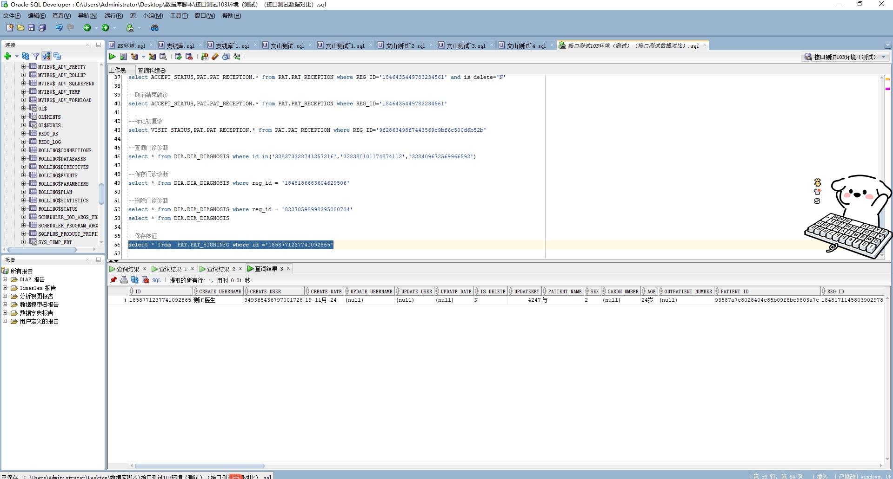

# 领域服务/基础领域 - 保存体征 - 保存体征 正向用例
## 请求参数：
``` json
{
  "hospCode": "NXRY",
  "orgCode": "NXRMYY",
  "patSignInfo": {
    "patientId": "93587a7c8028404c85b09f8bc9803a7c",
    "visitId": "1848171145803902978",
    "id": "1848171273440509953",
    "visitType": "1",
    "name": "与",
    "temperature": 0,
    "sex": "2",
    "age": "24岁"
  },
  "operatorId": "349365436797001728",
  "operatorName": "测试医生"
}
```
## 返回参数：
``` json
{
    "exception": null,
    "apiCode": null,
    "data": "1858771237741092865",
    "Code": 200,
    "Message": "操作成功"
}
```
## 数据校验：



# 领域服务/基础领域 - 保存体征 - 必填校验-[orgCode]为空
## 请求参数：
``` json
{
  "hospCode": "NXRY",
  "orgCode": "",
  "patSignInfo": {
    "patientId": "93587a7c8028404c85b09f8bc9803a7c",
    "visitId": "1848171145803902977",
    "id": "1848171273440509953",
    "visitType": "1",
    "name": "与",
    "temperature": 0,
    "sex": "2",
    "age": "24岁"
  },
  "operatorId": "349365436797001728",
  "operatorName": "测试医生"
}
```
## 返回参数：
``` json
{
  "exception": null,
  "apiCode": null,
  "data": null,
  "Code": 1,
  "Message": "医院编码不能为空"
}
```
# 领域服务/基础领域 - 保存体征 - 必填校验-[hospCode]为空
## 请求参数：
``` json
{
  "hospCode": "",
  "orgCode": "NXRMYY",
  "patSignInfo": {
    "patientId": "93587a7c8028404c85b09f8bc9803a7c",
    "visitId": "1848171145803902977",
    "id": "1848171273440509953",
    "visitType": "1",
    "name": "与",
    "temperature": 0,
    "sex": "2",
    "age": "24岁"
  },
  "operatorId": "349365436797001728",
  "operatorName": "测试医生"
}
```
## 返回参数：
``` json
{
  "exception": null,
  "apiCode": null,
  "data": null,
  "Code": 1,
  "Message": "院区编码不能为空"
}
```
# 领域服务/基础领域 - 保存体征 - 必填校验-[operatorId]为空
## 请求参数：
``` json
{
  "hospCode": "NXRY",
  "orgCode": "NXRMYY",
  "patSignInfo": {
    "patientId": "93587a7c8028404c85b09f8bc9803a7c",
    "visitId": "1848171145803902977",
    "id": "1848171273440509953",
    "visitType": "1",
    "name": "与",
    "temperature": 0,
    "sex": "2",
    "age": "24岁"
  },
  "operatorId": "",
  "operatorName": "测试医生"
}
```
## 返回参数：
``` json
{
  "exception": null,
  "apiCode": null,
  "data": null,
  "Code": 1,
  "Message": "操作人id不能为空"
}
```
# 领域服务/基础领域 - 保存体征 - 必填校验-[operatorName]为空
## 请求参数：
``` json
{
  "hospCode": "NXRY",
  "orgCode": "NXRMYY",
  "patSignInfo": {
    "patientId": "93587a7c8028404c85b09f8bc9803a7c",
    "visitId": "1848171145803902977",
    "id": "1848171273440509953",
    "visitType": "1",
    "name": "与",
    "temperature": 0,
    "sex": "2",
    "age": "24岁"
  },
  "operatorId": "349365436797001728",
  "operatorName": ""
}
```
## 返回参数：
``` json
{
  "exception": null,
  "apiCode": null,
  "data": null,
  "Code": 1,
  "Message": "操作人姓名不能为空"
}
```
# 领域服务/基础领域 - 保存体征 - 必填校验-[patSignInfo.patientId]为空
## 请求参数：
``` json
{
  "hospCode": "NXRY",
  "orgCode": "NXRMYY",
  "patSignInfo": {
    "patientId": null,
    "visitId": "1848171145803902977",
    "id": "1848171273440509953",
    "visitType": "1",
    "name": "与",
    "temperature": 0,
    "sex": "2",
    "age": "24岁"
  },
  "operatorId": "349365436797001728",
  "operatorName": "测试医生"
}
```
## 返回参数：
``` json
{
  "exception": null,
  "apiCode": null,
  "data": null,
  "Code": 1,
  "Message": "病人id不能为空"
}
```
# 领域服务/基础领域 - 保存体征 - 必填校验-[patSignInfo.name]为空
## 请求参数：
``` json
{
  "hospCode": "NXRY",
  "orgCode": "NXRMYY",
  "patSignInfo": {
    "patientId": "93587a7c8028404c85b09f8bc9803a7c",
    "visitId": "1848171145803902977",
    "id": "1848171273440509953",
    "visitType": "1",
    "name": null,
    "temperature": 0,
    "sex": "2",
    "age": "24岁"
  },
  "operatorId": "349365436797001728",
  "operatorName": "测试医生"
}
```
## 返回参数：
``` json
{
  "exception": null,
  "apiCode": null,
  "data": null,
  "Code": 1,
  "Message": "姓名不能为空"
}
```
# 领域服务/基础领域 - 保存体征 - 必填校验-[patSignInfo.visitType]为空
## 请求参数：
``` json
{
  "hospCode": "NXRY",
  "orgCode": "NXRMYY",
  "patSignInfo": {
    "patientId": "93587a7c8028404c85b09f8bc9803a7c",
    "visitId": "1848171145803902977",
    "id": "1848171273440509953",
    "visitType": null,
    "name": "与",
    "temperature": 0,
    "sex": "2",
    "age": "24岁"
  },
  "operatorId": "349365436797001728",
  "operatorName": "测试医生"
}
```
## 返回参数：
``` json
{
  "exception": null,
  "apiCode": null,
  "data": null,
  "Code": 1,
  "Message": "就诊类型不能为空"
}
```
# 领域服务/基础领域 - 保存体征 - 必填校验-[patSignInfo.visitId]为空
## 请求参数：
``` json
{
  "hospCode": "NXRY",
  "orgCode": "NXRMYY",
  "patSignInfo": {
    "patientId": "93587a7c8028404c85b09f8bc9803a7c",
    "visitId": null,
    "id": "1848171273440509953",
    "visitType": "1",
    "name": "与",
    "temperature": 0,
    "sex": "2",
    "age": "24岁"
  },
  "operatorId": "349365436797001728",
  "operatorName": "测试医生"
}
```
## 返回参数：
``` json
{
  "exception": null,
  "apiCode": null,
  "data": null,
  "Code": 1,
  "Message": "就诊id不能为空"
}
```
# 领域服务/基础领域 - 保存体征 - 枚举用例-[patSignInfo.visitType] 枚举值为 1(就诊类型为门诊)
## 请求参数：
``` json
{
  "hospCode": "NXRY",
  "orgCode": "NXRMYY",
  "patSignInfo": {
    "patientId": "93587a7c8028404c85b09f8bc9803a7c",
    "visitId": "1848171145803902979",
    "id": "1848171273440509953",
    "visitType": "1",
    "name": "与",
    "temperature": 0,
    "sex": "2",
    "age": "24岁"
  },
  "operatorId": "349365436797001728",
  "operatorName": "测试医生"
}
```
## 返回参数：
``` json
{
    "exception": null,
    "apiCode": null,
    "data": "1858783832338423810",
    "Code": 200,
    "Message": "操作成功"
}
```
# 领域服务/基础领域 - 保存体征 - 枚举用例-[patSignInfo.visitType] 枚举值为 2(就诊类型为住院)
## 请求参数：
``` json
{
  "hospCode": "NXRY",
  "orgCode": "NXRMYY",
  "patSignInfo": {
    "patientId": "93587a7c8028404c85b09f8bc9803a7c",
    "visitId": "1848171145803902980",
    "id": "1848171273440509953",
    "visitType": "2",
    "name": "与",
    "temperature": 0,
    "sex": "2",
    "age": "24岁"
  },
  "operatorId": "349365436797001728",
  "operatorName": "测试医生"
}
```
## 返回参数：
``` json
{
    "exception": null,
    "apiCode": null,
    "data": "1858784007882629121",
    "Code": 200,
    "Message": "操作成功"
}
```
# 领域服务/基础领域 - 保存体征 - 依赖用例-[operatorName]赋值为依赖用例测试值
## 请求参数：
``` json
{
  "hospCode": "NXRY",
  "orgCode": "NXRMYY",
  "patSignInfo": {
    "patientId": "93587a7c8028404c85b09f8bc9803a7c",
    "visitId": "1848171145803902981",
    "id": "1848171273440509953",
    "visitType": "1",
    "name": "与",
    "temperature": 0,
    "sex": "2",
    "age": "24岁"
  },
  "operatorId": "349365436797001728",
  "operatorName": "依赖用例测试值"
}
```
## 返回参数：
``` json
{
    "exception": null,
    "apiCode": null,
    "data": "1858784188678103041",
    "Code": 200,
    "Message": "操作成功"
}
```
# 领域服务/基础领域 - 保存体征 - 依赖用例-[operatorId]赋值为依赖用例测试值
## 请求参数：
``` json
{
  "hospCode": "NXRY",
  "orgCode": "NXRMYY",
  "patSignInfo": {
    "patientId": "93587a7c8028404c85b09f8bc9803a7c",
    "visitId": "1848171145803902982",
    "id": "1848171273440509953",
    "visitType": "1",
    "name": "与",
    "temperature": 0,
    "sex": "2",
    "age": "24岁"
  },
  "operatorId": "依赖用例测试值",
  "operatorName": "测试医生"
}
```
## 返回参数：
``` json
{
    "exception": null,
    "apiCode": null,
    "data": "1858785769557417985",
    "Code": 200,
    "Message": "操作成功"
}
```
# 领域服务/基础领域 - 保存体征 - 依赖用例-[patSignInfo.patientId]赋值为依赖用例测试值
## 请求参数：
``` json
{
  "hospCode": "NXRY",
  "orgCode": "NXRMYY",
  "patSignInfo": {
    "patientId": "依赖用例测试值",
    "visitId": "1848171145803902983",
    "id": "1848171273440509953",
    "visitType": "1",
    "name": "与",
    "temperature": 0,
    "sex": "2",
    "age": "24岁"
  },
  "operatorId": "349365436797001728",
  "operatorName": "测试医生"
}
```
## 返回参数：
``` json
{
    "exception": null,
    "apiCode": null,
    "data": "1858786124357787649",
    "Code": 200,
    "Message": "操作成功"
}
```
# 领域服务/基础领域 - 保存体征 - 依赖用例-[patSignInfo.visitId]赋值为依赖用例测试值
## 请求参数：
``` json
{
  "hospCode": "NXRY",
  "orgCode": "NXRMYY",
  "patSignInfo": {
    "patientId": "93587a7c8028404c85b09f8bc9803a7c",
    "visitId": "依赖用例测试值",
    "id": "1848171273440509953",
    "visitType": "1",
    "name": "与",
    "temperature": 0,
    "sex": "2",
    "age": "24岁"
  },
  "operatorId": "349365436797001728",
  "operatorName": "测试医生"
}
```
## 返回参数：
``` json
{
  "exception": null,
  "apiCode": null,
  "data": "1858770147792478210",
  "Code": 200,
  "Message": "操作成功"
}
```
# 领域服务/基础领域 - 保存体征 - 依赖用例-[patSignInfo.name]赋值为依赖用例测试值
## 请求参数：
``` json
{
  "hospCode": "NXRY",
  "orgCode": "NXRMYY",
  "patSignInfo": {
    "patientId": "93587a7c8028404c85b09f8bc9803a7c",
    "visitId": "1848171145803902985",
    "id": "1848171273440509953",
    "visitType": "1",
    "name": "依赖用例测试值",
    "temperature": 0,
    "sex": "2",
    "age": "24岁"
  },
  "operatorId": "349365436797001728",
  "operatorName": "测试医生"
}
```
## 返回参数：
``` json
{
    "exception": null,
    "apiCode": null,
    "data": "1858786754723930114",
    "Code": 200,
    "Message": "操作成功"
}
```
# 领域服务/基础领域 - 保存体征 - 依赖用例-[orgCode]赋值为依赖用例测试值
## 请求参数：
``` json
{
  "hospCode": "NXRY",
  "orgCode": "依赖用例测试值",
  "patSignInfo": {
    "patientId": "93587a7c8028404c85b09f8bc9803a7c",
    "visitId": "1848171145803902977",
    "id": "1848171273440509953",
    "visitType": "1",
    "name": "与",
    "temperature": 0,
    "sex": "2",
    "age": "24岁"
  },
  "operatorId": "349365436797001728",
  "operatorName": "测试医生"
}
```
## 返回参数：
``` json
{
  "exception": null,
  "apiCode": null,
  "data": "1858770158932549634",
  "Code": 200,
  "Message": "操作成功"
}
```
# 领域服务/基础领域 - 保存体征 - 依赖用例-[hospCode]赋值为依赖用例测试值
## 请求参数：
``` json
{
  "hospCode": "依赖用例测试值",
  "orgCode": "NXRMYY",
  "patSignInfo": {
    "patientId": "93587a7c8028404c85b09f8bc9803a7c",
    "visitId": "1848171145803902984",
    "id": "1848171273440509953",
    "visitType": "1",
    "name": "与",
    "temperature": 0,
    "sex": "2",
    "age": "24岁"
  },
  "operatorId": "349365436797001728",
  "operatorName": "测试医生"
}
```
## 返回参数：
``` json
{
    "exception": null,
    "apiCode": null,
    "data": "1858786495058763778",
    "Code": 200,
    "Message": "操作成功"
}
```