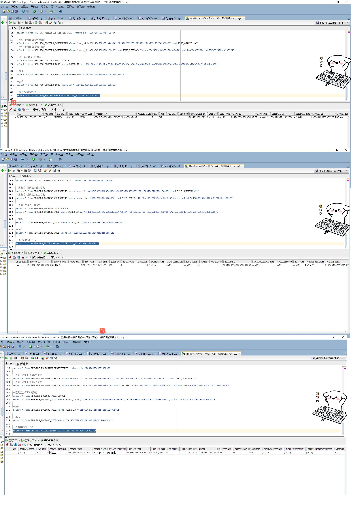

# 领域服务/基础领域 - 保存患者临时挂号 - 保存患者临时挂号 正向用例
## 请求参数：
``` json
{
  "hospCode": "NXRY",
  "orgCode": "NXRMYY",
  "regInfo": {
    "approveStatus": "1",
    "sourceId": "4e8d562e034946dea505c9f7cbca20ef",
    "deptName": "内分泌科(门)",
    "patientId": "93587a7c8028404c85b09f8bc9803a7c",
    "idCard": "430421199912121122",
    "outTimes": 1,
    "approveUserDate": "2024-10-22 10:26:00",
    "visitLevelCode": "183031397291417600",
    "approveUserId": "349365436797001728",
    "shiftName": "上午",
    "visitId": "1848551348233162753",
    "sexName": "女",
    "isAppoint": "N",
    "orderNo": "2024102210260050062306",
    "deptId": "224707910793326592",
    "regSource": 99,
    "visitLevelName": "主任医师",
    "shiftCode": "1",
    "validTime": "2024-10-22 23:59:59",
    "visitNo": "2024112002211",
    "queueNo": "200",
    "birthday": "1999-12-12 00:00:00",
    "regSubType": "1",
    "regMoney": "0",
    "refundStatus": "0",
    "regDate": "2024-10-22",
    "regSubTypeName": "无号收费",
    "doctorName": "测试医生",
    "doctorId": "349365436797001728",
    "startTime": "10:26:00",
    "regType": "1",
    "patientName": "与",
    "isPay": "1",
    "sex": "2",
    "mobile": "18807425221",
    "patTypeCode": "01",
    "settleNo": "2024102210260050037055",
    "approveUserName": "测试医生",
    "regTypeName": "门诊",
    "endTime": "23:59:59",
    "age": "24岁"
  },
  "operatorId": "349365436797001728",
  "operatorName": "测试医生"
}
```
## 返回参数：
``` json
{
    "exception": null,
    "apiCode": null,
    "data": {
        "visitId": "1859519491390939138",
        "regTriageId": "1859519491403522049"
    },
    "Code": 200,
    "Message": "操作成功"
}
```
## 数据校验：



# 领域服务/基础领域 - 保存患者临时挂号 - 必填校验-[orgCode]为空
## 请求参数：
``` json
{
  "hospCode": "NXRY",
  "orgCode": "",
  "regInfo": {
    "approveStatus": "1",
    "sourceId": "4e8d562e034946dea505c9f7cbca20ef",
    "deptName": "内分泌科(门)",
    "patientId": "93587a7c8028404c85b09f8bc9803a7c",
    "idCard": "430421199912121122",
    "outTimes": 1,
    "approveUserDate": "2024-10-22 10:26:00",
    "visitLevelCode": "183031397291417600",
    "approveUserId": "349365436797001728",
    "shiftName": "上午",
    "visitId": "1848551348233162753",
    "sexName": "女",
    "isAppoint": "N",
    "orderNo": "2024102210260050062306",
    "deptId": "224707910793326592",
    "regSource": 99,
    "visitLevelName": "主任医师",
    "shiftCode": "1",
    "validTime": "2024-10-22 23:59:59",
    "visitNo": "2024112000003",
    "queueNo": "200",
    "birthday": "1999-12-12 00:00:00",
    "regSubType": "1",
    "regMoney": "0",
    "refundStatus": "0",
    "regDate": "2024-10-22",
    "regSubTypeName": "无号收费",
    "doctorName": "测试医生",
    "doctorId": "349365436797001728",
    "startTime": "10:26:00",
    "regType": "1",
    "patientName": "与",
    "isPay": "1",
    "sex": "2",
    "mobile": "18807425221",
    "patTypeCode": "01",
    "settleNo": "2024102210260050037055",
    "approveUserName": "测试医生",
    "regTypeName": "门诊",
    "endTime": "23:59:59",
    "age": "24岁"
  },
  "operatorId": "349365436797001728",
  "operatorName": "测试医生"
}
```
## 返回参数：
``` json
{
  "exception": null,
  "apiCode": null,
  "data": null,
  "Code": 1,
  "Message": "医院编码不能为空"
}
```
# 领域服务/基础领域 - 保存患者临时挂号 - 必填校验-[hospCode]为空
## 请求参数：
``` json
{
  "hospCode": "",
  "orgCode": "NXRMYY",
  "regInfo": {
    "approveStatus": "1",
    "sourceId": "4e8d562e034946dea505c9f7cbca20ef",
    "deptName": "内分泌科(门)",
    "patientId": "93587a7c8028404c85b09f8bc9803a7c",
    "idCard": "430421199912121122",
    "outTimes": 1,
    "approveUserDate": "2024-10-22 10:26:00",
    "visitLevelCode": "183031397291417600",
    "approveUserId": "349365436797001728",
    "shiftName": "上午",
    "visitId": "1848551348233162753",
    "sexName": "女",
    "isAppoint": "N",
    "orderNo": "2024102210260050062306",
    "deptId": "224707910793326592",
    "regSource": 99,
    "visitLevelName": "主任医师",
    "shiftCode": "1",
    "validTime": "2024-10-22 23:59:59",
    "visitNo": "2024112000004",
    "queueNo": "200",
    "birthday": "1999-12-12 00:00:00",
    "regSubType": "1",
    "regMoney": "0",
    "refundStatus": "0",
    "regDate": "2024-10-22",
    "regSubTypeName": "无号收费",
    "doctorName": "测试医生",
    "doctorId": "349365436797001728",
    "startTime": "10:26:00",
    "regType": "1",
    "patientName": "与",
    "isPay": "1",
    "sex": "2",
    "mobile": "18807425221",
    "patTypeCode": "01",
    "settleNo": "2024102210260050037055",
    "approveUserName": "测试医生",
    "regTypeName": "门诊",
    "endTime": "23:59:59",
    "age": "24岁"
  },
  "operatorId": "349365436797001728",
  "operatorName": "测试医生"
}
```
## 返回参数：
``` json
{
  "exception": null,
  "apiCode": null,
  "data": null,
  "Code": 1,
  "Message": "院区编码不能为空"
}
```
# 领域服务/基础领域 - 保存患者临时挂号 - 必填校验-[operatorId]为空
## 请求参数：
``` json
{
  "hospCode": "NXRY",
  "orgCode": "NXRMYY",
  "regInfo": {
    "approveStatus": "1",
    "sourceId": "4e8d562e034946dea505c9f7cbca20ef",
    "deptName": "内分泌科(门)",
    "patientId": "93587a7c8028404c85b09f8bc9803a7c",
    "idCard": "430421199912121122",
    "outTimes": 1,
    "approveUserDate": "2024-10-22 10:26:00",
    "visitLevelCode": "183031397291417600",
    "approveUserId": "349365436797001728",
    "shiftName": "上午",
    "visitId": "1848551348233162753",
    "sexName": "女",
    "isAppoint": "N",
    "orderNo": "2024102210260050062306",
    "deptId": "224707910793326592",
    "regSource": 99,
    "visitLevelName": "主任医师",
    "shiftCode": "1",
    "validTime": "2024-10-22 23:59:59",
    "visitNo": "2024112000005",
    "queueNo": "200",
    "birthday": "1999-12-12 00:00:00",
    "regSubType": "1",
    "regMoney": "0",
    "refundStatus": "0",
    "regDate": "2024-10-22",
    "regSubTypeName": "无号收费",
    "doctorName": "测试医生",
    "doctorId": "349365436797001728",
    "startTime": "10:26:00",
    "regType": "1",
    "patientName": "与",
    "isPay": "1",
    "sex": "2",
    "mobile": "18807425221",
    "patTypeCode": "01",
    "settleNo": "2024102210260050037055",
    "approveUserName": "测试医生",
    "regTypeName": "门诊",
    "endTime": "23:59:59",
    "age": "24岁"
  },
  "operatorId": "",
  "operatorName": "测试医生"
}
```
## 返回参数：
``` json
{
  "exception": null,
  "apiCode": null,
  "data": null,
  "Code": 1,
  "Message": "操作人id不能为空"
}
```
# 领域服务/基础领域 - 保存患者临时挂号 - 必填校验-[operatorName]为空
## 请求参数：
``` json
{
  "hospCode": "NXRY",
  "orgCode": "NXRMYY",
  "regInfo": {
    "approveStatus": "1",
    "sourceId": "4e8d562e034946dea505c9f7cbca20ef",
    "deptName": "内分泌科(门)",
    "patientId": "93587a7c8028404c85b09f8bc9803a7c",
    "idCard": "430421199912121122",
    "outTimes": 1,
    "approveUserDate": "2024-10-22 10:26:00",
    "visitLevelCode": "183031397291417600",
    "approveUserId": "349365436797001728",
    "shiftName": "上午",
    "visitId": "1848551348233162753",
    "sexName": "女",
    "isAppoint": "N",
    "orderNo": "2024102210260050062306",
    "deptId": "224707910793326592",
    "regSource": 99,
    "visitLevelName": "主任医师",
    "shiftCode": "1",
    "validTime": "2024-10-22 23:59:59",
    "visitNo": "2024102200002",
    "queueNo": "200",
    "birthday": "1999-12-12 00:00:00",
    "regSubType": "1",
    "regMoney": "0",
    "refundStatus": "0",
    "regDate": "2024-10-22",
    "regSubTypeName": "无号收费",
    "doctorName": "测试医生",
    "doctorId": "349365436797001728",
    "startTime": "10:26:00",
    "regType": "1",
    "patientName": "与",
    "isPay": "1",
    "sex": "2",
    "mobile": "18807425221",
    "patTypeCode": "01",
    "settleNo": "2024102210260050037055",
    "approveUserName": "测试医生",
    "regTypeName": "门诊",
    "endTime": "23:59:59",
    "age": "24岁"
  },
  "operatorId": "349365436797001728",
  "operatorName": ""
}
```
## 返回参数：
``` json
{
  "exception": null,
  "apiCode": null,
  "data": null,
  "Code": 1,
  "Message": "操作人姓名不能为空"
}
```
# 领域服务/基础领域 - 保存患者临时挂号 - 必填校验-[regInfo]为空
## 请求参数：
``` json
{
  "hospCode": "NXRY",
  "orgCode": "NXRMYY",
  "regInfo": null,
  "operatorId": "349365436797001728",
  "operatorName": "测试医生"
}
```
## 返回参数：
``` json
{
  "exception": null,
  "apiCode": null,
  "data": null,
  "Code": 1,
  "Message": "门诊挂号信息不能为空"
}
```
# 领域服务/基础领域 - 保存患者临时挂号 - 必填校验-[regInfo.visitId]为空
## 请求参数：
``` json
{
  "hospCode": "NXRY",
  "orgCode": "NXRMYY",
  "regInfo": {
    "approveStatus": "1",
    "sourceId": "4e8d562e034946dea505c9f7cbca20ef",
    "deptName": "内分泌科(门)",
    "patientId": "93587a7c8028404c85b09f8bc9803a7c",
    "idCard": "430421199912121122",
    "outTimes": 1,
    "approveUserDate": "2024-10-22 10:26:00",
    "visitLevelCode": "183031397291417600",
    "approveUserId": "349365436797001728",
    "shiftName": "上午",
    "visitId": null,
    "sexName": "女",
    "isAppoint": "N",
    "orderNo": "2024102210260050062306",
    "deptId": "224707910793326592",
    "regSource": 99,
    "visitLevelName": "主任医师",
    "shiftCode": "1",
    "validTime": "2024-10-22 23:59:59",
    "visitNo": "2024102200002",
    "queueNo": "200",
    "birthday": "1999-12-12 00:00:00",
    "regSubType": "1",
    "regMoney": "0",
    "refundStatus": "0",
    "regDate": "2024-10-22",
    "regSubTypeName": "无号收费",
    "doctorName": "测试医生",
    "doctorId": "349365436797001728",
    "startTime": "10:26:00",
    "regType": "1",
    "patientName": "与",
    "isPay": "1",
    "sex": "2",
    "mobile": "18807425221",
    "patTypeCode": "01",
    "settleNo": "2024102210260050037055",
    "approveUserName": "测试医生",
    "regTypeName": "门诊",
    "endTime": "23:59:59",
    "age": "24岁"
  },
  "operatorId": "349365436797001728",
  "operatorName": "测试医生"
}
```
## 返回参数：
``` json
{
  "exception": null,
  "apiCode": null,
  "data": null,
  "Code": 1,
  "Message": "id不能为空"
}
```
# 领域服务/基础领域 - 保存患者临时挂号 - 必填校验-[regInfo.visitNo]为空
## 请求参数：
``` json
{
  "hospCode": "NXRY",
  "orgCode": "NXRMYY",
  "regInfo": {
    "approveStatus": "1",
    "sourceId": "4e8d562e034946dea505c9f7cbca20ef",
    "deptName": "内分泌科(门)",
    "patientId": "93587a7c8028404c85b09f8bc9803a7c",
    "idCard": "430421199912121122",
    "outTimes": 1,
    "approveUserDate": "2024-10-22 10:26:00",
    "visitLevelCode": "183031397291417600",
    "approveUserId": "349365436797001728",
    "shiftName": "上午",
    "visitId": "1848551348233162753",
    "sexName": "女",
    "isAppoint": "N",
    "orderNo": "2024102210260050062306",
    "deptId": "224707910793326592",
    "regSource": 99,
    "visitLevelName": "主任医师",
    "shiftCode": "1",
    "validTime": "2024-10-22 23:59:59",
    "visitNo": null,
    "queueNo": "200",
    "birthday": "1999-12-12 00:00:00",
    "regSubType": "1",
    "regMoney": "0",
    "refundStatus": "0",
    "regDate": "2024-10-22",
    "regSubTypeName": "无号收费",
    "doctorName": "测试医生",
    "doctorId": "349365436797001728",
    "startTime": "10:26:00",
    "regType": "1",
    "patientName": "与",
    "isPay": "1",
    "sex": "2",
    "mobile": "18807425221",
    "patTypeCode": "01",
    "settleNo": "2024102210260050037055",
    "approveUserName": "测试医生",
    "regTypeName": "门诊",
    "endTime": "23:59:59",
    "age": "24岁"
  },
  "operatorId": "349365436797001728",
  "operatorName": "测试医生"
}
```
## 返回参数：
``` json
{
  "exception": null,
  "apiCode": null,
  "data": null,
  "Code": 1,
  "Message": "门诊号不能为空"
}
```
# 领域服务/基础领域 - 保存患者临时挂号 - 必填校验-[regInfo.patientId]为空
## 请求参数：
``` json
{
  "hospCode": "NXRY",
  "orgCode": "NXRMYY",
  "regInfo": {
    "approveStatus": "1",
    "sourceId": "4e8d562e034946dea505c9f7cbca20ef",
    "deptName": "内分泌科(门)",
    "patientId": null,
    "idCard": "430421199912121122",
    "outTimes": 1,
    "approveUserDate": "2024-10-22 10:26:00",
    "visitLevelCode": "183031397291417600",
    "approveUserId": "349365436797001728",
    "shiftName": "上午",
    "visitId": "1848551348233162753",
    "sexName": "女",
    "isAppoint": "N",
    "orderNo": "2024102210260050062306",
    "deptId": "224707910793326592",
    "regSource": 99,
    "visitLevelName": "主任医师",
    "shiftCode": "1",
    "validTime": "2024-10-22 23:59:59",
    "visitNo": "2024102200002",
    "queueNo": "200",
    "birthday": "1999-12-12 00:00:00",
    "regSubType": "1",
    "regMoney": "0",
    "refundStatus": "0",
    "regDate": "2024-10-22",
    "regSubTypeName": "无号收费",
    "doctorName": "测试医生",
    "doctorId": "349365436797001728",
    "startTime": "10:26:00",
    "regType": "1",
    "patientName": "与",
    "isPay": "1",
    "sex": "2",
    "mobile": "18807425221",
    "patTypeCode": "01",
    "settleNo": "2024102210260050037055",
    "approveUserName": "测试医生",
    "regTypeName": "门诊",
    "endTime": "23:59:59",
    "age": "24岁"
  },
  "operatorId": "349365436797001728",
  "operatorName": "测试医生"
}
```
## 返回参数：
``` json
{
  "exception": null,
  "apiCode": null,
  "data": null,
  "Code": 1,
  "Message": "病人ID不能为空"
}
```
# 领域服务/基础领域 - 保存患者临时挂号 - 必填校验-[regInfo.patientName]为空
## 请求参数：
``` json
{
  "hospCode": "NXRY",
  "orgCode": "NXRMYY",
  "regInfo": {
    "approveStatus": "1",
    "sourceId": "4e8d562e034946dea505c9f7cbca20ef",
    "deptName": "内分泌科(门)",
    "patientId": "93587a7c8028404c85b09f8bc9803a7c",
    "idCard": "430421199912121122",
    "outTimes": 1,
    "approveUserDate": "2024-10-22 10:26:00",
    "visitLevelCode": "183031397291417600",
    "approveUserId": "349365436797001728",
    "shiftName": "上午",
    "visitId": "1848551348233162753",
    "sexName": "女",
    "isAppoint": "N",
    "orderNo": "2024102210260050062306",
    "deptId": "224707910793326592",
    "regSource": 99,
    "visitLevelName": "主任医师",
    "shiftCode": "1",
    "validTime": "2024-10-22 23:59:59",
    "visitNo": "2024102200002",
    "queueNo": "200",
    "birthday": "1999-12-12 00:00:00",
    "regSubType": "1",
    "regMoney": "0",
    "refundStatus": "0",
    "regDate": "2024-10-22",
    "regSubTypeName": "无号收费",
    "doctorName": "测试医生",
    "doctorId": "349365436797001728",
    "startTime": "10:26:00",
    "regType": "1",
    "patientName": null,
    "isPay": "1",
    "sex": "2",
    "mobile": "18807425221",
    "patTypeCode": "01",
    "settleNo": "2024102210260050037055",
    "approveUserName": "测试医生",
    "regTypeName": "门诊",
    "endTime": "23:59:59",
    "age": "24岁"
  },
  "operatorId": "349365436797001728",
  "operatorName": "测试医生"
}
```
## 返回参数：
``` json
{
  "exception": null,
  "apiCode": null,
  "data": null,
  "Code": 1,
  "Message": "病人姓名不能为空"
}
```
# 领域服务/基础领域 - 保存患者临时挂号 - 必填校验-[regInfo.sex]为空
## 请求参数：
``` json
{
  "hospCode": "NXRY",
  "orgCode": "NXRMYY",
  "regInfo": {
    "approveStatus": "1",
    "sourceId": "4e8d562e034946dea505c9f7cbca20ef",
    "deptName": "内分泌科(门)",
    "patientId": "93587a7c8028404c85b09f8bc9803a7c",
    "idCard": "430421199912121122",
    "outTimes": 1,
    "approveUserDate": "2024-10-22 10:26:00",
    "visitLevelCode": "183031397291417600",
    "approveUserId": "349365436797001728",
    "shiftName": "上午",
    "visitId": "1848551348233162753",
    "sexName": "女",
    "isAppoint": "N",
    "orderNo": "2024102210260050062306",
    "deptId": "224707910793326592",
    "regSource": 99,
    "visitLevelName": "主任医师",
    "shiftCode": "1",
    "validTime": "2024-10-22 23:59:59",
    "visitNo": "2024102200002",
    "queueNo": "200",
    "birthday": "1999-12-12 00:00:00",
    "regSubType": "1",
    "regMoney": "0",
    "refundStatus": "0",
    "regDate": "2024-10-22",
    "regSubTypeName": "无号收费",
    "doctorName": "测试医生",
    "doctorId": "349365436797001728",
    "startTime": "10:26:00",
    "regType": "1",
    "patientName": "与",
    "isPay": "1",
    "sex": null,
    "mobile": "18807425221",
    "patTypeCode": "01",
    "settleNo": "2024102210260050037055",
    "approveUserName": "测试医生",
    "regTypeName": "门诊",
    "endTime": "23:59:59",
    "age": "24岁"
  },
  "operatorId": "349365436797001728",
  "operatorName": "测试医生"
}
```
## 返回参数：
``` json
{
  "exception": null,
  "apiCode": null,
  "data": null,
  "Code": 1,
  "Message": "性别代码不能为空"
}
```
# 领域服务/基础领域 - 保存患者临时挂号 - 必填校验-[regInfo.sexName]为空
## 请求参数：
``` json
{
  "hospCode": "NXRY",
  "orgCode": "NXRMYY",
  "regInfo": {
    "approveStatus": "1",
    "sourceId": "4e8d562e034946dea505c9f7cbca20ef",
    "deptName": "内分泌科(门)",
    "patientId": "93587a7c8028404c85b09f8bc9803a7c",
    "idCard": "430421199912121122",
    "outTimes": 1,
    "approveUserDate": "2024-10-22 10:26:00",
    "visitLevelCode": "183031397291417600",
    "approveUserId": "349365436797001728",
    "shiftName": "上午",
    "visitId": "1848551348233162753",
    "sexName": null,
    "isAppoint": "N",
    "orderNo": "2024102210260050062306",
    "deptId": "224707910793326592",
    "regSource": 99,
    "visitLevelName": "主任医师",
    "shiftCode": "1",
    "validTime": "2024-10-22 23:59:59",
    "visitNo": "2024102200002",
    "queueNo": "200",
    "birthday": "1999-12-12 00:00:00",
    "regSubType": "1",
    "regMoney": "0",
    "refundStatus": "0",
    "regDate": "2024-10-22",
    "regSubTypeName": "无号收费",
    "doctorName": "测试医生",
    "doctorId": "349365436797001728",
    "startTime": "10:26:00",
    "regType": "1",
    "patientName": "与",
    "isPay": "1",
    "sex": "2",
    "mobile": "18807425221",
    "patTypeCode": "01",
    "settleNo": "2024102210260050037055",
    "approveUserName": "测试医生",
    "regTypeName": "门诊",
    "endTime": "23:59:59",
    "age": "24岁"
  },
  "operatorId": "349365436797001728",
  "operatorName": "测试医生"
}
```
## 返回参数：
``` json
{
  "exception": null,
  "apiCode": null,
  "data": null,
  "Code": 1,
  "Message": "性别名称不能为空"
}
```
# 领域服务/基础领域 - 保存患者临时挂号 - 必填校验-[regInfo.deptId]为空
## 请求参数：
``` json
{
  "hospCode": "NXRY",
  "orgCode": "NXRMYY",
  "regInfo": {
    "approveStatus": "1",
    "sourceId": "4e8d562e034946dea505c9f7cbca20ef",
    "deptName": "内分泌科(门)",
    "patientId": "93587a7c8028404c85b09f8bc9803a7c",
    "idCard": "430421199912121122",
    "outTimes": 1,
    "approveUserDate": "2024-10-22 10:26:00",
    "visitLevelCode": "183031397291417600",
    "approveUserId": "349365436797001728",
    "shiftName": "上午",
    "visitId": "1848551348233162753",
    "sexName": "女",
    "isAppoint": "N",
    "orderNo": "2024102210260050062306",
    "deptId": null,
    "regSource": 99,
    "visitLevelName": "主任医师",
    "shiftCode": "1",
    "validTime": "2024-10-22 23:59:59",
    "visitNo": "2024102200002",
    "queueNo": "200",
    "birthday": "1999-12-12 00:00:00",
    "regSubType": "1",
    "regMoney": "0",
    "refundStatus": "0",
    "regDate": "2024-10-22",
    "regSubTypeName": "无号收费",
    "doctorName": "测试医生",
    "doctorId": "349365436797001728",
    "startTime": "10:26:00",
    "regType": "1",
    "patientName": "与",
    "isPay": "1",
    "sex": "2",
    "mobile": "18807425221",
    "patTypeCode": "01",
    "settleNo": "2024102210260050037055",
    "approveUserName": "测试医生",
    "regTypeName": "门诊",
    "endTime": "23:59:59",
    "age": "24岁"
  },
  "operatorId": "349365436797001728",
  "operatorName": "测试医生"
}
```
## 返回参数：
``` json
{
  "exception": null,
  "apiCode": null,
  "data": null,
  "Code": 1,
  "Message": "挂号科室id不能为空"
}
```
# 领域服务/基础领域 - 保存患者临时挂号 - 必填校验-[regInfo.deptName]为空
## 请求参数：
``` json
{
  "hospCode": "NXRY",
  "orgCode": "NXRMYY",
  "regInfo": {
    "approveStatus": "1",
    "sourceId": "4e8d562e034946dea505c9f7cbca20ef",
    "deptName": null,
    "patientId": "93587a7c8028404c85b09f8bc9803a7c",
    "idCard": "430421199912121122",
    "outTimes": 1,
    "approveUserDate": "2024-10-22 10:26:00",
    "visitLevelCode": "183031397291417600",
    "approveUserId": "349365436797001728",
    "shiftName": "上午",
    "visitId": "1848551348233162753",
    "sexName": "女",
    "isAppoint": "N",
    "orderNo": "2024102210260050062306",
    "deptId": "224707910793326592",
    "regSource": 99,
    "visitLevelName": "主任医师",
    "shiftCode": "1",
    "validTime": "2024-10-22 23:59:59",
    "visitNo": "2024102200002",
    "queueNo": "200",
    "birthday": "1999-12-12 00:00:00",
    "regSubType": "1",
    "regMoney": "0",
    "refundStatus": "0",
    "regDate": "2024-10-22",
    "regSubTypeName": "无号收费",
    "doctorName": "测试医生",
    "doctorId": "349365436797001728",
    "startTime": "10:26:00",
    "regType": "1",
    "patientName": "与",
    "isPay": "1",
    "sex": "2",
    "mobile": "18807425221",
    "patTypeCode": "01",
    "settleNo": "2024102210260050037055",
    "approveUserName": "测试医生",
    "regTypeName": "门诊",
    "endTime": "23:59:59",
    "age": "24岁"
  },
  "operatorId": "349365436797001728",
  "operatorName": "测试医生"
}
```
## 返回参数：
``` json
{
  "exception": null,
  "apiCode": null,
  "data": null,
  "Code": 1,
  "Message": "挂号科室名称不能为空"
}
```
# 领域服务/基础领域 - 保存患者临时挂号 - 必填校验-[regInfo.doctorId]为空
## 请求参数：
``` json
{
  "hospCode": "NXRY",
  "orgCode": "NXRMYY",
  "regInfo": {
    "approveStatus": "1",
    "sourceId": "4e8d562e034946dea505c9f7cbca20ef",
    "deptName": "内分泌科(门)",
    "patientId": "93587a7c8028404c85b09f8bc9803a7c",
    "idCard": "430421199912121122",
    "outTimes": 1,
    "approveUserDate": "2024-10-22 10:26:00",
    "visitLevelCode": "183031397291417600",
    "approveUserId": "349365436797001728",
    "shiftName": "上午",
    "visitId": "1848551348233162753",
    "sexName": "女",
    "isAppoint": "N",
    "orderNo": "2024102210260050062306",
    "deptId": "224707910793326592",
    "regSource": 99,
    "visitLevelName": "主任医师",
    "shiftCode": "1",
    "validTime": "2024-10-22 23:59:59",
    "visitNo": "2024102200002",
    "queueNo": "200",
    "birthday": "1999-12-12 00:00:00",
    "regSubType": "1",
    "regMoney": "0",
    "refundStatus": "0",
    "regDate": "2024-10-22",
    "regSubTypeName": "无号收费",
    "doctorName": "测试医生",
    "doctorId": null,
    "startTime": "10:26:00",
    "regType": "1",
    "patientName": "与",
    "isPay": "1",
    "sex": "2",
    "mobile": "18807425221",
    "patTypeCode": "01",
    "settleNo": "2024102210260050037055",
    "approveUserName": "测试医生",
    "regTypeName": "门诊",
    "endTime": "23:59:59",
    "age": "24岁"
  },
  "operatorId": "349365436797001728",
  "operatorName": "测试医生"
}
```
## 返回参数：
``` json
{
  "exception": null,
  "apiCode": null,
  "data": null,
  "Code": 1,
  "Message": "挂号医生id不能为空"
}
```
# 领域服务/基础领域 - 保存患者临时挂号 - 必填校验-[regInfo.visitLevelCode]为空
## 请求参数：
``` json
{
  "hospCode": "NXRY",
  "orgCode": "NXRMYY",
  "regInfo": {
    "approveStatus": "1",
    "sourceId": "4e8d562e034946dea505c9f7cbca20ef",
    "deptName": "内分泌科(门)",
    "patientId": "93587a7c8028404c85b09f8bc9803a7c",
    "idCard": "430421199912121122",
    "outTimes": 1,
    "approveUserDate": "2024-10-22 10:26:00",
    "visitLevelCode": null,
    "approveUserId": "349365436797001728",
    "shiftName": "上午",
    "visitId": "1848551348233162753",
    "sexName": "女",
    "isAppoint": "N",
    "orderNo": "2024102210260050062306",
    "deptId": "224707910793326592",
    "regSource": 99,
    "visitLevelName": "主任医师",
    "shiftCode": "1",
    "validTime": "2024-10-22 23:59:59",
    "visitNo": "2024102200002",
    "queueNo": "200",
    "birthday": "1999-12-12 00:00:00",
    "regSubType": "1",
    "regMoney": "0",
    "refundStatus": "0",
    "regDate": "2024-10-22",
    "regSubTypeName": "无号收费",
    "doctorName": "测试医生",
    "doctorId": "349365436797001728",
    "startTime": "10:26:00",
    "regType": "1",
    "patientName": "与",
    "isPay": "1",
    "sex": "2",
    "mobile": "18807425221",
    "patTypeCode": "01",
    "settleNo": "2024102210260050037055",
    "approveUserName": "测试医生",
    "regTypeName": "门诊",
    "endTime": "23:59:59",
    "age": "24岁"
  },
  "operatorId": "349365436797001728",
  "operatorName": "测试医生"
}
```
## 返回参数：
``` json
{
  "exception": null,
  "apiCode": null,
  "data": null,
  "Code": 1,
  "Message": "坐诊级别id不能为空"
}
```
# 领域服务/基础领域 - 保存患者临时挂号 - 必填校验-[regInfo.visitLevelName]为空
## 请求参数：
``` json
{
  "hospCode": "NXRY",
  "orgCode": "NXRMYY",
  "regInfo": {
    "approveStatus": "1",
    "sourceId": "4e8d562e034946dea505c9f7cbca20ef",
    "deptName": "内分泌科(门)",
    "patientId": "93587a7c8028404c85b09f8bc9803a7c",
    "idCard": "430421199912121122",
    "outTimes": 1,
    "approveUserDate": "2024-10-22 10:26:00",
    "visitLevelCode": "183031397291417600",
    "approveUserId": "349365436797001728",
    "shiftName": "上午",
    "visitId": "1848551348233162753",
    "sexName": "女",
    "isAppoint": "N",
    "orderNo": "2024102210260050062306",
    "deptId": "224707910793326592",
    "regSource": 99,
    "visitLevelName": null,
    "shiftCode": "1",
    "validTime": "2024-10-22 23:59:59",
    "visitNo": "2024102200002",
    "queueNo": "200",
    "birthday": "1999-12-12 00:00:00",
    "regSubType": "1",
    "regMoney": "0",
    "refundStatus": "0",
    "regDate": "2024-10-22",
    "regSubTypeName": "无号收费",
    "doctorName": "测试医生",
    "doctorId": "349365436797001728",
    "startTime": "10:26:00",
    "regType": "1",
    "patientName": "与",
    "isPay": "1",
    "sex": "2",
    "mobile": "18807425221",
    "patTypeCode": "01",
    "settleNo": "2024102210260050037055",
    "approveUserName": "测试医生",
    "regTypeName": "门诊",
    "endTime": "23:59:59",
    "age": "24岁"
  },
  "operatorId": "349365436797001728",
  "operatorName": "测试医生"
}
```
## 返回参数：
``` json
{
  "exception": null,
  "apiCode": null,
  "data": null,
  "Code": 1,
  "Message": "坐诊级别名称不能为空"
}
```
# 领域服务/基础领域 - 保存患者临时挂号 - 必填校验-[regInfo.regDate]为空
## 请求参数：
``` json
{
  "hospCode": "NXRY",
  "orgCode": "NXRMYY",
  "regInfo": {
    "approveStatus": "1",
    "sourceId": "4e8d562e034946dea505c9f7cbca20ef",
    "deptName": "内分泌科(门)",
    "patientId": "93587a7c8028404c85b09f8bc9803a7c",
    "idCard": "430421199912121122",
    "outTimes": 1,
    "approveUserDate": "2024-10-22 10:26:00",
    "visitLevelCode": "183031397291417600",
    "approveUserId": "349365436797001728",
    "shiftName": "上午",
    "visitId": "1848551348233162753",
    "sexName": "女",
    "isAppoint": "N",
    "orderNo": "2024102210260050062306",
    "deptId": "224707910793326592",
    "regSource": 99,
    "visitLevelName": "主任医师",
    "shiftCode": "1",
    "validTime": "2024-10-22 23:59:59",
    "visitNo": "2024102200002",
    "queueNo": "200",
    "birthday": "1999-12-12 00:00:00",
    "regSubType": "1",
    "regMoney": "0",
    "refundStatus": "0",
    "regDate": null,
    "regSubTypeName": "无号收费",
    "doctorName": "测试医生",
    "doctorId": "349365436797001728",
    "startTime": "10:26:00",
    "regType": "1",
    "patientName": "与",
    "isPay": "1",
    "sex": "2",
    "mobile": "18807425221",
    "patTypeCode": "01",
    "settleNo": "2024102210260050037055",
    "approveUserName": "测试医生",
    "regTypeName": "门诊",
    "endTime": "23:59:59",
    "age": "24岁"
  },
  "operatorId": "349365436797001728",
  "operatorName": "测试医生"
}
```
## 返回参数：
``` json
{
  "exception": null,
  "apiCode": null,
  "data": null,
  "Code": 1,
  "Message": "挂号日期不能为空"
}
```
# 领域服务/基础领域 - 保存患者临时挂号 - 必填校验-[regInfo.refundStatus]为空
## 请求参数：
``` json
{
  "hospCode": "NXRY",
  "orgCode": "NXRMYY",
  "regInfo": {
    "approveStatus": "1",
    "sourceId": "4e8d562e034946dea505c9f7cbca20ef",
    "deptName": "内分泌科(门)",
    "patientId": "93587a7c8028404c85b09f8bc9803a7c",
    "idCard": "430421199912121122",
    "outTimes": 1,
    "approveUserDate": "2024-10-22 10:26:00",
    "visitLevelCode": "183031397291417600",
    "approveUserId": "349365436797001728",
    "shiftName": "上午",
    "visitId": "1848551348233162753",
    "sexName": "女",
    "isAppoint": "N",
    "orderNo": "2024102210260050062306",
    "deptId": "224707910793326592",
    "regSource": 99,
    "visitLevelName": "主任医师",
    "shiftCode": "1",
    "validTime": "2024-10-22 23:59:59",
    "visitNo": "2024102200002",
    "queueNo": "200",
    "birthday": "1999-12-12 00:00:00",
    "regSubType": "1",
    "regMoney": "0",
    "refundStatus": null,
    "regDate": "2024-10-22",
    "regSubTypeName": "无号收费",
    "doctorName": "测试医生",
    "doctorId": "349365436797001728",
    "startTime": "10:26:00",
    "regType": "1",
    "patientName": "与",
    "isPay": "1",
    "sex": "2",
    "mobile": "18807425221",
    "patTypeCode": "01",
    "settleNo": "2024102210260050037055",
    "approveUserName": "测试医生",
    "regTypeName": "门诊",
    "endTime": "23:59:59",
    "age": "24岁"
  },
  "operatorId": "349365436797001728",
  "operatorName": "测试医生"
}
```
## 返回参数：
``` json
{
  "exception": null,
  "apiCode": null,
  "data": null,
  "Code": 1,
  "Message": "记录状态不能为空"
}
```
# 领域服务/基础领域 - 保存患者临时挂号 - 必填校验-[regInfo.isPay]为空
## 请求参数：
``` json
{
  "hospCode": "NXRY",
  "orgCode": "NXRMYY",
  "regInfo": {
    "approveStatus": "1",
    "sourceId": "4e8d562e034946dea505c9f7cbca20ef",
    "deptName": "内分泌科(门)",
    "patientId": "93587a7c8028404c85b09f8bc9803a7c",
    "idCard": "430421199912121122",
    "outTimes": 1,
    "approveUserDate": "2024-10-22 10:26:00",
    "visitLevelCode": "183031397291417600",
    "approveUserId": "349365436797001728",
    "shiftName": "上午",
    "visitId": "1848551348233162753",
    "sexName": "女",
    "isAppoint": "N",
    "orderNo": "2024102210260050062306",
    "deptId": "224707910793326592",
    "regSource": 99,
    "visitLevelName": "主任医师",
    "shiftCode": "1",
    "validTime": "2024-10-22 23:59:59",
    "visitNo": "2024102200002",
    "queueNo": "200",
    "birthday": "1999-12-12 00:00:00",
    "regSubType": "1",
    "regMoney": "0",
    "refundStatus": "0",
    "regDate": "2024-10-22",
    "regSubTypeName": "无号收费",
    "doctorName": "测试医生",
    "doctorId": "349365436797001728",
    "startTime": "10:26:00",
    "regType": "1",
    "patientName": "与",
    "isPay": null,
    "sex": "2",
    "mobile": "18807425221",
    "patTypeCode": "01",
    "settleNo": "2024102210260050037055",
    "approveUserName": "测试医生",
    "regTypeName": "门诊",
    "endTime": "23:59:59",
    "age": "24岁"
  },
  "operatorId": "349365436797001728",
  "operatorName": "测试医生"
}
```
## 返回参数：
``` json
{
  "exception": null,
  "apiCode": null,
  "data": null,
  "Code": 1,
  "Message": "是否支付不能为空"
}
```
# 领域服务/基础领域 - 保存患者临时挂号 - 必填校验-[regInfo.regMoney]为空
## 请求参数：
``` json
{
  "hospCode": "NXRY",
  "orgCode": "NXRMYY",
  "regInfo": {
    "approveStatus": "1",
    "sourceId": "4e8d562e034946dea505c9f7cbca20ef",
    "deptName": "内分泌科(门)",
    "patientId": "93587a7c8028404c85b09f8bc9803a7c",
    "idCard": "430421199912121122",
    "outTimes": 1,
    "approveUserDate": "2024-10-22 10:26:00",
    "visitLevelCode": "183031397291417600",
    "approveUserId": "349365436797001728",
    "shiftName": "上午",
    "visitId": "1848551348233162753",
    "sexName": "女",
    "isAppoint": "N",
    "orderNo": "2024102210260050062306",
    "deptId": "224707910793326592",
    "regSource": 99,
    "visitLevelName": "主任医师",
    "shiftCode": "1",
    "validTime": "2024-10-22 23:59:59",
    "visitNo": "2024102200002",
    "queueNo": "200",
    "birthday": "1999-12-12 00:00:00",
    "regSubType": "1",
    "regMoney": null,
    "refundStatus": "0",
    "regDate": "2024-10-22",
    "regSubTypeName": "无号收费",
    "doctorName": "测试医生",
    "doctorId": "349365436797001728",
    "startTime": "10:26:00",
    "regType": "1",
    "patientName": "与",
    "isPay": "1",
    "sex": "2",
    "mobile": "18807425221",
    "patTypeCode": "01",
    "settleNo": "2024102210260050037055",
    "approveUserName": "测试医生",
    "regTypeName": "门诊",
    "endTime": "23:59:59",
    "age": "24岁"
  },
  "operatorId": "349365436797001728",
  "operatorName": "测试医生"
}
```
## 返回参数：
``` json
{
  "exception": null,
  "apiCode": null,
  "data": null,
  "Code": 1,
  "Message": "挂号费金额不能为空"
}
```
# 领域服务/基础领域 - 保存患者临时挂号 - 必填校验-[regInfo.regSource]为空
## 请求参数：
``` json
{
  "hospCode": "NXRY",
  "orgCode": "NXRMYY",
  "regInfo": {
    "approveStatus": "1",
    "sourceId": "4e8d562e034946dea505c9f7cbca20ef",
    "deptName": "内分泌科(门)",
    "patientId": "93587a7c8028404c85b09f8bc9803a7c",
    "idCard": "430421199912121122",
    "outTimes": 1,
    "approveUserDate": "2024-10-22 10:26:00",
    "visitLevelCode": "183031397291417600",
    "approveUserId": "349365436797001728",
    "shiftName": "上午",
    "visitId": "1848551348233162753",
    "sexName": "女",
    "isAppoint": "N",
    "orderNo": "2024102210260050062306",
    "deptId": "224707910793326592",
    "regSource": null,
    "visitLevelName": "主任医师",
    "shiftCode": "1",
    "validTime": "2024-10-22 23:59:59",
    "visitNo": "2024102200002",
    "queueNo": "200",
    "birthday": "1999-12-12 00:00:00",
    "regSubType": "1",
    "regMoney": "0",
    "refundStatus": "0",
    "regDate": "2024-10-22",
    "regSubTypeName": "无号收费",
    "doctorName": "测试医生",
    "doctorId": "349365436797001728",
    "startTime": "10:26:00",
    "regType": "1",
    "patientName": "与",
    "isPay": "1",
    "sex": "2",
    "mobile": "18807425221",
    "patTypeCode": "01",
    "settleNo": "2024102210260050037055",
    "approveUserName": "测试医生",
    "regTypeName": "门诊",
    "endTime": "23:59:59",
    "age": "24岁"
  },
  "operatorId": "349365436797001728",
  "operatorName": "测试医生"
}
```
## 返回参数：
``` json
{
  "exception": null,
  "apiCode": null,
  "data": null,
  "Code": 1,
  "Message": "挂号来源不能为空"
}
```
# 领域服务/基础领域 - 保存患者临时挂号 - 必填校验-[regInfo.validTime]为空
## 请求参数：
``` json
{
  "hospCode": "NXRY",
  "orgCode": "NXRMYY",
  "regInfo": {
    "approveStatus": "1",
    "sourceId": "4e8d562e034946dea505c9f7cbca20ef",
    "deptName": "内分泌科(门)",
    "patientId": "93587a7c8028404c85b09f8bc9803a7c",
    "idCard": "430421199912121122",
    "outTimes": 1,
    "approveUserDate": "2024-10-22 10:26:00",
    "visitLevelCode": "183031397291417600",
    "approveUserId": "349365436797001728",
    "shiftName": "上午",
    "visitId": "1848551348233162753",
    "sexName": "女",
    "isAppoint": "N",
    "orderNo": "2024102210260050062306",
    "deptId": "224707910793326592",
    "regSource": 99,
    "visitLevelName": "主任医师",
    "shiftCode": "1",
    "validTime": null,
    "visitNo": "2024102200002",
    "queueNo": "200",
    "birthday": "1999-12-12 00:00:00",
    "regSubType": "1",
    "regMoney": "0",
    "refundStatus": "0",
    "regDate": "2024-10-22",
    "regSubTypeName": "无号收费",
    "doctorName": "测试医生",
    "doctorId": "349365436797001728",
    "startTime": "10:26:00",
    "regType": "1",
    "patientName": "与",
    "isPay": "1",
    "sex": "2",
    "mobile": "18807425221",
    "patTypeCode": "01",
    "settleNo": "2024102210260050037055",
    "approveUserName": "测试医生",
    "regTypeName": "门诊",
    "endTime": "23:59:59",
    "age": "24岁"
  },
  "operatorId": "349365436797001728",
  "operatorName": "测试医生"
}
```
## 返回参数：
``` json
{
  "exception": null,
  "apiCode": null,
  "data": null,
  "Code": 1,
  "Message": "挂号有效期不能为空"
}
```
# 领域服务/基础领域 - 保存患者临时挂号 - 类型校验-[regInfo.regSource]类型错误
## 请求参数：
``` json
{
  "hospCode": "NXRY",
  "orgCode": "NXRMYY",
  "regInfo": {
    "approveStatus": "1",
    "sourceId": "4e8d562e034946dea505c9f7cbca20ef",
    "deptName": "内分泌科(门)",
    "patientId": "93587a7c8028404c85b09f8bc9803a7c",
    "idCard": "430421199912121122",
    "outTimes": 1,
    "approveUserDate": "2024-10-22 10:26:00",
    "visitLevelCode": "183031397291417600",
    "approveUserId": "349365436797001728",
    "shiftName": "上午",
    "visitId": "1848551348233162753",
    "sexName": "女",
    "isAppoint": "N",
    "orderNo": "2024102210260050062306",
    "deptId": "224707910793326592",
    "regSource": "\"abc\"",
    "visitLevelName": "主任医师",
    "shiftCode": "1",
    "validTime": "2024-10-22 23:59:59",
    "visitNo": "2024102200002",
    "queueNo": "200",
    "birthday": "1999-12-12 00:00:00",
    "regSubType": "1",
    "regMoney": "0",
    "refundStatus": "0",
    "regDate": "2024-10-22",
    "regSubTypeName": "无号收费",
    "doctorName": "测试医生",
    "doctorId": "349365436797001728",
    "startTime": "10:26:00",
    "regType": "1",
    "patientName": "与",
    "isPay": "1",
    "sex": "2",
    "mobile": "18807425221",
    "patTypeCode": "01",
    "settleNo": "2024102210260050037055",
    "approveUserName": "测试医生",
    "regTypeName": "门诊",
    "endTime": "23:59:59",
    "age": "24岁"
  },
  "operatorId": "349365436797001728",
  "operatorName": "测试医生"
}
```
## 返回参数：
``` json
{
  "exception": null,
  "apiCode": null,
  "data": null,
  "Code": 1,
  "Message": "请求参数错误"
}
```
# 领域服务/基础领域 - 保存患者临时挂号 - 枚举用例-[regInfo.regSource] 枚举值为 0(挂号来源为未知)
## 请求参数：
``` json
{
  "hospCode": "NXRY",
  "orgCode": "NXRMYY",
  "regInfo": {
    "approveStatus": "1",
    "sourceId": "4e8d562e034946dea505c9f7cbca20ef",
    "deptName": "内分泌科(门)",
    "patientId": "93587a7c8028404c85b09f8bc9803a7c",
    "idCard": "430421199912121122",
    "outTimes": 1,
    "approveUserDate": "2024-10-22 10:26:00",
    "visitLevelCode": "183031397291417600",
    "approveUserId": "349365436797001728",
    "shiftName": "上午",
    "visitId": "1848551348233162753",
    "sexName": "女",
    "isAppoint": "N",
    "orderNo": "2024102210260050062306",
    "deptId": "224707910793326592",
    "regSource": "0",
    "visitLevelName": "主任医师",
    "shiftCode": "1",
    "validTime": "2024-10-22 23:59:59",
    "visitNo": "2024112000007",
    "queueNo": "200",
    "birthday": "1999-12-12 00:00:00",
    "regSubType": "1",
    "regMoney": "0",
    "refundStatus": "0",
    "regDate": "2024-10-22",
    "regSubTypeName": "无号收费",
    "doctorName": "测试医生",
    "doctorId": "349365436797001728",
    "startTime": "10:26:00",
    "regType": "1",
    "patientName": "与",
    "isPay": "1",
    "sex": "2",
    "mobile": "18807425221",
    "patTypeCode": "01",
    "settleNo": "2024102210260050037055",
    "approveUserName": "测试医生",
    "regTypeName": "门诊",
    "endTime": "23:59:59",
    "age": "24岁"
  },
  "operatorId": "349365436797001728",
  "operatorName": "测试医生"
}
```
## 返回参数：
``` json
{
  "exception": null,
  "apiCode": null,
  "data": {
    "visitId": "1859514468623818754",
    "regTriageId": "1859514468632207362"
  },
  "Code": 200,
  "Message": "操作成功"
}
```
# 领域服务/基础领域 - 保存患者临时挂号 - 枚举用例-[regInfo.regSource] 枚举值为 1(挂号来源为)
## 请求参数：
``` json
{
  "hospCode": "NXRY",
  "orgCode": "NXRMYY",
  "regInfo": {
    "approveStatus": "1",
    "sourceId": "4e8d562e034946dea505c9f7cbca20ef",
    "deptName": "内分泌科(门)",
    "patientId": "93587a7c8028404c85b09f8bc9803a7c",
    "idCard": "430421199912121122",
    "outTimes": 1,
    "approveUserDate": "2024-10-22 10:26:00",
    "visitLevelCode": "183031397291417600",
    "approveUserId": "349365436797001728",
    "shiftName": "上午",
    "visitId": "1848551348233162753",
    "sexName": "女",
    "isAppoint": "N",
    "orderNo": "2024102210260050062306",
    "deptId": "224707910793326592",
    "regSource": "1",
    "visitLevelName": "主任医师",
    "shiftCode": "1",
    "validTime": "2024-10-22 23:59:59",
    "visitNo": "2024112000008",
    "queueNo": "200",
    "birthday": "1999-12-12 00:00:00",
    "regSubType": "1",
    "regMoney": "0",
    "refundStatus": "0",
    "regDate": "2024-10-22",
    "regSubTypeName": "无号收费",
    "doctorName": "测试医生",
    "doctorId": "349365436797001728",
    "startTime": "10:26:00",
    "regType": "1",
    "patientName": "与",
    "isPay": "1",
    "sex": "2",
    "mobile": "18807425221",
    "patTypeCode": "01",
    "settleNo": "2024102210260050037055",
    "approveUserName": "测试医生",
    "regTypeName": "门诊",
    "endTime": "23:59:59",
    "age": "24岁"
  },
  "operatorId": "349365436797001728",
  "operatorName": "测试医生"
}
```
## 返回参数：
``` json
{
  "exception": null,
  "apiCode": null,
  "data": {
    "visitId": "1859514474323877890",
    "regTriageId": "1859514474336460801"
  },
  "Code": 200,
  "Message": "操作成功"
}
```
# 领域服务/基础领域 - 保存患者临时挂号 - 枚举用例-[regInfo.regSource] 枚举值为 2(挂号来源为窗口)
## 请求参数：
``` json
{
  "hospCode": "NXRY",
  "orgCode": "NXRMYY",
  "regInfo": {
    "approveStatus": "1",
    "sourceId": "4e8d562e034946dea505c9f7cbca20ef",
    "deptName": "内分泌科(门)",
    "patientId": "93587a7c8028404c85b09f8bc9803a7c",
    "idCard": "430421199912121122",
    "outTimes": 1,
    "approveUserDate": "2024-10-22 10:26:00",
    "visitLevelCode": "183031397291417600",
    "approveUserId": "349365436797001728",
    "shiftName": "上午",
    "visitId": "1848551348233162753",
    "sexName": "女",
    "isAppoint": "N",
    "orderNo": "2024102210260050062306",
    "deptId": "224707910793326592",
    "regSource": "2",
    "visitLevelName": "主任医师",
    "shiftCode": "1",
    "validTime": "2024-10-22 23:59:59",
    "visitNo": "2024112000009",
    "queueNo": "200",
    "birthday": "1999-12-12 00:00:00",
    "regSubType": "1",
    "regMoney": "0",
    "refundStatus": "0",
    "regDate": "2024-10-22",
    "regSubTypeName": "无号收费",
    "doctorName": "测试医生",
    "doctorId": "349365436797001728",
    "startTime": "10:26:00",
    "regType": "1",
    "patientName": "与",
    "isPay": "1",
    "sex": "2",
    "mobile": "18807425221",
    "patTypeCode": "01",
    "settleNo": "2024102210260050037055",
    "approveUserName": "测试医生",
    "regTypeName": "门诊",
    "endTime": "23:59:59",
    "age": "24岁"
  },
  "operatorId": "349365436797001728",
  "operatorName": "测试医生"
}
```
## 返回参数：
``` json
{
  "exception": null,
  "apiCode": null,
  "data": {
    "visitId": "1859514479738724354",
    "regTriageId": "1859514479763890177"
  },
  "Code": 200,
  "Message": "操作成功"
}
```
# 领域服务/基础领域 - 保存患者临时挂号 - 枚举用例-[regInfo.regSource] 枚举值为 3(挂号来源为自助设备)
## 请求参数：
``` json
{
  "hospCode": "NXRY",
  "orgCode": "NXRMYY",
  "regInfo": {
    "approveStatus": "1",
    "sourceId": "4e8d562e034946dea505c9f7cbca20ef",
    "deptName": "内分泌科(门)",
    "patientId": "93587a7c8028404c85b09f8bc9803a7c",
    "idCard": "430421199912121122",
    "outTimes": 1,
    "approveUserDate": "2024-10-22 10:26:00",
    "visitLevelCode": "183031397291417600",
    "approveUserId": "349365436797001728",
    "shiftName": "上午",
    "visitId": "1848551348233162753",
    "sexName": "女",
    "isAppoint": "N",
    "orderNo": "2024102210260050062306",
    "deptId": "224707910793326592",
    "regSource": "3",
    "visitLevelName": "主任医师",
    "shiftCode": "1",
    "validTime": "2024-10-22 23:59:59",
    "visitNo": "2024112000010",
    "queueNo": "200",
    "birthday": "1999-12-12 00:00:00",
    "regSubType": "1",
    "regMoney": "0",
    "refundStatus": "0",
    "regDate": "2024-10-22",
    "regSubTypeName": "无号收费",
    "doctorName": "测试医生",
    "doctorId": "349365436797001728",
    "startTime": "10:26:00",
    "regType": "1",
    "patientName": "与",
    "isPay": "1",
    "sex": "2",
    "mobile": "18807425221",
    "patTypeCode": "01",
    "settleNo": "2024102210260050037055",
    "approveUserName": "测试医生",
    "regTypeName": "门诊",
    "endTime": "23:59:59",
    "age": "24岁"
  },
  "operatorId": "349365436797001728",
  "operatorName": "测试医生"
}
```
## 返回参数：
``` json
{
  "exception": null,
  "apiCode": null,
  "data": {
    "visitId": "1859514485526863874",
    "regTriageId": "1859514485539446785"
  },
  "Code": 200,
  "Message": "操作成功"
}
```
# 领域服务/基础领域 - 保存患者临时挂号 - 枚举用例-[regInfo.regSource] 枚举值为 4(挂号来源为移动终端)
## 请求参数：
``` json
{
  "hospCode": "NXRY",
  "orgCode": "NXRMYY",
  "regInfo": {
    "approveStatus": "1",
    "sourceId": "4e8d562e034946dea505c9f7cbca20ef",
    "deptName": "内分泌科(门)",
    "patientId": "93587a7c8028404c85b09f8bc9803a7c",
    "idCard": "430421199912121122",
    "outTimes": 1,
    "approveUserDate": "2024-10-22 10:26:00",
    "visitLevelCode": "183031397291417600",
    "approveUserId": "349365436797001728",
    "shiftName": "上午",
    "visitId": "1848551348233162753",
    "sexName": "女",
    "isAppoint": "N",
    "orderNo": "2024102210260050062306",
    "deptId": "224707910793326592",
    "regSource": "4",
    "visitLevelName": "主任医师",
    "shiftCode": "1",
    "validTime": "2024-10-22 23:59:59",
    "visitNo": "2024112000011",
    "queueNo": "200",
    "birthday": "1999-12-12 00:00:00",
    "regSubType": "1",
    "regMoney": "0",
    "refundStatus": "0",
    "regDate": "2024-10-22",
    "regSubTypeName": "无号收费",
    "doctorName": "测试医生",
    "doctorId": "349365436797001728",
    "startTime": "10:26:00",
    "regType": "1",
    "patientName": "与",
    "isPay": "1",
    "sex": "2",
    "mobile": "18807425221",
    "patTypeCode": "01",
    "settleNo": "2024102210260050037055",
    "approveUserName": "测试医生",
    "regTypeName": "门诊",
    "endTime": "23:59:59",
    "age": "24岁"
  },
  "operatorId": "349365436797001728",
  "operatorName": "测试医生"
}
```
## 返回参数：
``` json
{
  "exception": null,
  "apiCode": null,
  "data": {
    "visitId": "1859514491205951489",
    "regTriageId": "1859514491222728705"
  },
  "Code": 200,
  "Message": "操作成功"
}
```
# 领域服务/基础领域 - 保存患者临时挂号 - 枚举用例-[regInfo.regSource] 枚举值为 5(挂号来源为医生站)
## 请求参数：
``` json
{
  "hospCode": "NXRY",
  "orgCode": "NXRMYY",
  "regInfo": {
    "approveStatus": "1",
    "sourceId": "4e8d562e034946dea505c9f7cbca20ef",
    "deptName": "内分泌科(门)",
    "patientId": "93587a7c8028404c85b09f8bc9803a7c",
    "idCard": "430421199912121122",
    "outTimes": 1,
    "approveUserDate": "2024-10-22 10:26:00",
    "visitLevelCode": "183031397291417600",
    "approveUserId": "349365436797001728",
    "shiftName": "上午",
    "visitId": "1848551348233162753",
    "sexName": "女",
    "isAppoint": "N",
    "orderNo": "2024102210260050062306",
    "deptId": "224707910793326592",
    "regSource": "5",
    "visitLevelName": "主任医师",
    "shiftCode": "1",
    "validTime": "2024-10-22 23:59:59",
    "visitNo": "2024112000012",
    "queueNo": "200",
    "birthday": "1999-12-12 00:00:00",
    "regSubType": "1",
    "regMoney": "0",
    "refundStatus": "0",
    "regDate": "2024-10-22",
    "regSubTypeName": "无号收费",
    "doctorName": "测试医生",
    "doctorId": "349365436797001728",
    "startTime": "10:26:00",
    "regType": "1",
    "patientName": "与",
    "isPay": "1",
    "sex": "2",
    "mobile": "18807425221",
    "patTypeCode": "01",
    "settleNo": "2024102210260050037055",
    "approveUserName": "测试医生",
    "regTypeName": "门诊",
    "endTime": "23:59:59",
    "age": "24岁"
  },
  "operatorId": "349365436797001728",
  "operatorName": "测试医生"
}
```
## 返回参数：
``` json
{
  "exception": null,
  "apiCode": null,
  "data": {
    "visitId": "1859514497392549890",
    "regTriageId": "1859514497409327106"
  },
  "Code": 200,
  "Message": "操作成功"
}
```
# 领域服务/基础领域 - 保存患者临时挂号 - 枚举用例-[regInfo.regSource] 枚举值为 12(挂号来源为无号源强制挂号(窗口无号源))
## 请求参数：
``` json
{
  "hospCode": "NXRY",
  "orgCode": "NXRMYY",
  "regInfo": {
    "approveStatus": "1",
    "sourceId": "4e8d562e034946dea505c9f7cbca20ef",
    "deptName": "内分泌科(门)",
    "patientId": "93587a7c8028404c85b09f8bc9803a7c",
    "idCard": "430421199912121122",
    "outTimes": 1,
    "approveUserDate": "2024-10-22 10:26:00",
    "visitLevelCode": "183031397291417600",
    "approveUserId": "349365436797001728",
    "shiftName": "上午",
    "visitId": "1848551348233162753",
    "sexName": "女",
    "isAppoint": "N",
    "orderNo": "2024102210260050062306",
    "deptId": "224707910793326592",
    "regSource": "12",
    "visitLevelName": "主任医师",
    "shiftCode": "1",
    "validTime": "2024-10-22 23:59:59",
    "visitNo": "2024112000013",
    "queueNo": "200",
    "birthday": "1999-12-12 00:00:00",
    "regSubType": "1",
    "regMoney": "0",
    "refundStatus": "0",
    "regDate": "2024-10-22",
    "regSubTypeName": "无号收费",
    "doctorName": "测试医生",
    "doctorId": "349365436797001728",
    "startTime": "10:26:00",
    "regType": "1",
    "patientName": "与",
    "isPay": "1",
    "sex": "2",
    "mobile": "18807425221",
    "patTypeCode": "01",
    "settleNo": "2024102210260050037055",
    "approveUserName": "测试医生",
    "regTypeName": "门诊",
    "endTime": "23:59:59",
    "age": "24岁"
  },
  "operatorId": "349365436797001728",
  "operatorName": "测试医生"
}
```
## 返回参数：
``` json
{
  "exception": null,
  "apiCode": null,
  "data": {
    "visitId": "1859514503080026113",
    "regTriageId": "1859514503142940674"
  },
  "Code": 200,
  "Message": "操作成功"
}
```
# 领域服务/基础领域 - 保存患者临时挂号 - 枚举用例-[regInfo.regSource] 枚举值为 8(挂号来源为互联网医院)
## 请求参数：
``` json
{
  "hospCode": "NXRY",
  "orgCode": "NXRMYY",
  "regInfo": {
    "approveStatus": "1",
    "sourceId": "4e8d562e034946dea505c9f7cbca20ef",
    "deptName": "内分泌科(门)",
    "patientId": "93587a7c8028404c85b09f8bc9803a7c",
    "idCard": "430421199912121122",
    "outTimes": 1,
    "approveUserDate": "2024-10-22 10:26:00",
    "visitLevelCode": "183031397291417600",
    "approveUserId": "349365436797001728",
    "shiftName": "上午",
    "visitId": "1848551348233162753",
    "sexName": "女",
    "isAppoint": "N",
    "orderNo": "2024102210260050062306",
    "deptId": "224707910793326592",
    "regSource": "8",
    "visitLevelName": "主任医师",
    "shiftCode": "1",
    "validTime": "2024-10-22 23:59:59",
    "visitNo": "2024112000014",
    "queueNo": "200",
    "birthday": "1999-12-12 00:00:00",
    "regSubType": "1",
    "regMoney": "0",
    "refundStatus": "0",
    "regDate": "2024-10-22",
    "regSubTypeName": "无号收费",
    "doctorName": "测试医生",
    "doctorId": "349365436797001728",
    "startTime": "10:26:00",
    "regType": "1",
    "patientName": "与",
    "isPay": "1",
    "sex": "2",
    "mobile": "18807425221",
    "patTypeCode": "01",
    "settleNo": "2024102210260050037055",
    "approveUserName": "测试医生",
    "regTypeName": "门诊",
    "endTime": "23:59:59",
    "age": "24岁"
  },
  "operatorId": "349365436797001728",
  "operatorName": "测试医生"
}
```
## 返回参数：
``` json
{
  "exception": null,
  "apiCode": null,
  "data": {
    "visitId": "1859514509090463746",
    "regTriageId": "1859514509107240962"
  },
  "Code": 200,
  "Message": "操作成功"
}
```
# 领域服务/基础领域 - 保存患者临时挂号 - 枚举用例-[regInfo.regSource] 枚举值为 87(挂号来源为个人体检)
## 请求参数：
``` json
{
  "hospCode": "NXRY",
  "orgCode": "NXRMYY",
  "regInfo": {
    "approveStatus": "1",
    "sourceId": "4e8d562e034946dea505c9f7cbca20ef",
    "deptName": "内分泌科(门)",
    "patientId": "93587a7c8028404c85b09f8bc9803a7c",
    "idCard": "430421199912121122",
    "outTimes": 1,
    "approveUserDate": "2024-10-22 10:26:00",
    "visitLevelCode": "183031397291417600",
    "approveUserId": "349365436797001728",
    "shiftName": "上午",
    "visitId": "1848551348233162753",
    "sexName": "女",
    "isAppoint": "N",
    "orderNo": "2024102210260050062306",
    "deptId": "224707910793326592",
    "regSource": "87",
    "visitLevelName": "主任医师",
    "shiftCode": "1",
    "validTime": "2024-10-22 23:59:59",
    "visitNo": "2024112000015",
    "queueNo": "200",
    "birthday": "1999-12-12 00:00:00",
    "regSubType": "1",
    "regMoney": "0",
    "refundStatus": "0",
    "regDate": "2024-10-22",
    "regSubTypeName": "无号收费",
    "doctorName": "测试医生",
    "doctorId": "349365436797001728",
    "startTime": "10:26:00",
    "regType": "1",
    "patientName": "与",
    "isPay": "1",
    "sex": "2",
    "mobile": "18807425221",
    "patTypeCode": "01",
    "settleNo": "2024102210260050037055",
    "approveUserName": "测试医生",
    "regTypeName": "门诊",
    "endTime": "23:59:59",
    "age": "24岁"
  },
  "operatorId": "349365436797001728",
  "operatorName": "测试医生"
}
```
## 返回参数：
``` json
{
  "exception": null,
  "apiCode": null,
  "data": {
    "visitId": "1859514514941517825",
    "regTriageId": "1859514514949906434"
  },
  "Code": 200,
  "Message": "操作成功"
}
```
# 领域服务/基础领域 - 保存患者临时挂号 - 枚举用例-[regInfo.regSource] 枚举值为 88(挂号来源为单位体检)
## 请求参数：
``` json
{
  "hospCode": "NXRY",
  "orgCode": "NXRMYY",
  "regInfo": {
    "approveStatus": "1",
    "sourceId": "4e8d562e034946dea505c9f7cbca20ef",
    "deptName": "内分泌科(门)",
    "patientId": "93587a7c8028404c85b09f8bc9803a7c",
    "idCard": "430421199912121122",
    "outTimes": 1,
    "approveUserDate": "2024-10-22 10:26:00",
    "visitLevelCode": "183031397291417600",
    "approveUserId": "349365436797001728",
    "shiftName": "上午",
    "visitId": "1848551348233162753",
    "sexName": "女",
    "isAppoint": "N",
    "orderNo": "2024102210260050062306",
    "deptId": "224707910793326592",
    "regSource": "88",
    "visitLevelName": "主任医师",
    "shiftCode": "1",
    "validTime": "2024-10-22 23:59:59",
    "visitNo": "2024112000016",
    "queueNo": "200",
    "birthday": "1999-12-12 00:00:00",
    "regSubType": "1",
    "regMoney": "0",
    "refundStatus": "0",
    "regDate": "2024-10-22",
    "regSubTypeName": "无号收费",
    "doctorName": "测试医生",
    "doctorId": "349365436797001728",
    "startTime": "10:26:00",
    "regType": "1",
    "patientName": "与",
    "isPay": "1",
    "sex": "2",
    "mobile": "18807425221",
    "patTypeCode": "01",
    "settleNo": "2024102210260050037055",
    "approveUserName": "测试医生",
    "regTypeName": "门诊",
    "endTime": "23:59:59",
    "age": "24岁"
  },
  "operatorId": "349365436797001728",
  "operatorName": "测试医生"
}
```
## 返回参数：
``` json
{
  "exception": null,
  "apiCode": null,
  "data": {
    "visitId": "1859514520465416194",
    "regTriageId": "1859514520473804801"
  },
  "Code": 200,
  "Message": "操作成功"
}
```
# 领域服务/基础领域 - 保存患者临时挂号 - 枚举用例-[regInfo.regSource] 枚举值为 99(挂号来源为体检)
## 请求参数：
``` json
{
  "hospCode": "NXRY",
  "orgCode": "NXRMYY",
  "regInfo": {
    "approveStatus": "1",
    "sourceId": "4e8d562e034946dea505c9f7cbca20ef",
    "deptName": "内分泌科(门)",
    "patientId": "93587a7c8028404c85b09f8bc9803a7c",
    "idCard": "430421199912121122",
    "outTimes": 1,
    "approveUserDate": "2024-10-22 10:26:00",
    "visitLevelCode": "183031397291417600",
    "approveUserId": "349365436797001728",
    "shiftName": "上午",
    "visitId": "1848551348233162753",
    "sexName": "女",
    "isAppoint": "N",
    "orderNo": "2024102210260050062306",
    "deptId": "224707910793326592",
    "regSource": "99",
    "visitLevelName": "主任医师",
    "shiftCode": "1",
    "validTime": "2024-10-22 23:59:59",
    "visitNo": "2024112000017",
    "queueNo": "200",
    "birthday": "1999-12-12 00:00:00",
    "regSubType": "1",
    "regMoney": "0",
    "refundStatus": "0",
    "regDate": "2024-10-22",
    "regSubTypeName": "无号收费",
    "doctorName": "测试医生",
    "doctorId": "349365436797001728",
    "startTime": "10:26:00",
    "regType": "1",
    "patientName": "与",
    "isPay": "1",
    "sex": "2",
    "mobile": "18807425221",
    "patTypeCode": "01",
    "settleNo": "2024102210260050037055",
    "approveUserName": "测试医生",
    "regTypeName": "门诊",
    "endTime": "23:59:59",
    "age": "24岁"
  },
  "operatorId": "349365436797001728",
  "operatorName": "测试医生"
}
```
## 返回参数：
``` json
{
  "exception": null,
  "apiCode": null,
  "data": {
    "visitId": "1859514525976731650",
    "regTriageId": "1859514525989314561"
  },
  "Code": 200,
  "Message": "操作成功"
}
```
# 领域服务/基础领域 - 保存患者临时挂号 - 枚举用例-[regInfo.regSource] 枚举值为 60(挂号来源为转诊)
## 请求参数：
``` json
{
  "hospCode": "NXRY",
  "orgCode": "NXRMYY",
  "regInfo": {
    "approveStatus": "1",
    "sourceId": "4e8d562e034946dea505c9f7cbca20ef",
    "deptName": "内分泌科(门)",
    "patientId": "93587a7c8028404c85b09f8bc9803a7c",
    "idCard": "430421199912121122",
    "outTimes": 1,
    "approveUserDate": "2024-10-22 10:26:00",
    "visitLevelCode": "183031397291417600",
    "approveUserId": "349365436797001728",
    "shiftName": "上午",
    "visitId": "1848551348233162753",
    "sexName": "女",
    "isAppoint": "N",
    "orderNo": "2024102210260050062306",
    "deptId": "224707910793326592",
    "regSource": "60",
    "visitLevelName": "主任医师",
    "shiftCode": "1",
    "validTime": "2024-10-22 23:59:59",
    "visitNo": "2024112000018",
    "queueNo": "200",
    "birthday": "1999-12-12 00:00:00",
    "regSubType": "1",
    "regMoney": "0",
    "refundStatus": "0",
    "regDate": "2024-10-22",
    "regSubTypeName": "无号收费",
    "doctorName": "测试医生",
    "doctorId": "349365436797001728",
    "startTime": "10:26:00",
    "regType": "1",
    "patientName": "与",
    "isPay": "1",
    "sex": "2",
    "mobile": "18807425221",
    "patTypeCode": "01",
    "settleNo": "2024102210260050037055",
    "approveUserName": "测试医生",
    "regTypeName": "门诊",
    "endTime": "23:59:59",
    "age": "24岁"
  },
  "operatorId": "349365436797001728",
  "operatorName": "测试医生"
}
```
## 返回参数：
``` json
{
  "exception": null,
  "apiCode": null,
  "data": {
    "visitId": "1859514531433521153",
    "regTriageId": "1859514531450298369"
  },
  "Code": 200,
  "Message": "操作成功"
}
```
# 领域服务/基础领域 - 保存患者临时挂号 - 枚举用例-[regInfo.regSource] 枚举值为 61(挂号来源为营养膳食)
## 请求参数：
``` json
{
  "hospCode": "NXRY",
  "orgCode": "NXRMYY",
  "regInfo": {
    "approveStatus": "1",
    "sourceId": "4e8d562e034946dea505c9f7cbca20ef",
    "deptName": "内分泌科(门)",
    "patientId": "93587a7c8028404c85b09f8bc9803a7c",
    "idCard": "430421199912121122",
    "outTimes": 1,
    "approveUserDate": "2024-10-22 10:26:00",
    "visitLevelCode": "183031397291417600",
    "approveUserId": "349365436797001728",
    "shiftName": "上午",
    "visitId": "1848551348233162753",
    "sexName": "女",
    "isAppoint": "N",
    "orderNo": "2024102210260050062306",
    "deptId": "224707910793326592",
    "regSource": "61",
    "visitLevelName": "主任医师",
    "shiftCode": "1",
    "validTime": "2024-10-22 23:59:59",
    "visitNo": "2024112000019",
    "queueNo": "200",
    "birthday": "1999-12-12 00:00:00",
    "regSubType": "1",
    "regMoney": "0",
    "refundStatus": "0",
    "regDate": "2024-10-22",
    "regSubTypeName": "无号收费",
    "doctorName": "测试医生",
    "doctorId": "349365436797001728",
    "startTime": "10:26:00",
    "regType": "1",
    "patientName": "与",
    "isPay": "1",
    "sex": "2",
    "mobile": "18807425221",
    "patTypeCode": "01",
    "settleNo": "2024102210260050037055",
    "approveUserName": "测试医生",
    "regTypeName": "门诊",
    "endTime": "23:59:59",
    "age": "24岁"
  },
  "operatorId": "349365436797001728",
  "operatorName": "测试医生"
}
```
## 返回参数：
``` json
{
  "exception": null,
  "apiCode": null,
  "data": {
    "visitId": "1859514537347489793",
    "regTriageId": "1859514537360072705"
  },
  "Code": 200,
  "Message": "操作成功"
}
```
# 领域服务/基础领域 - 保存患者临时挂号 - 枚举用例-[regInfo.refundStatus] 枚举值为 0(记录状态为正常)
## 请求参数：
``` json
{
  "hospCode": "NXRY",
  "orgCode": "NXRMYY",
  "regInfo": {
    "approveStatus": "1",
    "sourceId": "4e8d562e034946dea505c9f7cbca20ef",
    "deptName": "内分泌科(门)",
    "patientId": "93587a7c8028404c85b09f8bc9803a7c",
    "idCard": "430421199912121122",
    "outTimes": 1,
    "approveUserDate": "2024-10-22 10:26:00",
    "visitLevelCode": "183031397291417600",
    "approveUserId": "349365436797001728",
    "shiftName": "上午",
    "visitId": "1848551348233162753",
    "sexName": "女",
    "isAppoint": "N",
    "orderNo": "2024102210260050062306",
    "deptId": "224707910793326592",
    "regSource": 99,
    "visitLevelName": "主任医师",
    "shiftCode": "1",
    "validTime": "2024-10-22 23:59:59",
    "visitNo": "2024112000020",
    "queueNo": "200",
    "birthday": "1999-12-12 00:00:00",
    "regSubType": "1",
    "regMoney": "0",
    "refundStatus": "0",
    "regDate": "2024-10-22",
    "regSubTypeName": "无号收费",
    "doctorName": "测试医生",
    "doctorId": "349365436797001728",
    "startTime": "10:26:00",
    "regType": "1",
    "patientName": "与",
    "isPay": "1",
    "sex": "2",
    "mobile": "18807425221",
    "patTypeCode": "01",
    "settleNo": "2024102210260050037055",
    "approveUserName": "测试医生",
    "regTypeName": "门诊",
    "endTime": "23:59:59",
    "age": "24岁"
  },
  "operatorId": "349365436797001728",
  "operatorName": "测试医生"
}
```
## 返回参数：
``` json
{
  "exception": null,
  "apiCode": null,
  "data": {
    "visitId": "1859514543089491970",
    "regTriageId": "1859514543102074882"
  },
  "Code": 200,
  "Message": "操作成功"
}
```
# 领域服务/基础领域 - 保存患者临时挂号 - 枚举用例-[regInfo.refundStatus] 枚举值为 1(记录状态为退号)
## 请求参数：
``` json
{
  "hospCode": "NXRY",
  "orgCode": "NXRMYY",
  "regInfo": {
    "approveStatus": "1",
    "sourceId": "4e8d562e034946dea505c9f7cbca20ef",
    "deptName": "内分泌科(门)",
    "patientId": "93587a7c8028404c85b09f8bc9803a7c",
    "idCard": "430421199912121122",
    "outTimes": 1,
    "approveUserDate": "2024-10-22 10:26:00",
    "visitLevelCode": "183031397291417600",
    "approveUserId": "349365436797001728",
    "shiftName": "上午",
    "visitId": "1848551348233162753",
    "sexName": "女",
    "isAppoint": "N",
    "orderNo": "2024102210260050062306",
    "deptId": "224707910793326592",
    "regSource": 99,
    "visitLevelName": "主任医师",
    "shiftCode": "1",
    "validTime": "2024-10-22 23:59:59",
    "visitNo": "2024112000021",
    "queueNo": "200",
    "birthday": "1999-12-12 00:00:00",
    "regSubType": "1",
    "regMoney": "0",
    "refundStatus": "1",
    "regDate": "2024-10-22",
    "regSubTypeName": "无号收费",
    "doctorName": "测试医生",
    "doctorId": "349365436797001728",
    "startTime": "10:26:00",
    "regType": "1",
    "patientName": "与",
    "isPay": "1",
    "sex": "2",
    "mobile": "18807425221",
    "patTypeCode": "01",
    "settleNo": "2024102210260050037055",
    "approveUserName": "测试医生",
    "regTypeName": "门诊",
    "endTime": "23:59:59",
    "age": "24岁"
  },
  "operatorId": "349365436797001728",
  "operatorName": "测试医生"
}
```
## 返回参数：
``` json
{
  "exception": null,
  "apiCode": null,
  "data": {
    "visitId": "1859514548563058690",
    "regTriageId": "1859514548575641602"
  },
  "Code": 200,
  "Message": "操作成功"
}
```
# 领域服务/基础领域 - 保存患者临时挂号 - 枚举用例-[regInfo.isPay] 枚举值为 0(是否支付为未支付)
## 请求参数：
``` json
{
  "hospCode": "NXRY",
  "orgCode": "NXRMYY",
  "regInfo": {
    "approveStatus": "1",
    "sourceId": "4e8d562e034946dea505c9f7cbca20ef",
    "deptName": "内分泌科(门)",
    "patientId": "93587a7c8028404c85b09f8bc9803a7c",
    "idCard": "430421199912121122",
    "outTimes": 1,
    "approveUserDate": "2024-10-22 10:26:00",
    "visitLevelCode": "183031397291417600",
    "approveUserId": "349365436797001728",
    "shiftName": "上午",
    "visitId": "1848551348233162753",
    "sexName": "女",
    "isAppoint": "N",
    "orderNo": "2024102210260050062306",
    "deptId": "224707910793326592",
    "regSource": 99,
    "visitLevelName": "主任医师",
    "shiftCode": "1",
    "validTime": "2024-10-22 23:59:59",
    "visitNo": "2024112000022",
    "queueNo": "200",
    "birthday": "1999-12-12 00:00:00",
    "regSubType": "1",
    "regMoney": "0",
    "refundStatus": "0",
    "regDate": "2024-10-22",
    "regSubTypeName": "无号收费",
    "doctorName": "测试医生",
    "doctorId": "349365436797001728",
    "startTime": "10:26:00",
    "regType": "1",
    "patientName": "与",
    "isPay": "0",
    "sex": "2",
    "mobile": "18807425221",
    "patTypeCode": "01",
    "settleNo": "2024102210260050037055",
    "approveUserName": "测试医生",
    "regTypeName": "门诊",
    "endTime": "23:59:59",
    "age": "24岁"
  },
  "operatorId": "349365436797001728",
  "operatorName": "测试医生"
}
```
## 返回参数：
``` json
{
  "exception": null,
  "apiCode": null,
  "data": {
    "visitId": "1859514554175037441",
    "regTriageId": "1859514554187620353"
  },
  "Code": 200,
  "Message": "操作成功"
}
```
# 领域服务/基础领域 - 保存患者临时挂号 - 枚举用例-[regInfo.isPay] 枚举值为 1(是否支付为已支付)
## 请求参数：
``` json
{
  "hospCode": "NXRY",
  "orgCode": "NXRMYY",
  "regInfo": {
    "approveStatus": "1",
    "sourceId": "4e8d562e034946dea505c9f7cbca20ef",
    "deptName": "内分泌科(门)",
    "patientId": "93587a7c8028404c85b09f8bc9803a7c",
    "idCard": "430421199912121122",
    "outTimes": 1,
    "approveUserDate": "2024-10-22 10:26:00",
    "visitLevelCode": "183031397291417600",
    "approveUserId": "349365436797001728",
    "shiftName": "上午",
    "visitId": "1848551348233162753",
    "sexName": "女",
    "isAppoint": "N",
    "orderNo": "2024102210260050062306",
    "deptId": "224707910793326592",
    "regSource": 99,
    "visitLevelName": "主任医师",
    "shiftCode": "1",
    "validTime": "2024-10-22 23:59:59",
    "visitNo": "2024112000023",
    "queueNo": "200",
    "birthday": "1999-12-12 00:00:00",
    "regSubType": "1",
    "regMoney": "0",
    "refundStatus": "0",
    "regDate": "2024-10-22",
    "regSubTypeName": "无号收费",
    "doctorName": "测试医生",
    "doctorId": "349365436797001728",
    "startTime": "10:26:00",
    "regType": "1",
    "patientName": "与",
    "isPay": "1",
    "sex": "2",
    "mobile": "18807425221",
    "patTypeCode": "01",
    "settleNo": "2024102210260050037055",
    "approveUserName": "测试医生",
    "regTypeName": "门诊",
    "endTime": "23:59:59",
    "age": "24岁"
  },
  "operatorId": "349365436797001728",
  "operatorName": "测试医生"
}
```
## 返回参数：
``` json
{
  "exception": null,
  "apiCode": null,
  "data": {
    "visitId": "1859514560340664322",
    "regTriageId": "1859514560353247234"
  },
  "Code": 200,
  "Message": "操作成功"
}
```
# 领域服务/基础领域 - 保存患者临时挂号 - 枚举用例-[regInfo.sex] 枚举值为 1(性别代码为男)
## 请求参数：
``` json
{
  "hospCode": "NXRY",
  "orgCode": "NXRMYY",
  "regInfo": {
    "approveStatus": "1",
    "sourceId": "4e8d562e034946dea505c9f7cbca20ef",
    "deptName": "内分泌科(门)",
    "patientId": "93587a7c8028404c85b09f8bc9803a7c",
    "idCard": "430421199912121122",
    "outTimes": 1,
    "approveUserDate": "2024-10-22 10:26:00",
    "visitLevelCode": "183031397291417600",
    "approveUserId": "349365436797001728",
    "shiftName": "上午",
    "visitId": "1848551348233162753",
    "sexName": "女",
    "isAppoint": "N",
    "orderNo": "2024102210260050062306",
    "deptId": "224707910793326592",
    "regSource": 99,
    "visitLevelName": "主任医师",
    "shiftCode": "1",
    "validTime": "2024-10-22 23:59:59",
    "visitNo": "2024112000024",
    "queueNo": "200",
    "birthday": "1999-12-12 00:00:00",
    "regSubType": "1",
    "regMoney": "0",
    "refundStatus": "0",
    "regDate": "2024-10-22",
    "regSubTypeName": "无号收费",
    "doctorName": "测试医生",
    "doctorId": "349365436797001728",
    "startTime": "10:26:00",
    "regType": "1",
    "patientName": "与",
    "isPay": "1",
    "sex": "1",
    "mobile": "18807425221",
    "patTypeCode": "01",
    "settleNo": "2024102210260050037055",
    "approveUserName": "测试医生",
    "regTypeName": "门诊",
    "endTime": "23:59:59",
    "age": "24岁"
  },
  "operatorId": "349365436797001728",
  "operatorName": "测试医生"
}
```
## 返回参数：
``` json
{
  "exception": null,
  "apiCode": null,
  "data": {
    "visitId": "1859514566787309570",
    "regTriageId": "1859514566816669697"
  },
  "Code": 200,
  "Message": "操作成功"
}
```
# 领域服务/基础领域 - 保存患者临时挂号 - 枚举用例-[regInfo.sex] 枚举值为 2(性别代码为女)
## 请求参数：
``` json
{
  "hospCode": "NXRY",
  "orgCode": "NXRMYY",
  "regInfo": {
    "approveStatus": "1",
    "sourceId": "4e8d562e034946dea505c9f7cbca20ef",
    "deptName": "内分泌科(门)",
    "patientId": "93587a7c8028404c85b09f8bc9803a7c",
    "idCard": "430421199912121122",
    "outTimes": 1,
    "approveUserDate": "2024-10-22 10:26:00",
    "visitLevelCode": "183031397291417600",
    "approveUserId": "349365436797001728",
    "shiftName": "上午",
    "visitId": "1848551348233162753",
    "sexName": "女",
    "isAppoint": "N",
    "orderNo": "2024102210260050062306",
    "deptId": "224707910793326592",
    "regSource": 99,
    "visitLevelName": "主任医师",
    "shiftCode": "1",
    "validTime": "2024-10-22 23:59:59",
    "visitNo": "2024112000025",
    "queueNo": "200",
    "birthday": "1999-12-12 00:00:00",
    "regSubType": "1",
    "regMoney": "0",
    "refundStatus": "0",
    "regDate": "2024-10-22",
    "regSubTypeName": "无号收费",
    "doctorName": "测试医生",
    "doctorId": "349365436797001728",
    "startTime": "10:26:00",
    "regType": "1",
    "patientName": "与",
    "isPay": "1",
    "sex": "2",
    "mobile": "18807425221",
    "patTypeCode": "01",
    "settleNo": "2024102210260050037055",
    "approveUserName": "测试医生",
    "regTypeName": "门诊",
    "endTime": "23:59:59",
    "age": "24岁"
  },
  "operatorId": "349365436797001728",
  "operatorName": "测试医生"
}
```
## 返回参数：
``` json
{
  "exception": null,
  "apiCode": null,
  "data": {
    "visitId": "1859514573972152322",
    "regTriageId": "1859514573984735233"
  },
  "Code": 200,
  "Message": "操作成功"
}
```
# 领域服务/基础领域 - 保存患者临时挂号 - 枚举用例-[regInfo.sex] 枚举值为 0(性别代码为未知)
## 请求参数：
``` json
{
  "hospCode": "NXRY",
  "orgCode": "NXRMYY",
  "regInfo": {
    "approveStatus": "1",
    "sourceId": "4e8d562e034946dea505c9f7cbca20ef",
    "deptName": "内分泌科(门)",
    "patientId": "93587a7c8028404c85b09f8bc9803a7c",
    "idCard": "430421199912121122",
    "outTimes": 1,
    "approveUserDate": "2024-10-22 10:26:00",
    "visitLevelCode": "183031397291417600",
    "approveUserId": "349365436797001728",
    "shiftName": "上午",
    "visitId": "1848551348233162753",
    "sexName": "女",
    "isAppoint": "N",
    "orderNo": "2024102210260050062306",
    "deptId": "224707910793326592",
    "regSource": 99,
    "visitLevelName": "主任医师",
    "shiftCode": "1",
    "validTime": "2024-10-22 23:59:59",
    "visitNo": "2024112000026",
    "queueNo": "200",
    "birthday": "1999-12-12 00:00:00",
    "regSubType": "1",
    "regMoney": "0",
    "refundStatus": "0",
    "regDate": "2024-10-22",
    "regSubTypeName": "无号收费",
    "doctorName": "测试医生",
    "doctorId": "349365436797001728",
    "startTime": "10:26:00",
    "regType": "1",
    "patientName": "与",
    "isPay": "1",
    "sex": "0",
    "mobile": "18807425221",
    "patTypeCode": "01",
    "settleNo": "2024102210260050037055",
    "approveUserName": "测试医生",
    "regTypeName": "门诊",
    "endTime": "23:59:59",
    "age": "24岁"
  },
  "operatorId": "349365436797001728",
  "operatorName": "测试医生"
}
```
## 返回参数：
``` json
{
  "exception": null,
  "apiCode": null,
  "data": {
    "visitId": "1859514580607541250",
    "regTriageId": "1859514580620124162"
  },
  "Code": 200,
  "Message": "操作成功"
}
```
# 领域服务/基础领域 - 保存患者临时挂号 - 枚举用例-[regInfo.sex] 枚举值为 9(性别代码为未说明)
## 请求参数：
``` json
{
  "hospCode": "NXRY",
  "orgCode": "NXRMYY",
  "regInfo": {
    "approveStatus": "1",
    "sourceId": "4e8d562e034946dea505c9f7cbca20ef",
    "deptName": "内分泌科(门)",
    "patientId": "93587a7c8028404c85b09f8bc9803a7c",
    "idCard": "430421199912121122",
    "outTimes": 1,
    "approveUserDate": "2024-10-22 10:26:00",
    "visitLevelCode": "183031397291417600",
    "approveUserId": "349365436797001728",
    "shiftName": "上午",
    "visitId": "1848551348233162753",
    "sexName": "女",
    "isAppoint": "N",
    "orderNo": "2024102210260050062306",
    "deptId": "224707910793326592",
    "regSource": 99,
    "visitLevelName": "主任医师",
    "shiftCode": "1",
    "validTime": "2024-10-22 23:59:59",
    "visitNo": "2024112000027",
    "queueNo": "200",
    "birthday": "1999-12-12 00:00:00",
    "regSubType": "1",
    "regMoney": "0",
    "refundStatus": "0",
    "regDate": "2024-10-22",
    "regSubTypeName": "无号收费",
    "doctorName": "测试医生",
    "doctorId": "349365436797001728",
    "startTime": "10:26:00",
    "regType": "1",
    "patientName": "与",
    "isPay": "1",
    "sex": "9",
    "mobile": "18807425221",
    "patTypeCode": "01",
    "settleNo": "2024102210260050037055",
    "approveUserName": "测试医生",
    "regTypeName": "门诊",
    "endTime": "23:59:59",
    "age": "24岁"
  },
  "operatorId": "349365436797001728",
  "operatorName": "测试医生"
}
```
## 返回参数：
``` json
{
  "exception": null,
  "apiCode": null,
  "data": {
    "visitId": "1859514586789945345",
    "regTriageId": "1859514586806722562"
  },
  "Code": 200,
  "Message": "操作成功"
}
```
# 领域服务/基础领域 - 保存患者临时挂号 - 依赖用例-[operatorName]赋值为依赖用例测试值
## 请求参数：
``` json
{
  "hospCode": "NXRY",
  "orgCode": "NXRMYY",
  "regInfo": {
    "approveStatus": "1",
    "sourceId": "4e8d562e034946dea505c9f7cbca20ef",
    "deptName": "内分泌科(门)",
    "patientId": "93587a7c8028404c85b09f8bc9803a7c",
    "idCard": "430421199912121122",
    "outTimes": 1,
    "approveUserDate": "2024-10-22 10:26:00",
    "visitLevelCode": "183031397291417600",
    "approveUserId": "349365436797001728",
    "shiftName": "上午",
    "visitId": "1848551348233162753",
    "sexName": "女",
    "isAppoint": "N",
    "orderNo": "2024102210260050062306",
    "deptId": "224707910793326592",
    "regSource": 99,
    "visitLevelName": "主任医师",
    "shiftCode": "1",
    "validTime": "2024-10-22 23:59:59",
    "visitNo": "2024112000028",
    "queueNo": "200",
    "birthday": "1999-12-12 00:00:00",
    "regSubType": "1",
    "regMoney": "0",
    "refundStatus": "0",
    "regDate": "2024-10-22",
    "regSubTypeName": "无号收费",
    "doctorName": "测试医生",
    "doctorId": "349365436797001728",
    "startTime": "10:26:00",
    "regType": "1",
    "patientName": "与",
    "isPay": "1",
    "sex": "2",
    "mobile": "18807425221",
    "patTypeCode": "01",
    "settleNo": "2024102210260050037055",
    "approveUserName": "测试医生",
    "regTypeName": "门诊",
    "endTime": "23:59:59",
    "age": "24岁"
  },
  "operatorId": "349365436797001728",
  "operatorName": "依赖用例测试值"
}
```
## 返回参数：
``` json
{
  "exception": null,
  "apiCode": null,
  "data": {
    "visitId": "1859514592624222210",
    "regTriageId": "1859514592640999425"
  },
  "Code": 200,
  "Message": "操作成功"
}
```
# 领域服务/基础领域 - 保存患者临时挂号 - 依赖用例-[operatorId]赋值为依赖用例测试值
## 请求参数：
``` json
{
  "hospCode": "NXRY",
  "orgCode": "NXRMYY",
  "regInfo": {
    "approveStatus": "1",
    "sourceId": "4e8d562e034946dea505c9f7cbca20ef",
    "deptName": "内分泌科(门)",
    "patientId": "93587a7c8028404c85b09f8bc9803a7c",
    "idCard": "430421199912121122",
    "outTimes": 1,
    "approveUserDate": "2024-10-22 10:26:00",
    "visitLevelCode": "183031397291417600",
    "approveUserId": "349365436797001728",
    "shiftName": "上午",
    "visitId": "1848551348233162753",
    "sexName": "女",
    "isAppoint": "N",
    "orderNo": "2024102210260050062306",
    "deptId": "224707910793326592",
    "regSource": 99,
    "visitLevelName": "主任医师",
    "shiftCode": "1",
    "validTime": "2024-10-22 23:59:59",
    "visitNo": "2024112000029",
    "queueNo": "200",
    "birthday": "1999-12-12 00:00:00",
    "regSubType": "1",
    "regMoney": "0",
    "refundStatus": "0",
    "regDate": "2024-10-22",
    "regSubTypeName": "无号收费",
    "doctorName": "测试医生",
    "doctorId": "349365436797001728",
    "startTime": "10:26:00",
    "regType": "1",
    "patientName": "与",
    "isPay": "1",
    "sex": "2",
    "mobile": "18807425221",
    "patTypeCode": "01",
    "settleNo": "2024102210260050037055",
    "approveUserName": "测试医生",
    "regTypeName": "门诊",
    "endTime": "23:59:59",
    "age": "24岁"
  },
  "operatorId": "依赖用例测试值",
  "operatorName": "测试医生"
}
```
## 返回参数：
``` json
{
  "exception": null,
  "apiCode": null,
  "data": {
    "visitId": "1859514599846813698",
    "regTriageId": "1859514599859396610"
  },
  "Code": 200,
  "Message": "操作成功"
}
```
# 领域服务/基础领域 - 保存患者临时挂号 - 依赖用例-[regInfo.deptName]赋值为依赖用例测试值
## 请求参数：
``` json
{
  "hospCode": "NXRY",
  "orgCode": "NXRMYY",
  "regInfo": {
    "approveStatus": "1",
    "sourceId": "4e8d562e034946dea505c9f7cbca20ef",
    "deptName": "依赖用例测试值",
    "patientId": "93587a7c8028404c85b09f8bc9803a7c",
    "idCard": "430421199912121122",
    "outTimes": 1,
    "approveUserDate": "2024-10-22 10:26:00",
    "visitLevelCode": "183031397291417600",
    "approveUserId": "349365436797001728",
    "shiftName": "上午",
    "visitId": "1848551348233162753",
    "sexName": "女",
    "isAppoint": "N",
    "orderNo": "2024102210260050062306",
    "deptId": "224707910793326592",
    "regSource": 99,
    "visitLevelName": "主任医师",
    "shiftCode": "1",
    "validTime": "2024-10-22 23:59:59",
    "visitNo": "2024112000030",
    "queueNo": "200",
    "birthday": "1999-12-12 00:00:00",
    "regSubType": "1",
    "regMoney": "0",
    "refundStatus": "0",
    "regDate": "2024-10-22",
    "regSubTypeName": "无号收费",
    "doctorName": "测试医生",
    "doctorId": "349365436797001728",
    "startTime": "10:26:00",
    "regType": "1",
    "patientName": "与",
    "isPay": "1",
    "sex": "2",
    "mobile": "18807425221",
    "patTypeCode": "01",
    "settleNo": "2024102210260050037055",
    "approveUserName": "测试医生",
    "regTypeName": "门诊",
    "endTime": "23:59:59",
    "age": "24岁"
  },
  "operatorId": "349365436797001728",
  "operatorName": "测试医生"
}
```
## 返回参数：
``` json
{
  "exception": null,
  "apiCode": null,
  "data": {
    "visitId": "1859514606553505793",
    "regTriageId": "1859514606566088705"
  },
  "Code": 200,
  "Message": "操作成功"
}
```
# 领域服务/基础领域 - 保存患者临时挂号 - 依赖用例-[regInfo.patientId]赋值为依赖用例测试值
## 请求参数：
``` json
{
  "hospCode": "NXRY",
  "orgCode": "NXRMYY",
  "regInfo": {
    "approveStatus": "1",
    "sourceId": "4e8d562e034946dea505c9f7cbca20ef",
    "deptName": "内分泌科(门)",
    "patientId": "依赖用例测试值",
    "idCard": "430421199912121122",
    "outTimes": 1,
    "approveUserDate": "2024-10-22 10:26:00",
    "visitLevelCode": "183031397291417600",
    "approveUserId": "349365436797001728",
    "shiftName": "上午",
    "visitId": "1848551348233162753",
    "sexName": "女",
    "isAppoint": "N",
    "orderNo": "2024102210260050062306",
    "deptId": "224707910793326592",
    "regSource": 99,
    "visitLevelName": "主任医师",
    "shiftCode": "1",
    "validTime": "2024-10-22 23:59:59",
    "visitNo": "2024112000031",
    "queueNo": "200",
    "birthday": "1999-12-12 00:00:00",
    "regSubType": "1",
    "regMoney": "0",
    "refundStatus": "0",
    "regDate": "2024-10-22",
    "regSubTypeName": "无号收费",
    "doctorName": "测试医生",
    "doctorId": "349365436797001728",
    "startTime": "10:26:00",
    "regType": "1",
    "patientName": "与",
    "isPay": "1",
    "sex": "2",
    "mobile": "18807425221",
    "patTypeCode": "01",
    "settleNo": "2024102210260050037055",
    "approveUserName": "测试医生",
    "regTypeName": "门诊",
    "endTime": "23:59:59",
    "age": "24岁"
  },
  "operatorId": "349365436797001728",
  "operatorName": "测试医生"
}
```
## 返回参数：
``` json
{
  "exception": null,
  "apiCode": null,
  "data": {
    "visitId": "1859514613360861185",
    "regTriageId": "1859514613381832706"
  },
  "Code": 200,
  "Message": "操作成功"
}
```
# 领域服务/基础领域 - 保存患者临时挂号 - 依赖用例-[regInfo.visitId]赋值为依赖用例测试值
## 请求参数：
``` json
{
  "hospCode": "NXRY",
  "orgCode": "NXRMYY",
  "regInfo": {
    "approveStatus": "1",
    "sourceId": "4e8d562e034946dea505c9f7cbca20ef",
    "deptName": "内分泌科(门)",
    "patientId": "93587a7c8028404c85b09f8bc9803a7c",
    "idCard": "430421199912121122",
    "outTimes": 1,
    "approveUserDate": "2024-10-22 10:26:00",
    "visitLevelCode": "183031397291417600",
    "approveUserId": "349365436797001728",
    "shiftName": "上午",
    "visitId": "依赖用例测试值",
    "sexName": "女",
    "isAppoint": "N",
    "orderNo": "2024102210260050062306",
    "deptId": "224707910793326592",
    "regSource": 99,
    "visitLevelName": "主任医师",
    "shiftCode": "1",
    "validTime": "2024-10-22 23:59:59",
    "visitNo": "2024112000032",
    "queueNo": "200",
    "birthday": "1999-12-12 00:00:00",
    "regSubType": "1",
    "regMoney": "0",
    "refundStatus": "0",
    "regDate": "2024-10-22",
    "regSubTypeName": "无号收费",
    "doctorName": "测试医生",
    "doctorId": "349365436797001728",
    "startTime": "10:26:00",
    "regType": "1",
    "patientName": "与",
    "isPay": "1",
    "sex": "2",
    "mobile": "18807425221",
    "patTypeCode": "01",
    "settleNo": "2024102210260050037055",
    "approveUserName": "测试医生",
    "regTypeName": "门诊",
    "endTime": "23:59:59",
    "age": "24岁"
  },
  "operatorId": "349365436797001728",
  "operatorName": "测试医生"
}
```
## 返回参数：
``` json
{
  "exception": null,
  "apiCode": null,
  "data": {
    "visitId": "1859514620264685569",
    "regTriageId": "1859514620277268481"
  },
  "Code": 200,
  "Message": "操作成功"
}
```
# 领域服务/基础领域 - 保存患者临时挂号 - 依赖用例-[regInfo.deptId]赋值为依赖用例测试值
## 请求参数：
``` json
{
  "hospCode": "NXRY",
  "orgCode": "NXRMYY",
  "regInfo": {
    "approveStatus": "1",
    "sourceId": "4e8d562e034946dea505c9f7cbca20ef",
    "deptName": "内分泌科(门)",
    "patientId": "93587a7c8028404c85b09f8bc9803a7c",
    "idCard": "430421199912121122",
    "outTimes": 1,
    "approveUserDate": "2024-10-22 10:26:00",
    "visitLevelCode": "183031397291417600",
    "approveUserId": "349365436797001728",
    "shiftName": "上午",
    "visitId": "1848551348233162753",
    "sexName": "女",
    "isAppoint": "N",
    "orderNo": "2024102210260050062306",
    "deptId": "依赖用例测试值",
    "regSource": 99,
    "visitLevelName": "主任医师",
    "shiftCode": "1",
    "validTime": "2024-10-22 23:59:59",
    "visitNo": "2024112000033",
    "queueNo": "200",
    "birthday": "1999-12-12 00:00:00",
    "regSubType": "1",
    "regMoney": "0",
    "refundStatus": "0",
    "regDate": "2024-10-22",
    "regSubTypeName": "无号收费",
    "doctorName": "测试医生",
    "doctorId": "349365436797001728",
    "startTime": "10:26:00",
    "regType": "1",
    "patientName": "与",
    "isPay": "1",
    "sex": "2",
    "mobile": "18807425221",
    "patTypeCode": "01",
    "settleNo": "2024102210260050037055",
    "approveUserName": "测试医生",
    "regTypeName": "门诊",
    "endTime": "23:59:59",
    "age": "24岁"
  },
  "operatorId": "349365436797001728",
  "operatorName": "测试医生"
}
```
## 返回参数：
``` json
{
  "exception": null,
  "apiCode": null,
  "data": {
    "visitId": "1859514627202064386",
    "regTriageId": "1859514627218841602"
  },
  "Code": 200,
  "Message": "操作成功"
}
```
# 领域服务/基础领域 - 保存患者临时挂号 - 依赖用例-[regInfo.visitNo]赋值为依赖用例测试值
## 请求参数：
``` json
{
  "hospCode": "NXRY",
  "orgCode": "NXRMYY",
  "regInfo": {
    "approveStatus": "1",
    "sourceId": "4e8d562e034946dea505c9f7cbca20ef",
    "deptName": "内分泌科(门)",
    "patientId": "93587a7c8028404c85b09f8bc9803a7c",
    "idCard": "430421199912121122",
    "outTimes": 1,
    "approveUserDate": "2024-10-22 10:26:00",
    "visitLevelCode": "183031397291417600",
    "approveUserId": "349365436797001728",
    "shiftName": "上午",
    "visitId": "1848551348233162753",
    "sexName": "女",
    "isAppoint": "N",
    "orderNo": "2024102210260050062306",
    "deptId": "224707910793326592",
    "regSource": 99,
    "visitLevelName": "主任医师",
    "shiftCode": "1",
    "validTime": "2024-10-22 23:59:59",
    "visitNo": "依赖用例测试值",
    "queueNo": "200",
    "birthday": "1999-12-12 00:00:00",
    "regSubType": "1",
    "regMoney": "0",
    "refundStatus": "0",
    "regDate": "2024-10-22",
    "regSubTypeName": "无号收费",
    "doctorName": "测试医生",
    "doctorId": "349365436797001728",
    "startTime": "10:26:00",
    "regType": "1",
    "patientName": "与",
    "isPay": "1",
    "sex": "2",
    "mobile": "18807425221",
    "patTypeCode": "01",
    "settleNo": "2024102210260050037055",
    "approveUserName": "测试医生",
    "regTypeName": "门诊",
    "endTime": "23:59:59",
    "age": "24岁"
  },
  "operatorId": "349365436797001728",
  "operatorName": "测试医生"
}
```
## 返回参数：
``` json
{
  "exception": null,
  "apiCode": null,
  "data": null,
  "Code": 400,
  "Message": "挂号记录已存在,门诊号不允许重复"
}
```
# 领域服务/基础领域 - 保存患者临时挂号 - 依赖用例-[regInfo.doctorId]赋值为依赖用例测试值
## 请求参数：
``` json
{
  "hospCode": "NXRY",
  "orgCode": "NXRMYY",
  "regInfo": {
    "approveStatus": "1",
    "sourceId": "4e8d562e034946dea505c9f7cbca20ef",
    "deptName": "内分泌科(门)",
    "patientId": "93587a7c8028404c85b09f8bc9803a7c",
    "idCard": "430421199912121122",
    "outTimes": 1,
    "approveUserDate": "2024-10-22 10:26:00",
    "visitLevelCode": "183031397291417600",
    "approveUserId": "349365436797001728",
    "shiftName": "上午",
    "visitId": "1848551348233162753",
    "sexName": "女",
    "isAppoint": "N",
    "orderNo": "2024102210260050062306",
    "deptId": "224707910793326592",
    "regSource": 99,
    "visitLevelName": "主任医师",
    "shiftCode": "1",
    "validTime": "2024-10-22 23:59:59",
    "visitNo": "2024102200002",
    "queueNo": "200",
    "birthday": "1999-12-12 00:00:00",
    "regSubType": "1",
    "regMoney": "0",
    "refundStatus": "0",
    "regDate": "2024-10-22",
    "regSubTypeName": "无号收费",
    "doctorName": "测试医生",
    "doctorId": "依赖用例测试值",
    "startTime": "10:26:00",
    "regType": "1",
    "patientName": "与",
    "isPay": "1",
    "sex": "2",
    "mobile": "18807425221",
    "patTypeCode": "01",
    "settleNo": "2024102210260050037055",
    "approveUserName": "测试医生",
    "regTypeName": "门诊",
    "endTime": "23:59:59",
    "age": "24岁"
  },
  "operatorId": "349365436797001728",
  "operatorName": "测试医生"
}
```
## 返回参数：
``` json
{
  "exception": null,
  "apiCode": null,
  "data": null,
  "Code": 400,
  "Message": "挂号记录已存在,门诊号不允许重复"
}
```
# 领域服务/基础领域 - 保存患者临时挂号 - 依赖用例-[regInfo.patientName]赋值为依赖用例测试值
## 请求参数：
``` json
{
  "hospCode": "NXRY",
  "orgCode": "NXRMYY",
  "regInfo": {
    "approveStatus": "1",
    "sourceId": "4e8d562e034946dea505c9f7cbca20ef",
    "deptName": "内分泌科(门)",
    "patientId": "93587a7c8028404c85b09f8bc9803a7c",
    "idCard": "430421199912121122",
    "outTimes": 1,
    "approveUserDate": "2024-10-22 10:26:00",
    "visitLevelCode": "183031397291417600",
    "approveUserId": "349365436797001728",
    "shiftName": "上午",
    "visitId": "1848551348233162753",
    "sexName": "女",
    "isAppoint": "N",
    "orderNo": "2024102210260050062306",
    "deptId": "224707910793326592",
    "regSource": 99,
    "visitLevelName": "主任医师",
    "shiftCode": "1",
    "validTime": "2024-10-22 23:59:59",
    "visitNo": "2024102200002",
    "queueNo": "200",
    "birthday": "1999-12-12 00:00:00",
    "regSubType": "1",
    "regMoney": "0",
    "refundStatus": "0",
    "regDate": "2024-10-22",
    "regSubTypeName": "无号收费",
    "doctorName": "测试医生",
    "doctorId": "349365436797001728",
    "startTime": "10:26:00",
    "regType": "1",
    "patientName": "依赖用例测试值",
    "isPay": "1",
    "sex": "2",
    "mobile": "18807425221",
    "patTypeCode": "01",
    "settleNo": "2024102210260050037055",
    "approveUserName": "测试医生",
    "regTypeName": "门诊",
    "endTime": "23:59:59",
    "age": "24岁"
  },
  "operatorId": "349365436797001728",
  "operatorName": "测试医生"
}
```
## 返回参数：
``` json
{
  "exception": null,
  "apiCode": null,
  "data": null,
  "Code": 400,
  "Message": "挂号记录已存在,门诊号不允许重复"
}
```
# 领域服务/基础领域 - 保存患者临时挂号 - 依赖用例-[orgCode]赋值为依赖用例测试值
## 请求参数：
``` json
{
  "hospCode": "NXRY",
  "orgCode": "依赖用例测试值",
  "regInfo": {
    "approveStatus": "1",
    "sourceId": "4e8d562e034946dea505c9f7cbca20ef",
    "deptName": "内分泌科(门)",
    "patientId": "93587a7c8028404c85b09f8bc9803a7c",
    "idCard": "430421199912121122",
    "outTimes": 1,
    "approveUserDate": "2024-10-22 10:26:00",
    "visitLevelCode": "183031397291417600",
    "approveUserId": "349365436797001728",
    "shiftName": "上午",
    "visitId": "1848551348233162753",
    "sexName": "女",
    "isAppoint": "N",
    "orderNo": "2024102210260050062306",
    "deptId": "224707910793326592",
    "regSource": 99,
    "visitLevelName": "主任医师",
    "shiftCode": "1",
    "validTime": "2024-10-22 23:59:59",
    "visitNo": "2024102200002",
    "queueNo": "200",
    "birthday": "1999-12-12 00:00:00",
    "regSubType": "1",
    "regMoney": "0",
    "refundStatus": "0",
    "regDate": "2024-10-22",
    "regSubTypeName": "无号收费",
    "doctorName": "测试医生",
    "doctorId": "349365436797001728",
    "startTime": "10:26:00",
    "regType": "1",
    "patientName": "与",
    "isPay": "1",
    "sex": "2",
    "mobile": "18807425221",
    "patTypeCode": "01",
    "settleNo": "2024102210260050037055",
    "approveUserName": "测试医生",
    "regTypeName": "门诊",
    "endTime": "23:59:59",
    "age": "24岁"
  },
  "operatorId": "349365436797001728",
  "operatorName": "测试医生"
}
```
## 返回参数：
``` json
{
  "exception": null,
  "apiCode": null,
  "data": null,
  "Code": 1,
  "Message": "系统内部异常"
}
```
# 领域服务/基础领域 - 保存患者临时挂号 - 依赖用例-[hospCode]赋值为依赖用例测试值
## 请求参数：
``` json
{
  "hospCode": "依赖用例测试值",
  "orgCode": "NXRMYY",
  "regInfo": {
    "approveStatus": "1",
    "sourceId": "4e8d562e034946dea505c9f7cbca20ef",
    "deptName": "内分泌科(门)",
    "patientId": "93587a7c8028404c85b09f8bc9803a7c",
    "idCard": "430421199912121122",
    "outTimes": 1,
    "approveUserDate": "2024-10-22 10:26:00",
    "visitLevelCode": "183031397291417600",
    "approveUserId": "349365436797001728",
    "shiftName": "上午",
    "visitId": "1848551348233162753",
    "sexName": "女",
    "isAppoint": "N",
    "orderNo": "2024102210260050062306",
    "deptId": "224707910793326592",
    "regSource": 99,
    "visitLevelName": "主任医师",
    "shiftCode": "1",
    "validTime": "2024-10-22 23:59:59",
    "visitNo": "2024102200002",
    "queueNo": "200",
    "birthday": "1999-12-12 00:00:00",
    "regSubType": "1",
    "regMoney": "0",
    "refundStatus": "0",
    "regDate": "2024-10-22",
    "regSubTypeName": "无号收费",
    "doctorName": "测试医生",
    "doctorId": "349365436797001728",
    "startTime": "10:26:00",
    "regType": "1",
    "patientName": "与",
    "isPay": "1",
    "sex": "2",
    "mobile": "18807425221",
    "patTypeCode": "01",
    "settleNo": "2024102210260050037055",
    "approveUserName": "测试医生",
    "regTypeName": "门诊",
    "endTime": "23:59:59",
    "age": "24岁"
  },
  "operatorId": "349365436797001728",
  "operatorName": "测试医生"
}
```
## 返回参数：
``` json
{
  "exception": null,
  "apiCode": null,
  "data": null,
  "Code": 1,
  "Message": "系统内部异常"
}
```