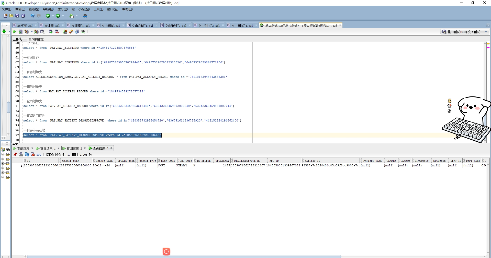

# 领域服务/基础领域 - 保存诊断证明 - 保存诊断证明 正向用例
## 请求参数：
``` json
{
  "diagProofInfo": {
    "patientId": "93587a7c8028404c85b09f8bc9803a7c",
    "visitId": "1848550301339267074",
    "visitDate": "2024-10-22 11:17:29"
  },
  "hospCode": "NXRY",
  "orgCode": "NXRMYY",
  "operatorId": "282475805660160000",
  "operatorName": "CS彭彭彭"
}
```
## 返回参数：
``` json
{
    "exception": null,
    "apiCode": null,
    "data": "1859076862723313666",
    "Code": 200,
    "Message": "操作成功"
}
```
## 数据校验：



# 领域服务/基础领域 - 保存诊断证明 - 必填校验-[orgCode]为空
## 请求参数：
``` json
{
  "diagProofInfo": {
    "patientId": "93587a7c8028404c85b09f8bc9803a7c",
    "visitId": "1848550301339267073",
    "visitDate": "2024-10-22 11:17:29"
  },
  "hospCode": "NXRY",
  "orgCode": "",
  "operatorId": "282475805660160000",
  "operatorName": "CS彭彭彭"
}
```
## 返回参数：
``` json
{
  "exception": null,
  "apiCode": null,
  "data": null,
  "Code": 1,
  "Message": "医院编码不能为空"
}
```
# 领域服务/基础领域 - 保存诊断证明 - 必填校验-[hospCode]为空
## 请求参数：
``` json
{
  "diagProofInfo": {
    "patientId": "93587a7c8028404c85b09f8bc9803a7c",
    "visitId": "1848550301339267073",
    "visitDate": "2024-10-22 11:17:29"
  },
  "hospCode": "",
  "orgCode": "NXRMYY",
  "operatorId": "282475805660160000",
  "operatorName": "CS彭彭彭"
}
```
## 返回参数：
``` json
{
  "exception": null,
  "apiCode": null,
  "data": null,
  "Code": 1,
  "Message": "院区编码不能为空"
}
```
# 领域服务/基础领域 - 保存诊断证明 - 必填校验-[operatorId]为空
## 请求参数：
``` json
{
  "diagProofInfo": {
    "patientId": "93587a7c8028404c85b09f8bc9803a7c",
    "visitId": "1848550301339267073",
    "visitDate": "2024-10-22 11:17:29"
  },
  "hospCode": "NXRY",
  "orgCode": "NXRMYY",
  "operatorId": "",
  "operatorName": "CS彭彭彭"
}
```
## 返回参数：
``` json
{
  "exception": null,
  "apiCode": null,
  "data": null,
  "Code": 1,
  "Message": "操作人id不能为空"
}
```
# 领域服务/基础领域 - 保存诊断证明 - 必填校验-[operatorName]为空
## 请求参数：
``` json
{
  "diagProofInfo": {
    "patientId": "93587a7c8028404c85b09f8bc9803a7c",
    "visitId": "1848550301339267073",
    "visitDate": "2024-10-22 11:17:29"
  },
  "hospCode": "NXRY",
  "orgCode": "NXRMYY",
  "operatorId": "282475805660160000",
  "operatorName": ""
}
```
## 返回参数：
``` json
{
  "exception": null,
  "apiCode": null,
  "data": null,
  "Code": 1,
  "Message": "操作人姓名不能为空"
}
```
# 领域服务/基础领域 - 保存诊断证明 - 必填校验-[diagProofInfo.patientId]为空
## 请求参数：
``` json
{
  "diagProofInfo": {
    "patientId": null,
    "visitId": "1848550301339267073",
    "visitDate": "2024-10-22 11:17:29"
  },
  "hospCode": "NXRY",
  "orgCode": "NXRMYY",
  "operatorId": "282475805660160000",
  "operatorName": "CS彭彭彭"
}
```
## 返回参数：
``` json
{
  "exception": null,
  "apiCode": null,
  "data": null,
  "Code": 1,
  "Message": "病人id不能为空"
}
```
# 领域服务/基础领域 - 保存诊断证明 - 必填校验-[diagProofInfo.visitId]为空
## 请求参数：
``` json
{
  "diagProofInfo": {
    "patientId": "93587a7c8028404c85b09f8bc9803a7c",
    "visitId": null,
    "visitDate": "2024-10-22 11:17:29"
  },
  "hospCode": "NXRY",
  "orgCode": "NXRMYY",
  "operatorId": "282475805660160000",
  "operatorName": "CS彭彭彭"
}
```
## 返回参数：
``` json
{
  "exception": null,
  "apiCode": null,
  "data": null,
  "Code": 1,
  "Message": "就诊id不能为空"
}
```
# 领域服务/基础领域 - 保存诊断证明 - 依赖用例-[operatorName]赋值为依赖用例测试值
## 请求参数：
``` json
{
  "diagProofInfo": {
    "patientId": "93587a7c8028404c85b09f8bc9803a7c",
    "visitId": "1848550301339267073",
    "visitDate": "2024-10-22 11:17:29"
  },
  "hospCode": "NXRY",
  "orgCode": "NXRMYY",
  "operatorId": "282475805660160000",
  "operatorName": "依赖用例测试值"
}
```
## 返回参数：
``` json
{
  "exception": null,
  "apiCode": null,
  "data": "1858809905226801154",
  "Code": 200,
  "Message": "操作成功"
}
```
# 领域服务/基础领域 - 保存诊断证明 - 依赖用例-[operatorId]赋值为依赖用例测试值
## 请求参数：
``` json
{
  "diagProofInfo": {
    "patientId": "93587a7c8028404c85b09f8bc9803a7c",
    "visitId": "1848550301339267073",
    "visitDate": "2024-10-22 11:17:29"
  },
  "hospCode": "NXRY",
  "orgCode": "NXRMYY",
  "operatorId": "依赖用例测试值",
  "operatorName": "CS彭彭彭"
}
```
## 返回参数：
``` json
{
  "exception": null,
  "apiCode": null,
  "data": "1858809905226801154",
  "Code": 200,
  "Message": "操作成功"
}
```
# 领域服务/基础领域 - 保存诊断证明 - 依赖用例-[orgCode]赋值为依赖用例测试值
## 请求参数：
``` json
{
  "diagProofInfo": {
    "patientId": "93587a7c8028404c85b09f8bc9803a7c",
    "visitId": "1848550301339267073",
    "visitDate": "2024-10-22 11:17:29"
  },
  "hospCode": "NXRY",
  "orgCode": "依赖用例测试值",
  "operatorId": "282475805660160000",
  "operatorName": "CS彭彭彭"
}
```
## 返回参数：
``` json
{
  "exception": null,
  "apiCode": null,
  "data": "1858809946708467714",
  "Code": 200,
  "Message": "操作成功"
}
```
# 领域服务/基础领域 - 保存诊断证明 - 依赖用例-[hospCode]赋值为依赖用例测试值
## 请求参数：
``` json
{
  "diagProofInfo": {
    "patientId": "93587a7c8028404c85b09f8bc9803a7c",
    "visitId": "1848550301339267073",
    "visitDate": "2024-10-22 11:17:29"
  },
  "hospCode": "依赖用例测试值",
  "orgCode": "NXRMYY",
  "operatorId": "282475805660160000",
  "operatorName": "CS彭彭彭"
}
```
## 返回参数：
``` json
{
  "exception": null,
  "apiCode": null,
  "data": "1858809951724855298",
  "Code": 200,
  "Message": "操作成功"
}
```
# 领域服务/基础领域 - 保存诊断证明 - 依赖用例-[diagProofInfo.patientId]赋值为依赖用例测试值
## 请求参数：
``` json
{
  "diagProofInfo": {
    "patientId": "依赖用例测试值",
    "visitId": "1848550301339267073",
    "visitDate": "2024-10-22 11:17:29"
  },
  "hospCode": "NXRY",
  "orgCode": "NXRMYY",
  "operatorId": "282475805660160000",
  "operatorName": "CS彭彭彭"
}
```
## 返回参数：
``` json
{
  "exception": null,
  "apiCode": null,
  "data": "1858809905226801154",
  "Code": 200,
  "Message": "操作成功"
}
```
# 领域服务/基础领域 - 保存诊断证明 - 依赖用例-[diagProofInfo.visitId]赋值为依赖用例测试值
## 请求参数：
``` json
{
  "diagProofInfo": {
    "patientId": "93587a7c8028404c85b09f8bc9803a7c",
    "visitId": "依赖用例测试值",
    "visitDate": "2024-10-22 11:17:29"
  },
  "hospCode": "NXRY",
  "orgCode": "NXRMYY",
  "operatorId": "282475805660160000",
  "operatorName": "CS彭彭彭"
}
```
## 返回参数：
``` json
{
  "exception": null,
  "apiCode": null,
  "data": "1858809961904431106",
  "Code": 200,
  "Message": "操作成功"
}
```