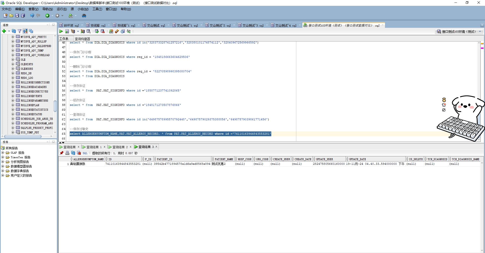

# 领域服务/基础领域 - 保存过敏史 - 保存过敏史 正向用例
## 请求参数：
``` json
{
  "allergyInfo": {
    "allergenType": "104",
    "drugAllergyName": [],
    "patientId": "39542b4771894578a1d6a9ad8568a894",
    "drugSpecId": [],
    "drugAllergy": [],
    "allergenSeverity": "01",
    "name": "测试优惠2",
    "id": "74110163944843553281",
    "allergenSymptomCode": "20E5208572581743E06383D3A8C0287D",
    "allergenSymptomName": "鼻粘膜肿胀"
  },
  "hospCode": "NXRY",
  "orgCode": "NXRMYY",
  "operatorId": "282475805660160000",
  "operatorName": "CS彭彭彭"
}
```
## 返回参数：
``` json
{
    "exception": null,
    "apiCode": null,
    "data": "74110163944843553281",
    "Code": 200,
    "Message": "操作成功"
}
```
## 数据校验：



# 领域服务/基础领域 - 保存过敏史 - 必填校验-[orgCode]为空
## 请求参数：
``` json
{
  "allergyInfo": {
    "allergenType": "104",
    "drugAllergyName": [],
    "patientId": "39542b4771894578a1d6a9ad8568a894",
    "drugSpecId": [],
    "drugAllergy": [],
    "allergenSeverity": "01",
    "name": "测试优惠2",
    "id": "74110163944843553280",
    "allergenSymptomCode": "20E5208572581743E06383D3A8C0287D",
    "allergenSymptomName": "鼻粘膜肿胀"
  },
  "hospCode": "NXRY",
  "orgCode": "",
  "operatorId": "282475805660160000",
  "operatorName": "CS彭彭彭"
}
```
## 返回参数：
``` json
{
  "exception": null,
  "apiCode": null,
  "data": null,
  "Code": 1,
  "Message": "医院编码不能为空"
}
```
# 领域服务/基础领域 - 保存过敏史 - 必填校验-[hospCode]为空
## 请求参数：
``` json
{
  "allergyInfo": {
    "allergenType": "104",
    "drugAllergyName": [],
    "patientId": "39542b4771894578a1d6a9ad8568a894",
    "drugSpecId": [],
    "drugAllergy": [],
    "allergenSeverity": "01",
    "name": "测试优惠2",
    "id": "74110163944843553280",
    "allergenSymptomCode": "20E5208572581743E06383D3A8C0287D",
    "allergenSymptomName": "鼻粘膜肿胀"
  },
  "hospCode": "",
  "orgCode": "NXRMYY",
  "operatorId": "282475805660160000",
  "operatorName": "CS彭彭彭"
}
```
## 返回参数：
``` json
{
  "exception": null,
  "apiCode": null,
  "data": null,
  "Code": 1,
  "Message": "院区编码不能为空"
}
```
# 领域服务/基础领域 - 保存过敏史 - 必填校验-[operatorId]为空
## 请求参数：
``` json
{
  "allergyInfo": {
    "allergenType": "104",
    "drugAllergyName": [],
    "patientId": "39542b4771894578a1d6a9ad8568a894",
    "drugSpecId": [],
    "drugAllergy": [],
    "allergenSeverity": "01",
    "name": "测试优惠2",
    "id": "74110163944843553280",
    "allergenSymptomCode": "20E5208572581743E06383D3A8C0287D",
    "allergenSymptomName": "鼻粘膜肿胀"
  },
  "hospCode": "NXRY",
  "orgCode": "NXRMYY",
  "operatorId": "",
  "operatorName": "CS彭彭彭"
}
```
## 返回参数：
``` json
{
  "exception": null,
  "apiCode": null,
  "data": null,
  "Code": 1,
  "Message": "操作人id不能为空"
}
```
# 领域服务/基础领域 - 保存过敏史 - 必填校验-[operatorName]为空
## 请求参数：
``` json
{
  "allergyInfo": {
    "allergenType": "104",
    "drugAllergyName": [],
    "patientId": "39542b4771894578a1d6a9ad8568a894",
    "drugSpecId": [],
    "drugAllergy": [],
    "allergenSeverity": "01",
    "name": "测试优惠2",
    "id": "74110163944843553280",
    "allergenSymptomCode": "20E5208572581743E06383D3A8C0287D",
    "allergenSymptomName": "鼻粘膜肿胀"
  },
  "hospCode": "NXRY",
  "orgCode": "NXRMYY",
  "operatorId": "282475805660160000",
  "operatorName": ""
}
```
## 返回参数：
``` json
{
  "exception": null,
  "apiCode": null,
  "data": null,
  "Code": 1,
  "Message": "操作人姓名不能为空"
}
```
# 领域服务/基础领域 - 保存过敏史 - 必填校验-[allergyInfo.patientId]为空
## 请求参数：
``` json
{
  "allergyInfo": {
    "allergenType": "104",
    "drugAllergyName": [],
    "patientId": null,
    "drugSpecId": [],
    "drugAllergy": [],
    "allergenSeverity": "01",
    "name": "测试优惠2",
    "id": "74110163944843553280",
    "allergenSymptomCode": "20E5208572581743E06383D3A8C0287D",
    "allergenSymptomName": "鼻粘膜肿胀"
  },
  "hospCode": "NXRY",
  "orgCode": "NXRMYY",
  "operatorId": "282475805660160000",
  "operatorName": "CS彭彭彭"
}
```
## 返回参数：
``` json
{
  "exception": null,
  "apiCode": null,
  "data": null,
  "Code": 1,
  "Message": "病人id不能为空"
}
```
# 领域服务/基础领域 - 保存过敏史 - 依赖用例-[operatorName]赋值为依赖用例测试值
## 请求参数：
``` json
{
  "allergyInfo": {
    "allergenType": "104",
    "drugAllergyName": [],
    "patientId": "39542b4771894578a1d6a9ad8568a894",
    "drugSpecId": [],
    "drugAllergy": [],
    "allergenSeverity": "01",
    "name": "测试优惠2",
    "id": "74110163944843553280",
    "allergenSymptomCode": "20E5208572581743E06383D3A8C0287D",
    "allergenSymptomName": "鼻粘膜肿胀"
  },
  "hospCode": "NXRY",
  "orgCode": "NXRMYY",
  "operatorId": "282475805660160000",
  "operatorName": "依赖用例测试值"
}
```
## 返回参数：
``` json
{
  "exception": null,
  "apiCode": null,
  "data": "74110163944843553280",
  "Code": 200,
  "Message": "操作成功"
}
```
# 领域服务/基础领域 - 保存过敏史 - 依赖用例-[operatorId]赋值为依赖用例测试值
## 请求参数：
``` json
{
  "allergyInfo": {
    "allergenType": "104",
    "drugAllergyName": [],
    "patientId": "39542b4771894578a1d6a9ad8568a894",
    "drugSpecId": [],
    "drugAllergy": [],
    "allergenSeverity": "01",
    "name": "测试优惠2",
    "id": "74110163944843553280",
    "allergenSymptomCode": "20E5208572581743E06383D3A8C0287D",
    "allergenSymptomName": "鼻粘膜肿胀"
  },
  "hospCode": "NXRY",
  "orgCode": "NXRMYY",
  "operatorId": "依赖用例测试值",
  "operatorName": "CS彭彭彭"
}
```
## 返回参数：
``` json
{
  "exception": null,
  "apiCode": null,
  "data": "74110163944843553280",
  "Code": 200,
  "Message": "操作成功"
}
```
# 领域服务/基础领域 - 保存过敏史 - 依赖用例-[orgCode]赋值为依赖用例测试值
## 请求参数：
``` json
{
  "allergyInfo": {
    "allergenType": "104",
    "drugAllergyName": [],
    "patientId": "39542b4771894578a1d6a9ad8568a894",
    "drugSpecId": [],
    "drugAllergy": [],
    "allergenSeverity": "01",
    "name": "测试优惠2",
    "id": "74110163944843553280",
    "allergenSymptomCode": "20E5208572581743E06383D3A8C0287D",
    "allergenSymptomName": "鼻粘膜肿胀"
  },
  "hospCode": "NXRY",
  "orgCode": "依赖用例测试值",
  "operatorId": "282475805660160000",
  "operatorName": "CS彭彭彭"
}
```
## 返回参数：
``` json
{
  "exception": null,
  "apiCode": null,
  "data": "74110163944843553280",
  "Code": 200,
  "Message": "操作成功"
}
```
# 领域服务/基础领域 - 保存过敏史 - 依赖用例-[hospCode]赋值为依赖用例测试值
## 请求参数：
``` json
{
  "allergyInfo": {
    "allergenType": "104",
    "drugAllergyName": [],
    "patientId": "39542b4771894578a1d6a9ad8568a894",
    "drugSpecId": [],
    "drugAllergy": [],
    "allergenSeverity": "01",
    "name": "测试优惠2",
    "id": "74110163944843553280",
    "allergenSymptomCode": "20E5208572581743E06383D3A8C0287D",
    "allergenSymptomName": "鼻粘膜肿胀"
  },
  "hospCode": "依赖用例测试值",
  "orgCode": "NXRMYY",
  "operatorId": "282475805660160000",
  "operatorName": "CS彭彭彭"
}
```
## 返回参数：
``` json
{
  "exception": null,
  "apiCode": null,
  "data": "74110163944843553280",
  "Code": 200,
  "Message": "操作成功"
}
```
# 领域服务/基础领域 - 保存过敏史 - 依赖用例-[allergyInfo.patientId]赋值为依赖用例测试值
## 请求参数：
``` json
{
  "allergyInfo": {
    "allergenType": "104",
    "drugAllergyName": [],
    "patientId": "依赖用例测试值",
    "drugSpecId": [],
    "drugAllergy": [],
    "allergenSeverity": "01",
    "name": "测试优惠2",
    "id": "74110163944843553280",
    "allergenSymptomCode": "20E5208572581743E06383D3A8C0287D",
    "allergenSymptomName": "鼻粘膜肿胀"
  },
  "hospCode": "NXRY",
  "orgCode": "NXRMYY",
  "operatorId": "282475805660160000",
  "operatorName": "CS彭彭彭"
}
```
## 返回参数：
``` json
{
  "exception": null,
  "apiCode": null,
  "data": "74110163944843553280",
  "Code": 200,
  "Message": "操作成功"
}
```